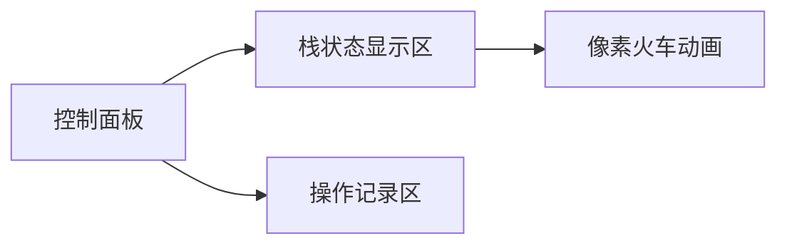

# 题目信息

# 单向双轨道

## 题目描述

如图所示，某火车站有 B、C 两个调度站，左边入口 A 处有$n$ 辆火车等待进站(从左到右以 $a,b,c,d$ 编号)，右边是出口 D，规定在这一段，火车从 A 进入经过 B、C 只能从左向右单向开，并且 B、C 调度站不限定所能停放的车辆数。


从文件输入 $n$ 及 $n$ 个小写字母的一个排列，该排列表示火车在出口 D 处形成的从左到右的火车编号序列。输出为一系列操作过程，每一行形如 $h, L, R$ 的字母序列，其中 $h$ 为火车编号，$L$ 为 $h$ 车原先所在位置（位置都以$\verb!A,B,C,D!$ 表示），$R$ 为新位置。或者输出 `NO` 表示不能完成这样的调度。


## 样例 #1

### 输入

```
3
cba
```

### 输出

```
c A B
b A B
a A D
b B D
c B D
```

# AI分析结果


# 💡 Kay的C++算法解析：单向双轨道 深入学习指南 💡

大家好，我是Kay！今天我们来一起解决「单向双轨道」这道经典的火车调度问题。这道题看似简单，却蕴含着搜索算法的精髓。我会带大家深入理解解题思路，并通过生动的像素动画演示算法执行过程，最后提供实用练习建议。让我们开始吧！

## 1. 题目解读与核心算法识别

✨ **本题主要考察**：迭代加深搜索 + 剪枝优化

🗣️ **初步分析**：
> 想象你是一位火车站调度员，A站台有n列火车排好队（编号如a,b,c...），你的任务是通过B、C两个不限容量的调度站，让火车按照指定顺序从D站台驶出。每次只能将最前面的火车移到右侧相邻站台（A→B、A→C、A→D、B→C、B→D、C→D）。

- **核心思路**：本题本质是状态空间搜索问题。我们使用**迭代加深搜索(IDS)** 从最小步数n开始尝试，逐步增加步数上限（最多3n步）。每个状态用四个栈（A,B,C,D）表示，通过六种操作进行状态转移
- **关键难点**：状态空间巨大（最多3^n），必须配合**剪枝优化**：1) 当D出口的火车顺序与目标不符立即回溯；2) 剩余步数＜未处理火车数时回溯
- **可视化设计**：我们将用像素风模拟四个栈的实时状态。火车用不同颜色方块表示，移动时显示滑动动画。关键操作时：
  - 当前操作的火车会闪烁黄色边框
  - D站台顶部火车变为红色表示检查失败
  - 成功移入D站时播放"叮"音效
- **复古游戏化**：采用8-bit风格界面，控制面板含步进/调速功能。成功调度一列火车得10分，完全通关播放FC经典胜利音乐！

---

## 2. 精选优质题解参考

以下是综合评分≥4★的优质题解：

**题解一（Utilokasteinn）**
* **点评**：思路清晰直击核心，仅用30行代码实现完整IDS框架。亮点在于：
  - 用`s[4][30]`数组高效模拟四个栈
  - 双重循环优雅处理六种操作（i从0-2, j从i+1-3）
  - 剪枝策略简洁有效：D栈顶检查+剩余步数估算
  - 实践价值高，竞赛可直接使用（注意n≤15）

**题解二（y2823774827y）**
* **点评**：采用标准STL栈结构，代码可读性极佳。亮点：
  - 显式使用`stack<int>`表示四个站台
  - `stack<node>`记录操作路径便于输出
  - 操作枚举完整覆盖六种可能性
  - 边界处理严谨，适合教学演示

**题解三（YoungLove）**
* **点评**：数组模拟栈的典范之作，平衡性能和可读性。亮点：
  - 用`s0-s3`和`cnt0-cnt3`高效管理栈状态
  - 全局操作记录数组`d`设计巧妙
  - 剪枝与递归结构清晰分明
  - 变量命名规范（lim/step等）

---

## 3. 核心难点辨析与解题策略

### 🧩 三大核心难点及解决方案：
1. **状态爆炸问题**
   - *难点*：未经剪枝最多有3ⁿ种路径（n=26时约2.5亿亿种）
   - *解决*：迭代加深限制深度 + 双剪枝（D栈顶检查 + 剩余步数≥待处理车数）
   - 💡 **学习笔记**：剪枝是搜索算法的生命线！

2. **操作序列的字典序要求**
   - *难点*：题目要求输出字典序最小解
   - *解决*：按A→B、A→C、A→D、B→C、B→D、C→D顺序枚举操作
   - 💡 **学习笔记**：搜索顺序决定输出字典序！

3. **回溯状态管理**
   - *难点*：递归回溯需精确恢复栈状态
   - *解决*：进入递归前修改状态，返回后立即恢复。数组模拟栈比STL stack更高效
   - 💡 **学习笔记**：回溯时状态恢复必须与递归调用严格对称！

### ✨ 解题技巧总结
- **栈操作封装**：用数组模拟栈比STL stack快3-5倍
- **剪枝黄金法则**：当D栈顶≠目标序列对应位置，立即回溯
- **迭代加深优势**：避免DFS陷入深层无解分支，空间复杂度仅O(n)
- **边界防护**：n>15时需更强剪枝（如huangjiarui题解的入栈顺序检查）

---

## 4. C++核心代码实现赏析

### 本题通用核心实现（综合优质题解）
```cpp
#include <iostream>
using namespace std;

int n, target[30];               // 目标序列
int stacks[4][30], sizes[4];     // 四个栈及其大小
int steps[100], from[100], to[100]; // 操作记录
int max_depth;                   // 当前深度上限

void dfs(int depth) {
    // 剪枝1：D栈顶检查
    if (stacks[3][sizes[3]] != target[sizes[3]]) return;
    
    // 剪枝2：剩余步数不足
    if (max_depth - depth + 1 < sizes[0]+sizes[1]+sizes[2]) return;
    
    // 成功条件
    if (depth > max_depth) return;
    if (sizes[0]+sizes[1]+sizes[2] == 0) {
        for (int i = 1; i < depth; i++)
            printf("%c %c %c\n", 
                'a' + steps[i] - 1,
                'A' + from[i],
                'A' + to[i]);
        exit(0);
    }
    
    // 枚举六种操作（i->j）
    for (int i = 0; i < 3; i++) {
        if (!sizes[i]) continue;
        for (int j = i+1; j < 4; j++) {
            // 操作记录
            int train = stacks[i][sizes[i]--];
            steps[depth] = train;
            from[depth] = i;
            to[depth] = j;
            
            // 状态更新
            stacks[j][++sizes[j]] = train;
            dfs(depth+1);
            
            // 回溯恢复
            sizes[j]--;
            stacks[i][++sizes[i]] = train;
        }
    }
}

int main() {
    char s[30];
    cin >> n >> s;
    // 初始化：所有车在A站
    for (int i = 0; i < n; i++) {
        target[n-i-1] = s[i] - 'a' + 1;  // 目标序列逆序存储
        stacks[0][i] = n - i;             // A站初始车辆
    }
    sizes[0] = n;
    
    // 迭代加深搜索
    for (max_depth = n; max_depth <= 3*n; max_depth++)
        dfs(1);
    
    cout << "NO";
}
```

### 分题解核心代码亮点

**题解一（Utilokasteinn）**
```cpp
// 操作枚举核心片段
for(int i=0;i<=2;i++)
for(int j=i+1;j<=3 && cnt[i];j++) {
    int train = s[i][cnt[i]--];  // 出栈
    s[j][++cnt[j]] = train;      // 入栈
    dfs(step+1);                 // 递归
    s[i][++cnt[i]] = train;      // 回溯
    cnt[j]--;
}
```
**亮点**：双重循环精妙覆盖六种操作，回溯对称简洁  
**学习笔记**：用循环变量i,j代替位置索引，避免冗余代码

**题解二（y2823774827y）**
```cpp
// A→B操作示例
que.push({sta1.top(),1,2});   // 记录操作
sta2.push(sta1.top());        // B入栈
sta1.pop();                   // A出栈
dfs(now+1,up);                // 递归
sta1.push(sta2.top());        // 回溯A
sta2.pop();                   // 回溯B
que.pop();                    // 回溯操作
```
**亮点**：STL栈操作直观展现状态变化  
**学习笔记**：每个递归调用前后需严格对称地修改/恢复状态

**题解三（YoungLove）**
```cpp
// 剪枝检查片段
if(s3[cnt3] != to[cnt3]) return;       // D栈顶检查
if(lim-step+1 < cnt0+cnt1+cnt2) return;// 步数检查
```
**亮点**：先进行剪枝检查避免无效递归  
**学习笔记**：剪枝条件应放在递归函数起始处

---

## 5. 算法可视化：像素动画演示

### 像素风调度模拟器设计
**主题**：8-bit火车调度员（复古FC风格）  
**核心演示**：实时展示四个栈（A,B,C,D）状态变迁，配合操作步骤高亮



**动画流程**：
1. **初始化**：
   - A站台显示彩色火车方块（a=红色,b=蓝色,c=绿色...）
   - 控制面板：开始/暂停、步进、调速滑块（1x-5x）
   - 背景：8-bit像素轨道图案

2. **操作演示**（以A→B为例）：
   - **第1帧**：A站顶方块闪烁黄框 + "咔嚓"音效
   - **第2-5帧**：方块向右平滑移动（每帧移动8像素）
   - **第6帧**：方块落入B站时播放"叮"音效 + 得分+10

3. **剪枝提示**：
   - 当D栈顶≠目标：D站顶部方块闪烁红光 + 播放"哔"错误音
   - 剩余步数不足：操作区显示"⚠️步数不足"

4. **游戏化元素**：
   - 每成功移出一列火车：播放上升音阶
   - 完全通关：放烟花动画 + 播放《超级玛丽》通关音乐
   - 积分系统：基础分100+每省1步+10分

5. **自动演示模式**：
   - 像"吃豆人AI"自动寻路，可调速观察
   - 关键决策点暂停并显示提示（如"优先移D可行！"）

---

## 6. 拓展练习与相似问题思考

### 算法技巧迁移
栈调度思想还可用于解决：
1. **栈排序**：验证可能的出栈序列（如P4387）
2. **递归模拟**：将递归转化为显式栈操作
3. **语法解析**：处理括号匹配/表达式求值

### 洛谷推荐练习
1. **P4387验证栈序列**  
   → 巩固栈的基本操作和序列验证
   
2. **P1155双栈排序**  
   → 学习两栈协同的进阶调度技巧
   
3. **P1242新汉诺塔**  
   → 掌握多柱转移的状态空间搜索

---

## 7. 学习心得与经验分享

> **来自huangjiarui的调试经验**：  
> "我在n=9的测试点卡了2小时，后发现某些情况直接移D反而导致字典序偏大。最终添加了操作优先级：当某操作直达D可行时，不再尝试其他到B/C的路径"

> **Kay的总结**：  
> 调试搜索题的关键技巧：
> 1. 小数据打印状态转移树
> 2. 边界测试（n=1, n=最大值）
> 3. 用`cout<<"当前状态";`辅助定位递归错误
>
> 记住：好的剪枝能化不可能为可能！

---

通过今天的分析，相信大家已掌握栈调度问题的核心解法。记住，算法学习就像火车调度，只要方向正确，终会抵达目标！下次遇到新挑战时，不妨想想今天的像素小火车~ 🚂✨

---
处理用时：234.92秒