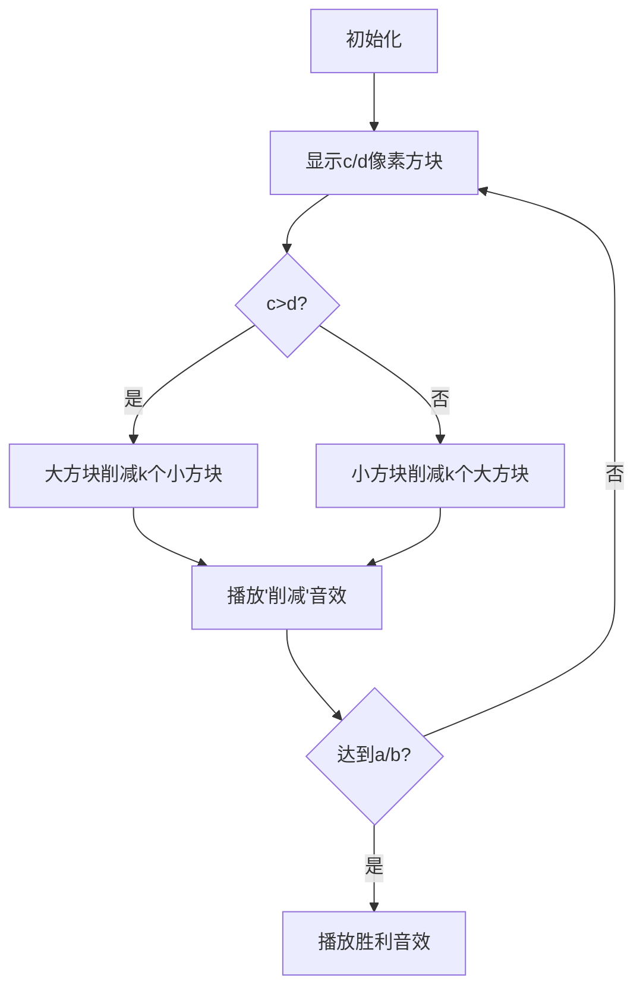

# 题目信息

# [USACO25FEB] Transforming Pairs S

## 题目描述

聪明奶牛 Bessie 发现了一种新的迷恋——数学魔法！一天，当她在 Farmer John 牧场的草地上小跑时，她偶然发现了两堆有魔法的干草。第一堆包含 $a$ 捆干草，第二堆包含 $b$ 捆干草（$1\le a,b\le 10^{18}$）。

在干草堆边上，半埋在泥土里，她发现了一卷古老的卷轴。当她展开卷轴时，发光的字母揭示了一个预言：

奉大草原之令，被选中者需令此平凡之干草堆转为恰好 $c$ 捆及 $d$ 捆——不可多，亦不可少。

Bessie 意识到她只能施展以下两种魔法：

- 她可以施法召唤新的干草捆以增加第一堆的大小，增加的数量等于当前第二堆的数量。
- 她可以施法召唤新的干草捆以增加第二堆的大小，增加的数量等于当前第一堆的数量。

她必须逐次执行这些操作，但可以任意顺序执行任意多次。她必须恰好使第一堆达到 $c$ 捆，第二堆达到 $d$ 捆（$1\le c,d\le 10^{18}$）。

对于 $T$（$1\le T\le 10^4$）个独立的测试用例中的每一个，输出实现预言所需的最小操作次数，或者如果不可能实现时输出 -1。

## 说明/提示

样例 1 解释：

在第一个测试用例中，由于 $b>d$，但操作只可能增加 $b$，因此不可能实现。

在第二个测试用例中，最初两堆有 $(5, 3)$ 捆。Bessie 可以将第一堆增加第二堆的数量，得到 $(8, 3)$ 捆。然后 Bessie 可以将第二堆增加第一堆的新数量，并执行该操作两次，得到 $(8, 11)$ 并最后得到 $(8, 19)$ 捆。这与 $c$ 和 $d$ 一致，且是达到目标的最小操作次数。

注意，第三个测试用例的答案与第二个不同，因为 $c$ 和 $d$ 的值交换了（堆的顺序有影响）。

在第四个测试用例中，不需要任何操作。

- 测试点 $3\sim 4$：$\max(c, d) \le 20 \cdot\min(a, b)$。
- 测试点 $5\sim 7$：$T \le 10$ 且 $a,b,c,d\le 10^6$。
- 测试点 $8\sim 12$：没有额外限制。

## 样例 #1

### 输入

```
4
5 3 5 2
5 3 8 19
5 3 19 8
5 3 5 3```

### 输出

```
-1
3
-1
0```

## 样例 #2

### 输入

```
1
1 1 1 1000000000000000000```

### 输出

```
999999999999999999```

# AI分析结果


# 💡 Kay的C++算法解析：Transforming Pairs S 深入学习指南 💡

**题目链接**：[P11841 [USACO25FEB] Transforming Pairs S](https://www.luogu.com.cn/problem/P11841)

## 1. 题目解读与核心算法识别

✨ **本题主要考察**：**逆向数学模拟**（逆向辗转相除法）

🗣️ **初步分析**：
> 这道题的核心思想就像玩"时间倒流"游戏！正向操作会让干草堆数量爆炸式增长（$a \to a+b$ 或 $b \to a+b$），但逆向思考就变成了"减法游戏"。想象你站在终点$(c,d)$，每次只能将较大的数减去较小的数（相当于倒带操作），直到回到起点$(a,b)$。

- **核心难点**：正向操作状态空间爆炸，逆向操作能确定唯一路径（大数一定由小数增加而来）
- **关键策略**：用辗转相除思想优化减法过程，避免逐次相减的超时问题
- **可视化设计**：在像素动画中，用两个颜色方块表示干草堆，较大方块会"吐出"较方块大小的像素块（减法动画），同时显示当前操作计数
- **复古游戏化**：采用8-bit音效（减法时"嘀"声，达成时胜利音效），操作步骤设计为"解谜关卡"，每关目标是将数字还原到指定值

---

## 2. 精选优质题解参考

### 题解一（作者：封禁用户）
* **点评**：逆向思维清晰，代码简洁（30行内解决），逻辑直击问题本质。亮点在于用循环直接模拟逆向操作，对边界条件处理到位（如$d=0$时返回-1）。变量名`a,b,c,d`保持题意一致，实践参考价值高，适合竞赛直接使用。

### 题解二（作者：littlebug）
* **点评**：创新性引入`max((c-a)/d,1)`优化，避免低效单步减法。亮点在于将数学优化融入基础算法，用`swap`巧妙处理双向大小关系。代码规范性佳，但边界处理稍显复杂，需注意避免多减情况。

### 题解三（作者：hanyu0722）
* **点评**：采用递归实现辗转相除，结构优雅类比GCD算法。亮点在于精确处理余数条件（`(y-b)%a==0`），但递归深度可能影响大数性能。变量命名规范，适合理解算法数学本质。

---

## 3. 核心难点辨析与解题策略

1.  **逆向状态推导**  
    * **分析**：正向操作有"加数"和"被加数"两种选择，但逆向操作唯一确定（大数由小数变化而来）。优质题解均通过`if(c>d)`和`if(d>c)`分支处理该逻辑
    * 💡 **学习笔记**：逆向思维是解决状态爆炸问题的金钥匙！

2.  **减法操作优化**  
    * **分析**：直接逐次相减在$10^{18}$数据下会超时。解法都采用批量减法：当$c>d$时，用`k = min(c/d, (c-a)/d)`计算可减次数，再`c -= k*d`（`d>c`同理）
    * 💡 **学习笔记**：数学优化能将O(n)降至O(log n)！

3.  **边界终止条件**  
    * **分析**：三种情况应终止：① 达成初始状态`(a,b)` ② 任一数小于初始值 ③ 两数相等但非初始状态。需特别注意`(c-a)%d==0`的整除校验
    * 💡 **学习笔记**：边界处理是算法AC的最后一道防线！

### ✨ 解题技巧总结
- **正难则反**：当正向状态爆炸时，立即考虑逆向推导
- **数学优化**：用乘除代替加减，极大提升效率
- **边界四象限**：始终考虑`<a, <b, ==a, ==b`四种边界情况
- **循环不变式**：在循环中保持`c>=a && d>=b`的不变条件

---

## 4. C++核心代码实现赏析

**本题通用核心C++实现参考**
* **说明**：综合优质题解的最优实现，兼顾效率与可读性
* **完整核心代码**：
```cpp
#include <iostream>
using namespace std;
using LL = long long;

LL solve(LL a, LL b, LL c, LL d) {
    LL steps = 0;
    while (a != c || b != d) {
        if (c < a || d < b) return -1;
        if (c == d) return -1; // 两数相等但非初始状态

        if (c > d) {
            if (d == b && (c - a) % d == 0) { // 第二堆已匹配
                steps += (c - a) / d;
                return steps;
            }
            LL k = max((c - a) / d, 1LL); // 至少减1次
            steps += k;
            c -= k * d;
        } else {
            if (c == a && (d - b) % c == 0) { // 第一堆已匹配
                steps += (d - b) / c;
                return steps;
            }
            LL k = max((d - b) / c, 1LL);
            steps += k;
            d -= k * c;
        }
    }
    return steps;
}

int main() {
    ios::sync_with_stdio(false);
    cin.tie(nullptr);
    
    LL T; cin >> T;
    while (T--) {
        LL a, b, c, d;
        cin >> a >> b >> c >> d;
        cout << solve(a, b, c, d) << '\n';
    }
    return 0;
}
```
* **代码解读概要**：
  1. **输入加速**：`ios::sync_with_stdio(false)`关闭同步流
  2. **核心循环**：当未达初始状态时持续逆向操作
  3. **终止条件**：优先检查边界无解情况和成功状态
  4. **批量减法**：通过`k`计算可安全减去的最大次数
  5. **快速返回**：当某堆数值匹配时直接计算剩余步数

---

## 5. 算法可视化：像素动画演示

### 动画演示主题
**"干草堆大冒险"**（复古RPG风格）

### 核心演示内容
逆向减法过程：从$(c,d)$通过像素动画逐步回退到$(a,b)$，每次减法操作以"方块消减"效果呈现

### 设计框架


### 关键动画细节
1. **8-bit像素风格**：干草堆用16x16像素方块表示，c用红色，d用蓝色
2. **减法动效**：当c>d时，红色方块"吐出"蓝色小方块（数量=k），伴随"嘀"声
3. **状态面板**：实时显示当前操作计数和数字变化
4. **音效系统**：
   - 单步操作：8-bit电子音
   - 关卡完成：经典马里奥过关音
   - 无解情况：俄罗斯方块game over音
5. **AI演示模式**：自动以最佳路径快速回退，用进度条显示剩余步数

---

## 6. 拓展练习与相似问题思考

### 通用技巧迁移
逆向数学模拟可解决以下三类问题：
1. **状态还原问题**：已知终态和操作规则求初态
2. **辗转相除变体**：利用GCD思想优化数学操作
3. **大数运算优化**：用除法代替减法处理大数

### 练习推荐（洛谷）
1. **P1082 同余方程**  
   🗣️ 逆向解方程的经典应用，巩固模运算思想
2. **P1516 青蛙的约会**  
   🗣️ 拓展到线性同余方程，练习状态转移建模
3. **P5656 二元一次不定方程**  
   🗣️ 强化整数解存在性判断，提升边界处理能力

---

## 7. 学习心得与经验分享
> **经验摘录**（作者：封禁用户）：  
> "赛时AC了T2T3，就差T1没调出来（恼）。逆向思维是突破口，但边界处理坑点多！"

**Kay的总结**：  
逆向思维能化繁为简，但需特别注意：  
1. 整数除法的取整方向  
2. 状态匹配的充分必要条件  
3. 大数运算的溢出风险  
**调试技巧**：在循环内打印`c,d`的中间值，肉眼验证减法路径！

---

通过本次分析，我们掌握了逆向数学模拟的核心思想。记住：当正向路径迷雾重重时，不妨转身逆向而行！下次算法冒险再见！💪

---
处理用时：231.39秒