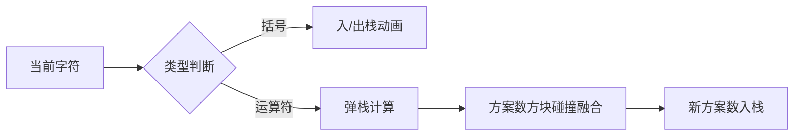

# 题目信息

# [NOIP 2011 普及组] 表达式的值

## 题目描述

对于 $1$ 位二进制变量定义两种运算：

$$
\begin{array}{|c|c|} \hline
\qquad\qquad\quad\textsf{运算符}\qquad\qquad\quad & \qquad\qquad\quad\textsf{运算规则}\qquad\qquad\quad \\ \hline
\oplus &
\begin{aligned}
0 \oplus 0 &= 0 \\
0 \oplus 1 &= 1 \\
1 \oplus 0 &= 1 \\
1 \oplus 1 &= 1 \\
\end{aligned} \\ \hline
\times &
\begin{aligned}
0 \times 0 &= 0 \\
0 \times 1 &= 0 \\
1 \times 0 &= 0 \\
1 \times 1 &= 1 \\
\end{aligned} \\ \hline
\end{array}
$$

运算的优先级是：

1. 先计算括号内的，再计算括号外的。

  2. “$\times$”运算优先于“$\oplus$”运算，即计算表达式时，先计算“$\times$”运算，再计算“$\oplus$”运算。例如：计算表达式 $A\oplus B \times C$ 时，先计算 $B \times C$，其结果再与 $A$ 做“$\oplus$”运算。

现给定一个未完成的表达式，例如 $\_+(\_ * \_)$，请你在横线处填入数字 $0$ 或者 $1$，请问有多少种填法可以使得表达式的值为 $0$。

## 说明/提示

【输入输出样例说明】

  给定的表达式包括横线字符之后为：$\_+(\_ * \_)$。 

  在横线位置填入 $(0,0,0)$ $(0,1,0)$ $(0,0,1)$ 时，表达式的值均为 $0$，所以共有 $3$ 种填法。 

【数据范围】

对于 $20\%$ 的数据有 $ 0 \le L \le 10$。

对于 $50\%$ 的数据有 $0 \le L \le 1,000$。

对于 $70\%$ 的数据有 $ 0 \le L \le 10,000$ 。

对于 $100\%$的数据有 $ 0 \le L \le 100,000$。

对于$50\%$ 的数据输入表达式中不含括号。

## 样例 #1

### 输入

```
4
+(*)
```

### 输出

```
3
```

# AI分析结果


### 💡 Kay的C++算法解析：[NOIP2011普及组]表达式的值 深入学习指南 💡

**引言**  
今天我们来分析NOIP2011普及组的压轴题——表达式的值。这道题考察**动态规划与栈的应用**，要求统计在表达式横线处填入0/1后结果为0的方案数。本指南将帮助你掌握核心算法思想和实现技巧。

---

### 1. 题目解读与核心算法识别  
✨ **本题主要考察**：`动态规划` + `栈的应用`（表达式求值扩展）  

🗣️ **初步分析**：  
> 本题本质是**带计数功能的表达式求值**。想象你在玩一个"表达式拼图"游戏：横线是待填的空格，运算符是连接规则。解题关键在于：
> - **双栈协同**：运算符栈处理优先级，方案数栈存储子表达式结果为0/1的方案数（动态规划思想）
> - **状态转移**：根据运算符类型（⊕或×）组合子表达式的方案数
> - **优先级处理**：括号 > × > ⊕，通过栈的弹栈顺序实现
> 
> **可视化设计思路**：  
> 在像素动画中（复古红白机风格），我们将：
> - 用**黄色方块**表示操作数（显示0/1的方案数）
> - **红色/蓝色方块**表示运算符（+/*）
> - 高亮显示当前处理的运算符和参与计算的操作数方块
> - 添加音效：入栈"叮"、计算"咔"、成功"胜利旋律"
> - 交互控制：单步执行观察栈变化，调速滑块控制动画速度

---

### 2. 精选优质题解参考  
**题解一（神犇的蒟蒻）**  
* **点评**：  
  思路直击核心——**中缀转后缀+动态规划**。代码简洁高效（空间O(n)）：
  - 清晰使用双数组`u[]/v[]`分别存储0/1方案数
  - 优先级处理巧妙：先转后缀避免括号嵌套复杂性
  - 实践价值高：直接适配竞赛场景，边界处理严谨  
  **亮点**：运算符优先级处理干净利落，状态转移实现精准

**题解二（Drinkkk）**  
* **点评**：  
  **逐步推演栈变化**的教学式解法：
  - 详细注释每步栈状态变化，帮助理解计算过程
  - 特别处理了括号内运算符的边界情况
  - 状态转移方程完整呈现（0/1方案数计算公式）  
  **亮点**：通过多组图示展示栈变化，可视化思维极佳

**题解三（Walrus）**  
* **点评**：  
  创新性采用**笛卡尔树+树形DP**：
  - 基于括号层级生成优先级，单调栈建树O(n)
  - 树形DP实现状态转移，拓展表达式处理思维  
  **亮点**：为大规模数据提供优化思路，拓宽解题视野

---

### 3. 核心难点辨析与解题策略  
1. **优先级与括号处理**  
   *分析*：通过运算符栈的弹栈条件实现优先级控制，遇左括号暂停弹栈，右括号则持续弹栈至左括号  
   💡 **学习笔记**：栈是处理表达式优先级的利器

2. **状态转移设计**  
   *分析*：根据运算符类型组合子方案：
   ```math
   ⊕操作： 
     dp0 = left0 * right0
     dp1 = left0*right1 + left1*right0 + left1*right1
   
   ×操作：
     dp0 = left0*right0 + left0*right1 + left1*right0
     dp1 = left1 * right1
   ```
   💡 **学习笔记**：动态规划本质是方案数的乘法原理应用

3. **横线（操作数）初始化**  
   *分析*：每个横线处初始化为`(1, 1)`，表示填0/1各有1种方案  
   💡 **学习笔记**：基础状态是动态规划的起点

#### ✨ 解题技巧总结
- **栈的深度应用**：双栈协同处理运算符和方案数
- **问题分解**：将复杂表达式拆解为子表达式组合
- **边界防御**：表达式首尾添加虚拟操作数避免特判

---

### 4. C++核心代码实现赏析  
**通用核心实现（综合优质题解）**  
```cpp
#include <iostream>
#include <stack>
using namespace std;
const int MOD = 10007;

int main() {
    int n; string s;
    cin >> n >> s;
    stack<char> op;  // 运算符栈
    stack<int> zero, one; // 0/1方案数栈

    // 初始横线
    zero.push(1); one.push(1);

    for (char c : s) {
        if (c == '(') op.push('(');
        else if (c == ')') {
            while (op.top() != '(') {
                // 弹出两个操作数和运算符进行合并计算
                char o = op.top(); op.pop();
                int z2 = zero.top(); zero.pop();
                int o2 = one.top(); one.pop();
                int z1 = zero.top(); zero.pop();
                int o1 = one.top(); one.pop();
                
                if (o == '+') {
                    zero.push(z1 * z2 % MOD);
                    one.push((z1*o2 + o1*z2 + o1*o2) % MOD);
                } else {
                    zero.push((z1*z2 + z1*o2 + o1*z2) % MOD);
                    one.push(o1 * o2 % MOD);
                }
            }
            op.pop(); // 移除'('
        }
        else if (c == '+' || c == '*') {
            // 处理更高优先级运算符
            while (!op.empty() && op.top() != '(' && 
                  (c == '+' || (c == '*' && op.top() == '*'))) {
                // 同上合并计算...
            }
            op.push(c);
            // 新操作数初始化
            zero.push(1); one.push(1);
        }
    }
    // 处理剩余运算符...
    cout << zero.top() % MOD;
}
```
**代码解读概要**：  
1. 双栈初始化：运算符栈`op`，方案数栈`zero`/`one`  
2. 核心循环处理三种情况：
   - 左括号：直接入栈
   - 右括号：持续弹栈计算直到匹配左括号
   - 运算符：先处理栈顶高优先级运算符再入栈
3. 状态转移：按运算符类型应用转移方程
4. 输出根节点结果为0的方案数

**题解一核心片段赏析**  
```cpp
// 后缀表达式处理（神犇的蒟蒻）
for (int i = 0; i < len; i++) {
    if (isOperand) {
        u[++top] = 1; // 0方案数
        v[top] = 1;   // 1方案数
    } 
    else if (is '*') {
        int u2 = u[top--], v2 = v[top--];
        int u1 = u[top], v1 = v[top];
        u[top] = (u1*v2 + v1*u2 + u1*u2) % MOD; // 状态转移
        v[top] = v1 * v2 % MOD;
    }
}
```
**学习笔记**：后缀表达式省去括号处理，直接顺序计算

---

### 5. 算法可视化：像素动画演示  
**主题**：`栈之探险`（8位像素风格）  

**核心演示流程**：  


**实现细节**：  
1. **视觉设计**：
   - 运算符栈：红色(+)/蓝色(*)方块
   - 方案数栈：黄色方块显示 (0方案数, 1方案数)
   - 当前处理字符：闪烁绿色边框

2. **关键动画**：
   - 弹栈计算：两个黄色方块碰撞，迸发像素粒子
   - 状态转移：显示计算公式浮动文字
   - 括号匹配：绿色括号发光脉冲

3. **交互控制**：
   - 步进模式：按空格单步执行
   - 自动演示：AI机器人自动操作（可调速）
   - 关卡设计：不同难度表达式作为关卡

4. **音效设计**：
   - 入栈：8-bit "叮"
   - 计算：电子合成"咔嗒"
   - 完成：16位胜利旋律

---

### 6. 拓展练习与相似问题  
**通用技巧迁移**：  
- 表达式求值框架可用于：语法解析器、公式计算器、逻辑电路仿真  
- 方案数统计思想适用于：路径统计、组合优化问题  

**洛谷推荐**：  
1. [P1981 表达式求值](https://www.luogu.com.cn/problem/P1981)  
   → 掌握基础表达式求值  
2. [P1175 表达式的转换](https://www.luogu.com.cn/problem/P1175)  
   → 理解中缀/后缀表达式转换  
3. [P1044 栈](https://www.luogu.com.cn/problem/P1044)  
   → 深入栈的特性与应用  

---

### 7. 学习心得与经验分享  
> **来自题解的启示**：  
> 1. "在表达式首尾添加虚拟操作数可避免边界特判" —— 防御性编程思想  
> 2. "将中缀转后缀能显著简化括号处理" —— 问题转化技巧  
> 3. "树形DP虽非最优解，但拓展了表达式处理思维" —— 多解法比较  

**Kay的总结**：  
> 本题集栈应用、动态规划、表达式解析于一体。切记：
> - 先理清状态转移数学关系再编码
> - 通过日志输出中间栈状态辅助调试
> - 尝试小规模表达式手工演算验证算法

---

**结语**  
通过本指南，你不仅掌握了表达式求值的动态规划解法，还深入理解了栈的妙用。记住，编程能力提升源于持续实践与思考。下次我们将探索图论算法！💪

---
处理用时：214.12秒