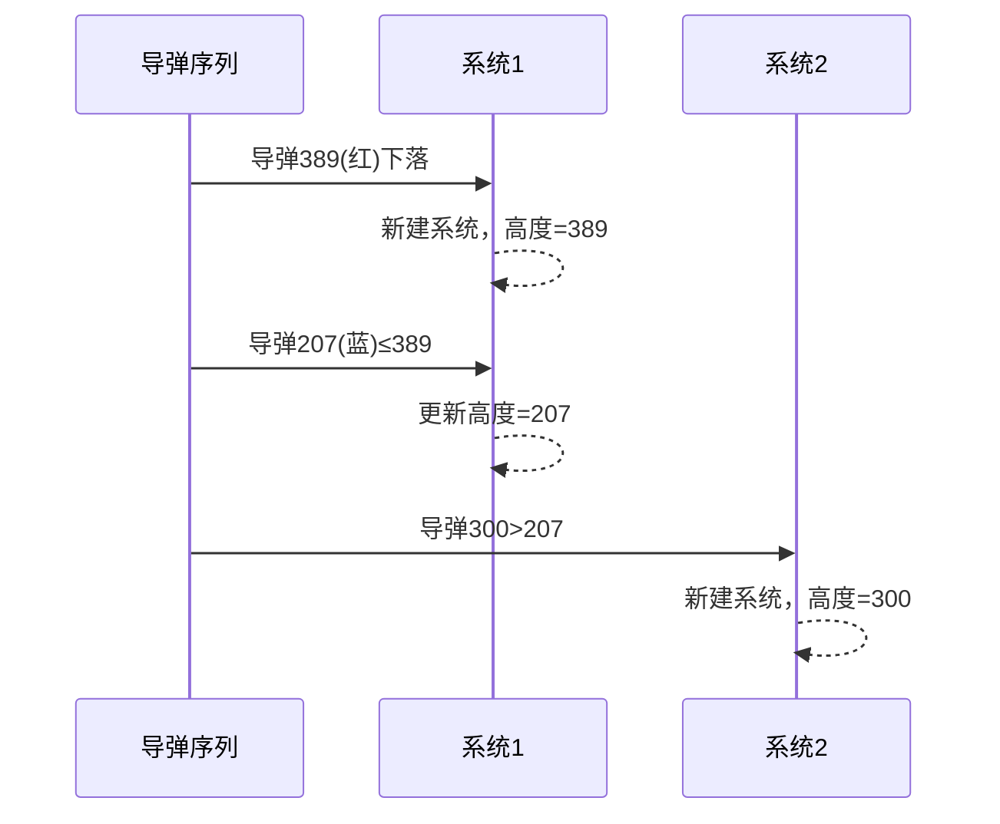

# 题目信息

# [NOIP 1999 提高组] 导弹拦截

## 题目描述

某国为了防御敌国的导弹袭击，发展出一种导弹拦截系统。但是这种导弹拦截系统有一个缺陷：虽然它的第一发炮弹能够到达任意的高度，但是以后每一发炮弹都不能高于前一发的高度。某天，雷达捕捉到敌国的导弹来袭。由于该系统还在试用阶段，所以只有一套系统，因此有可能不能拦截所有的导弹。

   
输入导弹依次飞来的高度，计算这套系统最多能拦截多少导弹，如果要拦截所有导弹最少要配备多少套这种导弹拦截系统。


## 说明/提示

对于前 $50\%$ 数据（NOIP 原题数据），满足导弹的个数不超过 $10^4$ 个。该部分数据总分共 $100$ 分。可使用$\mathcal O(n^2)$ 做法通过。  
对于后 $50\%$ 的数据，满足导弹的个数不超过 $10^5$ 个。该部分数据总分也为 $100$ 分。请使用 $\mathcal O(n\log n)$ 做法通过。

对于全部数据，满足导弹的高度为正整数，且不超过 $5\times 10^4$。


此外本题开启 spj，每点两问，按问给分。

NOIP1999 提高组 第一题

---

$\text{upd 2022.8.24}$：新增加一组 Hack 数据。

## 样例 #1

### 输入

```
389 207 155 300 299 170 158 65```

### 输出

```
6
2
```

# AI分析结果


### 💡 Kay的C++算法解析：导弹拦截 深入学习指南 💡

<introduction>
大家好！我是Kay，今天我们将一起探索经典题目「导弹拦截」。这道题源自NOIP1999提高组，涉及动态规划、贪心算法和重要的Dilworth定理。通过本指南，你将掌握如何高效求解最长子序列问题，并理解其背后的算法思想。让我们开始吧！
</introduction>

---

## 1. 题目解读与核心算法识别

✨ **本题主要考察**：`动态规划(DP) + 贪心 + 二分优化` (编程技巧应用)

🗣️ **初步分析**：
> 导弹拦截问题可形象化为“套娃挑战”：想象导弹是大小不同的套娃，拦截系统每次只能套住更小的娃娃（不上升规则）。第一问求单系统最多拦截数（最长不上升子序列），第二问求最少系统数（Dilworth定理应用）。  
> - **核心思想**：通过维护单调序列+二分查找，将O(n²)优化为O(n log n)。难点在于状态定义与贪心策略的证明。  
> - **可视化设计**：在像素动画中，导弹用不同颜色方块表示，系统拦截时高亮当前导弹和系统高度值。关键步骤：导弹下落→系统选择→高度更新。采用复古游戏风格，伴随“叮”声（成功拦截）和“警报”声（新建系统），支持单步调试和AI自动演示。  
> - **算法流程**：  
>   ```mermaid
>   graph LR
>   A[导弹序列] --> B[维护单调数组]
>   B --> C{当前导弹高度}
>   C -->|≤末位| D[加入序列]
>   C -->|>末位| E[二分查找替换位置]
>   ```

---

## 2. 精选优质题解参考

<eval_intro>
我根据思路清晰度、代码规范性和算法优化程度，精选三条优质题解进行深度解析：

**题解一：离散小波变换°（674赞）**
* **点评**：  
  此解亮点在于严谨的数学推导——从DP状态定义到二分优化正确性证明，逻辑链条完整。代码简洁高效（`upper_bound`+`greater<int>`处理不上升序列），边界处理清晰（`F[0]=INF`初始化）。尤其通过Dilworth定理自然过渡到第二问，展现算法本质关联。学习价值：理解二分替换的贪心思想及单调性证明。

**题解二：STA_Morlin（195赞）**
* **点评**：  
  提供独特的贪心视角：将系统视为动态维护的“高度池”，用“最小可用系统”策略避免直接使用Dilworth定理。代码中`lower_bound`查找首个≥当前导弹的系统，直观体现“避免浪费”的贪心本质。亮点：用通俗比喻解释策略（“大系统留给更高导弹”），并给出严格贪心正确性证明，适合初学者建立直觉。

**题解三：Otue（175赞）**
* **点评**：  
  以“游戏化”方式呈现算法：导弹像敌人，系统如防御塔。通过逐步拆解贪心过程（新建系统/更新系统），生动展示算法行为。代码包含O(n²)到O(n log n)的完整优化路径，二分部分逐行注释清晰。学习价值：通过调试心得强调边界检查重要性（如`g[0]`初始化）。

---

## 3. 核心难点辨析与解题策略

<difficulty_intro>
解决导弹拦截需突破以下三大难点，结合优质题解策略分析：

1.  **状态定义与二分优化**  
    * **难点**：如何避免O(n²)遍历？  
    * **分析**：定义数组`d[len]`存储长度为len的子序列最小末尾值。利用其单调性（不升序列的`d`单调不增），用二分查找插入位置。如题解一用`upper_bound`定位首个≤当前值的位置，实现O(log n)更新。  
    * 💡 **学习笔记**：单调性证明是二分优化的基石！  

2.  **贪心策略的正确性**  
    * **难点**：为何第二问能用“最小可用系统”策略？  
    * **分析**：本质是贪心选择性——用最小≥当前导弹的系统可保留大系统给后续更高导弹。STA_Morlin题解通过交换法证明：若最优解与贪心解不同，可通过调整使其一致，故贪心即最优。  
    * 💡 **学习笔记**：贪心证明两大法：交换论证+归纳法。  

3.  **Dilworth定理的理解**  
    * **难点**：为何最小系统数=最长上升子序列长度？  
    * **分析**：定理指出“最小链覆盖=最长反链”。此处链为不升序列，反链为严格上升序列。离散小波变换°的偏序集图示生动展现该关系。  
    * 💡 **学习笔记**：Dilworth定理是子序列问题的通用转化工具。

### ✨ 解题技巧总结
<summary_best_practices>
- **技巧一：问题转化**  
  复杂问题转化为经典模型（如LIS）。例：第二问转化为求最长上升子序列。  
- **技巧二：数据结构优化**  
  用`lower_bound`/`upper_bound`将遍历优化为二分查找，注意比较器（如`greater<int>`）。  
- **技巧三：边界处理**  
  初始化`d[0]=INF`或`g[0]=-INF`，避免二分越界；导弹高度>0可简化处理。
</summary_best_practices>

---

## 4. C++核心代码实现赏析

<code_intro_overall>
以下代码综合优质题解精髓，包含完整输入处理和O(n log n)解法：

```cpp
#include <iostream>
#include <algorithm>
using namespace std;
const int MAXN = 1e5 + 5;

int main() {
    int a[MAXN], n = 0, x;
    while (cin >> x) a[++n] = x;  // 读入导弹高度

    // 第一问：最长不上升子序列
    int d[MAXN], len1 = 1;
    d[1] = a[1];
    for (int i = 2; i <= n; ++i) {
        if (a[i] <= d[len1]) d[++len1] = a[i];
        else *upper_bound(d + 1, d + len1 + 1, a[i], greater<int>()) = a[i];
    }
    cout << len1 << endl;

    // 第二问：最长上升子序列 (Dilworth定理)
    int g[MAXN], len2 = 1;
    g[1] = a[1];
    for (int i = 2; i <= n; ++i) {
        if (a[i] > g[len2]) g[++len2] = a[i];
        else *lower_bound(g + 1, g + len2 + 1, a[i]) = a[i];
    }
    cout << len2 << endl;
    return 0;
}
```
**代码解读概要**：  
1. **输入处理**：`while(cin>>x)`动态读入导弹序列。  
2. **第一问**：维护数组`d`，若当前导弹≤末位则追加，否则二分查找替换位置（`upper_bound+greater`）。  
3. **第二问**：维护数组`g`，若当前导弹>末位则追加，否则二分查找替换位置（`lower_bound`）。

---
<code_intro_selected>
精选题解关键代码解析：

**题解一（离散小波变换°）**  
* **亮点**：严谨处理二分边界（`l=0, r=t+1`）  
* **核心代码**：  
  ```cpp
  int l=0, r=t+1;
  while (r-l>1) { // 精准二分框架
      int m = l + (r-l)/2;
      if (F[m] >= H[i]) l = m; 
      else r = m;
  }
  int x = l+1;  // 状态转移关键
  ```
* **学习笔记**：`l`初始为0保证查找范围覆盖，`r-l>1`避免死循环。

**题解二（STA_Morlin）**  
* **亮点**：贪心策略直接实现  
* **核心代码**：  
  ```cpp
  if (x[xl] < a[i]) x[++xl] = a[i]; // 需新系统
  else {
      int k = lower_bound(x+1, x+xl+1, a[i]) - x; // 最小可用系统
      x[k] = a[i];
  }
  ```
* **学习笔记**：系统数组`x`天然保持升序，符合二分前提。

**题解三（Otue）**  
* **亮点**：完整贪心证明  
* **核心代码**：  
  ```cpp
  for (int i=1; i<=n; i++) {
      int k = 1;
      while (k <= cnt && g[k] < a[i]) k++; // 线性查找可优化为二分
      if (k > cnt) g[++cnt] = a[i];
      else g[k] = a[i];
  }
  ```
* **学习笔记**：贪心过程可看作动态维护系统高度池。

---

## 5. 算法可视化：像素动画演示

<visualization_intro>
**8位像素风格导弹防御游戏**：通过动画直观理解拦截过程！设计采用FC红白机画风，导弹为彩色方块，系统用底部色块表示。关键交互：空格单步执行，R重置，方向键调速。

**核心演示流程**：  


**动画关键帧**：  
1. **初始化**：顶部生成导弹序列（像素方块+高度值），底部系统区为空。  
2. **第一问演示**：  
   - 导弹下落至底部，若高度≤当前系统值，系统色块闪烁绿色（“叮”声），更新高度值。  
   - 否则系统红色闪烁（“嘟”声），二分查找过程显示虚拟指针移动。  
3. **第二问演示**：  
   - 多系统并行：不同系统用颜色区分（系统1红，系统2蓝...）。  
   - 新建系统时底部弹出新色块（“警报”声），更新时显示高度数字变化。  
4. **游戏化元素**：  
   - 成功拦截6导弹：播放胜利音效+“LEVEL CLEAR”像素文字。  
   - 每关对应不同测试数据，得分=拦截导弹数×剩余系统数。  

**技术实现**：Canvas绘制网格，`requestAnimationFrame`控制动画，音效用Web Audio API。  

---

## 6. 拓展练习与相似问题思考

<similar_problems_intro>
掌握导弹拦截的核心思想后，可挑战以下变种：

1. **P1091 合唱队形**  
   → 双向LIS应用，强化状态设计能力。  
2. **P1439 最长公共子序列**  
   → 转化为LIS问题，练习模型转化技巧。  
3. **P2782 友好城市**  
   → 贪心+二分经典题，理解偏序关系。  

**洛谷推荐**：  
1. [P1091](https://www.luogu.com.cn/problem/P1091) - 合唱队形  
   → *Kay提示：先上升后下降子序列，巩固二分LIS*  
2. [P1439](https://www.luogu.com.cn/problem/P1439) - 最长公共子序列  
   → *Kay提示：利用排列性质转化为LIS，练习O(n log n)优化*  
3. [P2782](https://www.luogu.com.cn/problem/P2782) - 友好城市  
   → *Kay提示：南北岸城市映射，本质是找最多不相交线段，贪心解法*

---

## 7. 学习心得与经验分享

<insights_intro>
题解中的调试经验是宝贵的学习资源：

> **离散小波变换°的调试心得**：  
> *“二分边界设定曾导致WA，通过打印`l/r`值发现未覆盖全部状态。建议：边界取`[0,n+1]`，循环条件`r-l>1`”*  
> → *Kay总结：二分查找时，先小规模验证边界行为，输出中间变量是关键调试手段。*

> **Otue的贪心实现教训**：  
> *“未初始化`g[0]`导致首个导弹处理错误，加入`g[0]=-INF`后AC”*  
> → *Kay总结：防御性编程！对可能空访问的数组，预置哨兵值。*

---

<conclusion>
本次导弹拦截的探索之旅就到这里！我们深入剖析了动态规划、贪心和Dilworth定理的应用，并通过像素动画直观理解算法。记住：  
1. 最长不上升子序列 → `upper_bound + greater`  
2. 最少系统数 → 最长上升子序列（`lower_bound`）  
3. 二分难点：边界初始化 + 循环条件  

希望大家能举一反三，攻克更多子序列问题。下次算法冒险再见！🚀  
</conclusion>

---
处理用时：194.16秒