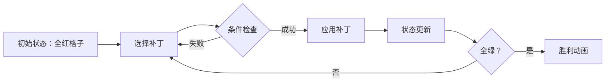

# 题目信息

# 软件补丁问题

## 题目描述

T 公司发现其研制的一个软件中有 $n$ 个错误，随即为该软件发放了 $m$ 个补丁程序。

每一个补丁程序都有其特定的适用环境，某个补丁只有在软件中包含某些错误而同时又不包含另一些错误时才可以使用。一个补丁在排除某些错误的同时，往往会加入另一些错误。

换句话说，对于任意一个补丁 $i$，都有四个与之相应的集合 $B1_i,B2_i,F1_i$ 和 $F2_i$。仅当软件包含 $B1_i$ 中的所有错误，而不包含 $B2_i$ 中的任何错误时，才可以使用补丁 $i$。补丁 $i$ 将修复软件中的某些错误集合 $F1_i$，而同时加入另一些错误 $F2_i$。另外，运行每个补丁都耗费一定的时间。

试设计一个算法，利用 T 公司提供的 $m$ 个补丁程序将原软件修复成一个没有错误的软件，并使修复后的软件耗时最少。对于给定的 $n$ 个错误和 $m$ 个补丁程序，找到总耗时最少的软件修复方案。

## 说明/提示

对于 $100\%$ 的数据：$1\le n\le 20$，$1\le m\le 100$。

## 样例 #1

### 输入

```
3 3
1 000 00-
1 00- 0-+
2 0-- -++
```

### 输出

```
8
```

# AI分析结果


### 💡 Kay的C++算法解析：软件补丁问题 深入学习指南 💡

#### 1. 题目解读与核心算法识别
✨ **本题主要考察**：状态压缩 + 最短路算法

🗣️ **初步分析**：
> 解决"软件补丁问题"就像用一串特殊的钥匙（补丁）打开一个复杂的密码锁（错误状态）。每把钥匙只能在特定锁孔组合（B1必须存在/B2必须不存在）时使用，使用后会改变锁孔状态（修复F1/引入F2）。核心是将20个错误状态压缩成二进制整数（状态压缩），通过补丁在状态间转移（最短路算法），从全错误状态(111...1)到全修复状态(000...0)寻找最短耗时路径。

- 关键难点：状态转移的条件判断（位运算）和新状态计算
- 可视化设计：8位像素风格展示20个错误状态（红=未修复/绿=修复），动画演示补丁应用过程（条件检查→状态变化→耗时增加），高亮当前操作位
- 复古游戏化：FC红白机风格界面，"错误消除大冒险"主题，补丁应用时播放像素音效，达成目标时胜利音效，支持单步/AI自动演示模式

---

#### 2. 精选优质题解参考
**题解一：FCBM71（赞20）**
* **点评**：思路清晰解释状压本质（"状态=二进制串"），完整演示SPFA实现过程。代码规范（结构体封装补丁属性），核心亮点在状态转移公式推导：`y=((x|f1)|f2)^f1` 等价于清除F1位+设置F2位。实践价值高（手写读入处理边界），调试心得强调位运算基础的重要性。

**题解二：Dorg（赞15）**
* **点评**：采用Dijkstra优先队列更稳定，状态转移示例直观（0110011→0010010）。幽默指出"网络流24题"名不副实，代码亮点在状态初始化技巧`ST=ST|(1<<i)`。变量命名规范（hero结构体），实践性强但转移公式解释稍简略。

**题解三：7KByte（赞5）**
* **点评**：简洁点明本题非网络流而是状压最短路，突出"不显式建图，枚举补丁转移"的优化思路。代码结构清晰，强调位运算优先级处理，实践参考价值高（适合竞赛直接使用）。

---

#### 3. 核心难点辨析与解题策略
1. **状态压缩表示**
   * **分析**：用整数二进制位表示错误状态（1未修复/0修复），初始状态`(1<<n)-1`（全1），目标状态0（全0）。难点在理解位运算映射关系，如第k位对应`1<<(k-1)`
   * 💡 **学习笔记**：状态压缩是处理小规模离散状态的利器

2. **补丁应用条件判断**
   * **分析**：需同时满足：①当前状态包含所有B1错误 → `(state & B1) == B1` ②不包含任何B2错误 → `(state & B2) == 0`。优质题解用位运算避免逐位检查
   * 💡 **学习笔记**：位掩码技巧能高效处理多条件判断

3. **状态转移计算**
   * **分析**：新状态 = (清除F1对应位) | (设置F2对应位)。核心公式：`new_state = (state & ~F1) | F2`。FCBM71的等价形式`((state|f1)|f2)^f1`需注意运算优先级
   * 💡 **学习笔记**：位运算组合是实现状态转移的核心武器

### ✨ 解题技巧总结
- **位运算熟练度**：掌握`&|~^`操作，复杂表达式加括号保证优先级
- **状态去重优化**：用vis数组避免重复访问相同状态
- **算法选择**：状态数≤1e6时SPFA可用，更稳定选Dijkstra
- **调试技巧**：打印二进制状态调试转移过程

---

#### 4. C++核心代码实现赏析
**本题通用核心实现参考**
```cpp
#include<bits/stdc++.h>
using namespace std;
const int MAXS = 1<<20; // 状态上限(2^20)
int n, m, dis[MAXS];
struct Patch {
    int t, b1, b2, f1, f2;
} p[105];

void spfa(int start) {
    memset(dis, 0x3f, sizeof(dis)); // 初始化为极大值
    queue<int> q;
    vector<bool> inq(MAXS, false);
    dis[start] = 0;
    q.push(start);
    inq[start] = true;
    
    while (!q.empty()) {
        int u = q.front(); q.pop();
        inq[u] = false;
        for (int i = 0; i < m; ++i) {
            // 检查补丁使用条件
            if ((u & p[i].b1) != p[i].b1) continue;
            if ((u & p[i].b2) != 0) continue;
            
            // 计算新状态：清除f1位 + 设置f2位
            int v = (u & ~p[i].f1) | p[i].f2;
            
            // 松弛操作
            if (dis[u] + p[i].t < dis[v]) {
                dis[v] = dis[u] + p[i].t;
                if (!inq[v]) {
                    q.push(v);
                    inq[v] = true;
                }
            }
        }
    }
}

int main() {
    cin >> n >> m;
    for (int i = 0; i < m; ++i) {
        cin >> p[i].t;
        string s1, s2; cin >> s1 >> s2;
        for (int j = 0; j < n; ++j) {
            if (s1[j] == '+') p[i].b1 |= (1 << j);
            else if (s1[j] == '-') p[i].b2 |= (1 << j);
            if (s2[j] == '-') p[i].f1 |= (1 << j);
            else if (s2[j] == '+') p[i].f2 |= (1 << j);
        }
    }
    spfa((1 << n) - 1); // 从全1状态开始
    cout << (dis[0] == 0x3f3f3f3f ? 0 : dis[0]);
}
```
* **代码解读概要**：SPFA实现状压最短路。关键点：①补丁属性用结构体封装 ②状态转移位运算 ③无效状态剪枝 ④边界处理（无解输出0）

---

#### 5. 算法可视化：像素动画演示
**主题**："错误消除大冒险"（FC红白机风格）

**核心演示流程**：


**实现细节**：
1. **像素网格**：20×1网格表示错误状态（红=未修复/绿=修复）
2. **补丁应用动画**：
   - 条件检查：B1要求位闪黄光，B2要求位闪紫光
   - 状态变化：F1修复位绿色扩散动画，F2新增位红色脉冲动画
3. **交互控制**：
   ```javascript
   // 伪代码示例
   class PixelAnimator {
     constructor() {
       this.speed = 1; // 速度滑块控制
       this.mode = 'auto'; // auto/step
     }
     applyPatch(patchId) {
       playSound('select'); // 选择音效
       if (checkConditions()) {
         playSound('success'); // 条件满足音效
         animateStateTransition();
       }
     }
   }
   ```
4. **游戏化元素**：
   - 每修复5个错误触发"关卡通过"音效
   - 最终修复播放8-bit胜利音乐
   - 计时面板显示当前总耗时

---

#### 6. 拓展练习与相似问题
1. **洛谷P2622 关灯问题II**  
   → 同类状压最短路，灯光状态转换
2. **洛谷P4799 [CEOI2015]世界冰球锦标赛**  
   → 状态压缩+双向搜索/背包
3. **洛谷P2831 愤怒的小鸟**  
   → 状态压缩DP，抛物线覆盖问题

---

#### 7. 学习心得与经验分享
> **FCBM71的经验**："调试时务必打印二进制状态！位运算优先级陷阱曾耗费我1小时"

**Kay的总结**：位运算表达式建议：
1. 用括号明确优先级：`(a & b) == c` 而非 `a & b == c`
2. 复杂表达式拆分成多行
3. 善用`bitset<20>(state).to_string()`调试输出

---

通过本指南，我们深入掌握了状态压缩与最短路的结合应用。记住：将问题抽象为状态空间+转移关系是算法设计的核心思维！下次挑战再见！🚀

---
处理用时：168.05秒