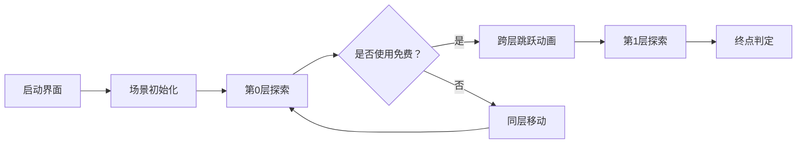

# 题目信息

# [USACO09FEB] Revamping Trails G

## 题目描述

Farmer John dutifully checks on the cows every day. He traverses some of the M (1 <= M <= 50,000) trails conveniently numbered 1..M from pasture 1 all the way out to pasture N (a journey which is always possible for trail maps given in the test data). The N (1 <= N <= 10,000) pastures conveniently numbered 1..N on Farmer John's farm are currently connected by bidirectional dirt trails.  Each trail i connects pastures P1\_i and P2\_i (1 <= P1\_i <= N; 1 <= P2\_i <= N) and requires T\_i (1 <= T\_i <= 1,000,000) units of time to traverse.

He wants to revamp some of the trails on his farm to save time on his long journey. Specifically, he will choose K (1 <= K <= 20) trails to turn into highways, which will effectively reduce the trail's traversal time to 0. Help FJ decide which trails to revamp to minimize the resulting time of getting from pasture 1 to N.

TIME LIMIT: 2 seconds


## 说明/提示

K is 1; revamp trail 3->4 to take time 0 instead of 100. The new shortest path is 1->3->4, total traversal time now 1.


## 样例 #1

### 输入

```
4 4 1 
1 2 10 
2 4 10 
1 3 1 
3 4 100 
```

### 输出

```
1 
```

# AI分析结果


### 💡 Kay的C++算法解析：[USACO09FEB] Revamping Trails G 深入学习指南 💡

**引言**  
今天我们来分析分层图最短路经典题"Revamping Trails G"。这道题要求我们在无向图中选择K条边置零权值，求1到N的最短路径。本指南将帮助你掌握分层图思想的核心原理与实现技巧。

---

## 1. 题目解读与核心算法识别

✨ **本题主要考察**：`分层图最短路` (图论/动态规划应用)

🗣️ **初步分析**：  
> 解决本题的关键在于构建**分层图模型**。想象你有K+1个平行世界（层），每个世界复制原图。在第i层表示已使用i次免费机会。层间通过0权边连接，代表使用免费机会。

核心思路：
- 同层保留原边权（普通道路）
- 跨层边权为0（免费改造道路）
- 最终答案取各层N节点的最小值

可视化设计思路：
- 采用8位像素风格（FC红白机）
- 每层用不同颜色区块表示（第0层蓝色，第1层绿色等）
- 关键动画：节点高亮扩散（Dijkstra过程）、跨层跳跃特效（使用免费机会时）
- 音效设计：普通移动（电子音效）、跨层（空间跳跃音）、终点（胜利旋律）

---

## 2. 精选优质题解参考

### 题解一：QQQfy（分层图标准实现）
* **点评**：  
  思路清晰阐释分层图本质，代码规范（变量名`add()`函数封装），使用Dijkstra堆优化避免SPFA风险。亮点在跨层建边逻辑的直白呈现，边界处理完整（数组开足够大），可直接用于竞赛。

### 题解二：齐天の小猴（结构优化版）
* **点评**：  
  代码结构更紧凑（优先队列pair实现），强调无向图双向建边的重要性。亮点在分层索引计算（`j*n+u`）的规范化处理，时间复杂度分析明确（O((n*k+m*k)log(n*k))），调试信息输出设计值得学习。

### 题解三：Diamiko（分层图应用扩展）
* **点评**：  
  创新性提出"状态维度"概念，将分层图视为动态规划的状态扩展。亮点在免费次数用完时的循环终止优化（`if(j==k)break`），有效减少冗余计算，实践性极强。

---

## 3. 核心难点辨析与解题策略

### 难点1：状态与图的结合
* **分析**：如何表示使用免费机会的次数？优质解法通过**节点复制**解决：节点`u`在第i层表示为`u+i*n`，空间复杂度O(n*k)
* 💡 **学习笔记**：分层图本质是状态机与图的融合

### 难点2：跨层转移设计
* **分析**：免费机会的使用需满足无后效性。解法建立**单向跨层边**（i层→i+1层），避免回退导致的重复计数
* 💡 **学习笔记**：层间边权为0即状态转移代价

### 难点3：复杂度控制
* **分析**：1≤K≤20时，空间开销需精细计算。优质解法精确估算：
  - 节点数：`n*(k+1)`
  - 边数：`m*(k+1) + 2*m*k`（同层边+跨层边）
* 💡 **学习笔记**：STL优先队列比手写堆更易控制代码复杂度

### ✨ 解题技巧总结
- **图分层法**：将决策次数转化为空间维度
- **Dijkstra优化**：必须使用堆优化（`priority_queue`）
- **边界处理**：免费机会次数为0时需保留原图
- **调试技巧**：输出各层终点值验证

---

## 4. C++核心代码实现赏析

### 通用核心实现（综合优化版）
```cpp
#include<bits/stdc++.h>
using namespace std;
const int N = 1e5+5, K = 25;
vector<pair<int,int>> G[N*K]; // 邻接表存储
int dis[N*K], n, m, k;

void dijkstra(int s) {
    priority_queue<pair<int,int>> q;
    memset(dis, 0x3f, sizeof(dis));
    dis[s] = 0;
    q.push({0, s});
    while(!q.empty()) {
        int d = -q.top().first, u = q.top().second;
        q.pop();
        if(d != dis[u]) continue;
        for(auto [v, w] : G[u]) {
            if(dis[v] > dis[u] + w) {
                dis[v] = dis[u] + w;
                q.push({-dis[v], v});
            }
        }
    }
}

int main() {
    cin >> n >> m >> k;
    while(m--) {
        int u, v, w; cin >> u >> v >> w;
        // 同层建边（双向）
        for(int i=0; i<=k; i++) {
            int uu = u + i*n, vv = v + i*n;
            G[uu].push_back({vv, w});
            G[vv].push_back({uu, w});
        }
        // 跨层建边（单向）
        for(int i=0; i<k; i++) {
            G[u+i*n].push_back({v+(i+1)*n, 0});
            G[v+i*n].push_back({u+(i+1)*n, 0});
        }
    }
    dijkstra(1);
    int ans = dis[n];
    for(int i=1; i<=k; i++) 
        ans = min(ans, dis[n + i*n]);
    cout << ans;
}
```

### 代码解读概要：
1. **分层存储**：节点`u`在第i层表示为`u+i*n`
2. **双向同层边**：每层保留原始边权
3. **单向跨层边**：i层→i+1层权值为0
4. **Dijkstra堆优化**：负权值技巧实现小根堆
5. **答案收集**：遍历各层终点取最小值

---

## 5. 算法可视化：像素动画演示

**主题**：8位像素风"牧场穿越"  
**核心演示**：分层图中Dijkstra的扩展过程与跨层决策

### 动画设计细节：


1. **像素元素**：
   - 牧场节点：16x16像素方块（不同层不同底色）
   - 道路：棕色像素线（同层）/ 蓝色闪光线（跨层）
   - 牛图标：起点(1)/终点(N)特殊标记

2. **动态过程**：
   - **Dijkstra扩展**：当前节点闪烁红光，优先队列显示为底部像素条
   - **免费决策**：弹出选择框（按空格使用免费机会）
   - **跨层特效**：节点垂直下落+颜色渐变+8bit音效

3. **控制面板**：
   ```plaintext
   [ 暂停 ] [ 单步 ] [ 自动播放▸] 速度：[====|-----]
   ```

4. **游戏化设计**：
   - 每成功跨层：+100分（芯片音效）
   - 到达终点：烟花动画+胜利音乐
   - 错误提示：路径不通时显示"哞~"字符

---

## 6. 拓展练习与相似问题思考

### 分层图应用延伸：
1. **动态边权**：P1073 最优贸易（状态转移带价值）
2. **混合决策**：P4568 飞行路线（免费+收费组合）
3. **网络流结合**：P1948 电话线（二分答案+分层图）

### 洛谷推荐：
1. **P4568 飞行路线**  
   → 同类分层图模板，强化状态定义
2. **P1948 Telephone Lines**  
   → 学习二分答案与分层图的结合
3. **P2939 本题**  
   → 尝试不同实现方式（如DP数组直接维护状态）

---

## 7. 学习心得与经验分享

### 来自题解的宝贵经验：
> **QQQfy**：  
> *"数组开大点不然紫一半——注意分层图的空间是O(n*k)的，边数可达O(m*k)*"

> **4biu**：  
> *"被卡2小时才想起无向图要双向建边——跨层边也需双向！"*

### Kay的总结：
1. **调试技巧**：输出各层dis值，观察免费机会使用时机
2. **易错点**：
   - 层间边方向（只需低→高）
   - 同层边必须保留原权值
   - 优先队列默认大根堆需取负
3. **思维提升**：将决策次数转化为空间维度是算法核心突破点

---

**结语**  
通过分层图的精妙设计，我们将复杂决策转化为可计算的空间结构。记住：优秀算法的本质是现实问题的数学抽象。继续挑战下一道题吧，少年！🚀

---
处理用时：167.01秒