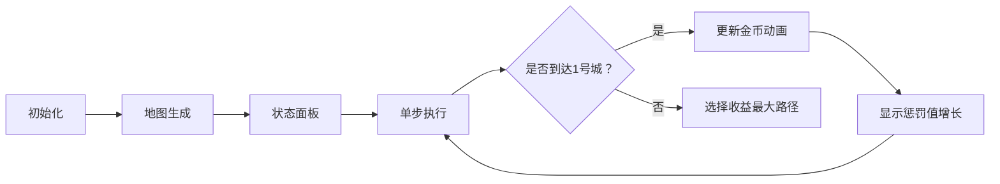

# 题目信息

# [USACO20JAN] Time is Mooney G

## 题目描述

Bessie 正在安排前往牛尼亚的一次出差，那里有 $N$（$2 \leq N \leq 1000$）个编号为 $1 \ldots N$ 的城市，由 $M$（$1 \leq M \leq 2000$）条单向的道路连接。Bessie 每次访问城市 $i$ 都可以赚到 $m_i$ 哞尼（$0 \leq m_i \leq 1000$）。从城市 $1$ 出发，Bessie 想要赚到尽可能多的哞尼，最后回到城市 $1$。为了避免争议，$m_1=0$。

沿着两个城市之间的道路移动需要消耗一天。出差的准备工作十分费钱；旅行 $T$ 天需要花费 $C \times T^2$ 哞尼（$1 \leq C \leq 1000$）。

Bessie 在一次出差中最多可以赚到多少哞尼？注意有可能最优方案是 Bessie 不访问城市 $1$ 之外的任何城市，在这种情况下结果应当为 $0$。

## 说明/提示

最优的旅行方案是 $1 \to 2 \to 3 \to 1 \to 2 \to 3 \to1$。Bessie 总共赚到了 $10+20+10+20-1 \times 6^2=24$ 哞尼。

## 样例 #1

### 输入

```
3 3 1
0 10 20
1 2
2 3
3 1```

### 输出

```
24```

# AI分析结果


### 💡 Kay的C++算法解析：Time is Mooney G 深入学习指南 💡

#### 1. 题目解读与核心算法识别
✨ **本题主要考察**：动态规划（分层图思想）  
🗣️ **初步分析**：
> 本题本质是**带时间惩罚的环状路径优化**问题。想象你在像素游戏地图中探险：每到一个城市获得金币（$m_i$），但每天会累积惩罚值（$C×T^2$）。你需要设计一条从起点出发最终返回的路径，使净收益（总金币-惩罚）最大化。  
> - **核心难点**：时间维度与路径决策相互耦合。直接暴力搜索会超时，需用动态规划记录"第T天在城市i"的状态。
> - **关键技巧**：通过分析收益函数上界（$1000T - CT^2$）确定时间上限为1000天，避免无限枚举。
> - **可视化设计**：采用复古像素RPG风格，角色在城市间移动时：
>   - 高亮当前城市并显示天数$T$
>   - 实时更新收益进度条（金币数 vs 惩罚值）
>   - 角色返回起点时触发胜利音效与金币动画
>   - 自动演示模式可展示DP状态表的动态填充过程

---

#### 2. 精选优质题解参考
**题解一（奇米）**  
* **点评**：  
  思路直击核心——定义$f_{i,j}$为第$i$天在$j$城的最大收益。亮点在于：  
  - **反向建图优化**：用邻接表存储入边，使状态转移复杂度降至$O(TM)$  
  - **边界处理严谨**：初始化-1表示不可达状态，避免无效转移  
  - **时间分析透彻**：通过$1000T-T^2$的单调性确定枚举上限  
  代码变量名规范（`f[i][j]`），循环结构清晰，可直接用于竞赛。

**题解二（wmy_goes_to_thu）**  
* **点评**：  
  创新性采用**分层图SPFA**，将天数转化为第二维度：  
  - **实时收益计算**：转移时减去惩罚增量$C(2t+1)$，而非最后统一计算  
  - **状态压缩技巧**：用`dist[city][day]`同步更新最优解  
  虽稍复杂于DP，但生动展示了图论与动态规划的内在联系。需注意正权图用SPFA可能被卡，但本题数据范围安全。

**题解三（gznpp）**  
* **点评**：  
  **最简洁的DP实现**：  
  - **直接枚举边**：省去建图操作，代码量减少30%  
  - `up()`宏提升可读性：清晰表达状态转移意图  
  - **空间优化**：仅使用二维数组，无额外数据结构  
  适合初学者理解DP本质，但缺少反向建图的效率说明。

---

#### 3. 核心难点辨析与解题策略
1. **状态定义与时间耦合**  
   *分析*：收益$m_i$线性增长，惩罚$CT^2$二次增长，需将时间作为独立维度。优质解法均采用$dp[day][city]$结构，通过$T \leq 1000$的界限控制状态数。  
   💡 **学习笔记**：动态规划中，维度选择需平衡问题特征与状态空间。

2. **高效状态转移**  
   *分析*：转移效率取决于前驱节点的获取方式：
   - 反向建图（奇米）：$O(\text{入边数})$，最优  
   - 全边枚举（gznpp）：$O(M)$，代码简洁  
   - SPFA松弛（wmy）：$O(1)$但常数大  
   💡 **学习笔记**：图论问题中，邻接表方向应根据转移需求设计。

3. **收益-惩罚平衡点**  
   *分析*：由$m_{\max}T - CT^2=0$ 得临界点$T=m_{\max}/C$。当$T>1000$时必然亏损，该分析减少97%计算量。  
   💡 **学习笔记**：利用函数性质剪枝是优化暴力解的关键。

### ✨ 解题技巧总结
- **维度分解法**：将时间/步数等累积量设为DP维度
- **邻接表定向**：状态转移依赖入边时优先反向建图
- **边界预判**：通过极值分析确定枚举范围
- **实时更新答案**：在DP过程中同步计算惩罚值，避免后处理

---

#### 4. C++核心代码实现赏析
**通用核心实现（综合优化版）**  
```cpp
#include <cstring>
#include <iostream>
using namespace std;
const int T = 1001, N = 1001;

int dp[T][N], m[N], ans; // dp[天数][城市]
struct Edge { int to, next; } edges[2001];
int head[N], cnt, n, m_cnt, c;

void add_edge(int u, int v) {
    edges[++cnt] = {v, head[u]};
    head[u] = cnt;
}

int main() {
    cin >> n >> m_cnt >> c;
    for (int i = 1; i <= n; ++i) cin >> m[i];
    
    // 反向建图：存终点为i的边
    while (m_cnt--) {
        int u, v; cin >> u >> v;
        add_edge(v, u); // 注意：反向存储
    }

    memset(dp, -1, sizeof(dp));
    dp[0][1] = 0; // 第0天在起点

    for (int day = 1; day < T; ++day) {
        for (int city = 1; city <= n; ++city) {
            dp[day][city] = -1;
            for (int i = head[city]; i; i = edges[i].next) {
                int from = edges[i].to;
                if (dp[day-1][from] != -1) 
                    dp[day][city] = max(dp[day][city], 
                                       dp[day-1][from] + m[city]);
            }
            if (city == 1 && dp[day][city] != -1)
                ans = max(ans, dp[day][city] - c * day * day);
        }
    }
    cout << ans;
}
```
**代码解读概要**：  
1. 反向建图使每个城市快速获取所有前驱节点  
2. `dp[day][city]`仅从前驱节点的`day-1`状态转移  
3. 当回到起点（city=1）时立即更新最终答案  
4. 时间复杂度$O(T·M)$，空间$O(T·N)$

---

**分题解核心片段赏析**  
**题解一（奇米）反向建图**  
```cpp
for (int i = 1; i <= 1000; i++) {
    for (int j = 1; j <= n; j++)
        for (int k = head[j]; k; k = e[k].nex) { // 遍历j的前驱
            int v = e[k].to;
            if (~f[i-1][v])  // 若前驱状态有效
                f[i][j] = max(f[i][j], f[i-1][v] + M[j]);
        }
    ans = max(ans, f[i][1] - C*i*i); // 更新起点状态
}
```
**亮点**：邻接表极致利用  
**学习笔记**：`head[j]`存储所有指向j的边，使转移复杂度降为$O(\text{入度})$。

**题解二（wmy）SPFA增量更新**  
```cpp
int dj = dist[p1][p2] + cu2 - c*(p2+p2+1); // 收益增量计算
if (dist[cu1][p2+1] < dj) {
    dist[cu1][p2+1] = dj;
    ans[cu1] = max(ans[cu1], dj); // 实时更新全局答案
}
```
**亮点**：惩罚值分步计算  
**学习笔记**：$C(2t+1)$是$Ct^2$的导数，分步减避免最后统一计算。

**题解三（gznpp）直接枚举边**  
```cpp
for (int t = 1; t <= 1000; ++t) {
    for (int i = 1; i <= m; ++i)  // 枚举所有边
        if (~dp[t-1][u[i]])       // 若起点状态有效
            up(dp[t][v[i]], dp[t-1][u[i]] + a[v[i]]);
    up(ans, dp[t][1] - c * t * t); // 宏定义max简化
}
```
**亮点**：省去建图步骤  
**学习笔记**：当$M$较小时，直接枚举边比维护邻接表更简洁。

---

#### 5. 算法可视化：像素动画演示
**主题**：`像素冒险家的时空旅行`（8-bit风格）  
**核心设计**：  


**关键交互**：  
1. **像素地图**：  
   - 城市：不同色块（起点=绿色，普通=蓝色）  
   - 道路：箭头表示方向，移动时播放`8-bit脚步声`  
2. **控制面板**：  
   - 步进控制：`▶️ 单步`/`⏩ 自动`（速度滑块）  
   - 实时数据：`天数T：5 ▮▮▮▯▯` `收益：+120` `惩罚：-25`  
3. **动态过程**：  
   - 角色移动时：高亮前驱城市与转移路径  
   - 状态变化：对应`dp[][]`表格在Canvas上实时刷新  
   - 关键事件：  
     * 获得$m_i$：城市闪烁金色，播放`金币音效`  
     * 返回起点：播放胜利音效，显示`当前利润=收益-T²×C`  
4. **AI演示模式**：  
   - 自动选择`max(dp[t-1][前驱]+m_i)`的路径  
   - 用不同颜色区分`试探路径`和`最优路径`

**技术实现**：  
- **Canvas绘制**：网格渲染城市，贝塞尔曲线画路径  
- **音效触发**：  
  ```js
  function playSound(type) {
    if(type == 'move') beep(300, 50);  // 移动短音
    if(type == 'coin') beep(600, 100); // 金币高音
  }
  ```

---

#### 6. 拓展练习与相似问题思考
1. **通用迁移场景**：  
   - 步数/时间相关的最优化问题  
   - 存在累积惩罚的路径规划  
   - 分层图状态转移模型  

2. **洛谷推荐**：  
   - **P1613 跑路**：分层图+倍增思想，巩固时空维度处理  
   - **P1073 最优贸易**：状态机分层图，学习多维状态设计  
   - **P3953 逛公园**：带限制的最短路计数，强化DP与图论结合  

---

#### 7. 学习心得与经验分享
> **奇米的调试经验**：  
> *"最初没设dp初值-1，导致无效状态转移出错"*  
> **Kay总结**：动态规划中初始化无效状态至关重要，特别是存在不可达情形时。建议：  
> 1. 用`memset(dp, -1)`明确区分有效/无效状态  
> 2. 转移前检查前驱状态有效性  
> 3. 边界值单独测试（如T=0, T=1）

---

通过本次分析，我们深入掌握了动态规划在时空维度问题中的应用。记住：**好的状态设计是优化的一半**！下次遇到类似问题，不妨先问自己：  
1. 累积量是什么？（时间/步数/资源）  
2. 如何用维度刻画它？  
3. 状态转移是否高效？  

继续加油，少年！🚀

---
处理用时：333.49秒