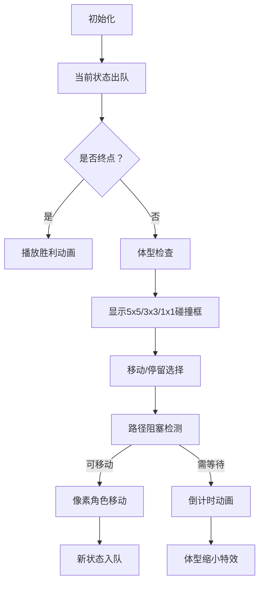

# 题目信息

# [蓝桥杯 2019 国 AC] 大胖子走迷宫

## 题目描述

小明是个大胖子，或者说是个大大胖子，如果说正常人占用 $1\times1$ 的面积，小明要占用 $5\times5$ 的面积。

由于小明太胖了，所以他行动起来很不方便。当玩一些游戏时，小明相比小伙伴就吃亏很多。小明的朋友们制定了一个计划，帮助小明减肥。计划的主要内容是带小明玩一些游戏，让小明在游戏中运动消耗脂肪。走迷宫是计划中的重要环节。

朋友们设计了一个迷宫，迷宫可以看成是一个由 $n\times n$ 个方阵组成的方阵，正常人每次占用方阵中 $1\times1$ 的区域，而小明要占用 $5\times5$ 的区域。小明的位置定义为小明最正中的一个方格。迷宫四周都有障碍物。为了方便小明，朋友们把迷宫的起点设置在了第 $3$ 行第 $3$ 列，终点设置在了第 $n-2$ 行第 $n-2$ 列。

小明在时刻 $0$ 出发，每单位时间可以向当前位置的上、下、左、右移动单位 $1$ 的距离，也可以停留在原地不动。小明走迷宫走得很辛苦，如果他在迷宫里面待的时间很长，则由于消耗了很多脂肪，他会在时刻 $k$ 变成一个胖子，只占用 $3\times3$ 的区域。如果待的时间更长，他会在时刻 $2\times k$ 变成一个正常人，只占用 $1\times1$ 的区域。注意，当小明变瘦时迷宫的起点和终点不变。

请问，小明最少多长时间能走到迷宫的终点。注意，小明走到终点时可能变瘦了也可能没有变瘦。

## 说明/提示

对于 $30 \%$ 的评测用例, $1 \leq n \leq 50$。

对于 $60 \%$ 的评测用例, $1 \leq n \leq 100$。

对于所有评测用例, $1 \leq n \leq 300$，$1 \leq k \leq 1000$。

蓝桥杯 2019 年国赛 A 组 F 题（C 组 I 题）。

## 样例 #1

### 输入

```
9 5
+++++++++
+++++++++
+++++++++
+++++++++
+++++++++
***+*****
+++++++++
+++++++++
+++++++++
```

### 输出

```
16```

# AI分析结果


### 💡 Kay的C++算法解析：大胖子走迷宫 深入学习指南 💡

#### 题目解读与核心算法识别
✨ **本题主要考察**：`状态空间搜索（BFS变种）`  
🗣️ **初步分析**：
> 解决"大胖子走迷宫"的关键在于**时间依赖的状态空间搜索**。想象小明是游戏《吃豆人》中的角色，随时间推移会"瘦身"缩小碰撞体积，从而通过狭窄通道。核心挑战在于：
> - 小明体型随时间变化（5×5→3×3→1×1）
> - 需同时考虑移动和停留两种操作
> - 路径合法性需检查整个占用区域
>
> **可视化设计思路**：
> - 采用FC红白机像素风格，小明用不同尺寸的像素方块表示（红/黄/绿）
> - 高亮显示当前检查的区域边界（5×5红色框→3×3黄色框→1×1绿色框）
> - 停留时显示倒计时动画，体型变化时播放"升级"音效
> - 自动演示模式可调速展示BFS探索过程（类似《吃豆人》AI寻路）

---

### 精选优质题解参考
**题解一：DreamLand_zcb (思路清晰，代码规范)**
* **点评**：采用标准BFS框架，结构体封装坐标/时间/体型三要素。亮点在于：
  - 用`work()`函数优雅处理体型变化逻辑
  - 明确跳过1×1体型的无效停留
  - 边界检查与障碍检测逻辑完整
  - 代码可读性强（如结构体成员命名规范）

**题解二：HHYQ_07 (算法优化，效率提升)**
* **点评**：创新性使用二维前缀和优化区域检查：
  - 预处理障碍物分布（`O(n²)`）
  - 将区域检查复杂度从`O(size²)`降至`O(1)`
  - 体型状态转换逻辑严谨（`now`变量维护当前尺寸）
  - 竞赛实战价值高，有效处理大数据规模

**题解三：qiuqiumqzm (多队列创新实现)**
* **点评**：采用三队列分阶段BFS解决状态爆炸：
  - 独立队列处理不同体型阶段（5×5/3×3/1×1）
  - 智能等待机制（仅当必要时才触发停留）
  - 时间复杂度优化到`O(n²)`级别
  - 提供多个优化版本（69ms→56ms）

---

### 核心难点辨析与解题策略
1. **体型变化与状态设计**
   * **分析**：体型随时间变化需特殊状态处理。优质解法通过`(x,y,t)`三元组或`(x,y,size)`配合时间计算解决
   * 💡 **学习笔记**：状态设计需包含时间维度，推荐体型size∈{0,1,2}表示法

2. **停留操作的必要性**
   * **分析**：当被障碍阻挡时，停留等待体型变化可能获得新路径。但1×1体型后停留无意义
   * 💡 **学习笔记**：停留操作等价于"时间消耗型移动"，需设置停止条件

3. **区域检查优化**
   * **分析**：5×5区域检查最坏复杂度O(25n²)。前缀和优化通过空间换时间
   * 💡 **学习笔记**：二维前缀和是网格类问题的利器，公式：`sum=pre[x2][y2]-pre[x1-1][y2]-pre[x2][y1-1]+pre[x1-1][y1-1]`

### ✨ 解题技巧总结
- **时空平衡**：大数据规模用前缀和，小规模直接遍历
- **状态压缩**：体型仅3种状态，可用0/1/2代替时间戳
- **剪枝优化**：1×1体型跳过停留；目标点提前返回
- **结构设计**：推荐`{x,y,time,size}`四元组状态结构

---

### C++核心代码实现赏析
**本题通用核心实现参考**
```cpp
#include <bits/stdc++.h>
using namespace std;
const int N=305;
int n,k,pre[N][N];
char grid[N][N];
bool vis[N][N][3]; // 三维状态标记: [x][y][size]

// 二维前缀和初始化
void init_pre() {
    for(int i=1;i<=n;i++)
        for(int j=1;j<=n;j++)
            pre[i][j] = pre[i-1][j]+pre[i][j-1]-pre[i-1][j-1]+(grid[i][j]=='*');
}

// 检查(x,y)位置在size体型下是否合法
bool check(int x,int y,int size){
    int r = size; // 半径:2→5x5,1→3x3,0→1x1
    int x1=x-r, y1=y-r, x2=x+r, y2=y+r;
    if(x1<1||y1<1||x2>n||y2>n) return false;
    return !(pre[x2][y2]-pre[x2][y1-1]-pre[x1-1][y2]+pre[x1-1][y1-1]);
}

int bfs() {
    queue<tuple<int,int,int,int>> q; // x,y,time,size
    q.push({3,3,0,2});
    vis[3][3][2]=true;

    while(!q.empty()){
        auto [x,y,t,s]=q.front(); q.pop();
        if(x==n-2 && y==n-2) return t;

        // 停留操作（仅当体型可变时）
        if(s>0){
            int ns=(t+1>=2*k)?0:(t+1>=k)?1:s;
            if(!vis[x][y][ns]){
                vis[x][y][ns]=true;
                q.push({x,y,t+1,ns});
            }
        }

        // 四方向移动
        for(auto [dx,dy] : {pair{1,0},{-1,0},{0,1},{0,-1}}){
            int nx=x+dx, ny=y+dy;
            if(nx<1||nx>n||ny<1||ny>n) continue;
            
            int ns=(t+1>=2*k)?0:(t+1>=k)?1:s;
            if(check(nx,ny,ns) && !vis[nx][ny][ns]){
                vis[nx][ny][ns]=true;
                q.push({nx,ny,t+1,ns});
            }
        }
    }
    return -1;
}
```

**题解一核心赏析（DreamLand_zcb）**
```cpp
// 亮点：简洁的状态转移
void bfs(){
    queue<node> q;
    q.push({3,3,0,2});
    while(!q.empty()){
        node t = q.front(); q.pop();
        if(t.x==n-2 && t.y==n-2) { /*输出*/ }
        
        // 体型自动更新
        int new_size = work(t.Time+1);
        if(t.size !=0) q.push({t.x,t.y,t.Time+1,new_size}); //停留
        
        for(int i=0;i<4;i++){
            int nx=t.x+dx[i], ny=t.y+dy[i];
            if(check(nx,ny,t.size)) // 区域检查
                q.push({nx,ny,t.Time+1,new_size});
        }
    }
}
```

**题解二核心赏析（HHYQ_07）**
```cpp
// 亮点：前缀和O(1)区域检查
bool check(int x,int y,int v){
    if(x-v<1||x+v>n||y-v<1||y+v>n) return false;
    int sum=pre[x+v][y+v]-pre[x+v][y-v-1]-pre[x-v-1][y+v]+pre[x-v-1][y-v-1];
    return !sum;
}
```

**题解三核心赏析（qiuqiumqzm）**
```cpp
// 亮点：三队列分阶段处理
void BFS(int v){
    if(v==2) q.push({3,3,0});
    else for(int i=1;i<=n;i++)
        for(int j=1;j<=n;j++)
            if(f[i][j][v+1]!=-1)
                q.push({i,j,(2-v)*k});
    while(q.size()){
        // 仅处理当前体型阶段的状态
    }
}
```

---

### 算法可视化：像素动画演示
**主题**："迷宫减肥大冒险"（8位像素风格）  
**核心设计**：


**实现要点**：
1. **像素网格**：300×300网格渲染，障碍物用深灰像素块
2. **角色设计**：
   - 5×5：红色16×16像素块（中心点高亮）
   - 3×3：黄色8×8像素块
   - 1×1：绿色像素点
3. **动画事件**：
   - 移动：角色向目标格滑动，播放步进音效（8-bit脚步声）
   - 停留：角色闪烁+上方显示倒计时（`k-t`）
   - 体型变化：缩放动画+升级音效
4. **控制面板**：
   - 速度滑块：调节帧率（0.5×~5×）
   - 单步模式：空格键触发单步执行
   - 路径追踪：显示已探索区域（半透明蓝色覆盖）

---

### 拓展练习与相似问题
**通用技巧迁移**：
1. **状态空间压缩**：P1126 机器人搬重物（方向+时间）
2. **区域动态变化**：P3956 棋盘（颜色变化路径）
3. **多层图搜索**：P1141 01迷宫（连通块扩展）

**洛谷推荐**：
1. **P1141 01迷宫**  
   → 巩固基础BFS与连通块概念
   
2. **P1126 机器人搬重物**  
   → 练习带转向的状态空间搜索
   
3. **P3956 棋盘**  
   → 掌握代价变化的最短路径算法

---

### 学习心得与经验分享
> **来自 DreamLand_zcb 的调试经验**：  
> *"在实现check函数时，通过打印当前检测范围坐标，快速定位了边界处理错误"*  
> → **Kay点评**：边界检查是网格类问题的核心陷阱，建议：
> 1. 封装独立检查函数
> 2. 预计算检测范围
> 3. 使用单元测试验证临界值

---

通过本次分析，我们掌握了状态空间搜索的核心思想：将时间维度转化为状态变量，通过智能的状态转移处理动态变化条件。记住：好的状态设计能让复杂问题迎刃而解！下次我们将探索更复杂的动态规划问题，继续加油！💪

---
处理用时：251.15秒