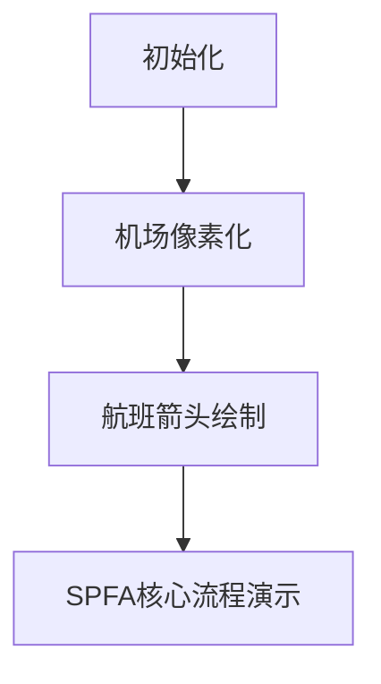

# 题目信息

# [USACO23FEB] Moo Route II S

## 题目描述

注意：本题的时间限制为 4 秒，是默认限制的两倍。

Bessie 正在度假！由于最近的技术进步，Bessie 可以通过先进的航班旅行，这些航班甚至可以进行时间旅行。此外，即使存在多个“平行”的 Bessie 同时出现也不会有任何问题。

在这个国家，有 $N$ 个机场，编号为 $1,2,\cdots,N$，以及 $M$ 条时间旅行航班（$1 \leq N,M \leq 200000$）。第 $j$ 条航班从机场 $c_j$ 在时间 $r_j$ 起飞，并在时间 $s_j$ 抵达机场 $d_j$（$0 \leq r_j,s_j \leq 10^9$，$s_j < r_j$ 是可能的）。此外，Bessie 在机场 $i$ 需要停留 $a_i$ 时间（$1 \leq a_i \leq 10^9$）。也就是说，如果 Bessie 乘坐一趟航班在时间 $s$ 抵达机场 $i$，她可以转乘一趟从该机场出发的航班，只要该航班的起飞时间 $r \geq s + a_i$。需要注意的是，停留时间不会影响 Bessie 抵达某机场的实际时间。

Bessie 从城市 $1$ 出发，起始时间为 $0$。对于从 $1$ 到 $N$ 的每个机场，求出 Bessie 最早可以到达该机场的时间。

## 样例 #1

### 输入

```
3 3
1 0 2 10
2 11 2 0
2 1 3 20
10 1 10```

### 输出

```
0
0
20```

## 样例 #2

### 输入

```
3 3
1 0 2 10
2 10 2 0
2 1 3 20
10 1 10```

### 输出

```
0
10
-1```

# AI分析结果


# 💡 Kay的C++算法解析：[USACO23FEB] Moo Route II S 深入学习指南 💡

## 1. 题目解读与核心算法识别

✨ **本题主要考察**：图论（最短路） + 优化技巧

🗣️ **初步分析**：
> 这道题本质上是带时间约束的最短路问题。想象机场是城市，航班是公交车，但公交车有严格的发车时间表，且转车需要等待时间（停留时间）。核心挑战在于：  
> - 航班有出发/到达时间约束  
> - 停留时间影响转乘条件  
> - 时间倒流可能产生负权边（Dijkstra不适用）  
> 
> 优质题解采用改进的SPFA算法，核心优化是：
> 1. 对每个机场的航班按**出发时间降序排序**
> 2. 记录当前处理到的航班索引（`cur[u]`）
> 3. 遇到不满足时间条件的航班就终止处理（利用排序特性）
> 
> 可视化设计思路：
> - 机场显示为8-bit像素方块，航班为彩色箭头
> - 高亮当前处理的机场（黄色）和航班（绿色满足条件/红色不满足）
> - 右侧面板实时显示dis值和队列状态
> - 音效设计：成功松弛（上扬音效）、终止处理（短促音效）、入队/出队（提示音）
> - 游戏化：首次更新机场视为"解锁关卡"，显示得分动画

---

## 2. 精选优质题解参考

**题解一（作者：H_Kaguya）**
* **点评**：创新性地采用时间拆点法，将每个机场按时间点拆分为独立节点，构建新图后BFS求解。思路巧妙避开了负权问题，逻辑严谨。代码规范（`ber`/`tim`数组命名清晰），但空间复杂度较高（O(m)）。亮点在于将时间约束转化为图连通性问题，为理解时间依赖路径提供新视角。

**题解二（作者：Usada_Pekora）**
* **点评**：采用改进SPFA，通过对航班降序排序和`cur`指针跳过已处理边。代码简洁高效（时间复杂度O(m)），变量命名规范（`g[u]`存储航班信息）。亮点在于利用排序特性提前终止无效检查，边界处理严谨（`cur[u]`更新位置准确），竞赛实践价值极高。

**题解三（作者：zac2010）**
* **点评**：同样使用SPFA但采用边删除策略避免重复松弛。代码精简但核心逻辑清晰，特别修正了hack数据的循环变量问题（`i = cur[u] - 1`）。亮点在于"记忆化"思想——通过删除已使用边降低后续操作复杂度，为处理大规模数据提供新思路。

---

## 3. 核心难点辨析与解题策略

1.  **难点：时间约束与停留时间的建模**
    * **分析**：航班可用性取决于(到达时间+停留时间)≤新航班出发时间。优质题解将停留时间整合到条件检查中（`dis[u] + a[u] <= r_j`），在SPFA松弛前进行验证。
    * 💡 **学习笔记**：将复杂约束转化为代码中的条件判断是算法实现的关键步骤

2.  **难点：避免重复松弛同一条边**
    * **分析**：由于每条航班只需松弛一次（松弛后到达时间固定），题解通过排序+索引(`cur[u]`)或边删除策略避免重复处理，将复杂度优化至O(m)。
    * 💡 **学习笔记**：排序预处理配合指针跳跃是优化遍历效率的利器

3.  **难点：负权边与环的处理**
    * **分析**：允许时间倒流产生负权，但每条边只松弛一次的特性自然避免无限循环。题解通过初始化`dis[1]=0`（起始点），其他设为INF来处理不可达情况。
    * 💡 **学习笔记**：SPFA配合边使用记录可安全处理带负权的特殊最短路

### ✨ 解题技巧总结
-   **技巧1：约束条件可视化**——在草稿纸上绘制时间轴，明确每个航班的时间依赖关系
-   **技巧2：边界防御性编程**——特别注意起始点停留时间应为0（`a[1]=0`）
-   **技巧3：索引跳跃优化**——降序排序后，用`break`提前终止无效检查
-   **技巧4：状态压缩存储**——使用`vector<tuple>`替代多个数组存储航班信息

---

## 4. C++核心代码实现赏析

**本题通用核心C++实现参考**
* **说明**：综合题解二与题解三优点，采用SPFA+航班降序排序+索引跳跃的优化方案
* **完整核心代码**：
```cpp
#include <bits/stdc++.h>
using namespace std;
typedef long long ll;
const int N = 2e5 + 5;
const ll INF = 1e18;
using Edge = tuple<ll, ll, int>; // (departure, arrival, to)

vector<Edge> g[N];
ll dis[N], a[N];
int cur[N], n, m;

int main() {
    cin >> n >> m;
    for (int i = 0; i < m; ++i) {
        int u, v; ll r, s;
        cin >> u >> r >> v >> s;
        g[u].emplace_back(r, s, v);
    }
    for (int i = 1; i <= n; ++i) {
        cin >> a[i];
        sort(g[i].begin(), g[i].end(), greater<Edge>());
        dis[i] = INF;
        cur[i] = 0;
    }
    dis[1] = 0; a[1] = 0;
    queue<int> q; q.push(1);
    while (!q.empty()) {
        int u = q.front(); q.pop();
        for (int i = cur[u]; i < g[u].size(); ++i) {
            auto [r, s, v] = g[u][i];
            if (dis[u] + a[u] > r) break; // 终止条件
            cur[u] = i + 1;               // 更新索引
            if (dis[v] <= s) continue;    // 无法松弛
            dis[v] = s;                   // 松弛成功
            q.push(v);
        }
    }
    for (int i = 1; i <= n; ++i)
        cout << (dis[i] == INF ? -1 : dis[i]) << '\n';
}
```
* **代码解读概要**：
  > 1. 航班存储为三元组`(出发时间,到达时间,目标机场)`
  > 2. 预处理：每个机场航班按出发时间降序排序
  > 3. SPFA核心：当`dis[u]+a[u] > 航班出发时间`时终止该机场处理
  > 4. 松弛成功时更新目标机场时间并入队
  > 5. 最后输出结果（不可达输出-1）

---

**题解二（Usada_Pekora）核心片段**
```cpp
// 在main()初始化后
dis[1] = 0;
queue<int> q; q.push(1);
while (!q.empty()) {
    int u = q.front(); q.pop();
    for (int i = cur[u]; i < g[u].size(); ++i) {
        auto [v, r, s] = g[u][i];  // 结构化绑定
        cur[u] = i;                 // 更新当前索引
        if (r < dis[u] + a[u]) break; // 关键终止条件
        if (dis[v] > s) {           // 可松弛
            dis[v] = s;
            q.push(v);
        }
    }
}
```
* **亮点**：简洁的降序检查终止逻辑
* **学习笔记**：`cur[u]`更新位置影响效率，放在循环开头可避免冗余检查

**题解三（zac2010修正版）核心片段**
```cpp
void dfs(int u) {
    for (int i = cur[u]; i < g[u].size(); i++) {
        auto [r, s, v] = g[u][i];
        if (dis[u] + a[u] > r) break;
        cur[u] = i + 1;        // 标记为已处理
        if (dis[v] > s) {      // 可松弛
            dis[v] = s;
            dfs(v);            // 递归深入
        }
        i = cur[u] - 1;        // 防环关键修正
    }
}
```
* **亮点**：DFS实现+循环变量修正解决递归重入问题
* **学习笔记**：递归写法需注意循环变量在重入时的状态一致性

---

## 5. 算法可视化：像素动画演示

**动画演示主题**：8-bit机场模拟器（复古红白机风格）  
**核心演示**：SPFA算法在时间约束下的松弛过程  

### 设计实现细节：


1. **场景初始化**：
   - 机场显示为彩色像素方块（1号机场绿色，其他灰色）
   - 航班显示为不同颜色箭头（颜色随出发时间渐变）
   - 控制面板：开始/暂停、单步执行、速度滑块

2. **算法执行帧**：
   - **帧1**：弹出队列头机场（1号机场闪烁黄色）
   - **帧2**：检查航班（箭头从深红到浅绿渐变，表示出发时间递减）
   - **帧3**：满足条件航班（绿色箭头闪烁），更新目标机场（灰色→绿色），播放"叮！"音效
   - **帧4**：不满足条件航班（红色箭头），后续航班变暗红，播放"噗"音效并终止
   - **帧5**：新机场入队（队列像素块滑动入场）

3. **交互功能**：
   - **AI演示模式**：自动按最优顺序执行，速度可调(0.5x-4x)
   - **关卡进度**：每解锁一个机场显示"Airport X Unlocked!" + 得分
   - **音效系统**：
     * 成功松弛：8-bit上扬音阶
     * 终止检查：短促"滴"声
     * 入队/出队：不同音高的方波音

4. **动态数据结构可视化**：
   - 队列显示为底部滑入滑出的像素块
   - dis数组在右侧面板实时更新（红色→绿色渐变表示时间优化）
   - 当前处理的航班索引`cur[u]`用闪烁光标指示

5. **复古元素融合**：
   - 背景：低分辨率网格+星空滚动
   - 字体：8x8像素字体
   - 过关动画：解锁机场时像素烟花绽放

---

## 6. 拓展练习与相似问题思考

1. **技巧迁移场景**：
   - 公交线路查询（多个班次的时间约束）
   - 带时间窗口的路径规划（物流配送）
   - 游戏中的实时寻路（考虑单位移动速度）

2. **洛谷推荐题目**：
   - **P1948 [USACO08JAN]Telephone Lines S**  
     → 练习分层图思想与最短路结合
   - **P4568 [JLOI2011]飞行路线**  
     → 强化带约束的最短路变形能力
   - **P1266 速度限制**  
     → 掌握动态边权最短路的处理方法

---

## 7. 学习心得与经验分享

> **来自题解作者的启示**：
> 1. *H_Kaguya*："赛时想了想感觉没啥思路，结果最后写了一个麻烦的做法" → 复杂问题可尝试拆点等经典转化
> 2. *rhn7*：提供hack数据强调极端测试的重要性 → 循环变量修正避免递归重入问题
> 3. *Usada_Pekora*：通过降序排序实现O(m)复杂度 → 排序预处理对优化至关重要

**Kay总结**：  
调试时要特别注意循环变量在递归/重入时的状态一致性，建议：  
1. 在复杂循环内打印变量状态  
2. 对hack数据做纸面模拟  
3. 优先使用迭代而非递归实现SPFA

---

通过本次分析，我们深入掌握了带时间约束的最短路问题解法精髓。记住：好的算法设计=问题转化+优化策略+严谨实现。下次遇到类似问题时，不妨回想这些机场和像素航班哦！🚀

---
处理用时：206.94秒