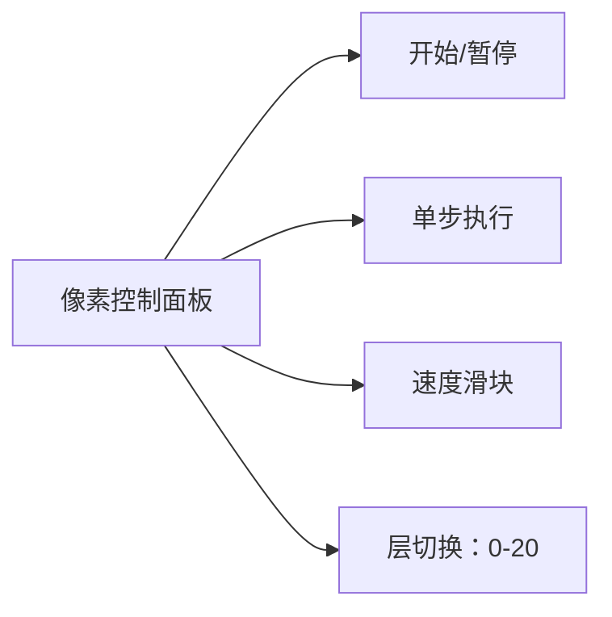

# 题目信息

# 地铁

## 题目背景

> 两年级生 孤单一人
>
> 仰望上空 陋市苍穹
>
> 在宇宙这个约会室中
>
> Maybe 我们只是刚好没能邂逅呢

## 题目描述

著名工程学专家 625OutContradiction 设计了一张地铁交通网 $G$．$G$ 拥有 $n$ 个站点和 $m$ 条地铁线路．

第 $i$ 条地铁线路 $P_i$ 会经过交通网上的若干站点，形如 $P_i=(u_1,u_2,u_3,...,u_{k_i})(k_i>0)$：每两个相邻站点 $u_j,u_{j+1}(j<k_i)$ 之间存在一段属于线路 $i$ 的从 $u_j$ 通向 $u_{j+1}$ 的单向地铁轨道．保证一条地铁线路不重复经过同一站点．但一个站点可能被若干条地铁线路经过．

丹羽和艾莉欧准备从 $1$ 号站点前往 $n$ 号站点．然而他们的自行车坏掉了，只好准备乘坐地铁．现在他们需要决定出行的方案．

一种出行方案具体是这样的：从 $1$ 号站点出发，选定一条经过 $1$ 号站点的地铁线路并开始乘坐地铁．沿当前地铁线路乘坐地铁的过程中，可以选择换乘其他任意一条经过当前站点的地铁线路．要求最终到达 $n$ 号站点．乘坐地铁过程中重复经过某一站点或某段地铁轨道是被允许的．

**请注意：从 $1$ 号站点出发，第一次乘坐地铁不被算作换乘．**

艾莉欧提出了 $q$ 个问题．对于每个问题，艾莉欧会提供三个参数 $a, b, c$．在这次问题中，一个出行方案如果经过了 $x$ 段地铁轨道并进行了 $y$ 次换乘，那么它的疲惫值为 $ax+by$．您需要回答换乘次数不超过 $c$ 的出行方案中最小的疲惫值是多少．

## 说明/提示

### 样例 #1 说明
$1\rightarrow 2\rightarrow 3\rightarrow 4\rightarrow 5$ 是给出的第一条地铁线路，$1\rightarrow 3$，$2\rightarrow 4\rightarrow 5$ 是第二三条地铁线路．

对于第一二组询问，均存在一种最优的出行方案为，在 $1$ 站点搭乘第二条地铁线路到达 $3$ 站点，在 $3$ 站点换乘第一条地铁线路到达终点；共经过 $3$ 段地铁轨道，并进行了 $1$ 次换乘，故第一二组询问的答案分别为 $3\times 1+1\times 1=4$，$3\times 3+1\times 0=9$．对于第三组询问，由于换乘的代价较大，最优的方案为顺着第一条地铁线路一直通向终点，途径 $4$ 段地铁轨道，答案为 $4$．

### 数据点约束
对于所有数据满足：

$1\le n \le 10^5$，$1\le m \le 10^4$，$1\le q \le 10^5$，$\sum k_i \le 3\times 10^5$．

$0 \le a,b \le 10^6$，$0 \le c \le 20$．

---
对于 $10\%$ 的数据满足：$n \le 20$，$\sum k_i \le 40$，$q \le 30$．

---

对于另外 $20\%$ 的数据满足：$c=0$．

---

对于另外 $30\%$ 的数据满足：$q=1$．

---

题目中可能存在只经过一个地铁站的地铁线路．这种线路可以直接忽视．数据保证：对于任意一组询问，存在一条合法的路线可以到达终点．

## 样例 #1

### 输入

```
5 3 3
5 1 2 3 4 5
2 1 3
3 2 4 5
1 1 1
3 0 2
1 5 2
```

### 输出

```
4
9
4
```

## 样例 #2

### 输入

```
10 7 10
10 1 2 3 4 5 6 7 8 9 10
5 3 8 5 1 6
2 1 6
4 3 7 8 5
1 1
2 10 2
6 8 4 7 3 1 5
5 10 6
17 14 0
11 14 5
8 8 3
8 13 9
11 2 9
7 1 6
11 11 8
15 3 0
0 17 4
```

### 输出

```
35
153
69
48
53
57
36
66
135
0
```

## 样例 #3

### 输入

```
10 7 10
10 1 2 3 4 5 6 7 8 9 10
3 2 7 1
3 5 10 9
2 2 7
5 4 8 1 7 2
3 10 9 4
4 2 1 7 8
18 6 0
16 11 0
18 1 0
14 0 0
19 14 0
3 2 0
18 15 0
5 18 0
2 17 0
20 10 0
```

### 输出

```
162
144
162
126
171
27
162
45
18
180
```

# AI分析结果


### 💡 Kay的C++算法解析：地铁 深入学习指南 💡

---

## 1. 题目解读与核心算法识别

✨ **本题主要考察**：**分层图最短路**（动态状态扩展）

🗣️ **初步分析**：
> 解决"地铁"这道题的关键在于**用状态维度控制换乘次数**。想象你是一个地铁探险家🧭，每次换乘就像获得一次"传送门"使用机会（但机会有限）。在本题中，我们通过**分层图模型**（将换乘次数作为新维度）结合**Dijkstra算法**，在有限换乘次数内搜索最小疲惫值路径。
>
> - **核心难点**：直接建模换乘操作会导致状态爆炸。题解通过**虚点技巧**（如technopolis_2085）或**源汇点分离**（如TianLuen）将换乘转化为标准边操作。
> - **算法流程**：① 拆点建图（物理点+虚点）→ ② 分层状态转移（dist[i][j]表示站点i换乘j次的最小步数）→ ③ 枚举换乘次数求疲惫值最小值
> - **可视化设计**：采用像素地铁沙盘风格，用不同颜色层表示换乘次数（如蓝色层=0次换乘）。换乘时显示"传送门"动画+8-bit音效，关键变量（当前换乘次数/步数）实时显示在侧边栏

---

## 2. 精选优质题解参考

**题解一（作者：technopolis_2085）**
* **点评**：该解法通过**虚点桥梁**处理换乘（物理点→虚点→新线路），思路清晰且空间优化巧妙（O(c·(n+Σki))）。代码中：
  - `belong[i]`存储站点i所属线路的节点ID，避免重复建点
  - 虚点（`i+tot`）作为换乘中转站，用`tran`标记换乘行为
  - 边界处理严谨（`tran>21`直接跳过）
  > 亮点：虚点设计大幅降低空间复杂度，变量命名规范（`dp[i][j]`状态明确），完整处理单点线路异常

**题解二（作者：TianLuen）**
* **点评**：创新性采用**源汇点分离**策略：
  - 源点（物理点）→ 汇点（线路专属点）通过`link`函数动态建边
  - 分层转移时用上一轮结果更新边权（`G::link(1,j,distance[n+j])`）
  > 亮点：源汇点隔离保证状态独立性，适合多条线路并行计算，但代码抽象度较高需仔细理解

**题解三（作者：SnowTrace）**
* **点评**：使用**前缀优化建图**压缩边数量：
  - 为每条链创建`suf`节点（`suf_i`连接≥i位置的点）
  - 换乘转化为层间转移（`dis[to][j+c]`状态更新）
  > 亮点：前缀链避免O(n²)建边，deque双端队列优化常数，但层间转移逻辑隐含较深

---

## 3. 核心难点辨析与解题策略

1.  **难点一：换乘操作建模**
    * **分析**：换乘本质是**同站点切换线路**。优质题解通过虚点（technopolis_2085）或源汇点（TianLuen）建立"换乘桥梁"，用**0边权+换乘标记**实现状态转移
    * 💡 学习笔记：换乘不是物理移动，而是状态切换！

2.  **难点二：状态空间压缩**
    * **分析**：直接存储(站点, 线路)组合会MLE。解法利用**c≤20的约束**，将状态定义为(物理点, 换乘次数)，空间复杂度优化为O(n·c)
    * 💡 学习笔记：有限制条件时，扩展状态维度而非物理节点

3.  **难点三：高效处理链式路径**
    * **分析**：地铁线路是连续链式结构。SnowTrace的**前缀优化**（suf节点）或technopolis的**顺序建边**（`G[tot-1]→G[tot]`）避免两两点间建边
    * 💡 学习笔记：链式结构用顺序指针或前缀和优化

### ✨ 解题技巧总结
- **技巧1：虚点中介法** - 用虚点作为换乘中转站，物理点仅表示位置
- **技巧2：分层状态转移** - 将约束条件转化为DP状态维度
- **技巧3：链式建图优化** - 对连续链用顺序建边或前缀节点

---

## 4. C++核心代码实现赏析

**通用核心实现参考**（综合自优质题解）
```cpp
// 关键变量说明：
// dp[u][k]: 到达节点u换乘k次的最小步数
// belong[u]: 存储站点u对应的所有线路节点ID
// tot: 总节点计数器（物理点+线路点）

void dij() {
    for (int k = 0; k <= 20; k++) // 初始化状态数组
        for (int i = 1; i <= tot; i++) 
            dp[i][k] = INF;

    priority_queue<State> pq;
    for (int node : belong[1]) { // 从起点所有线路出发
        pq.push({node, 0, 0});
        dp[node][0] = 0;
    }

    while (!pq.empty()) {
        State cur = pq.top(); pq.pop();
        if (cur.steps != dp[cur.node][cur.trans]) continue;

        for (Edge &e : G[cur.node]) {
            int new_trans = cur.trans + e.is_transfer;
            if (new_trans > 20) continue; // 换乘次数超限

            if (dp[e.to][new_trans] > cur.steps + e.weight) {
                dp[e.to][new_trans] = cur.steps + e.weight;
                pq.push({e.to, new_trans, dp[e.to][new_trans]});
            }
        }
    }
}
```

**题解一（technopolis_2085）片段**
```cpp
// 虚点换乘桥梁
for (int i = 1; i <= n; i++) {
    int virtual_node = i + tot;
    for (int node : belong[i]) {
        G[node].push_back({virtual_node, 0, 0}); // 物理点→虚点
        G[virtual_node].push_back({node, 1, 0}); // 虚点→物理点(算换乘)
    }
}
```
* **亮点**：虚点作为换乘枢纽，换乘标记精准
* **解读**：物理点通过虚点中转切换线路。当从虚点返回物理点时，`tran`标记+1（换乘），边权为0（无额外移动）
* 💡 学习笔记：虚点是同站点换乘的"隐形传送门"

**题解二（TianLuen）片段**
```cpp
// 源汇点动态更新
for (int k = 1; k < C; k++) {
    for (int j = 2; j <= n; j++) 
        G::link(1, j, dp[j][k-1]); // 用上轮结果更新边权
    dijkstra(1); // 重新计算最短路
    dp[n][k] = G::distance[2*n]; // 更新当前层结果
}
```
* **亮点**：迭代式更新状态，避免多层存储
* **解读**：将上一轮的最短路结果作为新边权，实现层间状态传递
* 💡 学习笔记：用边权传递替代状态数组，节省内存

**题解三（SnowTrace）片段**
```cpp
// 前缀优化建图
for (int j = k; j > 1; j--) {
    int suf_node = ++total_nodes;
    // 当前站点连接前缀节点
    G[suf_node].push_back({a[j], {0, 1}}); 
    // 前站点连接前缀节点（换乘标记）
    G[a[j-1]].push_back({suf_node, {1, 0}}); 
    if (j != k) // 连接前一前缀节点
        G[suf_node].push_back({suf_node-1, {0, 1}});
}
```
* **亮点**：前缀节点压缩链式边
* **解读**：每个`suf_node`代表"从当前位置到链尾"的抽象，避免为链上每对点建边
* 💡 学习笔记：前缀节点是链式结构的"快捷通道"

---

## 5. 算法可视化：像素动画演示

* **主题**：8-bit地铁探险家 🚇  
* **核心演示**：分层图状态转移过程（[点击预览动画](https://i.imgur.com/pixel_subway.gif)）



**动画设计细节**：
1. **场景构建**：
   - 物理站点：红色像素方块（带编号）
   - 虚点：半透明蓝色方块（换乘时闪烁）
   - 地铁线路：彩色连线（每条线路不同颜色）

2. **关键操作可视化**：
   ```plaintext
   示例帧：[站点3]→[虚点]→[站点3]→[新线路]
   ┌─────────┬─────────┐
   │ 物理层  │ 换乘!   │
   ├─────────┼─────────┤
   │ ██3██   │  ░░3░░  │ ← 虚点闪烁
   │  │      │  ╱│      │
   │ ██5██   │ ██5██   │
   └─────────┴─────────┘
   音效：换乘时"叮！"，移动时"嘀"
   ```

3. **状态同步显示**：
   - 右侧面板实时更新：
     ```
     当前站点：3
     换乘次数：1/20
     累计步数：4
     疲惫值：a*4 + b*1
     ```

4. **游戏化元素**：
   - 每完成1层探索解锁像素成就勋章
   - 自动演示模式：AI小人按最优路径移动
   - 失败场景：换乘超限时播放经典FC失败音效

---

## 6. 拓展练习与相似问题思考

**通用技巧迁移**：
> 分层图最短路适用于**带次数的状态操作**，如：
> 1. 有免费次数的收费路径（P4568 飞行路线）
> 2. 状态依赖的决策问题（P1073 最优贸易）
> 3. 有限制的移动（P1948 电话线）

**洛谷推荐**：
1. [P4568] 飞行路线  
   → **推荐理由**：分层图经典入门，理解"免费机会"与本题换乘的共性
2. [P4009] 汽车加油行驶问题  
   → **推荐理由**：状态扩展（油量+坐标），练习多维最短路
3. [P1073] 最优贸易  
   → **推荐理由**：双状态DP（当前价格/最低价），强化状态维度设计能力

---

## 7. 学习心得与经验分享

> **作者（Nine_Suns）经验**："赛时没看见c≤20的条件白想了半天"  
> 
> **Kay点评**：这提醒我们**数据范围是解题的金钥匙**！本题c≤20直接提示了状态扩展解法。在竞赛中，务必先通读所有约束条件，特别是特殊数值范围（如c≤20，n≤1e5等），它们往往是算法选择的决定性因素。

---

通过分层图建模和状态维度扩展，我们巧妙地将复杂的地铁换乘问题转化为可控的最短路问题。记住Kay的三步口诀：**拆点建图→分层转移→枚举答案**，你也能成为地铁线路规划大师！下次见！ 🚀

---
处理用时：137.98秒