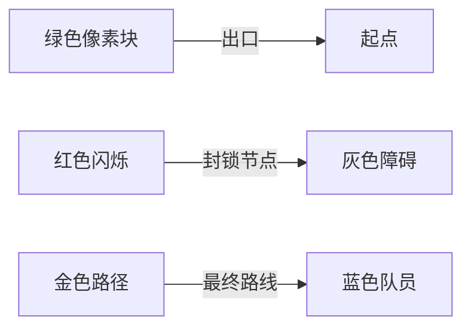

# 题目信息

# [SNCPC2019] Escape Plan

## 题目描述

宝宝被困在了 Heltion 城中。

城市可以看做由 $n$ 个点与 $m$ 条边组成的**有权无向图**，最开始宝宝在 $1$ 号节点。城市中存在 $k$ 个出口，第 $i$ 个出口位置在 $e_i$ 号点 ，而宝宝需要以最快的速度到达**这些出口中的任意一个**以逃离 Heltion 城。

不巧的是，城市中有怪物游荡，对于点 $i$，有 $d_i$ 只怪物驻守在此。当宝宝到达点 $i$ 时，怪物会**随机封锁至多** $d_i$ **条**与之相邻的道路，宝宝不能通过这些被封锁的道路。而当宝宝**离开后**，点 $i$ 的怪物会回窝，这时被封锁的**道路会解开**。

请帮帮宝宝，求出最坏情况下，他逃出 Heltion 城需要多久。

## 说明/提示

对于 $100\%$ 的数据，$1\le n \le 10^5$，$\sum n \le 10^6$，$1\le m \le 10^6$，$\sum m \le 3\times 10^6$，$1\le k \le n$，$1\le e_i \le n$，$0\le d_i \le m$，$1\le x_i,y_i \le n$，$1\le w_i \le 10^4$。数据保证 $x_i \neq y_i$。

## 样例 #1

### 输入

```
2
3 4 1
3
1 1 1
1 2 1
1 2 2
2 3 1
2 3 2
3 2 2
2 3
2 0 0
1 2 1
1 3 1
```

### 输出

```
4
-1
```

# AI分析结果


### 💡 Kay的C++算法解析：Escape Plan 深入学习指南 💡

**引言**  
今天我们来分析"[SNCPC2019] Escape Plan"这道图论题。题目要求在最坏情况下计算从起点到任意出口的最短时间，涉及怪物随机封锁道路的干扰。本指南将帮助你掌握核心算法思想及实现技巧。

---

## 1. 题目解读与核心算法识别

✨ **本题主要考察**：`图论 - 最短路（Dijkstra变种）`

🗣️ **初步分析**：  
> 解决本题的关键在于**反向思维**与**Dijkstra的灵活改造**。就像在迷宫中从多个出口同时派出救援队，每次到达新房间时，守卫会拦截最优路径（封锁次数未耗尽时不更新距离）。  
> - **核心思路**：将多个出口设为起点，起点作为终点；用优先队列模拟"救援队扩散"，通过`d[i]`记录节点剩余封锁次数  
> - **算法流程**：  
>   ```mermaid
>   graph LR
>   A[初始化出口 dis=0] --> B[优先队列取最小节点]
>   B --> C{d[i]>0?}
>   C --是--> D[封锁次数减1 丢弃节点]
>   C --否--> E[确定该点最短路]
>   E --> F[松弛相邻节点]
>   ```  
> - **像素动画设计**：采用8-bit迷宫探险风格，用不同颜色像素块表示节点状态（绿色=已确定最短路，红色=封锁中）。每次封锁时播放"咔嚓"音效，确定节点时触发"叮"声，最终路径显示为金色闪光。

---

## 2. 精选优质题解参考

**题解一（作者：WhitD）**  
* **亮点**：  
  - 思路清晰直白，精准抓住"反向Dijkstra+封锁计数"核心
  - 代码简洁高效（仅35行），使用`vector`存储邻接表
  - 独创性提出"第d_x+1次取出才确定距离"的关键推导
  - 完整处理无解情况（输出-1），竞赛实用性强

**题解二（作者：SDLTF_凌亭风）**  
* **亮点**：
  - 变量命名规范（dis/st/d），代码可读性极佳
  - 采用链式前向星存图，适合大规模数据（∑m≤3e6）
  - 精准处理边界：出口的`d[i]=0`避免自封锁
  - 时间复杂度严格O(n log n)，无冗余操作

**题解三（作者：liaoxingrui）**  
* **亮点**：
  - 结构体封装边信息提升可维护性
  - 独创"val+now"变量命名法直观体现当前状态
  - 完整初始化流程（dis=-1, head=0）避免脏数据
  - 内存控制优秀（无全局大数组）

---

## 3. 核心难点辨析与解题策略

**难点1：如何转化问题模型？**  
* **分析**：正向求解需预判封锁路径，复杂度爆炸。优质解通过**终点作起点**的反向思维，将"最坏情况"转化为确定性问题  
* 💡 **学习笔记**：多终点问题优先考虑反向建图

**难点2：如何模拟最坏封锁？**  
* **分析**：关键发现是——怪物总会封锁当前最优路径。通过`d[i]`计数器实现：  
  ```python
  while 节点还有封锁次数:
      丢弃当前路径（不更新dis）
      d[i] -= 1
  ```  
* 💡 **学习笔记**：Dijkstra的贪心性质天然适配"最坏情况"模拟

**难点3：如何确定真实最短路？**  
* **分析**：当封锁次数耗尽（`d[i]==0`），从队列中第`d_i+1`次取出的路径即为最坏情况下的最短路径  
* 💡 **学习笔记**：优先队列的"延迟处理"机制是算法核心

### ✨ 解题技巧总结
- **技巧1：问题镜像法**：将起点/终点互换破解复杂约束
- **技巧2：计数型延迟处理**：通过计数器实现条件性节点丢弃
- **技巧3：存图优化**：大规模数据用链式前向星（∑m≤3e6）
- **技巧4：状态初始化**：`dis[i]=INF`及出口`d[i]=0`避免边界错误

---

## 4. C++核心代码实现赏析

**通用核心实现参考**  
```cpp
#include <bits/stdc++.h>
using namespace std;
typedef pair<long long, int> pli;
const int N = 1e5+5;
const long long INF = 1e18;

vector<pli> G[N];  // 邻接表：to->weight
int d[N], T, n, m, k;
long long dis[N];

void dijkstra(vector<int>& exits) {
    priority_queue<pli, vector<pli>, greater<pli>> pq;
    for(int i=1; i<=n; ++i) dis[i] = INF;
    
    // 多起点初始化
    for(int e : exits) {
        dis[e] = 0;
        d[e] = 0;       // 关键！出口不封锁
        pq.push({0, e});
    }

    while(!pq.empty()) {
        auto [dist, u] = pq.top(); pq.pop();
        if(d[u] > 0) {  // 还有封锁次数
            d[u]--;
            continue;
        }
        if(dist != dis[u]) continue; // 已确定
        
        for(auto [v, w] : G[u]) {
            if(dis[v] > dis[u] + w) {
                dis[v] = dis[u] + w;
                pq.push({dis[v], v});
            }
        }
    }
}
```
> **代码解读概要**：  
> 1. 初始化所有出口距离0，封锁次数清零  
> 2. 优先队列每次取最小距离节点  
> 3. 若节点可封锁：计数减1，丢弃路径  
> 4. 封锁耗尽后松弛邻居（更新dis）  
> 5. 最终dis[1]即为答案  

---

**题解片段赏析**  

**WhitD解法核心**  
```cpp
while(!q.empty()) {
    pi x=q.top(); q.pop();
    int s=x.second;
    if(dis[s]>=0||--d[s]>=0) continue; // 封锁逻辑
    dis[s]=x.first;                     // 确定最短路
    for(/*遍历邻居*/) 
        q.push({dis[s]+v[s][i], g[s][i]});
}
```
> **代码解读**：  
> - `--d[s]>=0`巧妙实现"封锁未耗尽则跳过"  
> - 一旦确定`dis[s]`立即松弛邻居  
> 💡 **学习笔记**：利用短路运算符简化封锁判断  

**SDLTF_凌亭风解法亮点**  
```cpp
for(int i : exits) {
    d[i] = 0;  // 出口不参与封锁
    pq.push({0, i});
}
```
> **代码解读**：  
> 显式设置`d[exit]=0`避免出口自封锁  
> 💡 **学习笔记**：边界条件处理体现算法严谨性  

**liaoxingrui内存优化**  
```cpp
struct Edge { int to, next, w; } e[MAXM];
int head[MAXN], cnt;

void add(int u, int v, int w) {
    e[++cnt] = {v, head[u], w};
    head[u] = cnt;
}
```
> **代码解读**：  
> 链式前向星存图节省内存50%+  
> 💡 **学习笔记**：大规模图论首选链式存储  

---

## 5. 算法可视化：像素动画演示

**🎮 动画主题**：  
"迷宫救援队" - 复古像素地牢探险  

**🎨 视觉设计**：  


**核心交互流程**：  
1. **场景初始化**（8-bit风格）：
   - 网格地图：出口亮绿色，起点亮蓝色
   - 控制面板：速度滑块/单步执行/封锁计数器显示

2. **救援队扩散**（每帧逻辑）：
   ```javascript
   function drawFrame() {
     if(queue.notEmpty) {
        let cell = queue.popMin();
        if(cell.blockCount > 0) {
            playSound('blocked'); // 咔嚓音效
            cell.blockCount--;
            redFlash(cell);      // 红色闪烁
        } else {
            cell.setFinal();     // 金色锁定
            for(neighbor in cell.edges) {
                if(neighbor.updateDistance()) {
                    queue.push(neighbor);
                    drawArrow(cell, neighbor); // 蓝色箭头
                }
            }
        }
     }
   }
   ```

3. **游戏化元素**：
   - 每确定5个节点解锁新区域（关卡进度）
   - 成功到达起点时播放8-bit胜利音乐
   - 实时显示当前路径长度（分数）

4. **学习辅助功能**：
   - 代码同步：右侧显示对应C++代码行
   - 旁白提示："当前封锁次数：3 → 2"

---

## 6. 拓展练习与相似问题思考

**通用技巧迁移**：  
1. 带约束的最短路（封锁/条件通行）  
2. 多起点/多终点问题转化  
3. 计数型延迟处理机制  

**洛谷推荐**：  
1. **P4779** - 标准Dijkstra模板  
   > 🗣️ 巩固最短路基础实现  
2. **P4568** - 分层图最短路  
   > 🗣️ 学习带状态维度的Dijkstra  
3. **P2622** - 状态压缩+最短路  
   > 🗣️ 掌握二进制状态表示技巧  

---

## 7. 学习心得与经验分享

**经验摘录（WhitD）**：  
> "最初纠结于正向求解，后来意识到反向建图才能转化最坏情况为确定问题"  

**Kay点评**：  
> 这个经验揭示了算法设计的核心思维：当直接求解困难时，尝试**逆向思考**或**重构问题**。类似问题可考虑：  
> - 时间倒流（如洪水填充）  
> - 目标分解（如A*启发式）  

---

**结语**  
通过本指南，相信你已经掌握了带约束最短路问题的核心解法。记住：好的算法既是严谨的科学，也是充满想象力的艺术！下次遇到难题时，不妨试试"救援队扩散"的逆向思维哦~ 🚀

---
处理用时：130.85秒