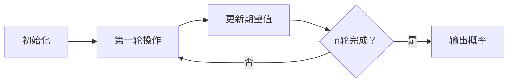

# 题目信息

# [中山市赛 2023] 简单数学题

## 题目描述

你有两个盒子，第一个盒子里有 $a1$ 个白球和 $a2$ 个黑球，第二个盒子里有 $b1$ 个白球和 $b2$ 个黑球，保证 $a1, a2, b1, b2$ 均大于 $0$。

每一轮你会从第一个盒子里均匀随机选取一个球放到第二个盒子，然后再从第二个盒子里均匀选取一个球放到第一个盒子，求经过 $n$ 轮后从第一个盒子里抽出白球的概率，对于 $998244353$ 取模。 

## 说明/提示

### 数据范围

令 $m = \max(a1, a2, b1, b2)$。

对于 $20\%$ 的数据，满足 $m, n \le 20$。

对于 $40\%$ 的数据，满足 $m, n \le 100$。

对于 $60\%$ 的数据，满足 $m, n \le 5000$。

对于 $80\%$ 的数据，满足 $n \le 10^7$。

对于 $100\%$ 的数据，满足 $n, m \le 10^{18}$。 

## 样例 #1

### 输入

```
1 1 1 1 1```

### 输出

```
499122177```

## 样例 #2

### 输入

```
7 7 10 10 8```

### 输出

```
362469031```

## 样例 #3

### 输入

```
4740 3269 4174 4965 2811```

### 输出

```
346687824```

## 样例 #4

### 输入

```
9037963 835314984430355419 899360196062620295 733639079211073534 740230801366522939```

### 输出

```
35006812```

## 样例 #5

### 输入

```
912201558090168867 796120182038152428 730024589551167161 792537498108992240
973950897761711340```

### 输出

```
589508199```

# AI分析结果


### 题目解读与核心算法识别  
✨ **本题主要考察**：`数学期望与递推优化`  

🗣️ **初步分析**：  
> 这道题的核心在于**概率的动态转移过程**。想象两个盒子像两个互相投球的球员：每轮先从盒子A随机抽一个球给盒子B，再从盒子B抽一个回给盒子A。经过n轮后，我们需计算盒子A中抽到白球的概率。  
> - **核心难点**：直接模拟n轮操作不可行（n可达10¹⁸），必须找到**数学递推关系**并优化计算  
> - **关键突破**：  
>   1. 利用期望的线性性质，将概率问题转化为**白球数量的期望值**计算  
>   2. 推导出形如 `x_i = p·x_{i-1} + q` 的递推关系  
>   3. 通过等比数列求和公式将O(n)优化为O(log n)  
> - **可视化设计**：  
>   采用复古像素风展示球转移过程（见第5节）。用不同颜色像素块表示盒子与球，动态显示期望值变化，关键操作用闪烁+音效强化（如球转移时播放"叮"声）  

---

### 精选优质题解参考  

**题解一（作者：Chitose_）**  
* **点评**：此解法思路清晰严谨，完美运用期望线性性质推导出递推关系。亮点在于：  
  1. **数学建模**：将概率转化为白球期望值 `x_i`，避免复杂概率计算  
  2. **递推优化**：识别出 `x_i = p·x_{i-1} + q` 结构，用等比数列公式直接计算 `x_n`  
  3. **代码规范**：变量命名合理（`p,q`对应系数），边界处理严谨（全程取模）  
  4. **效率卓越**：O(log n) 复杂度完美处理 n ≤ 10¹⁸  

**题解二（作者：ZnPdCo）**  
* **点评**：提出直接维护四个变量期望值的思路，但存在明显缺陷：  
  1. **未完成优化**：仅指出可用BM算法加速，未给出具体实现  
  2. **复杂度劣势**：暴力模拟n轮会超时（O(n)不满足n≤10¹⁸）  
  3. **参考价值有限**：虽提供新视角，但未解决核心优化问题  

---

### 核心难点辨析与解题策略  

1. **难点1：建立有效的递推关系**  
   * **分析**：必须找到白球数量期望 `x_i` 与 `x_{i-1}` 的数学关系。优质题解通过分析球转移概率（如从A移走白球概率=`x_{i-1}/A`），推导出 `x_i = p·x_{i-1} + q`  
   * 💡 **学习笔记**：概率问题中，期望的线性性质是破题关键  

2. **难点2：递推式的快速求解**  
   * **分析**：直接迭代n轮不可行。需展开递推式：  
     `x_n = pⁿ·x₀ + q·(pⁿ⁻¹ + pⁿ⁻² + ... + 1) = pⁿ·x₀ + q·(pⁿ-1)/(p-1)`  
     用**快速幂**计算指数项（O(log n)）  
   * 💡 **学习笔记**：形如 `x_i = k·x_{i-1} + b` 的递推，都可转化为等比数列求和  

3. **难点3：模运算下的除法处理**  
   * **分析**：概率计算涉及分数取模（如 `1/A mod 998244353`），必须用**逆元**代替除法  
   * 💡 **学习笔记**：费马小定理求逆元（`a⁻¹ ≡ a^{mod-2} mod mod`）是常用技巧  

#### ✨ 解题技巧总结  
- **技巧1：期望转化法** → 复杂概率问题转为期望值计算  
- **技巧2：递推识别术** → 分析状态转移寻找 `x_i = f(x_{i-1})` 结构  
- **技巧3：快速幂优化** → 将O(n)递推压缩为O(log n)计算  
- **技巧4：逆元预处理** → 模质数时用费马小定理处理除法  

---

### C++核心代码实现赏析  

**通用核心实现（综合自Chitose_解法）**  
```cpp
#include<bits/stdc++.h>
using namespace std;
const int mod = 998244353;
typedef long long ll;

ll qpow(ll x, ll a) { // 快速幂 (核心优化)
    ll res = 1;
    while(a) {
        if(a & 1) res = res * x % mod;
        x = x * x % mod;
        a >>= 1;
    }
    return res;
}

int main() {
    ll n, a1, a2, b1, b2;
    cin >> n >> a1 >> a2 >> b1 >> b2;
    a1 %= mod; a2 %= mod; b1 %= mod; b2 %= mod;

    ll A = (a1 + a2) % mod;     // 盒子A总球数
    ll B = (b1 + b2) % mod;     // 盒子B总球数
    ll T = (a1 + b1) % mod;     // 白球总数
    ll x0 = a1;                 // 初始白球数

    // 计算递推系数 p 和 q
    ll p = (A - 1) * B % mod * qpow(A, mod-2) % mod * qpow(B+1, mod-2) % mod;
    ll q = T * qpow(B+1, mod-2) % mod;

    // 计算 x_n = p^n * x0 + q*(p^n-1)/(p-1)
    ll pn = qpow(p, n % (mod-1)); // 费马小定理优化指数
    ll term1 = pn * x0 % mod;
    ll term2 = (pn - 1) * q % mod * qpow(p-1, mod-2) % mod;
    ll xn = (term1 + term2) % mod;

    // 最终概率 = x_n / A
    cout << xn * qpow(A, mod-2) % mod;
}
```

**代码解读概要**：  
1. **预处理**：计算总球数 `A, B` 和白球总数 `T`  
2. **系数计算**：  
   - `p = (A-1)*B/(A*(B+1))` → 转移系数  
   - `q = T/(B+1)` → 常数项  
   *（除法通过逆元实现）*  
3. **快速求解**：用快速幂计算 `pⁿ`，再组合等比数列公式  
4. **概率输出**：最终概率 = `xₙ / A`  

---

### 算法可视化：像素动画演示  

**主题**：`像素球盒大冒险`（8-bit风格双盒子球交换模拟）  

**核心演示流程**：  


**关键动画设计**：  
1. **像素场景**：  
   - 左侧盒子（A）：蓝底 + 白色/黑色像素球块  
   - 右侧盒子（B）：绿底 + 白/黑球块  
   - 控制面板：复古8-bit风格按钮（开始/步进/重置）  

2. **操作高亮**：  
   - 球从A→B转移 → A盒对应球闪烁红色 → 播放“叮”声  
   - 球从B→A转移 → 新位置像素块放大动画  
   - 当前期望值 `x_i` 实时显示在顶部（像素数字）  

3. **自动演示模式**：  
   - 点击"AI运行"后自动步进（速度可调）  
   - 每完成10%轮数播放升级音效  
   - 结束时所有白球跳动 + 播放胜利音乐  

4. **数学公式同步**：  
   - 屏幕右侧显示当前递推式 `x_i = ${p}·x_{i-1} + ${q}`  
   - 快速幂计算时展示指数位分解动画（如n=13 → 8+4+1）  

---

### 拓展练习与相似问题思考  

**通用技巧迁移**：  
1. 期望线性性质 → 适用于任何带随机转移的计数问题  
2. 递推优化 → 解决高轮次/高次数迭代问题（如矩阵快速幂）  
3. 逆元处理 → 所有模质数下的除法场景  

**洛谷推荐题目**：  
1. **P1291 [SHOI2002] 百事世界杯之旅**  
   → 同类期望递推问题，强化递推建模能力  
2. **P1349 矩阵加速数列计算**  
   → 递推优化进阶，学习矩阵快速幂  
3. **P3811 【模板】乘法逆元**  
   → 逆元计算专项训练  

---

### 学习心得与经验分享  
> **Chitose_的隐含经验**：  
> 面对n≤10¹⁸的数据范围时，**识别递推结构**比暴力模拟更重要。解题关键在于：  
> 1. 通过小规模样例手工推导递推式  
> 2. 发现 `x_i = k·x_{i-1} + b` 结构后立即转向等比数列求解  
> 3. 熟练使用快速幂模板处理指数运算  

---

本次分析就到这里！通过这道题我们掌握了**期望递推+快速幂优化**的核心技巧。记住：当遇到"经过n轮操作"类问题时，先问自己——是否存在可优化的递推关系？下次挑战见！🚀

---
处理用时：95.84秒