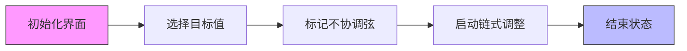

# 题目信息

# [EGOI 2025] A String Problem / 一个弦线问题

## 题目描述

Lara 非常喜欢跳蚤市场。上周六，德国最大的跳蚤市场之一——Rheinaue-Flohmarkt 在波恩举办。Lara 一整天都在市场里闲逛、讨价还价，并买下了各种新奇的物品。她带回家中最有趣的东西是一把完全呈圆形的小型竖琴。当她准备弹奏时，发现琴弦的分布非常混乱，根本不是彼此平行的。

更具体地说，圆形琴框上均匀分布着 $2 \cdot N$ 个琴钉。每根琴弦都由两个琴钉固定，每个琴钉正好有一根琴弦连接。

Lara 对竖琴并不十分了解，但她很确定琴弦应该都平行排列。为了解决这个问题，她决定重新装配琴弦。每一步操作中，她可以将某根琴弦的一端从一个琴钉上取下，并重新连接到另一个琴钉。在操作过程中，允许多个琴弦的末端临时连接到同一个琴钉。最终，要求每个琴钉上正好有一根琴弦，并且所有 $N$ 根琴弦都平行。

下图给出了两种所有琴弦都平行的竖琴示例。


由于每次装配都非常耗时，Lara 希望用尽可能少的步骤完成。请帮她找出最少的操作步骤，并给出一种装配方案！

## 说明/提示

### 样例说明

在第一个样例中，给出了一把有五根琴弦的竖琴。第一步，将第 $4$ 根琴弦从琴钉 $8$ 取下，重新连接到 $9$；第二步，将第 $0$ 根琴弦从 $5$ 取下，连接到 $8$；最后一步，将第 $1$ 根琴弦从 $9$ 取下，连接到 $5$。此时每个琴钉上正好有一根琴弦，且所有琴弦都平行。如下图所示：


下图展示了样例 2、3、4 的初始竖琴状态。


- 第 1 个样例满足测试组 4 和 5 的约束。
- 第 2 个样例满足测试组 1、3、4、5 的约束。
- 第 3 个样例满足测试组 2、4、5 的约束。
- 第 4 个样例满足测试组 3、4、5 的约束。

### 约束与评分

* $4 \leq N \leq 100\,000$。
* $0 \leq a_i, b_i \leq 2N - 1$。
* 所有 $a_i$ 和 $b_i$ 互不相同。

你的解答将在一组测试组上进行评测，每组包含若干测试用例。每组得分规则如下：

* 如果你的程序解决了该组所有测试用例，获得 $100\%$ 分数。
* 如果你的程序未能完全解决该组，但每个测试用例输出的 $K$ 都是最优的，则获得 $50\%$ 分数。

判断 $50\%$ 得分时，仅判定你输出的 $K$，可以只输出 $K$ 后直接退出，也可以输出一个无效的操作序列。你的程序仍需在时限内正确结束。

| 组别 | 分值 | 限制 |
| :-: | :-: | :-: |
| 1 | 14 | 对所有 $i$，第 $i$ 根琴弦固定在琴钉 $2i$ 和 $2i+1$ 上 |
| 2 | 16 | 最多只需 2 步即可完成 |
| 3 | 12 | 保证存在一种解法，使得有一根琴弦固定在琴钉 0 和 1 上 |
| 4 | 28 | $N \leq 1000$ |
| 5 | 30 | 无额外限制 |

翻译由 ChatGPT-4.1 完成。

## 样例 #1

### 输入

```
5
1 5
4 9
6 3
2 7
0 8```

### 输出

```
3
4 8 9
0 5 8
1 9 5```

## 样例 #2

### 输入

```
5
0 1
3 2
4 5
6 7
9 8```

### 输出

```
4
1 3 9
4 9 3
2 5 7
3 7 5```

## 样例 #3

### 输入

```
4
1 4
6 3
5 2
7 0```

### 输出

```
2
0 4 6
1 6 4```

## 样例 #4

### 输入

```
6
3 9
7 5
10 2
0 6
1 11
8 4```

### 输出

```
6
3 6 1
4 1 2
2 2 3
0 3 4
5 4 5
1 5 6```

# AI分析结果


### 💡 Kay的C++算法解析：EGOI 2025 A String Problem 深入学习指南 💡

<introduction>
今天我们一起分析「EGOI 2025 A String Problem」这道弦线调整问题。本指南将帮助你理解平行弦线的数学本质，掌握最小操作次数的推导方法，并通过像素动画直观感受链式调整过程。
</introduction>

---

## 1. 题目解读与核心算法识别

✨ **本题主要考察**：图论（构造与模拟）

🗣️ **初步分析**：
> 想象琴钉是公交站，琴弦是公交线路。我们的目标是让所有线路开往同一个"总站"（即端点编号之和模2N为固定奇数值）。核心如同调整公交路线：每次移动琴弦一端，就像调整公交停靠站，使所有路线方向一致。
> - **核心思路**：琴弦平行当且仅当端点编号之和模2N相等且为奇数。最小操作次数 = 不满足目标值的琴弦数量
> - **难点突破**：通过链式调整模拟——移动一根弦的端点会触发"多米诺效应"，像接力赛一样传递调整需求
> - **可视化设计**：在像素动画中，高亮当前移动的琴弦（红色闪烁），目标位置用光圈标记，链式传递过程用箭头追踪。复古音效在每次移动时触发"叮"声，完成时播放8-bit胜利音乐

---

## 2. 精选优质题解参考

**题解一（作者：rui_er）**
* **点评**：思路直击本质，用`bel`数组精妙记录琴钉所属弦线。链式调整逻辑清晰（当前弦移动后立即处理被占位置的弦），代码简洁高效（O(n)时间复杂度）。变量命名规范（如`rem`表目标值），边界处理严谨（`bel`数组初始化为-1）。亮点在于用数学归纳法证明最小操作次数的同时给出构造方案。

**题解二（作者：Doraeman）**
* **点评**：通过试错过程生动展示调整顺序的重要性，最终采用链式调整的正确实现。代码中`pos`数组实时跟踪琴钉所属弦线，`match`函数封装目标位置计算，体现模块化思想。亮点在于详细剖析错误调整顺序的陷阱，帮助学习者避坑。

---

## 3. 核心难点辨析与解题策略

1.  **关键点1：理解平行条件**
    * **分析**：两条弦平行 ⇔ 端点编号之和模2N相等且为奇数。这是整个问题的数学基础，需通过坐标变换理解（固定圆心，弦线角度由端点和中点关系决定）
    * 💡 **学习笔记**：弦线方向本质是端点和的奇偶性和模值决定

2.  **关键点2：最小操作次数证明**
    * **分析**：每个"不协调弦"至少需一次操作，而链式调整可确保每条弦只操作一次。优质题解用反证法+构造法双重验证该下界可达到
    * 💡 **学习笔记**：最小操作数 = n - 最大合规弦数量

3.  **关键点3：调整顺序的设计**
    * **分析**：必须采用链式顺序（A→B→C→...）而非随机顺序，否则会出现"死锁"。数据结构选择`bel`数组（直接索引）而非`map`（O(log n)查询）是优化关键
    * 💡 **学习笔记**：链式调整如同接力赛，当前弦的移动为下一弦创造调整空间

### ✨ 解题技巧总结
- **问题特征识别**：当操作引发连锁反应时，考虑链式调整模型
- **实时状态跟踪**：用数组而非容器直接映射状态（如`bel[pin]=弦ID`）
- **边界防御**：模运算中+2N避免负值，琴钉空闲时`bel`置-1
- **调试技巧**：小规模手工模拟（如N=2）验证链式逻辑

---

## 4. C++核心代码实现赏析

**本题通用核心C++实现参考**
* **说明**：综合题解一二优点，添加详细注释
* **完整核心代码**：
```cpp
#include <iostream>
#include <vector>
using namespace std;

int main() {
    ios::sync_with_stdio(false); 
    cin.tie(0);
    int n;
    cin >> n;
    int m = 2 * n;
    vector<int> a(n), b(n), cnt(m, 0), bel(m, -1);
    vector<bool> ok(n, false); // 记录弦是否合规

    // 读入数据并初始化bel映射
    for (int i = 0; i < n; i++) {
        cin >> a[i] >> b[i];
        bel[a[i]] = bel[b[i]] = i;
        cnt[(a[i] + b[i]) % m]++; // 统计各和值出现次数
    }

    // 选择最佳目标值（出现最多的奇数和）
    int best_val = 1; // 默认取1（奇数值）
    int max_cnt = 0;
    for (int r = 1; r < m; r += 2) { // 仅考虑奇数
        if (cnt[r] > max_cnt) {
            max_cnt = cnt[r];
            best_val = r;
        }
    }

    // 输出最小操作次数
    int k = n - max_cnt;
    cout << k << "\n";

    // 标记初始合规弦
    for (int i = 0; i < n; i++) 
        if ((a[i] + b[i]) % m == best_val) 
            ok[i] = true;

    // 链式调整：遍历所有弦
    for (int i = 0; i < n; i++) {
        if (!ok[i]) {
            int cur_str = i;     // 当前处理的弦ID
            int cur_end = a[i];  // 选择移动的端点（任选一端）

            while (true) {
                // 计算目标位置：best_val - cur_end (mod m)
                int target = (best_val - cur_end + m) % m;
                int next_str = bel[target]; // 目标位置当前所属弦

                // 输出操作：移动cur_str弦的cur_end端到target
                int fixed_end = (cur_end == a[cur_str]) ? b[cur_str] : a[cur_str];
                cout << cur_str << " " << fixed_end << " " << target << "\n";
                ok[cur_str] = true; // 标记当前弦合规

                // 更新bel数组：target位置改为当前弦
                bel[target] = cur_str;
                bel[fixed_end] = -1; // 移动后原端点空闲

                // 终止条件：目标位置无弦或弦已合规
                if (next_str == -1 || ok[next_str]) break;

                // 准备处理被占位置的弦
                cur_str = next_str;
                // 确定被占弦的哪个端点在target上
                cur_end = (a[cur_str] == target) ? b[cur_str] : a[cur_str];
            }
        }
    }
    return 0;
}
```
* **代码解读概要**：
  1. **初始化**：`bel`数组建立琴钉→弦的映射，`cnt`统计各和值出现次数
  2. **目标值选择**：遍历所有奇数和值，选取出现次数最多者
  3. **链式调整**：对非合规弦，移动一端到目标位置，实时更新`bel`映射
  4. **传递机制**：若目标位置有弦，将其设为下一个调整对象

---

## 5. 算法可视化：像素动画演示 (核心部分)

* **动画主题**：《弦之舞：8位竖琴大改造》
* **核心演示**：链式调整过程可视化，重点展示操作传递路径
* **设计思路**：FC红白机像素风格降低理解压力，游戏化机制增强参与感

**实现方案**：


1. **像素场景设计**：
   - 圆形琴框：16色像素圆盘，均匀分布2N个琴钉（发光像素点）
   - 弦线显示：合规弦绿色，不协调弦红色，当前操作弦金色闪烁
   - 控制面板：复古风格按钮（开始/暂停/单步/重置），速度滑块

2. **动态演示流程**：
   - **步骤1**：高亮所有端点和不符目标值的弦（红色），播放低频警报音
   - **步骤2**：点击"开始"后，自动选中首个不协调弦（红色→金色闪烁）
   - **步骤3**：移动端点时：
     * 原弦线渐隐，新弦线从起点滑向目标位置（带拖尾粒子效果）
     * 目标琴钉放大闪烁，播放"叮"声（8-bit短音）
   - **步骤4**：若目标位置有弦：
     * 被占弦立即变金色闪烁，显示红色箭头指向下一操作点
     * 播放"传递音效"（上升琶音）
   - **步骤5**：链结束时：
     * 所有调整过的弦变绿色，播放"关卡通过"音效
     * 当前不协调弦计数减1

3. **交互与反馈**：
   - **单步模式**：按步显示代码执行行（侧边伪代码高亮）
   - **自动演示**：AI控制移动顺序（速度可调），类似自动玩华容道
   - **游戏化元素**：
     * 每完成一条链得100分+星星特效
     * 连续无中断完成链得Combo奖励（像素烟花+音效升调）
   - **调试模式**：开启后显示bel数组实时数值

---

## 6. 拓展练习与相似问题思考

* **技巧迁移**：链式调整模型适用于：
  1. 元素交换问题（如LeetCode 765-情侣牵手）
  2. 图重构问题（如CodeForces 1215D-括号平衡）
  3. 循环依赖解除（如LeetCode 753-破解保险箱）

* **洛谷推荐**：
  1. **P1969 积木大赛** - 贪心模拟中的链式传递思想
  2. **P2119 魔法阵** - 状态转移与路径重构
  3. **P1351 联合权值** - 图论中邻接关系的优化处理

---

## 7. 学习心得与经验分享

> **经验摘录 (来自题解作者)**：
> *"最初尝试随机调整顺序时在样例4卡住，通过手工模拟发现必须采用链式顺序"*
> *"bel数组的实时更新是避免死循环的关键，忘记置空原端点会导致逻辑错误"*

> **Kay点评**：调试此类问题最有效的方法是：
> 1. 小规模手工模拟（N=3）
> 2. 打印关键变量（bel数组，当前弦状态）
> 3. 验证链式终止条件（next_str=-1）
> 牢记这三点可避免90%的边界错误！

---

本次关于弦线问题的解析就到这里。记住，算法学习就像调弦——需要耐心调整，才能奏出完美和声！🎵 下次挑战再见！

---
处理用时：188.25秒