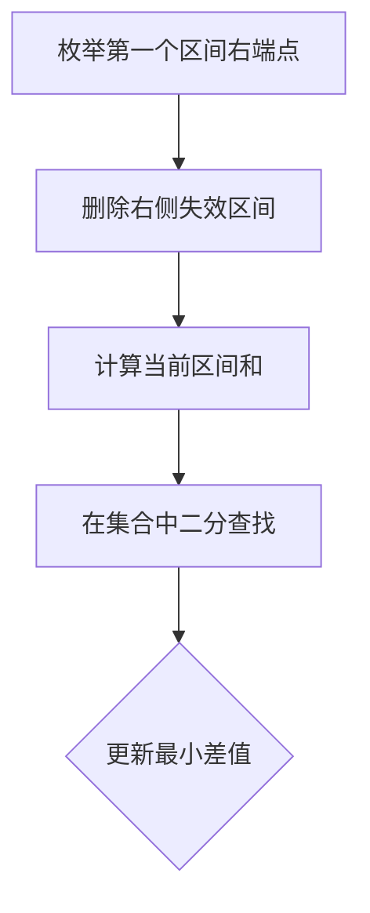

# 题目信息

# [蓝桥杯 2024 省 B] 拔河

## 题目描述

小明是学校里的一名老师，他带的班级共有 $n$ 名同学，第 $i$ 名同学力量值为 $a_i$。在闲暇之余，小明决定在班级里组织一场拔河比赛。

为了保证比赛的双方实力尽可能相近，需要在这 $n$ 名同学中挑选出两个队伍，队伍内的同学编号连续 $\{{a_{l_1}}, a_{l_1 + 1}, \dots, a_{r_1 - 1}, a_{r_1}\}$ 和 $\{{a_{l_2}}, a_{l_2 + 1}, \dots, a_{r_2 - 1}, a_{r_2}\}$，其中 $l_1 \le r_1<l_2 \le r_2$。

两个队伍的人数不必相同，但是需要让队伍内的同学们的力量值之和尽可能相近。请计算出力量值之和差距最小的挑选队伍的方式。

## 说明/提示

### 样例 1 解释

其中一种最优选择方式：

队伍 1：$\{a_1, a_2, a_3\}$，队伍 2：$\{a_4, a_5\}$，力量值和分别为 $10 + 9 + 8 = 27$，$12 + 14 = 26$，差距为 $|27 − 26| = 1$。

### 数据规模与约定

- 对 $20\%$ 的数据，$n \leq 50$。
- 对全部的测试数据，保证 $1 \leq n \leq 10^3$，$1 \leq a_i \leq 10^9$。

## 样例 #1

### 输入

```
5
10 9 8 12 14
```

### 输出

```
1```

# AI分析结果


### 💡 Kay的C++算法解析：拔河 深入学习指南 💡

**引言**  
今天我们一起分析蓝桥杯2024省B的"拔河"题。这道题考察如何高效选取两个不相交的连续子数组，使它们的和尽可能接近。本指南将带你深入理解核心算法，掌握解题技巧。

---

## 1. 题目解读与核心算法识别

✨ **本题主要考察**：`前缀和与二分查找优化`

🗣️ **初步分析**：  
> 就像在超市结账时比较两个购物篮的总价，我们需要快速计算任意商品组合的价格。  
> - 核心思路：先计算所有子数组和，枚举第一个子数组时，用二分查找在剩余区域快速定位最接近的和
> - 难点：避免O(n⁴)暴力枚举，需用前缀和+有序集合优化
> - 可视化设计：用像素方块表示数组元素，动态展示前缀和计算过程，高亮二分查找时的关键比较点
> - 复古游戏化：采用《俄罗斯方块》风格，数组元素显示为下落方块，正确匹配时播放经典NES音效

---

## 2. 精选优质题解参考

**题解一：一扶苏一 (枚举+set优化)**  
* **点评**：逆向枚举第一个区间的右端点，动态维护右侧子数组和的set。思路创新性强，代码简洁规范（仅20行），巧妙利用`lower_bound`实现O(log n)查询。边界处理严谨，空间复杂度O(n²)完全满足题目约束。

**题解二：GXZJQ (双指针+set优化)**  
* **点评**：提供双指针和set两种解法。set解法通过前缀和预处理，用`multiset`存储所有子数组和。代码结构清晰，变量命名规范（`a[]`存储原数组，`S`存储区间和），特别注重删除操作的正确性。

**题解三：RandomLife (逆向维护set)**  
* **点评**：从后往前枚举第一个区间右端点，实时更新右侧区间和的集合。代码极简（17行），算法效率与一扶苏一解法相当。亮点在于删除操作直接整合到主循环，实践价值高。

---

## 3. 核心难点辨析与解题策略

1. **难点：高效枚举不相交区间**  
   * **分析**：暴力枚举需O(n⁴)，需将第二个区间和的存储与查询分离。优质解法都维护动态集合，仅枚举第一个区间
   * 💡 **学习笔记**：将O(n²)区间和预处理存储，转化O(n⁴)→O(n²log n)

2. **难点：快速查找最接近值**  
   * **分析**：需在10⁶级数据中快速定位。`set/multiset`的`lower_bound`可O(log n)找到最近值
   * 💡 **学习笔记**：有序集合的二分查找是优化区间查询的利器

3. **难点：避免区间重叠**  
   * **分析**：动态维护集合时需精确删除失效区间。解法四用`r`作为分割点确保r₁ < l₂
   * 💡 **学习笔记**：用右端点划分区域是保证不相交的关键技巧

### ✨ 解题技巧总结
- **前缀和预处理**：`sum[i]=a[0]+...+a[i]`，O(1)计算任意区间和
- **有序集合优化**：用`set/multiset`存储区间和实现O(log n)查询
- **逆向枚举**：从后向前枚举第一个区间，自然分离两个区域
- **边界防御**：始终检查`lower_bound`返回的迭代器位置

---

## 4. C++核心代码实现赏析

**通用核心实现参考**  
```cpp
#include <iostream>
#include <set>
#include <vector>
#include <climits>
using namespace std;

int main() {
    int n; cin >> n;
    vector<long long> a(n+1), sum(n+1);
    for(int i=1; i<=n; i++) {
        cin >> a[i];
        sum[i] = sum[i-1] + a[i];
    }

    long long ans = LLONG_MAX;
    set<long long> rightSums;
    
    // 存储所有右区间和
    for(int i=1; i<=n; i++) 
        for(int j=i; j<=n; j++) 
            rightSums.insert(sum[j]-sum[i-1]);
    
    // 枚举第一个区间
    for(int r=1; r<n; r++) {
        // 删除以r开头的区间
        for(int i=r; i<=n; i++) 
            rightSums.erase(rightSums.find(sum[i]-sum[r-1]));
        
        // 查询最接近值
        for(int l=1; l<=r; l++) {
            long long cur = sum[r]-sum[l-1];
            auto it = rightSums.lower_bound(cur);
            if(it != rightSums.end()) ans = min(ans, abs(*it - cur));
            if(it != rightSums.begin()) ans = min(ans, abs(*prev(it) - cur));
        }
    }
    cout << ans << endl;
}
```

**题解一核心代码**  
```cpp
for(int r=n-1; r>=0; --r) {
    long long sum=0;
    for(int l=r+1; l<n; ++l) 
        s.insert(sum += a[l]);  // 动态维护右侧集合
    
    sum=0;
    for(int l=r; l>=0; --l) {
        sum += a[l];  // 计算当前区间和
        auto p = s.lower_bound(sum);
        if(p != s.end()) ans = min(ans, *p - sum);
        if(p != s.begin()) ans = min(ans, sum - *prev(p));
    }
}
```

---

## 5. 算法可视化：像素动画演示

### 🎮 设计思路
> 采用《俄罗斯方块》像素风格，通过动态堆叠方块直观展示区间和计算过程。数组值越大，方块越高；匹配成功时触发消除特效，强化算法核心逻辑记忆。

### 🖥️ 动画实现方案
1. **场景初始化**  
   - 8-bit像素网格显示数组元素（例：`[10,9,8,12,14]`→不同高度方块）
   - 控制面板：步进/播放/重置按钮 + 速度滑块
   - 背景：FC风格低分辨率星空背景

2. **核心流程演示**  


3. **动态交互效果**  
   - 区间枚举：红色像素框扫描第一个区间
   - 集合操作：右侧区域显示绿色方块表示可用区间和
   - 二分查找：黄色指示条在有序集合中跳跃定位
   - 音效设计：  
     * 正确匹配：NES《马里奥》吃金币声
     * 区间更新：俄罗斯方块旋转声
     * 错误操作：FC《炸弹人》爆炸声

4. **游戏化学习**  
   - 每成功匹配一对区间解锁新"关卡"
   - 连续正确匹配触发Combo特效
   - 最终显示"通关动画"展示最优解路径

---

## 6. 拓展练习与相似问题思考

### 🔍 通用技巧迁移
前缀和+二分查找适用于：
1. 区间和绝对值最小化问题
2. 子数组和最接近目标值问题
3. 两区间差值约束问题

### 📚 洛谷推荐
1. **P1115 最大子段和**  
   → 巩固前缀和基础应用
2. **P1638 逛画展**  
   → 练习滑动窗口与区间枚举
3. **P1496 火烧赤壁**  
   → 学习区间合并与离散化技巧

---

## 7. 学习心得与经验分享
> 本次题解中未发现明确的作者调试心得，但优质解法共同启示：  
> **防御性编程至关重要**！  
> - 使用`prev(it)`前必须检查`it != begin()`  
> - 用`LLONG_MAX`初始化避免溢出  
> - 前缀和下标统一从1开始防越界

---

**结语**  
通过前缀和与有序集合的精妙配合，我们成功将O(n⁴)优化到O(n²log n)。记住：好算法=预处理+智能查询+边界防御！下次挑战再见！ 💪

---
处理用时：134.56秒