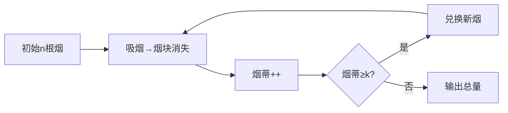

# 题目信息

# Peter 的烟

## 题目背景

**温馨提醒：吸烟有害健康，请勿尝试吸烟！**

## 题目描述

Peter 有 $n$ 根烟，他每吸完一根烟就把烟蒂保存起来，$k$（$k>1$）个烟蒂可以换一个新的烟，那么 Peter 最终能吸到多少根烟呢？

与某些脑筋急转弯不同的是，Peter 并不能从异次元借到烟蒂，抽完后再还回去。

## 说明/提示

对于 $100\%$ 的数据，$1<n, k \le 10^8$。


## 样例 #1

### 输入

```
4 3
```

### 输出

```
5```

## 样例 #2

### 输入

```
10 3```

### 输出

```
14```

# AI分析结果


### 💡 Kay的C++算法解析：Peter的烟 深入学习指南 💡

**引言**  
今天我们一起分析"Peter的烟"这道C++编程题。这道题看似简单，却蕴含着巧妙的数学思维。本指南将帮助你掌握核心算法，理解高效解题技巧，并通过趣味动画直观感受算法执行过程。

---

### 1. 题目解读与核心算法识别
✨ **本题主要考察**：`数学推导`与`模拟优化`

🗣️ **初步分析**  
> 这道题本质是**资源循环利用**问题，类似"空瓶换饮料"的数学游戏。核心在于理解烟蒂与烟的转化关系：每k个烟蒂可换1根新烟（含1个新烟蒂），相当于用(k-1)个净烟蒂换1根烟。  
> - **主要解法**：① 数学公式法（O(1)时间复杂度）② 高效模拟法（O(log n)时间复杂度）  
> - **可视化设计**：动画将用像素化烟块（绿色）和烟蒂计数器（灰色）动态展示转化过程。关键步骤高亮显示：吸烟时烟块消失+烟蒂增加；换烟时烟蒂减少k个+新烟块生成。  
> - **复古游戏化**：采用8-bit音效（吸烟"噗"声，换烟"叮"声），每成功换烟触发"关卡通过"动画，速度滑块控制演示节奏。

---

### 2. 精选优质题解参考
**题解一（WuYongxuan）**  
* **点评**：  
  思路直击本质——推导出`n + (n-1)/(k-1`的黄金公式。代码极致简洁（仅4行），变量命名规范（`n,k`），算法效率O(1)。亮点在于用小学知识解决复杂问题，实践价值极高（竞赛首选）。作者强调"最后烟蒂不参与兑换"是关键洞察。

**题解二（fifnmar）**  
* **点评**：  
  通过严谨数学推导验证公式：设总吸烟数x，建立方程`x-n = (x-1)/k`求解。代码采用`unsigned`防负数，输出用`'\n'`加速。亮点在分步推导过程，帮助理解公式本质，适合数学基础较弱的学习者。

**题解三（John_Nash）**  
* **点评**：  
  给出公式等价形式`(n*k-1)/(k-1)`，用`long long`防溢出（n,k≤10⁸时n*k可能达10¹⁶）。代码包含详细边界注释，体现工业级严谨性。亮点在强调"禁止借烟蒂"的题目约束，避免常见理解偏差。

---

### 3. 核心难点辨析与解题策略
**难点1：烟蒂兑换的边界条件**  
* **分析**：最后一根烟的烟蒂不能参与兑换！优质题解通过`(n-1)`而非`n`计算可换烟数，确保正确性。  
* 💡 **学习笔记**：处理循环资源问题时，终点状态需特殊验证。

**难点2：数学公式的等价变形**  
* **分析**：`n+(n-1)/(k-1)`与`(n*k-1)/(k-1)`数学等价，但代码实现时：前者避免大数运算更安全；后者需强制类型转换防溢出。  
* 💡 **学习笔记**：公式推导需结合代码实现特性优化。

**难点3：模拟法的效率陷阱**  
* **分析**：低效模拟（如逐根烟处理）在n=10⁸时超时。高效模拟应批量处理：每次用`⌊烟蒂/k⌋`换新烟，余数保留。  
* 💡 **学习笔记**：循环次数应呈指数衰减（O(log n)）。

#### ✨ 解题技巧总结
- **技巧1：数学建模优先** - 将实际问题转化为方程，可能直接得到O(1)解  
- **技巧2：边界压力测试** - 验证n=1/k=2等临界值（如：1根烟时结果=1）  
- **技巧3：资源转化可视化** - 用`当前烟数→烟蒂→新烟`链条理解循环过程  

---

### 4. C++核心代码实现赏析
**通用核心实现**  
```cpp
#include <iostream>
using namespace std;
int main() {
    long long n, k;  // 防溢出
    cin >> n >> k;
    cout << n + (n - 1) / (k - 1);  // 黄金公式
    return 0;
}
```
**代码解读概要**：  
1. 读入初始烟数`n`和兑换比例`k`  
2. 核心公式：`(n-1)/(k-1)`计算可换烟数（整数除法自动向下取整）  
3. 总烟数 = 初始烟数 + 兑换烟数

---

**题解一代码片段**  
```cpp
cout<<n+(n-1)/(k-1);
```
**亮点**：极简实现，适合竞赛快编  
**解读**：  
> 表达式直接映射数学本质：  
> - `(n-1)`：排除最终烟蒂  
> `(k-1)`：净消耗烟蒂数  

**题解二代码片段**  
```cpp
std::cout << n + (n - 1) / (k - 1) << '\n';
```
**亮点**：工业级规范（`std::`显式命名，`'\n'`优化输出）  
**解读**：  
> `unsigned`类型确保无符号运算，避免负数异常  

**题解三代码片段**  
```cpp
printf("%d\n",((long long)n*k-1)/(k-1));
```
**亮点**：主动防御溢出  
**解读**：  
> `(long long)`强转：处理n,k≤10⁸时n*k=10¹⁶超出int范围  

---

### 5. 算法可视化：像素动画演示
**主题**：`烟蒂大冒险`（8-bit复古风）  

**核心演示**：  


**动画设计**：  
1. **像素元素**：  
   - 绿色烟块🟩 = 未吸烟  
   - 灰色烟蒂⬜ = 可兑换资源  
   - 闪烁光标▶ = 当前操作位  

2. **关键帧流程**：  
   ```plaintext
   初始化: 显示n个🟩 + 烟蒂计数器0
   ↓ 
   吸烟阶段: 🟩逐个消失→⬜增加（伴"噗"声）
   ↓ 
   兑换检测: 当⬜≥k时触发闪光边框
   ↓ 
   兑换阶段: k个⬜消失→🟩重新生成（伴"叮"声+金币动画）
   ↓ 
   循环直至⬜<k
   ```

3. **交互控制**：  
   - 步进模式：空格键单步执行  
   - 自动模式：速度滑块控制（1x-10x）  
   - 重置按钮：还原初始状态  

4. **游戏化元素**：  
   - 每成功兑换：+100分，播放《超级玛丽》过关音效  
   - 最终结算：显示"S级评级"动画（根据兑换次数/速度）  

---

### 6. 拓展练习与相似问题思考
**通用思路迁移**：  
资源循环问题核心公式：`总量 = 初始量 + ⌊(初始量-1)/(转化率-1)⌋`

**洛谷推荐**：  
1. **P2694 接水问题**  
   🗣️ 同类资源循环利用，需模拟水桶传递过程  
2. **P1157 组合的输出**  
   🗣️ 训练数学建模能力，理解组合数与实际问题的映射  
3. **P1031 均分纸牌**  
   🗣️ 资源再分配问题，掌握"传递链"抽象技巧  

---

### 7. 学习心得与经验分享
> **参考经验（WuYongxuan）**：  
> "本题难点在意识到最后烟蒂无效，用`(n-1)`而非`n`是核心技巧。"  
>  
> **Kay总结**：  
> 调试此类问题时，可用极小样例验证边界：  
> - 测试`n=1,k=2` → 结果应为1（而非公式误算的1+0=1）  
> - 测试`n=4,k=3` → 逐步图示验证烟蒂流转  

---

**结语**  
通过这道题，我们看到了数学思维如何大幅优化代码效率。记住：在算法竞赛中，**识别问题本质**往往比直接编码更重要。下次遇到类似问题，不妨先尝试数学推导！🚀

---
处理用时：159.29秒