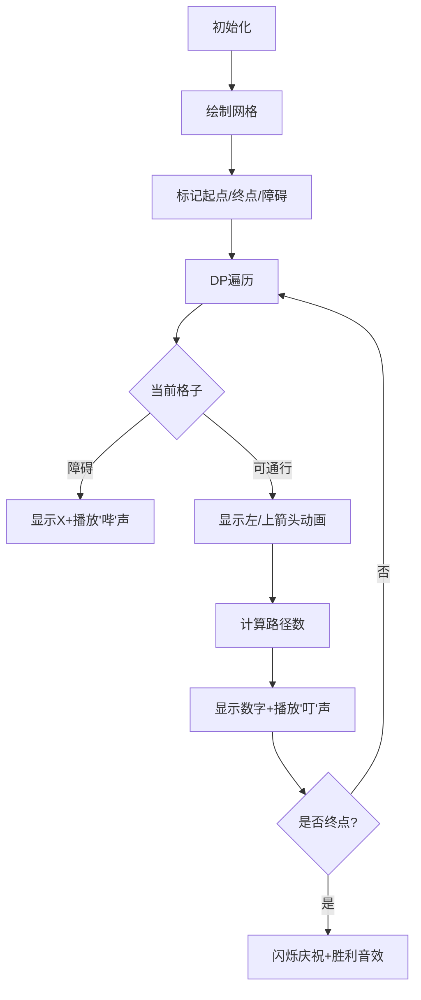

# 题目信息

# 路径计数2

## 题目描述

一个 $N \times N$ 的网格，你一开始在 $(1,1)$，即左上角。每次只能移动到下方相邻的格子或者右方相邻的格子，问到达 $(N,N)$，即右下角有多少种方法。

但是这个问题太简单了，所以现在有 $M$ 个格子上有障碍，即不能走到这 $M$ 个格子上。


## 说明/提示

对于 $20\%$ 的数据，有$N≤3$；

对于 $40\%$ 的数据，有$N≤100$；

对于 $40\%$ 的数据，有$M=0$；

对于 $100\%$ 的数据，有$N≤1000,M≤100000$。


## 样例 #1

### 输入

```
3 1
3 1```

### 输出

```
5```

# AI分析结果


### 💡 Kay的C++算法解析：路径计数2 深入学习指南 💡

#### 1. 题目解读与核心算法识别
✨ **本题主要考察**：`动态规划/递推应用`  
🗣️ **初步分析**：
> 解决路径计数问题，关键在于理解**递推关系**。就像在城市网格中规划路线：每个路口的可达路线数等于上方路口路线数加左方路口路线数。本题中，障碍物相当于封路路段，需特殊处理。
> - **核心思路**：建立二维DP数组，`dp[i][j]`表示到达(i,j)的路径数。状态转移方程：`dp[i][j] = dp[i-1][j] + dp[i][j-1]`（无障碍时）
> - **难点处理**：障碍物需标记并跳过计算；边界条件需特殊处理（首行/列）
> - **可视化设计**：采用像素网格动画（8-bit风格），用颜色区分格子类型（绿=起点/红=终点/灰=障碍），动态展示DP填充过程，关键操作配复古音效（如"叮"=计算，"哔"=障碍）

#### 2. 精选优质题解参考
**题解一（作者：憨憨儿）**
* **点评**：思路清晰推导严谨，用`bool`数组标记障碍逻辑直观。代码规范（变量名`x/y`含义明确），边界处理通过`continue`跳过起点和首行/列单独处理，虽未优化空间但可读性极佳。实践价值高，注释详细易调试。亮点：完整展示递推过程，适合初学者理解DP本质。

**题解二（作者：Jimmy000）**
* **点评**：代码简洁高效（仅14行），统一处理逻辑：先累加再判断障碍。利用数组默认0值特性，省去边界特判。亮点：`a[i][j] += a[i-1][j] + a[i][j-1]`直击核心，配合障碍置0操作干净利落，竞赛实现典范。

**题解三（作者：佳铭）**
* **点评**：创新初始化技巧`f[0][1]=1`巧妙避免边界判断，使代码更紧凑。状态转移与障碍判断融合度高，取模操作规范。亮点：通过虚拟行列设计简化逻辑，展示DP初始化艺术，适合进阶学习。

#### 3. 核心难点辨析与解题策略
1. **状态转移方程构建**
   * **分析**：需理解路径单向性（仅右/下移动），当前点路径数=左边点+上边点路径数。优质题解均通过`dp[i][j]=dp[i-1][j]+dp[i][j-1]`实现
   * 💡 **学习笔记**：DP本质是数学归纳法，当前状态由子问题决定

2. **边界条件处理**
   * **分析**：首行无上方来源，首列无左方来源。解法分两种：①显式判断（憨憨儿）②虚拟行列初始化（佳铭）
   * 💡 **学习笔记**：边界是DP的基石，错误处理直接导致结果谬误

3. **障碍物融合处理**
   * **分析**：需在DP前标记障碍（`bool数组`），计算中跳过或置零。注意障碍阻断后续路径（如首行障碍使右侧全不可达）
   * 💡 **学习笔记**：预处理是优化复杂度的关键，O(1)查询障碍状态

### ✨ 解题技巧总结
- **问题分解法**：将网格路径分解为单点路径计算，建立二维状态表
- **防御性编程**：输入后立即标记障碍，避免主逻辑污染
- **边界预判**：显式处理首行/列或创新初始化
- **实时取模**：大数问题每一步操作后取模（`%100003`）

---

#### 4. C++核心代码实现赏析
**通用核心实现（综合优化版）**
```cpp
#include <iostream>
#include <cstring>
using namespace std;
const int MOD = 100003, N = 1005;

int main() {
    int n, m, dp[N][N] = {0};
    bool obs[N][N] = {false}; // 障碍标记
    
    cin >> n >> m;
    while (m--) {
        int x, y; cin >> x >> y;
        obs[x][y] = true;
    }

    dp[0][1] = 1; // 虚拟初始化
    for (int i = 1; i <= n; i++) {
        for (int j = 1; j <= n; j++) {
            if (obs[i][j]) dp[i][j] = 0;
            else dp[i][j] = (dp[i-1][j] + dp[i][j-1]) % MOD;
        }
    }
    cout << dp[n][n];
}
```
**代码解读概要**：  
> 1. 初始化虚拟点`dp[0][1]=1`统一边界处理  
> 2. 双重循环遍历网格，先检测障碍再递推  
> 3. 实时取模避免溢出  
> 4. 障碍点直接置零阻断路径  

**题解一片段（憨憨儿）**
```cpp
for (int i = 1; i <= n; i++)
    for (int j = 1; j <= n; j++) {
        if (y[i][j] || (i == 1 && j == 1)) continue;
        else if (i == 1) x[i][j] = x[i][j-1] % 100003;
        else if (j == 1) x[i][j] = x[i-1][j] % 100003;
        else x[i][j] = (x[i-1][j] + x[i][j-1]) % 100003;
    }
```
**亮点**：边界显式处理，适合理解DP流程  
**学习笔记**：多分支结构清晰但可优化为统一逻辑  

**题解二片段（Jimmy000）**
```cpp
a[1][1] = 1;
for (int i = 1; i <= n; i++)
    for (int j = 1; j <= n; j++) {
        a[i][j] += a[i-1][j] + a[i][j-1];
        if (b[i][j]) a[i][j] = 0;
        a[i][j] %= 100003;
    }
```
**亮点**：先计算后置零，逻辑紧凑  
**学习笔记**：利用默认0值特性减少边界判断  

---

#### 5. 算法可视化：像素动画演示
**主题**：8-bit风格《网格探险家》  
**核心演示**：动态规划填充过程+障碍物影响  



**关键交互设计**：
1. **视觉编码**：
   - 🟩起点/🟥终点/⬛障碍/🟨当前处理格
   - 箭头动画：左/上方向路径来源
   - 实时显示格子路径数
2. **音效系统**：
   - 路径计算："叮"（8-bit短音）
   - 障碍："哔"（警告音）
   - 完成：胜利旋律
3. **控制面板**：
   - 速度滑块：控制DP填充速度
   - 单步/暂停：重点步骤分析
   - 重置：随机生成新障碍
4. **游戏化元素**：
   - 每完成10%点亮进度星
   - 错误操作触发像素风格"爆炸"特效
   - 最终评分（基于操作效率）

---

#### 6. 拓展练习与相似问题
**通用套路延伸**：
1. 方向扩展：允许对角线移动（状态转移+1项）
2. 代价计算：格子有通行代价（最小值DP）
3. 路径回溯：记录具体路径而不仅是数量

**洛谷推荐**：
1. **P1002 过河卒**  
   🗣️ *同类网格DP+障碍物，马的控制点处理*
2. **P1216 数字三角形**  
   🗣️ *变形网格DP，学习最优路径决策*
3. **P1434 滑雪**  
   🗣️ *DP+记忆化搜索综合应用，理解状态转移多样性*

---

#### 7. 学习心得与经验分享
> **经验摘录（作者：Atmizz）**：  
> *"最初用DFS直接TLE，改用DP才AC。数据规模是算法选择的决定性因素！"*  
>   
> **Kay点评**：  
> 此教训揭示**算法复杂度意识**的重要性。DFS时间复杂度O(2^(n×n))在n=1000时完全不可行，而DP的O(n²)才是正解。建议：  
> - 10^3级别数据：优先考虑O(n²)以下算法  
> - 调试时先估算最坏情况  
> - 递归改递推是常见优化手段  

---

通过本指南，相信你已掌握网格DP的核心思想。记住：**好算法=正确状态转移+严谨边界处理**。下次挑战见！💪

---
处理用时：143.42秒