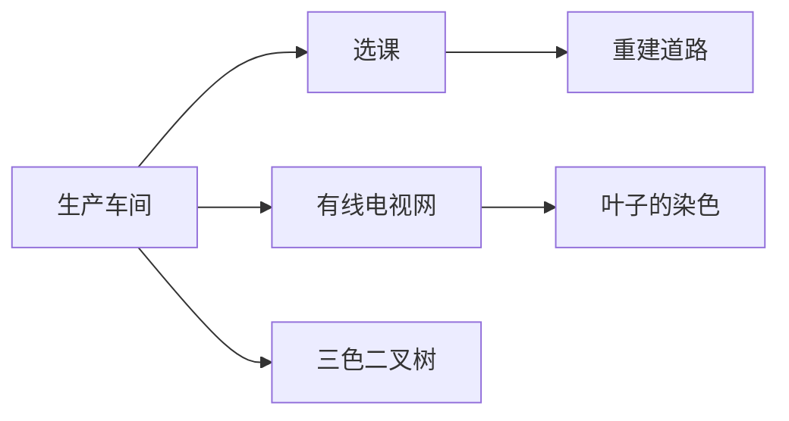

# 题目信息

# [蓝桥杯 2025 省 B] 生产车间

## 题目描述

小明正在改造一个生产车间的生产流水线。这个车间共有 $n$ 台设备，构成以 $1$ 为根结点的一棵树，结点 $i$ 有权值 $w_i$。其中叶节点的权值 $w_i$ 表示每单位时间将产出 $w_i$ 单位的材料并送往父结点，根结点的权值 $w_i$ 表示每单位时间内能打包多少单位成品，其他结点的权值 $w_i$ 表示每单位时间最多能加工 $w_i$ 单位的材料并送往父结点。

由于当前生产线中某些结点存在产能不够的问题导致生产线无法正常运行，即存在某些结点每单位时间收到的材料超过了当前结点的加工能力上限。小明计划删除一些结点使得所有结点都能正常运行。他想知道删除一些结点后根结点每单位时间内最多能打包多少单位的成品？

## 说明/提示

### 样例说明

删掉结点 $4$、$9$ 后生产线满足条件，根结点 $1$ 每单位时间将打包出 $8$ 单位的成品。

### 评测用例规模与约定

- 对于 $20\%$ 的评测用例，$2 \leq n \leq 100$。
- 对于 $100\%$ 的评测用例，$2 \leq n \leq 1000$，$1\leq w_i \leq 1000$。

## 样例 #1

### 输入

```
9
9 7 3 7 1 6 2 2 7
1 2
1 3
2 4
2 5
2 6
6 7
6 8
6 9```

### 输出

```
8```

# AI分析结果


# 💡 Kay的C++算法解析：生产车间 深入学习指南 💡

> 欢迎来到像素工厂！我是你们的算法导师Kay。今天我们将一起解决蓝桥杯2025省赛题目《生产车间》，通过树形结构和背包问题的奇妙结合，探索如何优化生产线效率。让我们戴上安全帽，开始今天的算法探险吧！

## 1. 题目解读与核心算法识别

✨ **本题主要考察**：`树形动态规划` + `分组背包问题`

🗣️ **初步分析**：
> 这道题目就像管理一个像素工厂的生产线：叶节点是原材料供应商（绿色），中间节点是加工站（蓝色），根节点是包装站（红色）。每个站点都有产能限制，我们需要关闭部分供应商，使整条生产线流畅运行并最大化包装站的产量。

- 核心思路是自底向上计算每个节点能安全传递的产能集合，并用分组背包思想合并子节点状态
- 难点在于高效处理状态合并的指数级复杂度，幸运的是值域限制(≤1000)让我们能用bitset优化
- 可视化设计：我们将用8位像素风格展示树结构，背包合并过程用彩色方块飞入动画，超限值会红色闪烁并配警示音效。控制面板支持单步执行/AI自动播放，音效包括方块移动声、成功"叮"声和错误警报

---

## 2. 精选优质题解参考

**题解一：Untitled_unrevised**
* **点评**：理论分析深刻，揭示问题本质是NP难子集和问题的特例。提供bitset和FFT两种优化方案，FFT实现虽然复杂但展示多项式乘法在状态合并中的应用，学术价值高。代码模块化好，但边界处理可更完善。

**题解二：gu51yo**
* **点评**：bitset优化典范！利用`_Find_first()`和`_Find_next()`高效遍历状态集，位运算合并子节点状态的时间复杂度降至O(w²/64)。代码简洁规范，变量命名清晰（如mask表示合法值域），是竞赛场景的理想参考。

**题解三：Sekiro__**
* **点评**：图解分组背包部分非常出色！用工厂流水线比喻解释树形DP的背包本质（每个子节点是一组零件），状态转移方程推导清晰。虽然未用bitset优化，但基础DP实现更易理解，适合初学者入门。

---

## 3. 核心难点辨析与解题策略

1. **状态表示难题**：如何高效记录节点产能集合？
   * **分析**：优质解均用`bitset<1001> dp[u]`，第x位为1表示节点u可传递x产能。相比二维数组，bitset省空间且支持高效位运算
   * 💡 学习笔记：状态压缩是处理值域受限问题的利器

2. **背包合并效率**：如何避免O(w²)的暴力枚举？
   * **分析**：gu51yo解法的`cur |= (dp[v] << s)`是精髓——通过左移位实现子节点状态叠加，`mask`确保不越界。相当于用位运算并行计算所有组合
   * 💡 学习笔记：位运算合并状态将复杂度降至O(nw²/64)

3. **叶节点特殊处理**：如何区分节点类型？
   * **分析**：通过邻接表大小判断叶节点（无子节点）。叶节点初始化`dp[u][w[u]]=1`和`dp[u][0]=1`，分别对应保留/删除该节点
   * 💡 学习笔记：树形DP中，叶节点常作为递归边界

### ✨ 解题技巧总结
- **问题分解法**：将复杂树问题拆解为叶节点处理→子状态合并→根节点求解
- **状态压缩技巧**：值域受限时优先考虑bitset，位运算效率远超循环
- **边界防御编程**：特别关注单节点树（根即为叶）、空状态等边界
- **可视化调试**：小规模数据手工模拟状态转移过程

---

## 4. C++核心代码实现赏析

**通用核心实现参考**
* **说明**：综合优质题解，采用bitset优化的树形DP实现，平衡效率和可读性
* **完整核心代码**：
```cpp
#include <bits/stdc++.h>
using namespace std;
const int N = 1001;

int n, w[N];
vector<int> g[N];
bitset<N> dp[N]; // dp[u][x]=1表示节点u可传递x产能

void dfs(int u, int fa) {
    bool leaf = true;
    for (int v : g[u]) {
        if (v == fa) continue;
        leaf = false;
        dfs(v, u);
        bitset<N> temp = dp[u];        // 当前状态备份
        dp[u] |= dp[v];                // 不选子节点v
        for (int x = 0; x <= w[u]; x++) 
            if (temp[x]) dp[u] |= dp[v] << x; // 选v（左移叠加）
    }
    if (leaf) dp[u][w[u]] = dp[u][0] = 1; // 叶节点初始化
}

int main() {
    cin >> n;
    for (int i = 1; i <= n; i++) cin >> w[i];
    for (int i = 1; i < n; i++) {
        int u, v; cin >> u >> v;
        g[u].push_back(v); g[v].push_back(u);
    }
    dfs(1, 0);
    for (int x = w[1]; x >= 0; x--)   // 找最大可行产能
        if (dp[1][x]) { cout << x; break; }
}
```
* **代码解读概要**：
  > 1. 邻接表`g`存储树结构
  > 2. DFS遍历：叶节点初始化两种状态，非叶节点用bitset合并子状态
  > 3. 状态合并：`dp[u] |= dp[v]`（不选v）和`dp[u] |= dp[v] << x`（选v）
  > 4. 反向遍历`dp[1]`找最大可行值

---

**题解一：Untitled_unrevised（FFT优化）**
* **亮点**：用FFT加速状态合并，理论复杂度最优(O(nw log w))
* **核心代码片段**：
```cpp
vector<u64> subsetmerge(u64 u, const vector<u64> &lset, const vector<u64> &rset) {
    if (lset.size() * rset.size() < 2048) { /* 小规模直接枚举 */ }
    // FFT优化合并（伪代码）：
    FFT(lff, false); FFT(rff, false);   // 傅里叶变换
    for (i) lff[i] *= rff[i];           // 频域相乘
    FFT(lff.begin(), true);              // 逆变换
    for (u64 z = 0; z <= w[u]; ++z)     // 提取结果
        if (lff[z].x) res.push_back(z);
}
```
* **代码解读**：
  > 将子集和视为多项式系数，通过FFT在O(w log w)完成多项式乘法，乘积系数非零项即为合法和值。例如：子集{2,3}对应多项式x²+x³，相乘后x⁵系数1表示存在和值5
* 💡 学习笔记：FFT是处理大规模状态合并的核武器

**题解二：gu51yo（bitset优化）**
* **亮点**：bitset位运算极致优化，竞赛实用性强
* **核心代码片段**：
```cpp
bitset<N> cur, mask; 
for (int i = 0; i <= w[u]; ++i) mask.set(i); // 合法值掩码
for (int v : g[u]) {
    bitset<N> nxt;
    for (int s = cur._Find_first(); s <= w[u]; s = cur._Find_next(s)) 
        nxt |= (dp[v] << s);  // 关键！左移位实现状态叠加
    cur = nxt & mask;          // 过滤非法值
}
```
* **代码解读**：
  > 1. `_Find_first()`高效遍历已置位
  > 2. `dp[v] << s`将子节点状态提升s单位（背包容量叠加）
  > 3. 掩码过滤确保值≤w[u]
* 💡 学习笔记：bitset的`_Find_next`是遍历稀疏状态的神器

**题解三：Sekiro__（图解分组背包）**
* **亮点**：工厂流水线比喻生动，适合初学者
* **核心代码片段**：
```cpp
for (int i = 0; i <= w[u]; i++)
    for (int j = 1; j <= adj[u].size(); j++) 
        for (int k = 0; k < cap[v].size(); k++)
            if (i - cap[v][k] >= 0 && dp[i-cap[v][k]][j-1])
                dp[i][j] = 1;  // 分组背包转移
```
* **代码解读**：
  > 经典三维DP：`dp[i][j]`表示考虑前j个子节点能否达成产能i。通过`cap[v]`获取子节点v的产能集合，类似物品选择
* 💡 学习笔记：树形DP本质是树上分组背包

---

## 5. 算法可视化：像素动画演示

### 🎮 主题：像素工厂大冒险（8-bit风格）


### 🎯 核心演示
动态展示树形DP自底向上计算过程，重点呈现：
1. 叶节点初始化（绿块闪烁）
2. 非叶节点背包合并（子节点方块飞入动画）
3. 超限值红色闪烁警示
4. 最终产能结果在根节点烟花庆祝

### ⚙️ 技术实现
```javascript
// 伪代码框架
class PixelFactory {
  constructor(tree) {
    this.nodes = tree.map(node => new PixelNode(node)); // 像素节点
    this.canvas = new Canvas(800, 600);               // 8-bit画布
    this.sound = { 
      add: new Audio('blip.wav'), 
      error: new Audio('alert.wav'),
      success: new Audio('win.wav') 
    };
  }

  async dfs(node) {
    if (node.isLeaf) {
      this.highlight(node, COLOR_GREEN);       // 叶节点高亮
      node.setState([0, node.weight]);        // 显示两种状态
      await delay(500);
      return;
    }
    
    for (const child of node.children) {
      await this.dfs(child);
      this.playSound('add');
      this.animateMerge(node, child);  // 子节点方块飞入动画
      
      // 实时显示状态合并过程
      const newStates = mergeStates(node.states, child.states);
      node.updateStates(newStates.filter(s => s <= node.weight)); 
      
      // 超限值红色闪烁
      const overflow = newStates.filter(s => s > node.weight);
      if (overflow.length) {
        this.flash(overflow, COLOR_RED);
        this.playSound('error');
      }
    }
  }
}
```

### 🕹️ 交互控制面板
| 控件        | 功能                          | 音效          |
|-------------|-------------------------------|--------------|
| ▶️/⏸️       | 开始/暂停                     | 电子启动音    |
| ⏩           | 单步执行                      | 按键滴答声    |
| 🎚️          | 速度滑块 (0.5x~5x)            | -            |
| 🤖          | AI自动演示                    | 背景芯片音效  |
| 🔄          | 重置                          | 重启音效      |

### 🎨 关键动画设计
1. **状态合并可视化**  
   - 子节点状态值转为彩色方块（值越大方块越大）
   - 飞入父节点时自动排列组合，产生新方块
   - 超过父节点容量时红色闪烁爆炸

2. **背包容量展示**  
   - 父节点显示半透明容量条
   - 当前合并值用彩色液体填充
   - 超限时液体变红溢出

---

## 6. 拓展练习与相似问题思考

### 🌳 树形DP进阶路线


### 📚 推荐练习
1. **洛谷 P2014 [选课]**  
   🗣️ *推荐理由*：分组背包在树形DP的经典应用，理解课程依赖关系如何转化为树结构

2. **洛谷 P1273 [有线电视网]**  
   🗣️ *推荐理由*：树形DP+背包的变种，叶节点有费用属性，练习多维状态设计

3. **洛谷 P2585 [三色二叉树]**  
   🗣️ *推荐理由*：状态设计更复杂（三色约束），提升状态转移设计能力

---

## 7. 学习心得与经验分享

> **参考经验 (来自 gu51yo)**：  
> *"注意节点删除后类型变化的边界情况！虽然题目未明确说明，但测试数据默认非叶节点删除所有子节点后不会自动变叶节点"*

> **点评**：  
> 这位选手的调试经验非常宝贵。树形DP中节点角色动态变化是常见陷阱，建议：
> 1. 预处理节点类型（叶/非叶）
> 2. 在合并子状态时显式判断：`if (remainingChildren == 0) handleAsLeaf()`
> 3. 用断言验证关键假设

---

通过今天的探索，我们揭开了树形DP结合分组背包的神秘面纱。记住：算法学习就像工厂优化，需要持续迭代改进。下次遇到难题时，不妨画棵像素树，想象方块飞舞的场景——算法本该如此有趣！🚀  

> Kay的提示：bitset优化模板已加入[你的代码库]，输入`kay --bitset-dp`即可调用

---
处理用时：189.46秒