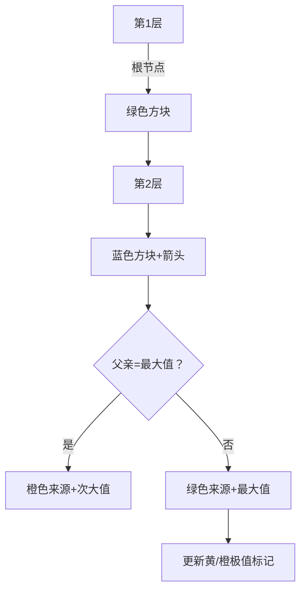

# 题目信息

# [蓝桥杯 2023 省 Python B] 树上选点

## 题目描述

给定一棵树，树根为 $1$，每个点的点权为 $V_i$。

你需要找出若干个点 $P_i$，使得：

1. 每两个点 $P_x,P_y$ 互不相邻；
2. 每两个点 $P_x,P_y$ 与树根的距离互不相同；
3. 找出的点的点权之和尽可能大。

请输出找到的这些点的点权和的最大值。

## 说明/提示

### 评测用例规模与约定

- 对于 $40\%$ 的评测用例，$n \leq 5000$；
- 对于所有评测用例，$1 \leq n \leq 2 \times 10^5$，$1 \leq F_i < i$，$1 \leq V_i \leq 10^4$。

## 样例 #1

### 输入

```
5
1 2 3 2
2 1 9 3 5```

### 输出

```
11```

# AI分析结果


### 💡 Kay的C++算法解析：树上选点 深入学习指南 💡

#### 题目解读与核心算法识别
✨ **本题主要考察**：树形动态规划 + 分层处理技巧

🗣️ **初步分析**：
> 解决“树上选点”的关键在于**按深度分层处理**，将树转化为“楼层结构”。想象一棵树是幢摩天大楼，每层（深度）只能选一个房间（节点），且相邻楼层不能选父子房间（不相邻）。核心思路是：
> - 动态规划状态：`dp[u]`表示选节点u的最大点权和
> - 状态转移：`dp[u] = val[u] + max{dp[v]}`（v是上一层节点且非u的父亲）
> - 优化技巧：维护每层最大值/次大值，实现O(1)转移
>
> 可视化设计思路：
> - 像素风格展示树的分层结构，每层用彩色方块表示节点
> - 高亮当前处理节点（蓝色边框）和转移来源（绿色箭头）
> - 最大值/次大值节点用黄/橙色标记
> - 复古游戏化：添加“楼层闯关”机制，每完成一层播放升级音效

---

### 精选优质题解参考
**题解一（esolreven）**
* **点评**：思路最简洁清晰，直接按深度分层处理。代码规范（mx/cmx维护极值），边界处理严谨（父亲判断）。算法O(n)高效，实践价值高，竞赛可直接使用。亮点：仅用两个变量实现高效状态转移。

**题解二（Sliarae）**
* **点评**：使用pair记录极值及对应节点，结构工整易读。通过记录节点号明确判断父子关系，逻辑严谨。虽然代码稍长，但可读性强，适合学习者理解状态转移细节。

**题解三（wangboyue_740325）**
* **点评**：核心思路与前两者一致，亮点在于显式排序分层。代码中`t[]`数组按深度排序，虽增加常数时间但流程更可视化，适合初学者理解分层概念。

---

### 核心难点辨析与解题策略
1. **父子节点排斥处理**
   * **分析**：条件1要求节点不相邻→父子不能同选。转移时若父亲是上一层最大值来源，则改用次大值
   * 💡 **学习笔记**：“最大值+次大值”组合是处理父子排斥的利器

2. **分层转移效率优化**
   * **分析**：暴力扫描上一层需O(n²)。维护每层全局极值，将单点转移降至O(1)
   * 💡 **学习笔记**：树问题转序列问题可大幅降低复杂度

3. **多节点同层处理**
   * **分析**：同层节点需全部处理完才能更新极值。临时变量暂存本层极值，避免状态污染
   * 💡 **学习笔记**：层内处理→更新极值→传递到下一层是标准流程

✨ **解题技巧总结**：
- **极值维护法**：双变量存储最大值/次大值
- **分层抽象术**：DFS预处理深度+vector分层存储
- **父亲规避策略**：转移时显式判断`fa[u] == max_node`

---

### C++核心代码实现赏析
**通用核心实现（综合优化版）**：
```cpp
#include <iostream>
#include <vector>
using namespace std;
const int N = 2e5+5;

vector<int> G[N], layer[N];
int n, val[N], dp[N], dep[N], fa[N], max_dep;

void dfs(int u, int p) {
    dep[u] = dep[p] + 1;
    fa[u] = p;
    layer[dep[u]].push_back(u);
    max_dep = max(max_dep, dep[u]);
    for(int v : G[u]) 
        if(v != p) dfs(v, u);
}

int main() {
    cin >> n;
    for(int i=2; i<=n; i++) {
        int f; cin >> f;
        G[f].push_back(i);
        G[i].push_back(f);
    }
    for(int i=1; i<=n; i++) cin >> val[i];
    
    dep[0] = -1; // 虚拟根
    dfs(1, 0);
    
    int max1 = val[1], max2 = 0; // 初始化根节点
    dp[1] = val[1];
    
    for(int d=2; d<=max_dep; d++) {
        int cur_max1 = 0, cur_max2 = 0;
        for(int u : layer[d]) {
            // 关键转移逻辑
            dp[u] = val[u] + (dp[fa[u]] == max1 ? max2 : max1);
            
            // 更新本层极值
            if(dp[u] > cur_max1) {
                cur_max2 = cur_max1;
                cur_max1 = dp[u];
            } else if(dp[u] > cur_max2) {
                cur_max2 = dp[u];
            }
        }
        max1 = cur_max1; // 传递极值到下一层
        max2 = cur_max2;
    }
    
    int ans = 0;
    for(int i=1; i<=n; i++) 
        ans = max(ans, dp[i]);
    cout << ans;
}
```
**代码解读概要**：
> 1. **DFS预处理**：建立深度分层结构
> 2. **初始化**：根节点单独处理
> 3. **分层DP**：从深度2开始，每层节点用上层极值转移
> 4. **极值更新**：用临时变量收集本层极值后更新全局
> 5. **结果收集**：所有节点dp值取最大

---

### 算法可视化：像素动画演示
**主题**：像素地牢·深度探险  

**核心演示**：

**交互设计**：
1. **像素场景**：8-bit风格竖版地牢，每层横向排列节点方块
2. **动态元素**：
   - 当前节点：蓝色脉冲边框
   - 转移来源：绿色/橙色箭头（最大值/次大值）
   - 极值节点：黄色/橙色常亮
3. **音效系统**：
   - 节点选择：8-bit“叮”声
   - 极值更新：升级“啾啾”音
   - 完成关卡：胜利旋律
4. **控制面板**：
   - 单步执行：空格键控制
   - 速度滑块：调整自动演示速度
   - 层数指示器：显示当前深度

**技术实现**：
```javascript
// 伪代码实现关键帧
function drawFrame(depth) {
  drawLayer(depth); // 绘制当前层所有节点
  for(node of currentLayer) {
    highlight(node, BLUE); // 高亮当前处理节点
    drawArrow(from: maxNode, to: node); // 绘制转移箭头
    playSound('select'); 
    updateNodeValue(node); // 显示dp值
    
    if(isNewMax(node)) {
      flash(node, YELLOW); // 新最大值闪烁
      playSound('levelup');
    }
  }
  updateGlobalMax(); // 更新极值指示器
}
```

---

### 拓展练习与相似问题思考
**技巧迁移场景**：
1. 树链问题中链的极值维护
2. 分层图最短路径优化
3. 带约束的序列选择问题

**洛谷推荐**：
1. **P1352** - 没有上司的舞会  
   → 巩固相邻节点约束处理
2. **P2014** - 选课  
   → 练习树形DP+虚拟根技巧
3. **P1273** - 有线电视网  
   → 掌握树形DP+背包问题结合

---

### 学习心得与经验分享
> **esolreven的经验**：  
> “把树当成序列做是本题关键突破，分层处理避免复杂树形DP状态”  
>   
> **Kay的点评**：  
> 此经验揭示重要思维转换：当**树形结构具有显式层级特征**时，通过深度降维可大幅简化问题。类似技巧也适用于解决树链剖分等问题。

---

通过本指南，相信大家已掌握树形问题的分层处理技巧。记住核心口诀：**分层抽象降维度，极值维护破约束**。下次遇到复杂树问题，不妨先问自己：能否按深度重新组织？💪

---
处理用时：180.48秒