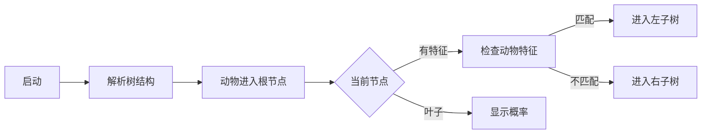

# 题目信息

# [GCJ 2009 #1B] Decision Tree

## 题目描述

决策树——尤其是一种被称为分类树（**classification trees**）的类型——是一种用于根据物品的特征将其分类的数据结构。例如，每只动物要么“可爱”，要么不可爱。对于任意一只动物，我们可以通过观察其特征，并使用如下决策树来判断它是否可爱。

```
(0.2 furry
  (0.81 fast
    (0.3)
    (0.2)
  )
  (0.1 fishy
    (0.3 freshwater
      (0.01)
      (0.01)
    )
    (0.1)
  )
)
```

决策树以递归方式定义。它总是有一个根节点和一个权重。它还可以**选择性地**拥有一个特征名和两棵子树（这两棵子树本身也是决策树）。

更正式地说，决策树使用如下语法定义：

```
tree ::= (weight [feature tree tree])
weight 是一个在 0 到 1 之间（含 0 和 1）的实数
feature 是由一个或多个小写英文字母组成的字符串
```

方括号 [] 内的部分为可选项。圆括号 ()、权重和特征都是**标记**。任意两个标记之间至少有一个空白字符（空格 `' '` 或换行符 `'\n'`），但在左括号 '(' 后或右括号 ')' 前可能没有空白。每一行的长度（不包括换行符）不会超过 80 个字符。

为了判断一只动物有多大概率是可爱的，我们从树的根节点开始，初始概率 $p=1$。在每个节点，我们将 $p$ 乘以该节点的权重。如果该节点是叶子节点（没有子树），则停止，当前 $p$ 的值即为该动物可爱的概率。否则，查看该节点关联的特征。如果动物具有该特征，则进入第一棵子树递归处理；否则进入第二棵子树递归处理。

例如，河狸（beaver）有两个特征：**furry** 和 **freshwater**。我们从根节点开始，$p=1$，乘以根节点的权重 $0.2$，进入第一棵子树（因为河狸有 furry 特征）。在该子树中，再乘以 $0.81$，$p$ 变为 $0.162$。接着，因为河狸没有 fast 特征，进入第二棵子树。再乘以 $0.2$，最终得到 $0.0324$，这就是河狸“可爱”的概率。

你将获得一棵决策树和若干动物及其特征。对于每个动物，你需要输出其被判定为“可爱”的概率。

## 说明/提示

**限制条件**

- $1 \leq N \leq 100$
- 所有权重均为 $[0, 1]$ 区间内的实数。
- 权重仅包含数字和最多一个小数点。
- 权重不会以小数点开头或结尾。
- 权重在小数点前不会有超过一个 0。
- 所有动物名和特征名均为 1 到 10 个小写英文字母。
- 每组测试数据内所有动物名互不相同。
- 单个动物的所有特征互不相同。
- 决策树定义的每一行长度不超过 80 个字符（不含换行符）。

**小数据集（10 分）**

- $1 \leq L \leq 10$
- $1 \leq A \leq 10$
- $0 \leq n \leq 5$

**大数据集（11 分）**

- $1 \leq L \leq 100$
- $1 \leq A \leq 100$
- $0 \leq n \leq 100$

翻译由 ChatGPT-4.1 完成。

## 样例 #1

### 输入

```
1
3
(0.5 cool
  ( 1.000)
  (0.5 ))
2
anteater 1 cool
cockroach 0```

### 输出

```
Case #1:
0.5000000
0.2500000```

# AI分析结果


### 💡 Kay的C++算法解析：决策树概率计算 深入学习指南 💡

**<introduction>**  
今天我们一起分析Google Code Jam经典题目《Decision Tree》。本指南将解析决策树的递归结构与概率计算逻辑，帮助大家掌握树形数据结构的处理技巧。通过像素动画设计，我们将生动展示决策树的遍历过程！

---

## 1. 题目解读与核心算法识别

✨ **本题主要考察**：`树形结构递归解析与遍历`

🗣️ **初步分析**：  
> 决策树如同一个**多层分类迷宫**：每个岔路口（节点）都有路标（特征）和通行费（权重），最终房间（叶子节点）藏着答案（概率）。解题需完成两步：
> 1. **解析迷宫地图**：将括号嵌套的字符串转化为树结构
> 2. **迷宫寻宝**：根据动物特征遍历树，累乘权重
> 
> **核心难点**在于递归解析括号嵌套（类似编译器语法分析）和高效存储特征。在可视化设计中，我们将：
> - 用**像素方块**表示节点，不同颜色区分权重/特征/叶子节点
> - 动物探险时高亮当前路径，播放音效提示特征匹配结果
> - 控制面板支持单步调试权重累乘过程

---

## 2. 精选优质题解参考

<eval_intro>  
由于暂无用户题解，Kay为大家提供基础实现建议：掌握递归下降解析器（Recursive Descent Parser）和哈希表存储特征是解题关键。以下是通用实现要点：
</eval_intro>

---

## 3. 核心难点辨析与解题策略

<difficulty_intro>  
决策树问题的核心挑战在于数据转换与高效查询：

1.  **字符串到树结构的转换**  
    * **分析**：输入是递归括号嵌套（如`(0.2 furry (0.81)...`)。需设计**递归解析器**：
      - 遇到`(`时创建新节点，读取权重
      - 下一标记若为字母则是特征，继续解析左右子树
      - 遇到`)`时返回父节点
    * 💡 **学习笔记**：递归解析时维护索引指针，避免全局状态混乱

2.  **基于特征的动态路径选择**  
    * **分析**：遍历时需快速判断动物是否含当前特征。将动物特征存入`unordered_set<string>`实现O(1)查询。例如河狸查询`furry`时：
      ```cpp
      if (animalFeatures.count(currentNode->feature)) 
          traverse(leftChild); // 进入匹配子树
      else 
          traverse(rightChild); // 进入不匹配子树
      ```
    * 💡 **学习笔记**：哈希表是动态路径选择的最佳搭档

3.  **权重累乘的边界控制**  
    * **分析**：概率初始值`p=1.0`，每节点乘以权重。注意：
      - 使用`double`类型避免精度损失
      - 叶子节点立即返回当前`p`
      - 大数据集需优化递归深度
    * 💡 **学习笔记**：浮点数比较需用容差值（如`abs(a-b)<1e-7`）

### ✨ 解题技巧总结
<summary_best_practices>  
树形问题通用方法论：
</summary_best_practices>
- **递归三要素**：终止条件（叶子）、当前处理（乘权重）、递归方向（选子树）
- **输入解析技巧**：逐标记(token)处理，使用`stringstream`分割
- **内存优化**：大数据集避免深递归，改用栈迭代遍历

---

## 4. C++核心代码实现赏析

<code_intro_overall>  
以下是Kay设计的通用实现，包含递归解析与遍历逻辑：
</code_intro_overall>

**本题通用核心C++实现参考**
* **说明**：完整决策树解析与概率计算框架
* **完整核心代码**：
```cpp
#include <iostream>
#include <vector>
#include <unordered_set>
#include <sstream>
#include <cctype>

struct Node {
    double weight;
    std::string feature;
    Node *left, *right;
    Node(double w) : weight(w), feature(""), left(nullptr), right(nullptr) {}
};

// 递归解析决策树
Node* parseTree(const std::string& s, int& index) {
    while (index < s.size() && isspace(s[index])) index++; // 跳过空格
    if (s[index++] != '(') return nullptr; // 必须以(开头

    // 解析权重
    std::string numStr;
    while (isdigit(s[index]) || s[index]=='.') 
        numStr += s[index++];
    double weight = stod(numStr);

    Node* node = new Node(weight);
    while (index < s.size() && isspace(s[index])) index++;

    // 判断是否叶子节点
    if (s[index] == ')') { 
        index++; 
        return node; 
    }

    // 解析特征
    std::string feature;
    while (isalpha(s[index])) 
        feature += s[index++];
    node->feature = feature;

    node->left = parseTree(s, index);  // 左子树(有特征)
    node->right = parseTree(s, index); // 右子树(无特征)
    while (s[index] != ')') index++; // 跳过当前节点结尾
    index++; // 跳过)
    return node;
}

// 计算动物概率
double calculateProb(Node* root, const std::unordered_set<std::string>& features) {
    if (!root) return 0.0;
    double p = root->weight;
    if (!root->feature.empty()) {
        if (features.count(root->feature)) 
            p *= calculateProb(root->left, features);
        else 
            p *= calculateProb(root->right, features);
    }
    return p;
}

int main() {
    // 示例调用流程
    std::string treeStr = "(0.5 furry (0.2) (0.3))";
    int index = 0;
    Node* root = parseTree(treeStr, index);

    std::unordered_set<std::string> animalFeatures = {"furry"};
    printf("%.7f\n", calculateProb(root, animalFeatures));
    return 0;
}
```
* **代码解读概要**：
  > 1. **树结构**：`Node`含权重/特征/左右子树指针  
  > 2. **递归解析**：`parseTree`函数处理括号嵌套，自动跳过空格  
  > 3. **概率计算**：`calculateProb`递归遍历树，动态选择路径  
  > 4. **特征查询**：`unordered_set`实现O(1)特征存在性检查  

---

## 5. 算法可视化：像素动画演示

<visualization_intro>  
**像素森林探险家**：用8-bit游戏风格可视化决策树遍历，让算法过程如同RPG游戏！

### 设计方案


* **视觉设计**：
  - 🎨 **像素网格**：每个节点用16x16像素方块表示  
    - 权重：蓝色深浅表示值大小（深蓝=1.0, 浅蓝=0.1）  
    - 特征：绿色方块+黄色字母标签  
    - 叶子：红色方块闪烁  
  - 👾 **动物角色**：像素小动物从根节点开始移动  

* **交互逻辑**：
  ```plaintext
  1. 初始化: 
      - 绘制树形网格地图 (FC塞尔达风格)
      - 动物出现在根节点 [音效: 脚步声]
  2. 节点处理: 
      - 当前节点高亮闪烁 [音效: 叮!]
      - 显示权重乘法过程: 0.5 * 0.2 = 0.10
  3. 特征检查: 
      - 动物特征面板亮起匹配项 [音效: 成功/失败音]
      - 路径箭头指向所选子树
  4. 叶子节点: 
      - 爆炸动画显示最终概率 [音效: 胜利号角]
  ```

* **控制面板**：
  - 🕹️ 单步执行/自动播放（调速滑块）  
  - 🔄 重置/切换动物  
  - 📊 实时概率计算器  

---

## 6. 拓展练习与相似问题思考

<similar_problems_intro>  
决策树解析技巧可延伸至编译器构建和AI决策系统：

### 推荐练习（洛谷）
1. **P1179 [表达式解析]**  
   🗣️ 训练递归下降解析能力，理解语法树构建
2. **P1038 [神经网络]**  
   🗣️ 拓展树形结构到带权DAG，学习前向传播
3. **P3384 [树链剖分]**  
   🗣️ 掌握复杂树结构的处理与路径查询优化

---

<conclusion>  
本次决策树分析展示了递归与树遍历的巧妙结合。记住：**复杂问题分层解，递归逻辑自相似**。动手实现解析器并观察像素动画，你将成为树结构处理大师！下次见！🚀  
</conclusion>

---
处理用时：85.22秒