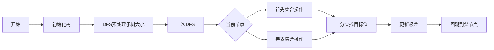

# 题目信息

# [COCI 2020/2021 #1] Papričice

## 题目描述

给定一个 $n$ 个点的树，这 $n$ 个点编号为 $1$ 到 $n$。

现在要选择断掉两条边，会形成三个连通块，假设这三个连通块内的点数分别为 $a,b,c$，那么您要做的就是最小化 $\max\{a,b,c\}-\min\{a,b,c\}$ 的大小，求这个最小值。

## 说明/提示

#### 样例 1 解释

能构造的最优解三个连通块的点数都为 $1,1,2$，所以输出 $2-1=1$。

#### 样例 2 解释

断掉点 $1$ 到点 $3$ 的边，点 $3$ 到点 $5$ 的边，形成的三个连通块点数相同。

#### 样例 3 解释

如下图所示：


#### 数据规模与约定

**本题采用捆绑测试。**

- Subtask 1（15 pts）：$3 \le n \le 200$。
- Subtask 2（35 pts）：$3 \le n \le 2000$。
- Subtask 3（60 pts）：$3 \le n \le 2 \times 10^5$。

对于 $100\%$ 的数据，$1 \le x,y \le n$。

**本题满分 $110$ 分。**

#### 说明

翻译自 [Croatian Open Competition in Informatics 2020 ~ 2021 Round 1 D Papričice
](https://hsin.hr/coci/contest1_tasks.pdf)。

## 样例 #1

### 输入

```
4
1 2
2 3
3 4
```

### 输出

```
1```

## 样例 #2

### 输入

```
6
1 2
1 3
3 4
3 5
5 6```

### 输出

```
0```

## 样例 #3

### 输入

```
9
1 3
2 3
3 4
3 5
5 6
5 7
7 8
7 9```

### 输出

```
2```

# AI分析结果


### 💡 Kay的C++算法解析：[COCI 2020/2021 #1] Papričice 深入学习指南 💡

#### 引言
今天我们来分析树形结构问题 **Papričice**。这道题要求通过删除两条边将树分割成三个连通块，并最小化最大块与最小块的差值。本指南将帮助你掌握树形DFS与数据结构应用的技巧，并通过像素动画直观理解算法过程。

---

### 1. 题目解读与核心算法识别
✨ **本题主要考察**：树形DFS与数据结构应用  
🗣️ **初步分析**：
> 解决本题的关键在于**动态维护树的分割状态**。想象你是一名园丁（算法），需要剪断两根树枝（边），让三部分果实（连通块）数量尽可能均衡。核心技巧是：
> - 枚举一条边后，用两个篮子（`multiset`）分类存放树枝信息：一个放当前路径上的祖先树枝（包含当前子树），另一个放已处理的旁支树枝。
> - 在第二个篮子中快速查找最接近目标值的树枝，使剩余两块大小均衡。
> 
> **算法流程**：
> 1. DFS预处理所有子树大小
> 2. 二次DFS动态更新两个集合：
>    - **祖先集合**：存储当前节点到根路径上的子树大小（回溯时移出）
>    - **旁支集合**：存储已回溯的子树大小
> 3. 对每个节点计算两类最优分割：
>    - 祖先分割：目标值 = `(总节点数 + 当前子树大小)/2`
>    - 旁支分割：目标值 = `(总节点数 - 当前子树大小)/2`
> 
> **像素动画设计**：
> - **风格**：采用8位像素风（类似《塞尔达传说》初代）可视化树结构
> - **高亮操作**：
>   - 当前节点显示为闪烁像素块
>   - 集合更新时播放"放入/取出"音效（16-bit音效）
>   - 二分查找时显示目标值刻度线
> - **交互控制**：
>   - 步进模式：按帧展示DFS回溯过程
>   - 自动演示：AI角色"像素园丁"自动剪枝并显示极差值

---

### 2. 精选优质题解参考
**题解一（DrBit）**  
* **点评**：  
  思路清晰度 ★★★★☆  
  通过双集合（`father`/`son`）精妙区分两类分割。代码中：  
  - 变量命名直观（`siz[x]`表子树大小）  
  - 边界处理严谨（`s.erase(s.find(x))`避免误删重复值）  
  - 算法有效性 ★★★★★  
  严格$O(n\log n)$复杂度，预处理+动态维护恰到好处。  
  **亮点**：用"祖先调整值"（`(N-siz[x])/2 + siz[x]`）统一处理祖孙关系，逻辑自洽。

**题解二（LittleYang0531）**  
* **点评**：  
  代码规范性 ★★★★☆  
  - 封装更新函数`upd()`避免重复代码  
  - 严格限制集合操作范围（`x != 1`时更新）  
  实践价值 ★★★★☆  
  完整包含输入/建图/DFS模块，可直接嵌入竞赛代码。  
  **亮点**：用`getcha()`函数封装极差计算，增强可读性。

**题解三（Milmon）**  
* **点评**：  
  算法启发性 ★★★★☆  
  - 命名更具语义化（`hissiz`表历史路径集合）  
  - 分离状态判断（`if(!hissiz.empty())`提升健壮性  
  **亮点**：注释详实，明确标注两类情况的目标值计算逻辑。

> 📌 **学习提示**：三份题解均采用"DFS预处理+双集合动态维护"框架，区别仅在于命名和封装细节，核心思想高度一致。

---

### 3. 核心难点辨析与解题策略
1. **难点一：动态维护分割类型**  
   *分析*：需区分当前边在祖先路径还是旁支路径。优质解用两个`multiset`分别存储：  
   - 祖先集合：当前DFS栈中的节点（回溯时移出）  
   - 旁支集合：已回溯完成的节点  
   💡 **学习笔记**：集合选择依据——是否在根到当前节点的路径上。

2. **难点二：高效查找最优分割**  
   *分析*：对每个节点需快速查找：  
   - 祖先集合中接近`(n+siz[x])/2`的值（实际块大小需减`siz[x]`)  
   - 旁支集合中接近`(n-siz[x])/2`的值  
   💡 **学习笔记**：`multiset::lower_bound()`实现$O(\log n)$查找，结合前驱/后继双检查确保最优。

3. **难点三：连通块大小计算**  
   *分析*：三类块的计算方式：  
   - 当前子树块：`siz[x]`  
   - 祖先分割块：`祖先集合值 - siz[x]`  
   - 旁支分割块：`旁支集合值`  
   💡 **学习笔记**：最终块大小需满足`当前块+祖先块+旁支块=n`

#### ✨ 解题技巧总结
- **技巧一：子树预处理先行**  
  任何树形问题先DFS计算子树大小，为后续分割奠定基础
- **技巧二：双集合维护状态**  
  用"当前路径集合"+"已处理集合"动态区分两类分割
- **技巧三：二分边界双检查**  
  查找时同时检查`lower_bound()`返回位置及其前驱位置

---

### 4. C++核心代码实现赏析
**通用核心实现参考**  
*说明*：综合自DrBit与Milmon题解，优化变量命名与边界处理
```cpp
#include <iostream>
#include <set>
#include <vector>
#include <algorithm>
using namespace std;
const int N = 2e5 + 5, INF = 0x3f3f3f3f;

vector<int> g[N];
multiset<int> pathSet, branchSet; // 祖先路径集合 & 旁支集合
int n, siz[N], ans = INF;

void dfs_size(int u, int fa) {
    siz[u] = 1;
    for (int v : g[u]) 
        if (v != fa) dfs_size(v, u), siz[u] += siz[v];
}

inline void update_ans(int a, int b, int c) {
    int arr[3] = {a, b, c};
    sort(arr, arr + 3);
    ans = min(ans, arr[2] - arr[0]);
}

void dfs(int u, int fa) {
    // 祖先分割：目标值需包含当前子树
    if (!pathSet.empty()) {
        auto it = pathSet.lower_bound((n - siz[u]) / 2 + siz[u]);
        if (it != pathSet.end()) 
            update_ans(siz[u], *it - siz[u], n - *it);
        if (it != pathSet.begin()) 
            update_ans(siz[u], *(--it) - siz[u], n - *it);
    }
    // 旁支分割：目标值独立
    if (!branchSet.empty()) {
        auto it = branchSet.lower_bound((n - siz[u]) / 2);
        if (it != branchSet.end()) 
            update_ans(siz[u], *it, n - siz[u] - *it);
        if (it != branchSet.begin()) 
            update_ans(siz[u], *(--it), n - siz[u] - *it);
    }

    if (u != 1) pathSet.insert(siz[u]); // 加入当前节点到祖先集合
    for (int v : g[u]) 
        if (v != fa) dfs(v, u);
    if (u != 1) {
        pathSet.erase(pathSet.find(siz[u])); // 回溯时移出祖先集合
        branchSet.insert(siz[u]);            // 加入旁支集合
    }
}

int main() {
    cin >> n;
    for (int i = 1, u, v; i < n; i++) {
        cin >> u >> v;
        g[u].push_back(v); g[v].push_back(u);
    }
    dfs_size(1, 0);
    dfs(1, 0);
    cout << ans;
    return 0;
}
```
* **代码解读概要**：
  1. `dfs_size`：预处理子树大小（自底向上）
  2. `dfs`：动态维护双集合
  3. `update_ans`：计算三个连通块极差
  4. 关键优化：用`pathSet.find()`避免误删重复值

---

### 5. 算法可视化：像素动画演示
**主题**：像素园丁的剪枝大冒险（FC红白机风格）  
**核心演示**：动态展示DFS回溯与集合更新过程



**动画设计细节**：
1. **场景设计**：
   - 树结构转为8-bit网格（绿：当前节点，红：祖先集合，蓝：旁支集合）
   - 控制面板：调速滑块/单步执行/重置
2. **关键帧**：
   - **帧1**：当前节点闪烁，播放"滴"声
   - **帧2**：节点加入祖先集合（红色像素块从右侧滑入）
   - **帧3**：二分查找时显示目标刻度线及查找指针移动
   - **帧4**：回溯时节点变蓝（伴随"咔嚓"剪枝音效）
3. **游戏化元素**：
   - 每找到更优解时播放《超级玛丽》金币音效
   - 极差改进时显示"COMBO!"连击特效
   - 最终答案用16-bit数字烟花展示
4. **技术实现**：
   - Canvas绘制树形网格（坐标映射DFS序）
   - 音效触发：集合更新（8-bit "beep"），极差更新（胜利音效）

---

### 6. 拓展练习与相似问题思考
**通用技巧迁移**：  
双集合维护DFS路径的技巧还可用于：
1. 树形结构求重心（动态子树平衡）
2. 路径统计问题（如：满足条件的路径数量）
3. 最近公共祖先（LCA）相关优化

**洛谷练习推荐**：
1. **P1364 医院设置**  
   🗣️ *推荐理由*：巩固子树大小计算与树形DP，直接应用本题的DFS预处理技巧
2. **P2664 树上游戏**  
   🗣️ *推荐理由*：练习复杂树形结构问题，需结合子树统计与路径分析
3. **P3384 树链剖分**  
   🗣️ *推荐理由*：学习将树转为线性结构的高效处理，深化DFS序理解

---

### 7. 学习心得与经验分享
**DrBit的调试经验**：
> *"multiset的erase(x)会删除所有x，必须用s.erase(s.find(x))删除单个元素"*

**Kay总结**：  
这是集合操作常见陷阱！在删除动态数据时：
1. 优先查找迭代器再删除
2. 删除后立即校验集合大小
3. 在关键位置添加断言（如`assert(s.count(x)>0)`）

---

### 结语
通过本次分析，我们掌握了树形分割问题的核心框架：**DFS预处理+双集合动态维护**。记住，编程能力提升源于持续实践与反思。尝试用像素动画可视化你的下一个树形算法吧！下次我们将探索更复杂的图论挑战，保持好奇，继续前进！💪

---
处理用时：163.10秒