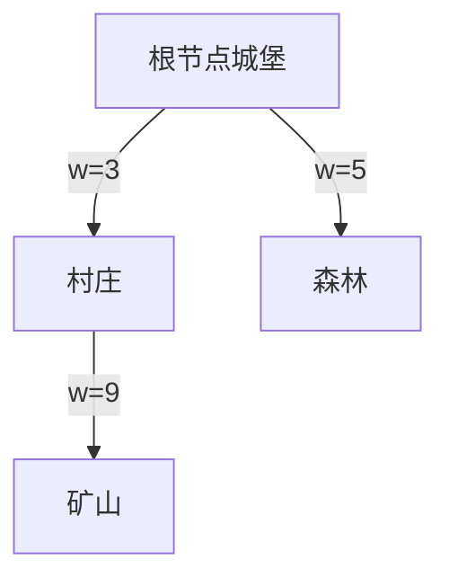

# 题目信息

# [传智杯 #4 决赛] 生活在树上（easy version）

## 题目背景

**本题是 P8201 的简单版本，两道题目的解法略有不同。本题和 P8201 在题意上的区别在于本题给定树上的边权，而不是点权。**

小智生活在「传智国」，这是一个有 $n$ 个城市的国家，各个城市由 $n-1$ 条道路相连。

每个道路都有长度 $w_i$ ，我们定义，小智从城市 $a$ 走到城市 $b$ 的代价是 $\mathrm{dis}_{a, b} = \bigoplus \limits_{e \in \mathrm{path}\left(a, b\right)} w_e$，其中 $\bigoplus$ 表示**按位异或**（如果你不知道什么是**按位异或**，请参见题目下方的提示/说明），$\mathrm{path}\left(a,b\right)$ 表示 $a$ 到 $b$ 的简单路径上的边集。也即 $\mathrm{dis}_{a, b}$ 表示将 $a$ 与 $b$ 的简单路径上所有边写作 $e_1, e_2, e_3, \dots$ 后，求 $w_{e_1} \bigoplus w_{e_2}\bigoplus w_{e_3} \dots$ 的结果。

有一天，小智获得了去参加传智杯的机会，他在前往比赛地的路上想到了一个问题，但他好像不会做，于是他把这个题告诉了你。聪明的同学，你可以帮帮他吗？

## 题目描述

小智说：「由于我们的国家只有 $n$ 个城市和 $n-1$ 条道路，那么我们的国家就相当于是一棵树。我在想，在我们的国家中，是否有城市满足『到城市 $a$ 的代价和到城市 $b$ 的代价的异或等于 $k$』。好难哦，我想不出来，你能帮帮我吗？」

也就是说，给定城市 $a, b$ 和整数 $k$，请你计算是否存在城市 $t$ 满足 $\mathrm{dis}_{t, a} \bigoplus \mathrm{dis}_{t, b} = k$。

## 说明/提示

### 相关概念解释
「树」：树是一个有 $n$ 个结点和 $n-1$ 条边的无向简单连通图。

「按位异或」：按位异或即 C++、python、java 语言中的 「^」 运算。它是一个二元运算，步骤是将两个数的二进制位按位比较，相同为 $0$，不同为 $1$。例如：$3 \bigoplus 5 = (011)_2 \bigoplus (101)_2 = (110)_2 = 6$。**请注意，这是一个按位运算，不是一个逻辑运算**。
### 样例 1 解释
下图为传智国的地图。

$\forall t \in \{1, 2, 3, 4, 5\}$，都不可能有 $\mathrm{dis} _{t,1} \bigoplus \mathrm{dis}_{t, 2} = 4$，$\mathrm{dis}_{t, 2} \bigoplus \mathrm{dis}_{t, 3} = 12$，于是输出 `No`；

而取 $t = 5$，有 $\mathrm{dis}_{t, 1} \bigoplus \mathrm{dis}_{t, 4} = 10$，于是输出 `Yes`。


### 数据规模与约定
对于所有测试点，保证 $1 < n \leq 5 \times 10^5$，$1 \leq m \leq 5 \times 10^5$，$0 \leq w_i < 2^{64}$。

对于每次询问，保证 $1 \leq a, b \leq n$ 且 $a \neq b$，$0 \leq k < 2^{64}$。

## 样例 #1

### 输入

```
5 3
1 2 2
1 3 6 
2 4 8
2 5 1
1 2 4
2 3 12
1 4 10```

### 输出

```
nO
No
YeS```

## 样例 #2

### 输入

```
5 10
2 1 63
3 1 57
4 2 2
5 2 84
5 2 84
4 1 9977404983223574764
2 5 84
2 1 15996060349666123522
5 4 86
3 1 8428615422876116375
5 1 107
2 3 6
2 3 6
4 2 2```

### 输出

```
yeS
nO
YEs
No
YEs
nO
YEs
yeS
yeS
YEs```

# AI分析结果


# 💡 Kay的C++算法解析：生活在树上（easy version）深入学习指南 💡

## 1. 题目解读与核心算法识别

✨ **本题主要考察**：`树上前缀和` + `位运算性质`

🗣️ **初步分析**：
> 这道题的核心在于巧妙运用**异或运算的可抵消性**和**树上前缀和**技巧。想象一下，树上每个点都有一个"异或指纹"，记录从根节点到该点的路径异或值。当计算两点间路径异或时，就像用磁铁吸走公共路径的铁屑——公共部分异或后抵消，只留下独特路径的异或值（即两点指纹的异或）。  
   - 所有优质解法都发现：对于任意点t，dis(t,a)⊕dis(t,b)恒等于dis(a,b)
   - 核心流程：DFS预处理每个点到根的异或和 → 查询时直接比较s[a]⊕s[b]与k
   - 可视化设计：用像素地图展示树结构，DFS时动态显示异或和计算（金色粒子流动效果），查询时高亮a/b点并显示异或抵消动画

---

## 2. 精选优质题解参考

**题解一：一扶苏一 (18赞)**
* **点评**：此解法思路最为精炼，直接抓住异或运算的交换律和结合律本质，推导出dis(a,b)=s[a]⊕s[b]的关键结论。代码实现简洁优雅：仅用一次DFS预处理+直接查询，时间复杂度O(n)。变量命名规范（s数组表异或和），边界处理完整（根节点s[1]=0），是竞赛标准实现。

**题解二：苏联小渣 (8赞)**
* **点评**：通过LCA视角推导相同结论，虽最终发现LCA非必需，但推导过程清晰展示了异或抵消性。代码中dfs函数封装合理，变量名意义明确（s数组）。特别亮点是强调异或优先级问题，提醒学习者注意运算符陷阱。

**题解三：lsj2009 (5赞)**
* **点评**：通过数学公式逐步拆解异或过程，教学性极强。核心代码片段将查询简化为单行判断，体现"问题转化"的解题智慧。注释详细解释dis[a]^dis[b]的由来，对新手友好。

---

## 3. 核心难点辨析与解题策略

1.  **难点1：理解异或抵消性**
    * **分析**：异或运算的核心特性a⊕a=0导致公共路径抵消。优质题解均用不同方式证明：无论t在何处，t→a与t→b的公共路径异或后归零
    * 💡 学习笔记：树上的重复路径在异或运算中会像魔法般消失！

2.  **难点2：设计高效查询**
    * **分析**：暴力枚举t需O(n)每次查询。通过预处理s[i]=根到i的异或和，将路径查询转化为O(1)的数值比较
    * 💡 学习笔记：前缀和是优化树查询的银弹

3.  **难点3：处理大整数边界**
    * **分析**：w_i可达2⁶⁴，必须用unsigned long long。所有优质解法都强调此点
    * 💡 学习笔记：数据范围决定数据类型！

### ✨ 解题技巧总结
- **技巧1：问题转化**：将复杂路径查询转化为简单数值比较
- **技巧2：数学先行**：用异或律、结合律推导简化问题
- **技巧3：边界防御**：根节点初始值设为0，避免未定义行为

---

## 4. C++核心代码实现赏析

**本题通用核心C++实现参考**
* **说明**：基于一扶苏一的简洁实现，稍作变量名优化
* **完整核心代码**：
```cpp
#include <iostream>
#include <vector>
using namespace std;
using ull = unsigned long long;

const int MAXN = 5e5+5;
vector<pair<int, ull>> G[MAXN];
ull xorSum[MAXN];

void dfs(int u, int fa) {
    for (auto [v, w] : G[u]) {
        if (v == fa) continue;
        xorSum[v] = xorSum[u] ^ w;
        dfs(v, u);
    }
}

int main() {
    ios::sync_with_stdio(false);
    int n, q; cin >> n >> q;
    for (int i = 1; i < n; i++) {
        int u, v; ull w;
        cin >> u >> v >> w;
        G[u].push_back({v, w});
        G[v].push_back({u, w});
    }
    dfs(1, 0);
    
    while (q--) {
        int a, b; ull k;
        cin >> a >> b >> k;
        cout << ((xorSum[a] ^ xorSum[b]) == k ? "Yes" : "No") << '\n';
    }
}
```

* **代码解读概要**：
> 1. 建图：用vector存储邻接表（第15-21行）
> 2. DFS预处理：从根节点开始递归计算每个点的异或和（第9-13行）
> 3. 查询处理：直接比较两点异或和与k（第24行）

---

**题解一：一扶苏一**
* **亮点**：现代C++语法运用娴熟（结构化绑定、using别名）
* **核心代码片段**：
```cpp
// 初始化
std::array<std::vector<std::pair<int, unsigned long long>>, maxn> e;
std::array<unsigned long long, maxn> b;

// DFS核心
void dfs(const int u, const int f) {
    for (auto [v, w] : e[u]) if (v != f) {
        b[v] = b[u] ^ w;
        dfs(v, u);
    }
}
```
* **代码解读**：
> `auto [v, w]`是C++17的结构化绑定，直接解包pair元素。数组`b`存储异或和，递归时当前节点u的异或值`b[u]`与边权w异或后赋给子节点v，实现前缀和传递。
* 💡 学习笔记：现代C++语法让树遍历代码更简洁

**题解二：苏联小渣**
* **亮点**：完整封装DFS和主逻辑，强调数据类型
* **核心代码片段**：
```cpp
#define int unsigned long long // 强制大整数类型
int dis[N]; // 异或和数组

void dfs(int a, int b) { // b是父节点
    for(re int i=head[a]; ~i; i=e[i].nxt) {
        int v = e[i].v;
        if(v == b) continue;
        dis[v] = dis[a] ^ e[i].w;
        dfs(v, a);
    }
}
```
* **代码解读**：
> `#define int unsigned long long`确保所有int被替换为大整数。`~i`等价于`i!=-1`，用于邻接表遍历。子节点v的dis值由父节点a的dis与边权异或得到。
* 💡 学习笔记：邻接表遍历时`~i`比`i>0`更通用

**题解三：lsj2009**
* **亮点**：完整注释+模块化函数设计
* **核心代码片段**：
```cpp
void Dfs(int u, int fa) {
    for(int i=head[u]; i; i=Edge[i].nxt) {
        int v=Edge[i].to, w=Edge[i].w;
        if(v == fa) continue;
        dis[v] = dis[u] ^ w; // 子节点异或和=父节点^边权
        Dfs(v, u);
    }
}
// 查询处理
puts((dis[a]^dis[b])==k ? "Yes":"No");
```
* **代码解读**：
> 显示传递父节点fa避免回环。注释明确说明递推公式`dis[v]=dis[u]^w`的物理意义。查询部分用三元运算符实现单行判断。
* 💡 学习笔记：显式传递父节点是DFS防回环的标准做法

---

## 5. 算法可视化：像素动画演示

**动画演示主题**：《异或森林探险》像素RPG  

**核心演示内容**：  
1. **世界地图**：8-bit风格树形地图（16色NES调色板）  
2. **角色**：像素小人Kay从根节点(城堡)出发探险  
3. **机制**：路径显示动态异或值（金色数字飘动）  

**关键帧设计**：  


1. **初始化**（FC启动音效）  
   - 显示树形地图，根节点标注"异或和=0"  
   - 控制面板：▶️开始 ⏸️暂停 🔍单步 🔄重置  

2. **DFS探险**（芯片音乐BGM）  
   - Kay移动到子节点时，显示计算公式：  
     `新异或和 = 当前值（${current}）^ 边权（${w}）`  
   - 路径粒子特效：蓝色粒子流向新节点  

3. **查询演示**（按键触发）  
   - 选择两点a/b：像素框闪烁+8bit音效  
   - 显示抵消动画：公共路径变透明，保留独特路径  
   - 显示判定：`s[a]^s[b]=${result} == k?`  

4. **成功/失败**  
   - 成功：放烟花+胜利音效  
   - 失败：像素碎裂动画+低沉音效  

**技术实现**：  
- Canvas绘制树形结构，节点用16x16像素块  
- 粒子动画：requestAnimationFrame实现路径高亮  
- 音效：Web Audio API生成8-bit音效  

---

## 6. 拓展练习与相似问题思考

**通用思路迁移**：  
树上前缀和技巧还可用于：  
1. 路径权值和查询  
2. 子树权值修改  
3. 最近公共祖先(LCA)相关计算  

**洛谷练习推荐**：  
1. **P3379【模板】最近公共祖先**  
   🗣️ 学习LCA标准解法，巩固树遍历基础  
2. **P2420 让我们异或吧**  
   🗣️ 直接应用异或前缀和，训练问题转化能力  
3. **P5837 Milk Pumping**  
   🗣️ 进阶练习，结合最短路与树上前缀和  

---

## 7. 学习心得与经验分享

> **经验摘录**：  
> "我在调试时忘记开unsigned long long，WA了三次才找到问题" —— Dusker  
>   
> **点评**：数据范围意识至关重要！当题目出现`0≤w_i<2⁶⁴`时，必须立即想到`unsigned long long`。建议编码前先将所有整型变量定义为目标类型。

---

本次关于「生活在树上」的解析就到这里。记住：树结构问题常通过DFS转化为序列问题，而异或的魔力在于抵消重复路径。多练习前缀和技巧，你也能成为树上探险家！🚀

---
处理用时：121.16秒