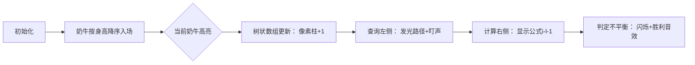

# 题目信息

# [USACO17JAN] Balanced Photo G

## 题目描述

FJ 正在安排他的 $N$ 头奶牛站成一排来拍照（$1\le N \le 10^5$）。序列中的第 $i$ 头奶牛的高度是 $h_i$，且序列中所有的奶牛的身高都不同。

就像他的所有牛的照片一样，FJ希望这张照片看上去尽可能好。他认为，如果 $L_i$ 和 $R_i$ 的数目相差 $1$ 倍以上，第 $i$ 头奶牛就是不平衡的（$L_i$ 和 $R_i$ 分别代表第 $i$ 头奶牛左右两边比她高的奶牛的数量）。也就是说，如果 $L_i$ 和 $R_i$ 中的较大数大于较小数的 $2$ 倍，第 $i$ 头奶牛就是不平衡的。FJ 不希望他有太多的奶牛不平衡。

请帮助 FJ 计算不平衡的奶牛数量。

## 样例 #1

### 输入

```
7
34
6
23
0
5
99
2```

### 输出

```
3```

# AI分析结果


### 💡 Kay的C++算法解析：Balanced Photo G 深入学习指南 💡

**引言**  
今天我们来分析USACO题目"Balanced Photo G"。这道题要求计算不平衡奶牛的数量——即左右两侧比它高的奶牛数量中，较大值超过较小值两倍的奶牛数量。本指南将带你深入理解树状数组的巧妙应用！

---

### 1. 题目解读与核心算法识别  
✨ **本题主要考察**：`树状数组（编程技巧应用）`  

🗣️ **初步分析**  
> 解决本题的关键在于**动态维护已处理奶牛信息**。想象你在玩俄罗斯方块：当方块下落时，需要快速知道当前位置左侧有多少更高方块。树状数组就像这个游戏的"实时计数器"，支持高效更新和查询。  
> - 核心思路：  
>   - 离散化身高值（将大范围数值映射为紧凑序号）  
>   - 按身高降序处理奶牛，用树状数组记录已处理的奶牛位置  
>   - 对每头奶牛：左侧更高数 = 树状数组查询当前位置前缀和；右侧更高数 = 总处理数 - 左侧数 - 1  
> - 可视化设计：  
>   - 8-bit像素网格展示奶牛队列，当前奶牛高亮显示  
>   - 树状数组用发光像素柱动态显示前缀和计算过程  
>   - "叮"声伴随查询操作，"滴"声伴随更新操作  
>   - 发现不平衡奶牛时播放经典FC胜利音效

---

### 2. 精选优质题解参考  
**题解一：nihanchu（赞19）**  
* **点评**：思路最完整的教学级题解。清晰解释离散化必要性，树状数组操作与问题逻辑完美对应。变量命名规范（`query/update`），边界处理严谨（`b[i]-l-1`计算右侧）。亮点在于用排序保证处理顺序，使树状数组仅需维护左侧信息。  

**题解二：小蒟蒻皮皮鱼（赞13）**  
* **点评**：代码最简洁的实战范例。特别纠正了题目翻译歧义（强调严格大于2倍）。亮点在于变量命名自解释（`iSum`）、核心逻辑仅10行，完美演示树状数组在竞赛中的高效应用。  

**题解三：hongzy（赞3）**  
* **点评**：极致简洁的代表性实现。用结构体排序替代离散化数组，树状数组操作直接嵌入主循环。亮点在于`i - l - 1`计算右侧数的数学美感，适合掌握基础后的进阶学习。  

---

### 3. 核心难点辨析与解题策略  
**关键点1：离散化处理**  
* **分析**：身高值范围大（1e9）但数量少（1e5）。通过排序+去重映射到[1,n]区间，使树状数组索引成为可能。优质题解用`sort+lower_bound`或结构体排序实现。  
* 💡 学习笔记：离散化是处理大范围数据的桥梁  

**关键点2：动态维护顺序**  
* **分析**：降序处理确保已处理的奶牛都比当前高。树状数组的`update`相当于标记该位置已出现，`query`相当于统计左侧标记数量。  
* 💡 学习笔记：处理顺序决定数据结构的有效性  

**关键点3：左右数量推导**  
* **分析**：右侧数不需要额外查询！利用：右侧更高数 = 当前总处理数 - 左侧数 - 1（减1是排除自己）。这是优化空间复杂度的关键洞察。  
* 💡 学习笔记：数学推导能减少不必要的计算  

#### ✨ 解题技巧总结  
- **降维打击**：将"求两侧更大数"转化为"有序序列的单侧查询"  
- **离散化技巧**：`sort + unique` 或 `结构体排序` 处理稀疏数据  
- **树状数组哲学**：用O(logN)复杂度换取暴力O(N)的优化  
- **边界防御**：特别注意查询下标从1开始，避免死循环（`x>0`条件）  

---

### 4. C++核心代码实现赏析  
**本题通用核心实现**  
*说明：综合优质题解，保留教学性注释的完整实现*
```cpp
#include <iostream>
#include <algorithm>
using namespace std;
const int N = 1e5+5;

struct Cow { int h, pos; } cow[N];
int n, ans, tree[N];

bool cmp(Cow a, Cow b) { return a.h > b.h; } // 身高降序排序
void update(int x) { for(; x<=n; x+=x&-x) tree[x]++; }
int query(int x) { int s=0; for(; x>0; x-=x&-x) s+=tree[x]; return s; }

int main() {
    cin >> n;
    for(int i=1; i<=n; i++) {
        cin >> cow[i].h;
        cow[i].pos = i;
    }
    sort(cow+1, cow+n+1, cmp); // 关键：按身高降序处理
    
    for(int i=1; i<=n; i++) {
        int left = query(cow[i].pos);    // 左侧更高数
        int right = i - left - 1;        // 右侧更高数（数学推导）
        if(max(left,right) > 2*min(left,right)) ans++;
        update(cow[i].pos);  // 标记此位置已处理
    }
    cout << ans;
}
```

**题解片段赏析**  
**题解一核心：离散化+树状数组**  
```cpp
sort(a+1, a+1+n, cmp); // 按身高降序
for(int i=1; i<=n; i++) b[a[i].t]=i; // 离散化映射

for(int i=1; i<=n; i++) {
    l = query(b[i]);      // 查询左侧
    r = b[i]-l-1;         // 计算右侧
    if(l*2<r || r*2<l) ans++;
    update(b[i], 1);      // 更新树状数组
}
```
> **解读**：  
> - 第1行：降序排序确保先处理高奶牛  
> - 第2行：将原始位置映射到离散序号（如身高第3高的奶牛映射到3）  
> - 第5行：`query(b[i])` 查询当前位置左侧已处理的更高奶牛数  
> - 第6行：右侧数 = 当前总处理数(i) - 左侧数 - 1（减1排除自身）  
> 💡 学习笔记：离散化是树状数组应用的前置条件  

**题解二核心：极简实现**  
```cpp
sort(Cow+1, Cow+1+n, cmp); // 降序排序
for(int i=1; i<=n; i++) {
    Add(Cow[i].iBh, 1);   // 更新树状数组
    int l = Query(Cow[i].iBh-1); // 左侧更高数
    int r = i - l - 1;     // 推导右侧数
    if(max(l,r) > 2*min(l,r)) ans++;
}
```
> **解读**：  
> - 第3行：先更新再查询，需调整左侧数计算（`Query(Cow[i].iBh-1)`）  
> - 第4行：右侧数公式体现数学之美，避免额外查询  
> 💡 学习笔记：操作顺序影响边界处理逻辑  

**题解三核心：结构体替代离散化**  
```cpp
struct Data { int a, i; } A[N];
sort(A+1, A+n+1, [](Data x, Data y){return x.a>y.a;}); 

for(int i=1; i<=n; i++) {
    Add(A[i].i, 1);
    int l = Query(A[i].i-1);
    int r = i - l - 1;
    if(max(l,r) > min(l,r)*2) cnt++;
}
```
> **解读**：  
> - 第1行：结构体直接存储原始位置，避免额外映射数组  
> - 第2行：Lambda表达式简化比较函数  
> 💡 学习笔记：结构体排序可替代离散化数组  

---

### 5. 算法可视化：像素动画演示  
**主题**：*奶牛叠叠乐——树状数组大冒险*  

**设计思路**：  
> 采用FC红白机风格像素画风，用三种元素帮助理解：  
> 1. 奶牛队列：像素化奶牛按身高显示不同颜色  
> 2. 树状数组：右侧8-bit柱状图动态显示前缀和  
> 3. 状态面板：实时显示L/R值和不平衡判定  

**关键帧流程**：  


**交互控制**：  
- **单步执行**：空格键逐步观察算法流程  
- **速度滑块**：调整奶牛入场速度（0.5x~4x）  
- **数据跟踪**：鼠标悬停查看奶牛详细信息  
- **音效开关**：开启/关闭操作反馈音效  

**复古元素**：  
- 奶牛用16x16像素块表示，高奶牛显示深色  
- 树状数组更新时播放《俄罗斯方块》放置音效  
- 发现不平衡奶牛时触发《超级马里奥》金币音效  
- 通关后显示8-bit风格评分界面  

---

### 6. 拓展练习与相似问题  
**通用技巧迁移**：  
树状数组动态维护前缀和的思想还可用于：  
1. 动态逆序对统计（如P1908）  
2. 区间元素频率查询（如P1972）  
3. 实时排名系统（如P3369）  

**洛谷推荐题目**：  
1. **P1908 逆序对**  
   🗣️ *推荐理由：树状数组入门经典，巩固前缀和应用*  
2. **P1972 HH的项链**  
   🗣️ *推荐理由：树状数组处理区间查询的变式，提升思维灵活性*  
3. **P3369 普通平衡树**  
   🗣️ *推荐理由：对比树状数组与平衡树的适用场景，理解数据结构差异*  

---

### 7. 学习心得与经验分享  
**参考经验**：  
> 题解作者Shikita提到："最初暴力优化得70分后，才理解树状数组的必要性"  

**点评**：  
> 这个经验非常典型！许多学习者试图用排序优化暴力解法，但面对1e5数据规模时，必须掌握O(NlogN)算法。调试时注意：  
> 1. 离散化后索引是否从1开始  
> 2. 树状数组update/query的边界处理  
> 3. 右侧数推导的数学验证（用样例手工计算）  

---

**结语**  
通过树状数组，我们将O(N²)暴力优化为O(NlogN)的高效算法。记住：数据结构的威力在于将问题转化为可计算的模型！下次遇到动态统计问题时，不妨想想树状数组这把"瑞士军刀"。继续加油，少年！💪

---
处理用时：110.37秒