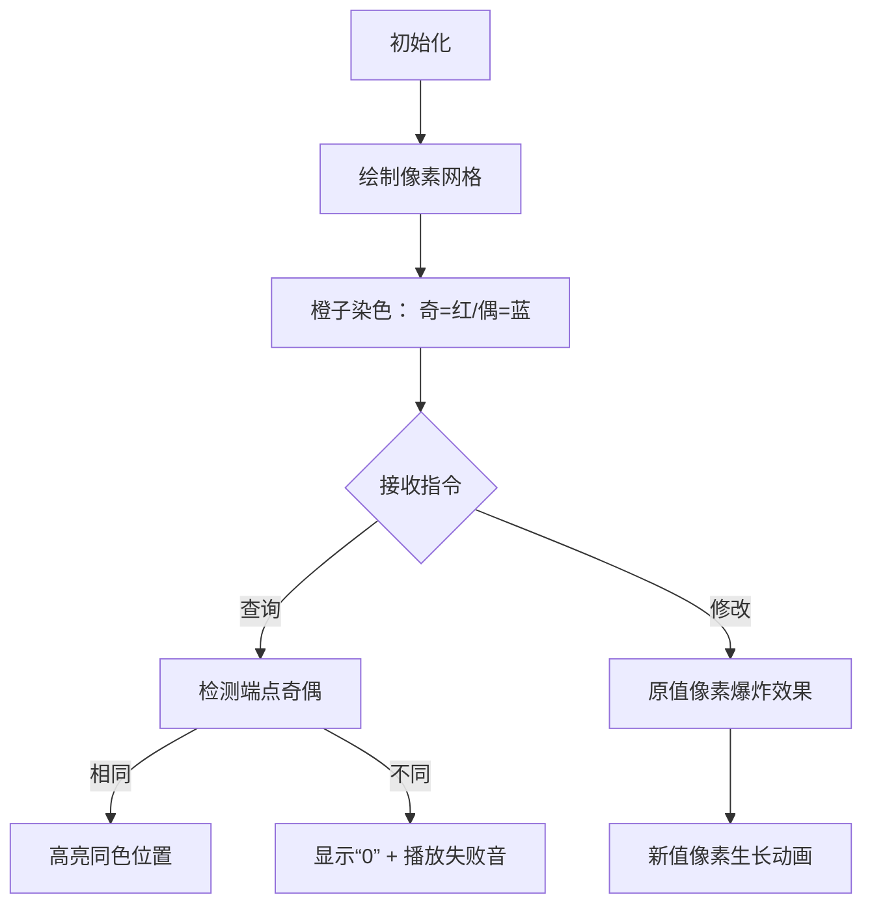

# 题目信息

# [eJOI 2019] 异或橙子

## 题目描述

Janez 喜欢橙子！他制造了一个橙子扫描仪，但是这个扫描仪对于扫描的每个橙子的图像只能输出一个  $32$ 位整数。

他一共扫描了 $n$ 个橙子，但有时他也会重新扫描一个橙子，导致这个橙子的 $32$ 位整数发生更新。

Janez 想要分析这些橙子，他觉得异或操作非常有趣，他每次选取一个区间从 $l$  至 $u$，他想要得到这个区间内所有子区间的异或和的异或和。

例如 $l=2,u=4$ 的情况，记橙子序列 $A$ 中第 $i$ 个橙子的整数是 $a_i$，那么他要求的就是：

$$a_2 \oplus a_3 \oplus a_4 \oplus (a_2\oplus a_3)\oplus(a_3\oplus a_4)\oplus(a_2\oplus a_3 \oplus a_4)$$

-------------------------------------

注：式子中的 $\oplus$ 代表按位异或运算。异或的运算规则如下。

对于两个数的第 $i$ 位，记为 $x,y$，那么：

|$x$|$y$|$x\oplus y$|
| :-----------: | :-----------: | :-----------: |
|$0$|$1$|$1$|
|$1$|$0$|$1$|
|$0$|$0$|$0$|
|$1$|$1$|$0$|

例：$13\oplus 23=26$

|$13=$|$0\cdots 001101$|
| --------: | :------: |
|$23=$|$0\cdots 010111$|
|$13\oplus 23=$|$0\cdots 011010$|

## 说明/提示

#### 输入输出样例 1 解释

- 最初，$A=[1,2,3]$，询问结果为 $1\oplus 2\oplus 3\oplus(1\oplus 2)\oplus (2\oplus 3)\oplus(1\oplus 2\oplus 3)=2$

- 修改后，第一个位置被修改为 $3$ ，询问的结果是 $3\oplus 2\oplus 3\oplus(3\oplus 2)\oplus (2\oplus 3)\oplus(3\oplus 2\oplus 3)=0$。

----------------------------

#### 数据规模与约定：

**本题采用多测试点捆绑测试，共有 5 个子任务**。

- Subtask 1(12 points)：$1\le n,q\le 10^2$，无特殊限制
- Subtask 2(18 points)：$1\le n,q\le 5\times 10^2$，且没有修改操作。
- Subtask 3(25 points)：$1\le n,q\le 5\times 10^3$，无特殊限制
- Subtask 4(20 points)：$1\le n,q\le 2\times 10^5$，且没有修改操作。
- Subtask 5(25 points)：$1\le n,q\le 2\times 10^5$，无特殊限制

对于所有数据，$0\le a_i\le 10^9,1\le n,q\le 2\times 10^5$

--------------------------

#### 说明

原题来自：[eJOI2019](http://ejoi2019.si/) Problem A. [XORanges](https://www.ejoi2019.si/static/media/uploads/tasks/xoranges-isc(1).pdf)

题面&数据来自：[LibreOJ](https://loj.ac/problem/3195)

## 样例 #1

### 输入

```
3 3
1 2 3
2 1 3
1 1 3
2 1 3```

### 输出

```
2
0```

## 样例 #2

### 输入

```
5 6
1 2 3 4 5
2 1 3
1 1 3
2 1 5
2 4 4
1 1 1
2 4 4```

### 输出

```
2
5
4
4```

# AI分析结果


# 💡 Kay的C++算法解析：eJOI 2019 异或橙子 深入学习指南 💡

> "编程就像剥橙子，看似复杂的结构下藏着简洁的几何美。" —— Kay

## 1. 题目解读与核心算法识别

✨ **本题主要考察**：`树状数组应用` + `位运算性质分析`

🗣️ **初步分析**：
> 这道题的核心像在玩一个"奇偶消消乐"游戏！想象每个橙子上的数字是像素块，我们需要快速计算特定区间内所有子区间异或值的叠加效果。关键突破在于发现：
> - 当区间端点奇偶性不同时，所有数字都会出现**偶数次**（像成对消失的像素块）
> - 当端点奇偶性相同时，只有与端点同奇偶性的位置会保留（像扫雷游戏里的安全格子）

**可视化设计思路**：
- 在8位像素网格中，用不同颜色区分奇/偶位置橙子
- 查询时高亮有效位置（同奇偶性），播放"叮"的音效表示保留
- 修改时显示像素块数值变化动画，配以"唰"的音效
- 控制面板提供单步执行/调速滑块，观察树状数组更新过程

---

## 2. 精选优质题解参考

### 题解一：Lice (98赞)
* **亮点**：
  - 思路直击本质：直接利用异或性质化简问题
  - 代码极致简洁（仅24行核心逻辑）
  - 树状数组实现规范，变量命名清晰（`tree[0]`/`tree[1]`）
  - 空间效率优化到位（O(n)空间）
  - 包含关键注释说明位运算原理

### 题解二：Warriors_Cat (19赞)
* **亮点**：
  - 详细推导了位置出现次数的数学公式：f(l,r,i)=(i-l+1)(r-i+1)
  - 创新性用奇偶性分析替代复杂计算
  - 树状数组封装良好（独立结构体）
  - 包含完备的边界处理（`x-1`巧妙处理前缀和）

### 题解三：Hexarhy (12赞)
* **亮点**：
  - 明确列出异或的四条核心性质
  - 强调位运算优先级问题（实际编码常见坑点）
  - 树状数组实现包含防误操作的`const`修饰
  - 完整注释了单点修改的数学原理（a^a=0）

---

## 3. 核心难点辨析与解题策略

### 难点1：理解查询结果的化简原理
* **分析**：通过列举小规模案例（如[2,4]），发现每个位置出现的次数满足特定奇偶规律。结合异或的自反性（a^a=0），最终简化为仅需计算同奇偶位置异或值
* 💡 **学习笔记**：复杂问题往往存在对称性破缺点

### 难点2：设计高效数据结构
* **分析**：双树状数组方案比线段树更优——时间复杂度稳定O(qlogn)，空间减少50%。选择依据：
  - 树状数组：完美适配单点修改+前缀查询
  - 分离奇偶：将原问题分解为两个独立子问题
* 💡 **学习笔记**：数据结构选择决定算法效率上限

### 难点3：实现安全的单点修改
* **分析**：修改操作需先取消原值影响（`a[x]^y`），再写入新值。关键技巧：
  ```cpp
  tree[x&1].update(a[x]^y, x); // 先消除旧值影响
  a[x] = y;                    // 再更新存储值
  ```
* 💡 **学习笔记**：数据一致性是修改操作的核心

### ✨ 解题技巧总结
1. **性质优先原则**：面对复杂表达式，优先分析数学性质
2. **奇偶分离法**：按位置奇偶性分解问题可大幅简化
3. **树状数组三板斧**：
   - `lowbit`快速索引
   - 前缀查询异或和
   - 差异更新实现修改

---

## 4. C++核心代码实现赏析

### 本题通用核心C++实现
```cpp
#include <cstdio>
const int N = 2e5 + 5;

struct BIT {
    int dat[N];
    void update(int x, int p) {
        for(; p <= n; p += p & -p) 
            dat[p] ^= x;
    }
    int query(int p) {
        int res = 0;
        for(; p; p -= p & -p)
            res ^= dat[p];
        return res;
    }
} tree[2];  // tree[0]偶位置, tree[1]奇位置

int main() {
    scanf("%d%d", &n, &q);
    for (int i = 1; i <= n; ++i) {
        scanf("%d", a + i);
        tree[i & 1].update(a[i], i);
    }
    while (q--) {
        int op, x, y;
        scanf("%d%d%d", &op, &x, &y);
        if (op == 1) {
            tree[x & 1].update(a[x] ^ y, x);
            a[x] = y;
        } else {
            if ((x + y) & 1) puts("0");
            else printf("%d\n", tree[x & 1].query(y) ^ tree[x & 1].query(x - 1));
        }
    }
}
```
**代码解读概要**：
1. 双树状数组分别维护奇偶位置
2. 修改时通过`a[x]^y`抵消原值
3. 查询时先判奇偶性，再用前缀和差分

---

### 题解一：Lice
* **亮点**：极致简洁的工业级实现
* **核心代码**：
```cpp
if (opt == 1) 
    tree[x & 1].update(a[x] ^ y, x), a[x] = y;
else {
    if ((x + y) & 1) printf("0\n");
    else printf("%d\n", tree[x & 1].query(y) ^ tree[x & 1].query(x - 1));
}
```
* **代码解读**：
  > 像玩俄罗斯方块般精准！修改操作仅1行：`tree[x&1].update(a[x]^y,x)`利用异或性质完成值替换。查询时`(x+y)&1`巧妙检测端点奇偶性，避免分支语句

* 💡 **学习笔记**：位运算可实现分支逻辑的算术化

### 题解二：Warriors_Cat
* **亮点**：高可读性的OOP封装
* **核心代码**：
```cpp
struct BIT {
    int c[N];
    void change(int x, int y) {
        while (x <= n) c[x] ^= y, x += x & -x;
    }
    int query(int x) {
        int ans = 0;
        while (x) ans ^= c[x], x -= x & -x;
        return ans;
    }
};
```
* **代码解读**：
  > 将树状数组封装为独立结构体，像给游戏角色装备技能！`change()`和`query()`方法隔离实现细节，`x & -x`快速计算lowbit索引

* 💡 **学习笔记**：数据结构封装提升代码复用性

### 题解三：Hexarhy
* **亮点**：防御性编程典范
* **核心代码**：
```cpp
void modify(int pos, const int x) { // const防止意外修改
    for (; pos <= n; pos += lowbit(pos))
        tree[pos] ^= x;
}
```
* **代码解读**：
  > 添加`const`修饰保证参数安全，像游戏里的护甲！位运算操作统一用括号确保优先级，如`(x & 1)`而非`x & 1`

* 💡 **学习笔记**：const修饰符是代码安全的防护罩

---

## 5. 算法可视化：像素动画演示

### 设计主题
**"橙子消消乐"** - 融合《俄罗斯方块》的像素风格与《扫雷》的奇偶判定机制

### 核心演示流程


### 关键交互设计
1. **动态网格渲染**：
   - 8-bit风格（16色限定）
   - 奇数列：■(红) / 偶数列：●(蓝)
   - 当前操作位闪烁边框

2. **树状数组具象化**：
   ```plaintext
   奇数组: [3]—[5]—[7]  ← 链条可视化
   索引值: 1 2 3 4 5 6 7
   ```

3. **音效系统**：
   - 有效查询：8-bit "叮!" (FC游戏金币声)
   - 无效查询：短促"噗"(地雷爆炸)
   - 数值修改："唰唰"擦写音

4. **AI演示模式**：
   - 自动播放典型测试用例
   - 速度滑块控制(0.5x~5x)
   - 单步模式显示树状数组更新路径

### 技术实现
- **Canvas绘制**：网格动态生成 + 差值动画
- **状态同步**：高亮当前操作的树状数组节点
- **游戏化扩展**：每完成5次查询解锁新橙子皮肤

---

## 6. 拓展练习与相似问题

### 通用技巧迁移
双树状数组技巧适用于：
1. 奇偶分离统计问题
2. 带位置约束的区间查询
3. 需要快速更新的前缀操作

### 推荐练习 (洛谷)
1. **P1908 逆序对**  
   → 巩固树状数组基础应用
2. **P1972 [SDOI2009]HH的项链**  
   → 学习带位置约束的区间统计
3. **P3368 【模板】树状数组 2**  
   → 掌握差分树状数组技巧

---

## 7. 学习心得与经验分享

> **Warriors_Cat的调试经验**：  
> "最初在推导位置出现次数公式时，通过小规模数据模拟发现规律：当l=1,u=3时，手工计算每个位置出现次数为[3,4,3]，从而验证f(l,r,i)=(i-l+1)(r-i+1)"

> **Kay的点评**：  
> 手工模拟小数据是验证思路的黄金准则，就像游戏里先打小怪练级！建议在纸上画出3×3的案例网格，直观观察位置贡献规律

---

> 理解异或的二进制舞蹈后，你会发现数据结构的本质是创造观察问题的视角。保持好奇心，少年们！下次我们在《像素冒险》中再会！🎮

---
处理用时：109.52秒