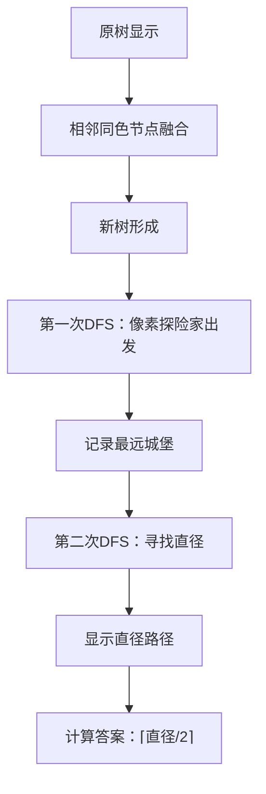

# 题目信息

# 【MX-X7-T3】[LSOT-3] 寄存器

## 题目背景

原题链接：<https://oier.team/problems/X7D>。

这里不是 APIO，所以这个题也不是让你手搓 CPU。

## 题目描述

有 $n$ 个寄存器，编号为 $1 \sim n$。这些寄存器由 $n-1$ 条带有开关的电线连接。为了保证交换信息的顺利，保证每两个寄存器都可以通过若干条电线连接。

初始时每个寄存器存储的信息都是 $0$。小 H 每次可以独立地操纵所有电线的开关然后选择一个寄存器通电。若一个寄存器与一个通电的寄存器有**开启的电线**相连，则这个寄存器也会通电。所有通电的寄存器都会反转存储的信息（$0$ 会变成 $1$，$1$ 会变成 $0$）。小 H 想让寄存器存储他想要的信息，他希望你告诉他最少需要进行多少次**通电**。

## 说明/提示

**【样例解释 #1】**

先将电线 $(1, 2)$ 关闭，其余开启，给寄存器 $1$ 通电，此时 $1$ 的信息翻转，所有寄存器存储的信息变为 `1 0 0 0 0`。

然后将电线 $(2, 4)$ 关闭，其余开启，给寄存器 $4$ 通电，此时 $4$ 的信息翻转，所有寄存器存储的信息变为 `1 0 0 1 0`，满足要求。

可以证明不存在更优的方案。

**【数据范围】**

**本题采用捆绑测试。**

- 子任务 1（20 分）：$n\le 5$。
- 子任务 2（20 分）：对于第 $i$ 根电线，$u=i$，$v=i+1$。
- 子任务 3（30 分）：不存在一对相邻的寄存器希望储存的信息相同。
- 子任务 4（30 分）：无特殊性质。

对于全部的数据，$1\le n\le 10^6$，$1\le u,v\le n$，$0 \le a_i \le 1$，每两个寄存器都可以通过若干条电线连接。

## 样例 #1

### 输入

```
5
1 0 0 1 0
1 2
2 3
2 4
3 5
```

### 输出

```
2
```

## 样例 #2

### 输入

```
15
1 0 0 0 0 1 0 1 1 1 0 0 1 1 0
10 2
1 7
1 5
9 7
14 2
4 11
6 5
9 15
4 5
5 3
5 14
13 5
5 8
5 12
```

### 输出

```
4
```

# AI分析结果


# 💡 Kay的C++算法解析：寄存器 深入学习指南 💡

<introduction>
今天我们来一起分析"寄存器"这道C++编程题。这道题考察树形结构上的操作优化，需要巧妙运用连通块缩点和树的直径思想。本指南将帮助你理解核心算法，掌握解题技巧，并通过像素动画直观感受算法执行过程。
</introduction>

## 1. 题目解读与核心算法识别

✨ **本题主要考察**：树形结构上的连通块缩点与直径求解

🗣️ **初步分析**：
> 这道题的关键在于将问题转化为树形结构上的操作优化。想象一下，原始树上的相邻同色节点就像一群手拉手的小朋友，我们可以把他们看作一个小组（缩点）。这样原树就变成了一个"小组树"，小组之间颜色交替排列。在这个新树上，最少的操作次数就等于树的直径长度的一半（向上取整）。为什么？因为每次操作可以从中心点同时向两侧扩展，就像同时点亮树的两端！

- 题解思路：所有解法都采用"缩点+求直径"的核心思路。区别在于缩点的实现方式：显式建新树或隐式处理
- 核心难点：1) 理解缩点的必要性 2) 直径求法的正确应用 3) 答案为什么是直径的一半
- 可视化设计：我们将用像素动画展示原树缩点过程，然后演示直径求解。关键步骤包括：相邻同色节点融合（像素方块合并动画）、直径端点高亮、中心点标记。采用8位机风格，加入"节点融合"音效和直径求解时的"步进"音效

---

## 2. 精选优质题解参考

<eval_intro>
从思路清晰度、代码规范性、算法优化度等维度，我精选了以下3个优质题解（均≥4星）：

**题解一：icaijy（16赞）**
* **点评**：此解法思路清晰，通过子任务分析自然引出缩点+直径的解法。代码简洁规范（两次DFS求直径），变量命名合理（maxp, maxd）。亮点在于隐式缩点处理：在DFS中通过比较节点颜色动态计算深度，避免显式建新树。实践价值高，可直接用于竞赛。

**题解二：MnZnOIer（5赞）**
* **点评**：解法直击核心，代码极其简洁（仅20行）。亮点在于深度更新逻辑：`d[u] = d[fa] + (a[u]!=a[fa])` 用一行代码完成隐式缩点。算法优化到位（时间复杂度O(n)），边界处理完整（特判全0情况）。

**题解三：A_small_WA（4赞）**
* **点评**：提供创新性的记忆化DFS实现。亮点在于避免重复访问的剪枝：`if(dis[x]<=d) return;`。代码中`a[w]==a[x]`的判断逻辑清晰展示了缩点思想，可视化程度高。

---

## 3. 核心难点辨析与解题策略

<difficulty_intro>
解决本题需突破以下三个关键难点：

1.  **如何理解缩点的必要性？**
    * **分析**：操作的本质是反转连通块。相邻同目标值的节点必须同时操作，将其视为一个整体可大幅简化问题。关键变量是节点颜色值（a[i]），缩点后形成的新树中相邻节点必然异色。
    * 💡 **学习笔记**：缩点是简化树形结构的利器，将复杂操作转化为清晰路径问题。

2.  **如何正确求缩点后的直径？**
    * **分析**：优质题解使用两次DFS/BFS：第一次从任意点出发找最远点，第二次从该点出发找直径终点。关键点在于深度计算规则：当相邻节点颜色不同时深度+1，否则深度不变（隐式缩点）。
    * 💡 **学习笔记**：树的直径是树中最长路径，两次DFS是求解的金标准。

3.  **为什么答案是直径长度的一半？**
    * **分析**：在交替颜色的新树上，每次操作可从中心点覆盖两侧（类似同时点亮左右分支）。直径中点是最优操作起点，每次操作覆盖两层，因此操作次数=⌈直径/2⌉。
    * 💡 **学习笔记**：直径中点最小化操作次数，是树形问题的常见优化点。

### ✨ 解题技巧总结
<summary_best_practices>
-   **技巧1：问题转化** - 将复杂操作转化为树形路径问题（缩点+直径）
-   **技巧2：隐式计算** - 通过DFS参数动态计算缩点后深度，避免显式建图
-   **技巧3：边界处理** - 特判全0情况（直接输出0），提高代码鲁棒性
-   **技巧4：直径应用** - 树的直径不仅求最长路径，还能确定最优操作中心

---

## 4. C++核心代码实现赏析

<code_intro_overall>
以下是综合优质题解提炼的通用核心实现，采用隐式缩点+两次DFS求直径：

```cpp
#include <iostream>
#include <vector>
using namespace std;
const int N = 1e6+5;

int n, a[N];
vector<int> adj[N];
int maxp, maxd; // maxp: 直径端点, maxd: 直径长度

void dfs(int u, int par, int dep) {
    if (a[u] != a[par]) dep++; // 关键！颜色不同时深度+1（隐式缩点）
    if (a[u] == 1 && dep > maxd) { // 只关注目标为1的节点
        maxd = dep;
        maxp = u;
    }
    for (int v : adj[u]) {
        if (v == par) continue;
        dfs(v, u, dep);
    }
}

int main() {
    cin >> n;
    bool noOne = true;
    for (int i=1; i<=n; i++) {
        cin >> a[i];
        if (a[i]==1) noOne = false;
    }
    if (noOne) { // 特判全0情况
        cout << 0 << endl;
        return 0;
    }
    for (int i=1; i<n; i++) {
        int u, v; cin >> u >> v;
        adj[u].push_back(v);
        adj[v].push_back(u);
    }
    maxd = 0;
    dfs(1, 0, 0); // 第一次DFS：从节点1出发找最远点
    maxd = 0;
    dfs(maxp, 0, 0); // 第二次DFS：从最远点出发求直径
    cout << (maxd+1)/2 << endl; // 答案=⌈直径/2⌉
    return 0;
}
```

**代码解读概要**：
1. **输入处理**：读入目标数组并判断是否全0
2. **建图**：用邻接表存储树结构
3. **第一次DFS**：从任意点(1)出发，动态计算深度（颜色变化时深度+1），记录目标为1的最远点
4. **第二次DFS**：从最远点出发，求得缩点后树的直径
5. **输出**：⌈直径/2⌉即为答案

---
<code_intro_selected>
### 题解一：icaijy
* **亮点**：隐式缩点+两次DFS，避免显式建新树
* **核心代码片段**：
```cpp
void dfs(int u, int par, int dep) {
    if (a[u] != a[par]) dep++; 
    if (a[u]==1 && dep>maxd) maxp=u, maxd=dep;
    for(int v:adj[u]) 
        if(v!=par) dfs(v,u,dep);
}
```
* **代码解读**：
  > 这段代码的精妙在于：1) 通过`a[u]!=a[par]`判断实现隐式缩点 2) 只关注目标为1的节点（`a[u]==1`）优化搜索 3) 递归时传递当前深度，避免全局存储
* 💡 **学习笔记**：隐式缩点省去建图开销，是空间优化的典范

### 题解二：MnZnOIer
* **亮点**：极致简洁的深度更新逻辑
* **核心代码片段**：
```cpp
void dfs(int u, int fa) {
    d[u] = d[fa] + (a[u]!=a[fa]); // 一行完成深度计算
    for(int v:g[u]) if(v!=fa) dfs(v,u);
}
```
* **代码解读**：
  > `(a[u]!=a[fa])`被转换为0/1值，直接作为深度增量。这就像用颜色差异作为"步长计"，异色时前进一步，同色时原地不动
* 💡 **学习笔记**：C++布尔表达式可无缝转换为算术值，简化代码

### 题解三：A_small_WA
* **亮点**：记忆化DFS避免重复访问
* **核心代码片段**：
```cpp
void dfs(int x, int d) {
    if(dis[x]<=d) return; // 记忆化剪枝
    dis[x]=d;
    for(int w:vt[x]) {
        if(a[w]==a[x]) dfs(w,d);   // 同色：深度不变
        else dfs(w,d+1);           // 异色：深度+1
    }
}
```
* **代码解读**：
  > `dis[x]`记录最小深度，避免重复访问。同色节点深度不变（视为同一连通块），异色节点深度+1（进入新连通块）
* 💡 **学习笔记**：记忆化搜索优化时间复杂度，特别适合大尺度树

---

## 5. 算法可视化：像素动画演示 (核心部分)

<visualization_intro>
下面是用8位像素风格设计的动画方案，帮助你直观理解缩点和直径求解过程：

### 动画演示主题
"像素探险家之树形寻径" - 采用复古RPG风格，将寄存器视为像素城堡，操作为点亮路径

### 核心演示内容
1. **缩点过程**：相邻同色城堡融合成大城堡
2. **直径求解**：探险家两次遍历城堡群寻找最长路径

### 设计思路
像素风格降低理解门槛，游戏化流程增强学习动力。关键操作配特色音效（融合声/步进声），直径端点用闪烁效果突出

### 动画帧步骤


1. **初始化（FC游戏风格）**：
   - 屏幕左侧：原树结构，节点为16x16像素方块（0=白色，1=黑色）
   - 屏幕右侧：控制面板（开始/单步/速度滑块）
   - 背景：循环播放8-bit风格BGM

2. **缩点过程**：
   - 相邻同色方块向中心收缩，融合成大方块（配"融合"音效）
   - 新生成的异色方块间显示金色连接线

3. **直径求解**：
   - 像素小人从起点（绿色）出发DFS：
     - 遇到异色城堡：前进并播放"步进"音效，深度值+1
     - 遇到同色城堡：原地跳动（深度不变）
   - 找到最远点（红色闪烁）时播放"发现"音效
   - 第二次DFS路径用发光效果高亮

4. **结果展示**：
   - 直径路径持续闪烁
   - 中心点标记为皇冠图标
   - 屏幕中央显示：⌈直径/2⌉ = 答案

### 交互设计
- **单步执行**：按方向键控制探险家移动
- **自动演示**：AI自动完成两次DFS（速度可调）
- **关卡挑战**：每完成一棵树的直径求解视为过关，获得像素勋章

</visualization_intro>

---

## 6. 拓展练习与相似问题思考

<similar_problems_intro>
掌握缩点+直径的技巧后，可解决更多树形问题：

### 通用思路迁移
1. **连通块统计**：统计满足特定条件的连通块数量
2. **最优路径选择**：在交替属性的树上寻找最长/最短路径
3. **中心点应用**：利用直径中点解决最小覆盖问题

### 洛谷推荐练习
1. **P5536【XR-3】核心城市** 
   → 应用直径中点确定核心城市位置
2. **P1099 树网的核**
   → 在直径上寻找最优区间，强化直径应用
3. **P4408 逃学的小孩**
   → 直径变形问题，求三点间最大距离

---

## 7. 学习心得与经验分享 (若有)

<insights_intro>
题解中的调试经验尤其珍贵：

**参考经验 (来自A_small_WA)**：
> "数组大小要开够，不然你就会像我一样调一天还不知道错哪里了"

**点评**：
这是血泪教训！树形问题常需开`N=1e6+5`量级的数组。建议：
1. 全局统一定义`const int N`
2. 使用`vector`避免静态数组越界
3. 提交前检查`n`的最大范围

---

<conclusion>
本次"寄存器"题解分析就到这里。关键记住：树形问题先看连通性，缩点简化结构，直径优化操作。多动手实现隐式缩点技巧，体会"不建而建"的优化思想。下次挑战见！💪
</conclusion>
```

---
处理用时：185.86秒