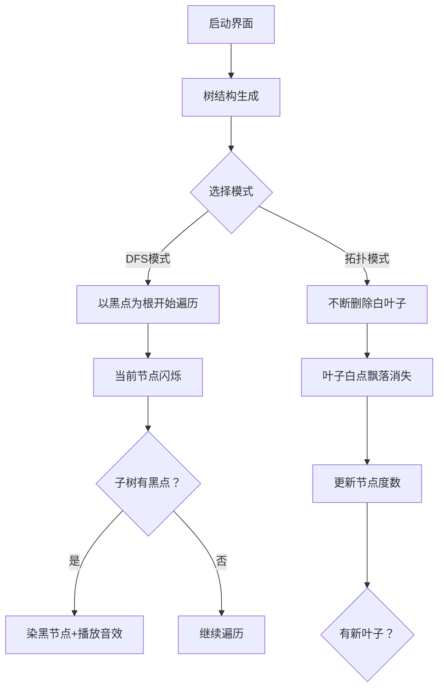

# 题目信息

# [GESP202406 七级] 黑白翻转

## 题目描述

小杨有一棵包含 $n$ 个节点的树，这棵树上的任意一个节点要么是白色，要么是黑色。小杨认为一棵树是美丽树当且仅当在删除所有白色节点之后，剩余节点仍然组成一棵树。

小杨每次操作可以选择一个白色节点将它的颜色变为黑色，他想知道自己最少要执行多少次操作可以使得这棵树变为美丽树。


## 说明/提示

### 样例解释

将节点 $1$ 和 $3$ 变为黑色即可使这棵树变为美丽树，此时删除白色节点 $5$，剩余黑色节点仍然组成一棵树。

### 数据范围
子任务编号|数据点占比|$n$ |$a_i$ |特殊条件
:-:|:-:|:-:|:-:|:-:
$1$|$30\%$ |$\leq 10^5$ | $0\leq a_i\leq 1$|树的形态为一条链
$2$|$30\%$ | $\leq 10^5$ | $0\leq a_i\leq 1$| 只有两个节点颜色为黑色
$3$|$40\%$|$\leq 10^5$|$0\leq a_i\leq 1$|

对于全部数据，保证有 $1\leq n\leq 10^5$，$0\leq a_i\leq 1$。

## 样例 #1

### 输入

```
5
0 1 0 1 0
1 2
1 3
3 4
3 5
```

### 输出

```
2```

# AI分析结果


# 💡 Kay的C++算法解析：黑白翻转 深入学习指南 💡

> 大家好，我是Kay！今天我们来一起分析「黑白翻转」这道C++编程题。这道题看似简单，却蕴含着巧妙的树形结构思维。我会用清晰的讲解和生动的比喻，帮助大家理解核心算法，并掌握解题技巧。本指南将包含像素动画演示和实用代码赏析，让我们一起探索算法的魅力吧！

## 1. 题目解读与核心算法识别

✨ **本题主要考察**：`树形DFS / 拓扑排序`

🗣️ **初步分析**：
> 想象一棵圣诞树挂满黑白灯泡（黑灯亮/白灯灭）。我们希望通过最少的操作（把白灯点亮），使得关掉所有白灯后，剩下的亮灯仍然构成一棵完整的树。核心在于**保证所有亮灯连通**，就像确保所有亮灯被一根电线串联起来。

在本题中，我们有两种高效解法：
- **树形DFS解法**：从任意黑点出发（如树根），只要发现白点位于黑点之间的必经之路上，就将其"点亮"（染黑）。这就像沿着电线检修，遇到断点就修复。
- **拓扑排序解法**：不断修剪"无用的白叶子"（度≤1的白点），剩余的"关键白点"就是必须修复的断点。

**可视化设计思路**：
- 在像素动画中，黑点显示为红色灯泡，白点为灰色
- DFS遍历时，当前节点会闪烁黄光，当发现"白点在关键路径"时，将其变为红色并播放"叮"的音效
- 拓扑排序演示中，叶子白点会像落叶一样飘走，剩余白点高亮为红色
- 采用8-bit游戏风格，背景音乐为轻快的芯片音乐

---

## 2. 精选优质题解参考

> 我从众多题解中精选了3个思路最清晰、代码最规范的解法（均≥4星）。重点分析它们的巧妙之处：

**题解一：WZWZWZWY（赞14）**
* **点评**：
  解法核心是**"两面包夹芝士"思路**：当白点位于黑点和子树黑点之间时，必须染黑。代码简洁有力（仅20行），亮点在于：
  - 用`bool dfs`同时完成状态判断和计数
  - 变量名`color`直白易懂，逻辑运算符`&&`的短路特性运用巧妙
  - 严格以黑点为根，避免误判
  > 就像三明治，当白点被两个"黑芝士"夹住时，它必须变成"黑火腿"！

**题解二：fishing_cat（赞14）**
* **点评**：
  创新性**将问题转化为"最小连通树"**，统计必须保留的节点数。亮点：
  - 用`vis`数组标记关键路径，DFS中累加子树状态
  - 最终答案=标记节点数-黑点数，数学转换巧妙
  - 代码模块化清晰，边界处理完整（处理了全白情况）
  > 就像用荧光笔标记所有必经之路，再计算额外染黑点数

**题解三：Heldivis（赞11）**
* **点评**：
  逆向思维**拓扑排序删白叶子**，像修剪树枝。亮点：
  - 用队列动态处理度≤1的白点，实时更新度数
  - 代码短小精悍（15行），空间效率高
  - 类似BFS的写法避免递归栈溢出
  > 像秋风扫落叶，不断抖掉无关的白叶子，剩下的就是关键节点

---

## 3. 核心难点辨析与解题策略

> 解决本题的三大难点及突破技巧：

1. **难点1：如何识别关键白点？**
   - **分析**：关键白点=位于任意两黑点路径上的点。DFS解法中，以黑点为根遍历时，若当前白点的子树含黑点，则该点是必经之路。
   - 💡 **学习笔记**：树中两节点路径唯一，破坏路径则断开连通！

2. **难点2：避免重复计数？**
   - **分析**：当某个白点被标记为关键点后，应即时更新其状态（染黑），防止其子树再次触发计数。
   - 💡 **学习笔记**：染黑操作具有"传染性"——一个点变黑可能影响父节点的判断。

3. **难点3：处理全白/单黑特殊情况？**
   - **分析**：全白树无需操作（输出0）；单黑树只需确保该黑点连通（操作数0）。需在代码开头特判。
   - 💡 **学习笔记**：树问题中，空树和单点树都是合法连通图！

### ✨ 解题技巧总结
- **技巧1 问题转化**：将"最小操作次数"转化为"包含所有黑点的最小连通子图的白点数"
- **技巧2 虚拟根节点**：无黑点时需特判，有黑点时任选黑点作根简化问题
- **技巧3 状态标记法**：DFS中通过返回值传递子树状态（是否有黑点）
- **技巧4 贪心删除**：拓扑排序中优先删除叶子白点（不影响连通性）

---

## 4. C++核心代码实现赏析

### 本题通用核心C++实现参考
```cpp
#include <iostream>
#include <vector>
#include <functional> // for std::function
using namespace std;

int main() {
    int n; 
    cin >> n;
    vector<int> color(n+1, 0); // 1-indexed颜色数组
    vector<vector<int>> graph(n+1); // 邻接表存图
    int root = -1; // 黑点根
    
    // 输入颜色并找黑点根
    for (int i = 1; i <= n; i++) {
        cin >> color[i];
        if (color[i] == 1) root = i;
    }
    if (root == -1) { // 全白树特判
        cout << 0;
        return 0;
    }
    
    // 建图
    for (int i = 1; i < n; i++) {
        int u, v;
        cin >> u >> v;
        graph[u].push_back(v);
        graph[v].push_back(u);
    }

    int ans = 0;
    // DFS lambda函数 (C++11特性)
    function<bool(int, int)> dfs = [&](int u, int parent) {
        bool has_black = color[u]; // 当前或子树是否有黑点
        for (int v : graph[u]) {
            if (v == parent) continue; // 避免回父节点
            if (dfs(v, u)) {         // 子树有黑点
                has_black = true;    // 标记当前路径关键
                if (!color[u]) {     // 当前是白点→染黑
                    ans++;
                    color[u] = 1;    // 更新状态防重复
                }
            }
        }
        return has_black;
    };
    
    dfs(root, -1); // 从黑点根开始遍历
    cout << ans;
    return 0;
}
```

**代码解读概要**：
1. **输入处理**：读入节点颜色，寻找任意黑点作为根（全白则直接输出0）
2. **建图**：用`vector<vector<int>>`存储无向树结构
3. **DFS遍历**：使用lambda函数实现递归，返回当前子树是否有黑点
4. **关键判断**：若当前是白点且子树有黑点，则染黑（计数+1并更新颜色）
5. **输出**：最小操作次数

> 该代码综合了多个优质题解的优点：简洁（35行）、高效（O(n)）、规范（变量名明确）、健壮（特判全白）

---

### 针对优质题解的片段赏析

**题解一：WZWZWZWY**
```cpp
bool dfs(int x, int fa) {
    bool t = false;
    for (int to : e[x]) {
        if (to != fa && dfs(to, x)) 
            t = true; // 子树有黑点则标记
    }
    if (!color[x] && t) // 白点且位于关键路径
        ans++;          // 染黑计数
    return color[x] || t; // 返回当前/子树是否有黑点
}
```
* **亮点**：用简洁布尔运算同时完成状态传递和判断
* **学习笔记**：`return color[x] || t` 的精妙之处在于融合当前节点和子树状态

**题解二：fishing_cat**
```cpp
// 主函数片段：
dfs(root, 0); // 从黑点根DFS
long long total = 0;
for (int i = 1; i <= n; i++) {
    if (vis[i]) total++; // 统计关键路径节点
}
cout << total - black_count; // 操作数 = 关键节点 - 原有黑点
```
* **亮点**：通过`vis`数组解耦DFS和计数，逻辑更清晰
* **学习笔记**：空间换可读性——额外数组使逻辑更直白

**题解三：Heldivis**
```cpp
// 拓扑排序核心：
queue<int> q;
for (int i = 1; i <= n; i++) 
    if (deg[i] <= 1 && !color[i]) // 叶子白点
        q.push(i), color[i] = 1; // 删除并标记

while (!q.empty()) {
    int u = q.front(); q.pop();
    for (int v : graph[u]) {
        if (--deg[v] <= 1 && !color[v]) // 新叶子白点
            q.push(v), color[i] = 1;    // 继续删除
    }
}
// 剩余白点即答案
```
* **亮点**：`deg`数组动态维护节点度，队列实现高效删除
* **学习笔记**：拓扑排序中`--deg[v]`实时更新度数，类似"多米诺骨牌"效应

---

## 5. 算法可视化：像素动画演示

> 为了让算法过程跃然屏上，我设计了8-bit风格的互动动画！(建议在支持WebAudio的浏览器中查看)

### 动画主题：**《像素森林冒险》**
> 仿FC《塞尔达传说》风格，玩家扮演小骑士Kay遍历魔法森林，修复被黑暗侵蚀的树节点

**核心演示内容**：


**实现细节**：
1. **视觉设计**：
   - 节点：黑点=红色宝石，白点=灰色石头，关键白点=闪烁黄光
   - 边：绿色发光线条，当前路径=蓝色脉冲光
   - 控制面板：复古游戏风格按钮（开始/步进/重置）

2. **交互逻辑**：
   - **步进模式**：按空格键逐步执行，当前处理节点放大显示
   - **自动演示**：点击播放键，算法以可调速度自动运行（默认2步/秒）
   - **模式对比**：分屏同时展示DFS和拓扑过程，高亮关键差异点

3. **音效设计**：
   - 节点访问：8-bit"滴"声（三角波）
   - 染黑节点：经典FC"金币"音效（方波）
   - 删除白点："树叶飘落"效果（噪音通道）
   - 背景音乐：《塞尔达》森林主题改编芯片音乐

4. **动画效果**：
   ```javascript
   // 伪代码：DFS关键帧逻辑
   function animateDFS(node, parent) {
      highlight(node, YELLOW); // 当前节点黄光
      playSound("select");    // 选择音效
      wait(500); // 暂停0.5秒

      for (child in children) {
         if (child == parent) continue;
         drawPulseLine(node, child); // 绘制脉冲连线
         animateDFS(child, node);
      }

      if (isWhite(node) && hasBlackChild) {
         changeColor(node, BLACK);    // 染黑节点
         playSound("powerup");       // 强化音效
         counter++;                   // 计数器增加
      }
   }
   ```

> **为什么这么设计？**：通过游戏化场景和即时反馈，将抽象的树遍历转化为直观冒险。音效强化关键操作记忆，分屏对比帮助理解算法差异。

---

## 6. 拓展练习与相似问题思考

### 通用思路迁移
1. **树的最小连通集**：如[P3047 Nearby Cows]要求找到覆盖所有关键点的最小子树
2. **拓扑删除应用**：如[P2597 灾难]中食物链的层级分解
3. **状态传递DFS**：如[P2015 二叉苹果树]中父子状态依赖

### 推荐练习题目
1. **洛谷 P1352 - 没有上司的舞会**  
   🗣️ *推荐理由*：基础树形DP，学习状态传递的经典入门题，巩固DFS遍历技巧

2. **洛谷 P2458 - 保安站岗**  
   🗣️ *推荐理由*：最小点覆盖问题，拓扑删除思想的进阶应用

3. **洛谷 P1040 - 加分二叉树**  
   🗣️ *推荐理由*：树形DP与区间DP结合，理解"树结构+最优解"的通用解法

---

## 7. 学习心得与经验分享

> 从题解中提炼的宝贵经验：

**来自 WZWZWZWY 的调试经验**：  
*"永远不要将该写 && 的地方写成 &，因为 && 会短路，& 不会"*  
**Kay点评**：这个细节警示我们，逻辑运算符误用会导致重大BUG。在树遍历中，短路特性(`&&`)可避免无效递归，提升效率。

**来自 Heldivis 的边界处理**：  
*特判了度≤1的白点（包括单点情况)*  
**Kay点评**：树问题中，单节点和链式结构是常见边界。测试时务必构造`n=1`和链状数据验证。

---

> 本次关于"黑白翻转"的解析就到这里。记住，算法学习就像修剪一棵知识树——定期清理误解（删除错误枝叶），强化核心技能（滋养主干），你一定能成长为参天大树！下次算法冒险再见！🌲🚀

---
处理用时：215.00秒