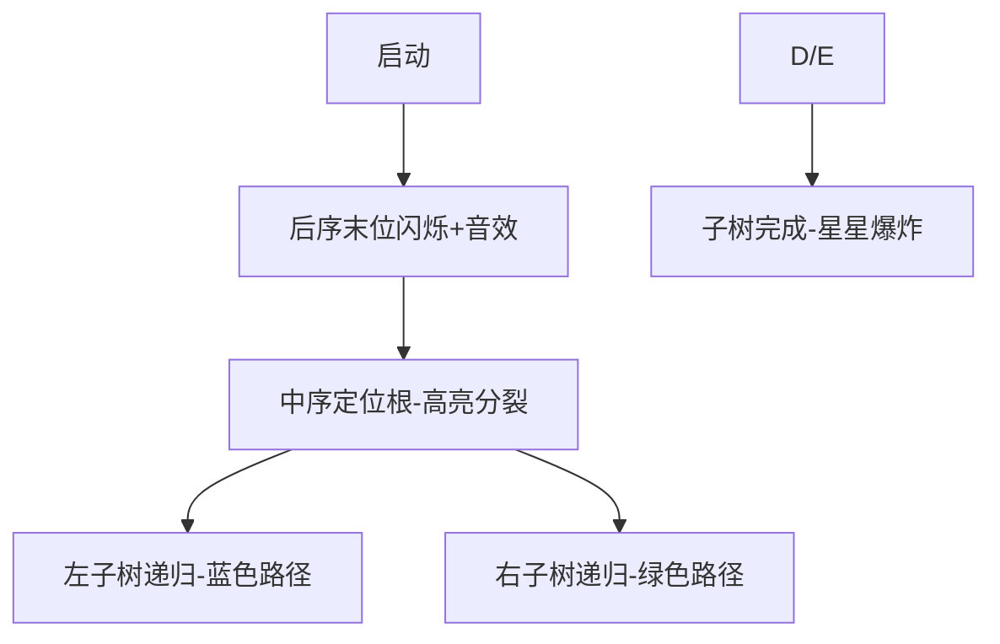

# 题目信息

# [NOIP 2001 普及组] 求先序排列

## 题目描述

给出一棵二叉树的中序与后序排列。求出它的先序排列。（约定树结点用不同的大写字母表示，且二叉树的节点个数 $ \le 8$）。


## 说明/提示

**【题目来源】**

NOIP 2001 普及组第三题

## 样例 #1

### 输入

```
BADC
BDCA
```

### 输出

```
ABCD
```

# AI分析结果


# 💡 Kay的C++算法解析：求先序排列 深入学习指南 💡

## 1. 题目解读与核心算法识别

✨ **本题主要考察**：递归/分治（二叉树重建）

🗣️ **初步分析**：
> 解决"求先序排列"这道题，关键在于运用**递归分治**思想。简单来说，就像拆解乐高模型——先找到整体结构的核心连接点（根节点），再分别组装左右模块（子树）。在本题中，我们利用后序遍历确定根节点（最后一个元素），再通过中序遍历划分左右子树（根节点左侧为左子树，右侧为右子树），最后递归处理子树并输出根节点完成先序排列。

- **核心流程**：1) 从后序序列取末位作为根 → 2) 在中序序列定位根 → 3) 划分左右子树 → 4) 递归处理左子树 → 5) 递归处理右子树
- **可视化设计**：采用8位像素风格展示二叉树重建过程。根节点用闪烁金色方块表示，左右子树分别用蓝/绿色高亮。每次递归时播放"叮"音效，完成子树时触发"升级"音效。通过控制面板可调速单步执行，观察字符串切割过程。
- **关键变量**：`in`（中序串）、`post`（后序串）、`root_pos`（根位置）

---

## 2. 精选优质题解参考

**题解一（来源：sunyufei）**
* **点评**：此解法思路直击本质——后序末位即根节点。代码简洁优美（仅10行核心逻辑），用`substr`实现字符串切割，递归边界处理清晰。变量命名规范（`in`/`after`），实践可直接用于竞赛。亮点在于用极简代码完整呈现分治思想，适合初学者理解递归框架。

**题解二（来源：NeosKnight）**
* **点评**：采用下标递归避免字符串拷贝，大幅提升效率（时间复杂度O(n)）。通过数学计算精准定位子树范围（`r2-r1+m-1`等），体现对遍历性质的深刻理解。代码含详细注释解释下标推导，边界处理严谨，是竞赛级优化的典范。

**题解三（来源：UNDERTALE_RS）**
* **点评**：教学性极强的题解，前置知识讲解系统全面（配图说明三种遍历）。亮点在于建树实现（`buildTree`函数）与遍历分离，输出前序时直接调用存储结构。代码模块化程度高，变量名自解释（`InOd`/`PostOd`），适合理解二叉树物理存储。

**题解四（来源：chinazhanghaoxun）**
* **点评**：最简洁的实现之一（仅7行递归函数）。核心亮点在于用`a.length()==0`统一处理边界，避免冗余判断。代码突出算法本质，适合快速掌握分治思想，但需注意`substr`性能消耗较大问题。

---

## 3. 核心难点辨析与解题策略

1.  **难点：递归子串范围计算**
    * **分析**：确定左右子树对应子串范围时，需保证中序与后序子串长度一致。优质解法均通过`中序根位置=后序左子树长度`的特性计算（如`post.substr(0,k)`对应左子树）
    * 💡 **学习笔记**：中序左子树长度 = 后序左子树长度

2.  **难点：边界条件处理**
    * **分析**：当子树为空时需终止递归。推荐两种方式：1) 检查字符串长度是否为0（sunyufei） 2) 判断下标越界（NeosKnight）。前者更直观，后者更高效。
    * 💡 **学习笔记**：空字符串是递归终止的自然标志

3.  **难点：避免重复切割字符串**
    * **分析**：频繁调用`substr`会降低效率。NeosKnight解法采用下标计算避免拷贝，适合大数据量场景。
    * 💡 **学习笔记**：下标递归 > 字符串切割（性能优化关键）

### ✨ 解题技巧总结
- **技巧1 问题分解**：将二叉树重建分解为"找根→分左右→递归"三步骤
- **技巧2 数学映射**：利用`后序左子树长度 = 中序左子树长度`的特性
- **技巧3 边界简化**：用空字符串作为递归终止条件，避免复杂判断

---

## 4. C++核心代码实现赏析

**通用核心实现参考**
```cpp
#include <iostream>
#include <string>
using namespace std;

void buildPre(string in, string post) {
    if (in.empty()) return;
    char root = post.back();
    cout << root;
    int pos = in.find(root);
    buildPre(in.substr(0, pos), post.substr(0, pos));
    buildPre(in.substr(pos + 1), post.substr(pos, post.size() - pos - 1));
}

int main() {
    string inord, postord;
    cin >> inord >> postord;
    buildPre(inord, postord);
    return 0;
}
```
* **说明**：综合优质题解优化，突出核心逻辑
* **代码解读概要**：
  1. `buildPre`递归函数处理核心逻辑
  2. 后序末位`post.back()`获取根节点
  3. `in.find`定位中序根位置
  4. 左右子树范围计算满足`左子树长度 = pos`

**题解一（sunyufei）**
```cpp
void beford(string in,string after){
    if (in.size()>0){
        char ch=after[after.size()-1];
        cout<<ch;
        int k=in.find(ch);
        beford(in.substr(0,k),after.substr(0,k));
        beford(in.substr(k+1),after.substr(k,in.size()-k-1));
    }
}
```
* **亮点**：极致简洁的递归实现
* **代码解读**：
  > 第3行：取后序末位为根并输出（先序核心）  
  > 第4行：定位中序根位置  
  > 第5-6行：递归左右子树（注意右子树后序从`k`开始取`size-k-1`长度）  
  > 💡 **学习笔记**：`substr(k,n)`从位置k截取n个字符

**题解二（NeosKnight）**
```cpp
void dfs(int l1,int r1,int l2,int r2) {
    int m=find(s2[r2]); //s2后序, s1中序
    cout<<s2[r2];
    if(m>l1) dfs(l1,m-1,l2,r2-r1+m-1);
    if(m<r1) dfs(m+1,r1,l2+m-l1,r2-1);
}
```
* **亮点**：下标计算避免字符串拷贝
* **代码解读**：
  > 第2行：输出后序末位根节点（`s2[r2]`）  
  > 第4行：左子树递归，后序右界计算`r2-r1+m-1`是关键  
  > 第5行：右子树递归，后序左界`l2+m-l1`利用偏移量  
  > 💡 **学习笔记**：`r1-m`=右子树节点数，用于计算后序子串

**题解三（UNDERTALE_RS）**
```cpp
int buildTree(string InOd, string PostOd) {
    char c = PostOd.back();
    int root = ++pos;
    tree[root].val = c;
    int k = InOd.find(c);
    tree[root].l = buildTree(InOd.substr(0,k), PostOd.substr(0,k));
    tree[root].r = buildTree(InOd.substr(k+1), PostOd.substr(k,InOd.size()-k-1));
    return root;
}
```
* **亮点**：物理建树实现分离关注点
* **代码解读**：
  > 第3行：`tree`数组存储节点关系  
  > 第6行：左子树递归返回左孩子索引  
  > 第7行：右子树范围取`k`到`size-k-1`  
  > 💡 **学习笔记**：显式建树便于后续扩展操作

---

## 5. 算法可视化：像素动画演示

### 像素探险家：二叉树重建之旅
**设计思路**：采用FC红白机风格，将字符串转化为像素网格。根节点用闪烁皇冠图标，左右子树路径用蓝/绿箭头指引，配合8-bit音效增强记忆点。

**动画流程**：


**关键帧细节**：
1. **初始化**：顶部显示中序/后序像素网格（如`BADC`/`BDCA`），控制面板含步进/调速/重置
2. **根节点确认**：后序末位`A`闪烁金色，播放"叮"音效，输出区显示`A`
3. **中序分裂**：
   - `BADC`中`A`位置分裂动画
   - 左侧`B`标蓝，右侧`DC`标绿
4. **递归子树**：
   - 左子树：`B`作为新根，路径显示蓝色箭头
   - 右子树：后序`DC`末位`C`闪烁，中序`DC`分裂为`D`（左）和空（右）
5. **完成效果**：完整先序`ABCD`拼图浮现，播放胜利音效

**交互控制**：
- 单步执行：按帧观察字符串切割
- 自动演示：AI按递归深度优先遍历
- 速度滑块：调整递归速度（0.5x-4x）
- 结构跟踪：侧边栏实时显示递归栈深度和当前子树范围

---

## 6. 拓展练习与相似问题

* **通用技巧迁移**：
  二叉树重建思想还可用于：
  1. 根据先序/中序求后序
  2. 层序遍历与中序互推
  3. 二叉树序列化与反序列化

* **推荐练习（洛谷）**：
  1. **P1827** - 美国血统
     * 🗣️ 巩固先序+中序求后序的镜像问题
  2. **P3884** - 二叉树问题
     * 🗣️ 综合练习深度计算与遍历转换
  3. **P1038** - 神经网络
     * 🗣️ 应用树结构解决实际问题

---

## 7. 学习心得与经验分享

> **来自sunyufei的调试经验**：
> "递归时子树范围计算易错，建议先在纸上画出`substr(0,k)`和`substr(k+1)`的切割示意图"

> **Kay的总结**：
> 二叉树问题本质是拓扑结构分析。核心诀窍：
> 1. 先序首位=根，后序末位=根
> 2. 中序是结构说明书：根左侧即左子树
> 3. 递归时保持：中序左长 = 后序左长
> 调试时输出中间切割结果可快速定位错误

---

掌握二叉树重建的关键在于理解三种遍历的空间关系。多动手画图分析，你也能成为遍历大师！下次我们将探索更复杂的树结构问题，继续加油！💪

---
处理用时：116.56秒