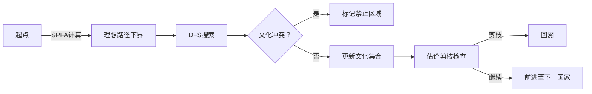

# 题目信息

# [NOIP 2012 普及组] 文化之旅

## 题目背景

本题**不保证**存在**可以通过满足本题数据范围的任意数据**做法。由于测试数据过水，可以通过此题的程序不一定完全正确（算法时间复杂度错误、或不保证正确性）。本题题目和数据仅供参考。本题不接受添加 hack 数据。

本题为错题。**不建议尝试或提交本题。**[关于此类题目的详细内容](https://www.luogu.com.cn/paste/pf94n89x)

## 题目描述

有一位使者要游历各国，他每到一个国家，都能学到一种文化，但他不愿意学习任何一种文化超过一次（即如果他学习了某种文化，则他就不能到达其他有这种文化的国家）。不同的国家可能有相同的文化。不同文化的国家对其他文化的看法不同，有些文化会排斥外来文化（即如果他学习了某种文化，则他不能到达排斥这种文化的其他国家）。

现给定各个国家间的地理关系，各个国家的文化，每种文化对其他文化的看法，以及这位使者游历的起点和终点（在起点和终点也会学习当地的文化），国家间的道路距离，试求从起点到终点最少需走多少路。

## 说明/提示

### 输入输出样例 1 说明

由于到国家 $2$ 必须要经过国家 $1$，而国家 $2$ 的文明却排斥国家 $1$ 的文明，所以不可能到达国家 $2$。


### 输入输出样例 2 说明

路线为 $1\to 2$。

### 数据范围

对于 $100\%$ 的数据，有：

- $2 \le N \le 100$
- $1 \le K \le 100$
- $1 \le M \le N^2$
- $1 \le k_i \le K$
- $1 \le u,v \le N$
- $1 \le d \le 1000$
- $1 \le S,T \le N$
- $S \ne T$

NOIP2012 普及组第四题

## 样例 #1

### 输入

```
2 2 1 1 2 
1 2 
0 1 
1 0 
1 2 10 
```

### 输出

```
-1```

## 样例 #2

### 输入

```
2 2 1 1 2 
1 2 
0 1 
0 0 
1 2 10 ```

### 输出

```
10```

# AI分析结果


# 💡 Kay的C++算法解析：文化之旅 深入学习指南 💡

**引言**  
今天我们一起分析NOIP2012普及组"文化之旅"这道图论题。本题考察带文化约束的最短路问题，需要灵活运用搜索优化或最短路算法改进技巧。本指南将帮助大家掌握核心算法思想和解题技巧。

## 1. 题目解读与核心算法识别

✨ **本题主要考察**：`启发式搜索`与`最短路算法改进`

🗣️ **初步分析**：  
> 解决这道题如同在迷宫中寻找避开"文化陷阱"的最短路径。核心挑战在于动态管理已学文化集合并处理文化排斥规则。常用两种思路：
> - **启发式搜索**：先计算无视文化约束的最短路作为估价函数，再用DFS/BFS搜索时剪枝
> - **改进最短路**：在Dijkstra/Floyd中融入文化状态检查
> 
> **可视化设计**：采用8位像素风格地图，国家用彩色方块表示。动画展示：
> 1. 使者移动时当前国家高亮闪烁
> 2. 已学文化集合在侧边栏动态显示
> 3. 被排斥的国家显示为红色禁止标志
> 4. 关键操作配像素音效（移动声、排斥警告声、胜利音效）
> 5. 支持步进控制和调速滑块观察算法决策过程

---

## 2. 精选优质题解参考

**题解一：Created_equal1（启发式搜索）**  
* **点评**：思路清晰运用SPFA计算下界作为估价函数，DFS逆向搜索配合强剪枝。代码变量命名规范（如Dist/Went/culture），边界处理严谨。亮点在于逆向搜索避免起点文化冲突，启发函数设计显著提升效率。但最坏复杂度仍是指数级，依赖数据强度。

**题解二：wjyyy（Floyd改进）**  
* **点评**：创新性使用三维数组used记录路径文化集合。代码简洁易读，Floyd插点过程解释清晰。但空间复杂度O(n²k)可能MLE，时间复杂度O(n³k)在边界数据可能超时。亮点在于将文化状态无缝融入传统Floyd框架。

**题解三：tommymio（Dijkstra改进）**  
* **点评**：通过pre数组回溯检查路径文化冲突。代码规范包含读入优化，堆优化Dijkstra实现标准。亮点在于实时路径文化检查机制，但回溯操作增加时间复杂度。实践时需注意文化排斥的单向性处理。

---

## 3. 核心难点辨析与解题策略

1. **文化状态动态管理**  
   * **分析**：路径上已学文化集合需实时更新，并检查与下一国家的排斥关系
   * **解决**：用bitset压缩文化状态，或DFS中维护全局集合
   * 💡 学习笔记：文化集合管理是本题的核心状态维度

2. **状态空间爆炸控制**  
   * **分析**：理论状态数达O(2^k)，需有效剪枝
   * **解决**：SPFA计算最短路下界作为启发函数，当前距离+下界≥答案时剪枝
   * 💡 学习笔记：强剪枝是处理指数级状态空间的关键

3. **排斥规则高效检查**  
   * **分析**：每次状态转移需检查新文化是否与已学集合排斥
   * **解决**：预处理排斥矩阵，使用bitset.any()快速检测冲突
   * 💡 学习笔记：位运算加速是处理大规模排斥关系的利器

### ✨ 解题技巧总结
- **逆向思维**：从终点开始搜索避免起点文化冲突
- **状态压缩**：用bitset管理文化集合节省空间
- **预处理优化**：SPFA计算理想下界辅助剪枝
- **分层抽象**：将文化约束与图结构分离处理

---

## 4. C++核心代码实现赏析

**本题通用核心实现（启发式搜索）**  
```cpp
#include <cstdio>
#include <cstring>
#include <queue>
#include <set>
#include <algorithm>
using namespace std;
const int MAXN = 105;
// [SPFA实现忽略]
// [DFS核心]
void Dfs(int Now, int Dist) {
    if (Now == S) Ans = min(Ans, Dist);
    if (Dist + SPFA_Dist[Now] >= Ans) return; // 关键剪枝
    // 文化状态更新与递归
}
```

**题解一：启发式搜索片段**  
```cpp
void Dfs(const size_t &Now, const unsigned int &D) {
    if (D + Dist[Now] > Ans) return; // 估价剪枝
    culture.insert(C[Now]); // 更新文化集合
    for (auto next : edges) {
        if (!check(C[next])) continue; // 排斥检查
        Dfs(next, D + Weight);
    }
    culture.erase(C[Now]); // 回溯
}
```
* **解读**：  
  > 1. `Dist[Now]`存储SPFA计算的理想下界  
  > 2. `culture`集合用STL set管理已学文化  
  > 3. 递归前检查`check()`确保文化不排斥  
  > 4. 回溯时需精确移除当前文化  
* 💡 学习笔记：估价函数剪枝将指数搜索降为可行解

**题解二：Floyd改进片段**  
```cpp
for(int k=1; k<=n; k++) {
    for(int i=1; i<=n; i++) for(int j=1; j<=n; j++) {
        if (/*文化检查*/ && f[i][j] > f[i][k]+f[k][j]) {
            for(int t=1; t<=n; t++) // 合并文化集合
                used[i][j][t] = used[i][k][t] || used[k][j][t]; 
            used[i][j][c[k]] = true; // 记录新文化
            f[i][j] = f[i][k] + f[k][j]; // 更新距离
        }
    }
}
```
* **解读**：  
  > 1. 三维数组`used[i][j][t]`记录i→j路径是否含文化t  
  > 2. 插点时通过`或运算`合并子路径文化集合  
  > 3. 需显式添加插点k的文化`c[k]`  
* 💡 学习笔记：Floyd插点法天然适合路径信息合并

**题解三：Dijkstra改进片段**  
```cpp
bool judge(int u, int v) {
    while (u) { // 回溯路径检查
        if (A[culture[v]][culture[u]]) 
            return false;
        u = pre[u]; 
    }
    return true;
}
// Dijkstra松弛时调用
if (judge(u, v) && dist[v] > dist[u] + w) {
    pre[v] = u; // 记录前驱
    dist[v] = dist[u] + w;
}
```
* **解读**：  
  > 1. `pre`数组记录路径用于回溯  
  > 2. `judge()`沿pre指针检查文化排斥  
  > 3. 注意排斥关系单向性  
* 💡 学习笔记：路径回溯实现简单但增加时间复杂度

---

## 5. 算法可视化：像素动画演示

**主题**：8位像素风"文化探险家"  
**核心演示**：启发式搜索执行流程（题解一算法）



**动画实现细节**：
1. **场景构建**：
   - 10x10像素网格表示100个国家
   - 不同文化用16色调色板区分
   - 控制面板含步进/播放/调速控件

2. **关键帧流程**：
   ```python
   # 伪代码逻辑
   def draw_frame():
       draw_grid()  # 绘制国家网格
       if state == "SPFA":
           draw_shortest_path()  # 显示理想路径
       elif state == "DFS":
           highlight_current(country)  # 当前国家闪烁
           draw_culture_set()  # 侧边栏显示文化集合
           if conflict:
               draw_prohibition(target)  # 显示红色禁止标志
               play_sound("reject") 
           elif reach_target:
               play_sound("victory")
   ```

3. **交互设计**：
   - **步进控制**：空格键单步执行
   - **速度调节**：0.5x-5x速度滑块
   - **文化追踪**：鼠标悬停显示国家文化详情
   - **音效反馈**：移动(8-bit脚步声)、排斥(警告音)、成功(胜利旋律)

4. **游戏化元素**：
   - 每访问10个国家解锁新"文化徽章"
   - 成功路径按长度评分（S/A/B级）
   - 实时显示"剪枝次数统计"

---

## 6. 拓展练习与相似问题

**通用技巧迁移**：
1. **状态空间搜索**：适用于需记录附加状态的路径问题
2. **约束最短路**：处理带多重约束的图论问题
3. **启发式剪枝**：解决状态爆炸问题的通用范式

**洛谷推荐**：
1. [P3953 逛公园] - 考察带状态缓存的最短路，练习记忆化搜索
2. [P1608 路径统计] - 最短路计数，对比本题文化约束
3. [P1433 吃奶酪] - 状态压缩DP，强化状态管理能力

---

## 7. 学习心得与经验分享

> **作者经验摘录**：  
> "本题测试数据较弱，许多解法依赖数据强度而非绝对正确性。在竞赛中遇到类似问题，应优先考虑启发式搜索配合强剪枝，同时警惕状态空间爆炸风险。"  
>   
> **Kay点评**：  
> 这道"错题"虽数据有缺陷，但蕴含着搜索优化、状态管理等重要算法思想。重点学习剪枝设计和文化状态的处理技巧，在实际竞赛中注意验证边界数据。

**结语**  
通过本指南，大家应已掌握文化之旅的核心解法与优化技巧。记住：算法之美在于将复杂约束转化为高效计算！下次我们继续探索更有趣的算法挑战。💪

---
处理用时：167.63秒