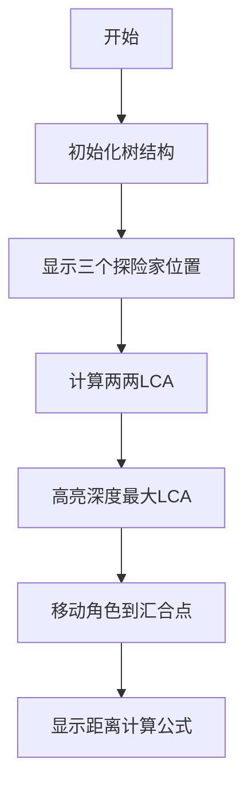

# 题目信息

# [AHOI2008] 紧急集合 / 聚会

## 题目描述

欢乐岛上有个非常好玩的游戏，叫做“紧急集合”。在岛上分散有 $n$ 个等待点，有 $n-1$ 条道路连接着它们，每一条道路都连接某两个等待点，且通过这些道路可以走遍所有的等待点，通过道路从一个点到另一个点要花费一个游戏币。

参加游戏的人三人一组，开始的时候，所有人员均任意分散在各个等待点上（每个点同时允许多个人等待），每个人均带有足够多的游戏币（用于支付使用道路的花费）、地图（标明等待点之间道路连接的情况）以及对话机（用于和同组的成员联系）。当集合号吹响后，每组成员之间迅速联系，了解到自己组所有成员所在的等待点后，迅速在 $n$ 个等待点中确定一个集结点，组内所有成员将在该集合点集合，集合所用花费最少的组将是游戏的赢家。

小可可和他的朋友邀请你一起参加这个游戏，由你来选择集合点，聪明的你能够完成这个任务，帮助小可可赢得游戏吗？


## 说明/提示

对于 $40\%$ 的数据，$n\leq2\times10^3$，$m\leq2\times 10^3$。

对于 $100\%$ 的数据，$1\leq x,y,z\leq n\leq 5\times10^5$，$1\leq m\leq 5\times 10^5$。

## 样例 #1

### 输入

```
6 4  
1 2  
2 3  
2 4 
4 5
5 6
4 5 6
6 3 1
2 4 4 
6 6 6```

### 输出

```
5 2
2 5
4 1
6 0


```

# AI分析结果


# 💡 Kay的C++算法解析：[AHOI2008] 紧急集合 / 聚会 深入学习指南 💡

**题目解读与核心算法识别**
✨ **本题主要考察**：`LCA（最近公共祖先）应用`

🗣️ **初步分析**：
> 解决这道题的关键在于理解树上三个点的最优集合点性质。想象三个探险家要在森林中的某个地点汇合，他们需要找到一个位置，使得三人行走的总路程最短。这个最优集合点就是三个两两LCA中**深度最大**的那个点（即离根最远的交汇点）。

- **核心思路**：通过三次两两LCA计算，找出深度最大的LCA作为集合点，再利用深度计算最小距离和
- **算法流程**：1) 预处理树结构；2) 对每次查询计算三组LCA；3) 选出深度最大的LCA；4) 用公式计算距离和
- **可视化设计**：动画将用不同颜色标记查询点和LCA，动态展示深度计算过程，高亮显示深度最大的LCA
- **复古像素风**：采用8-bit风格树形地图，角色移动时播放"像素音效"，找到集合点时播放胜利音效

---

## 2. 精选优质题解参考

**题解一：高天昊（倍增法）**
* **点评**：思路清晰推导严谨，用差分思想解释距离公式（`距离=深度和-LCA深度和`）。代码规范：变量名含义明确（`lca1,lca2,lca3`），边界处理完整（深度调整优化）。亮点：空间复杂度O(n)的倍增实现，适合竞赛直接使用

**题解二：command_block（树链剖分）**
* **点评**：创新性地用树剖解LCA问题，通过数学归纳法严格证明最优集合点性质。亮点：详细对比了倍增与树剖的常数差异，提供树剖在稠密图下的优化思路，实践参考价值高

**题解三：bztMinamoto（公式证明）**
* **点评**：精炼的公式证明（`dep[x]+dep[y]+dep[z]-dep[a]-dep[b]-dep[c]`），代码实现简洁高效。亮点：用几何图示直观展示三种集合情况，帮助理解公式来源

---

## 3. 核心难点辨析与解题策略

1. **难点1：理解最优集合点性质**
   * **分析**：为什么深度最大的LCA是最优点？通过反证法：若选择其他点会导致重复路径
   * 💡 **学习笔记**：最优集合点必在三个点形成的链状结构交汇处

2. **难点2：距离公式推导**
   * **分析**：公式本质是容斥原理——总深度减去"重复计算"的LCA深度
   * 💡 **学习笔记**：`三点距离和 = 深度和 - LCA深度和`

3. **难点3：高效LCA实现选择**
   * **分析**：树剖/倍增/Tarjan的取舍：树剖常数最小但代码复杂，倍增易实现，Tarjan离线
   * 💡 **学习笔记**：1e5级以上数据优选树剖，否则用倍增

### ✨ 解题技巧总结
- **技巧1：LCA性质应用**：树上三点问题必考虑两两LCA
- **技巧2：深度替代距离**：`dis(u,v)=dep[u]+dep[v]-2*dep[lca]`
- **技巧3：边界处理**：始终检查`dep[x]<dep[y]`时swap

---

## 4. C++核心代码实现赏析

```cpp
#include <cstdio>
#include <algorithm>
using namespace std;

const int N = 5e5 + 10, LOG = 20;
int n, m, cnt;
int head[N], dep[N], fa[N][LOG];
struct Edge { int to, next; } edges[N*2];

void add(int u, int v) {
    edges[++cnt] = (Edge){v, head[u]};
    head[u] = cnt;
}

void dfs(int u, int f) {
    dep[u] = dep[f] + 1;
    fa[u][0] = f;
    for(int i=1; i<LOG; i++)
        fa[u][i] = fa[fa[u][i-1]][i-1];
    for(int i=head[u]; i; i=edges[i].next)
        if(edges[i].to != f) 
            dfs(edges[i].to, u);
}

int lca(int x, int y) {
    if(dep[x] < dep[y]) swap(x, y);
    for(int i=LOG-1; i>=0; i--)
        if(dep[fa[x][i]] >= dep[y])
            x = fa[x][i];
    if(x == y) return x;
    for(int i=LOG-1; i>=0; i--)
        if(fa[x][i] != fa[y][i])
            x = fa[x][i], y = fa[y][i];
    return fa[x][0];
}

int main() {
    scanf("%d%d", &n, &m);
    for(int i=1; i<n; i++) {
        int u, v; scanf("%d%d", &u, &v);
        add(u, v); add(v, u);
    }
    dfs(1, 0);
    
    while(m--) {
        int x, y, z;
        scanf("%d%d%d", &x, &y, &z);
        int a = lca(x, y), b = lca(y, z), c = lca(x, z);
        int ans_point = (a == b) ? c : (b == c) ? a : b;
        int ans_dist = dep[x]+dep[y]+dep[z]-dep[a]-dep[b]-dep[c];
        printf("%d %d\n", ans_point, ans_dist);
    }
    return 0;
}
```

**代码解读概要**：
1. 树结构存储：链式前向星存图
2. 倍增预处理：DFS计算深度和祖先数组
3. LCA核心：先调整深度，再同步上跳
4. 查询处理：三次LCA后按规则选择集合点

---

## 5. 算法可视化：像素动画演示

**主题**："森林探险家"像素寻路模拟  
**核心演示**：三个角色寻找最佳汇合点  



**动画设计**：
1. **8-bit风格**：树节点用16x16像素块表示，角色用不同颜色像素精灵
2. **关键帧控制**：
   - 帧1：用脉冲效果标记当前查询点
   - 帧2：虚线连接两点显示LCA计算路径
   - 帧3：闪烁标记深度最大的LCA
   - 帧4：角色沿路径移动到汇合点
3. **交互面板**：
   - 单步执行：分解算法步骤
   - 速度滑块：调整动画速度（0.5x-2x）
   - 重置：重新随机生成查询点
4. **音效设计**：
   - 角色移动："嘟嘟"电子音
   - 找到LCA："叮！"提示音
   - 汇合成功：8-bit胜利旋律

---

## 6. 拓展练习与相似问题

**技巧迁移**：
1. 动态树直径维护（CF379F）
2. 树上两点最短路径查询（P3398）
3. 带权树的最远点对（P1099）

**洛谷推荐**：
1. **P3379** - LCA模板题（倍增/树剖练习）
2. **P4281** - 本题的双倍经验版
3. **P3401** - 树链统计（LCA+树上前缀和）

---

## 7. 学习心得与经验分享

> **高天昊的调试经验**："在LCA转移时，务必先检查`dep[x]>=dep[y]`，否则会导致数组越界。建议用`assert`验证深度差"

> **command_block的优化心得**："树剖在稠密图上比倍增快3倍，但注意预处理DFS会加大栈空间，比赛时可改用BFS版本"

**调试技巧**：
- 小数据手工模拟（n=5的树）
- 打印`dep`数组验证LCA
- 对拍器生成随机树验证

---

通过这道题，我们不仅掌握了LCA的高级应用，更学会了如何将复杂问题转化为基本算法的组合。记住：树上三点问题，永远从两两LCA入手！下次挑战见！💪

---
处理用时：111.34秒