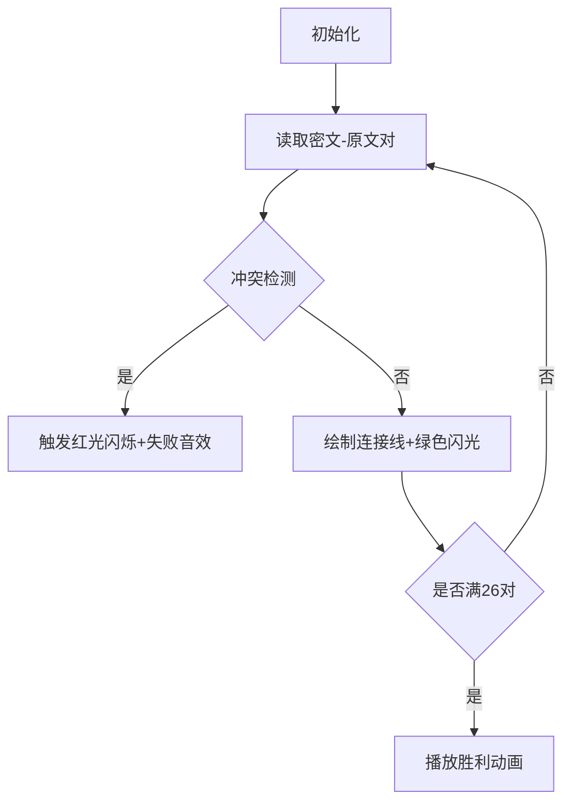

# 题目信息

# [NOIP 2009 提高组] 潜伏者

## 题目描述

R 国和 S 国正陷入战火之中，双方都互派间谍，潜入对方内部，伺机行动。历尽艰险后，潜伏于 S 国的 R 国间谍小 C 终于摸清了 S 国军用密码的编码规则：

1. S 国军方内部欲发送的原信息经过加密后在网络上发送，原信息的内容与加密后所得的内容均由大写字母 $\texttt{A}\sim\texttt{Z}$ 构成（无空格等其他字符）；
2. S 国对于每个字母规定了对应的密字。加密的过程就是将原信息中的所有字母替换为其对应的密字；
3. 每个字母只对应一个唯一的密字，不同的字母对应不同的密字。密字可以和原字母相同。

例如，若规定 $\tt A$ 的密字为 $\tt A$，$\tt B$ 的密字为 $\tt C$（其他字母及密字略），则原信息 $\tt ABA$ 被加密为 $\tt ACA$。

现在，小 C 通过内线掌握了 S 国网络上发送的一条加密信息及其对应的原信息。小 C 希望能通过这条信息，破译 S 国的军用密码。小 C 的破译过程是这样的：扫描原信息，对于原信息中的字母 $x$（代表任一大写字母），找到其在加密信息中的对应大写字母 $y$，并认为在密码里 $y$ 是 $x$ 的密字。如此进行下去直到停止于如下的某个状态：

1. 所有信息扫描完毕，$\texttt{A}\sim\texttt{Z}$ 所有 $26$ 个字母在原信息中均出现过并获得了相应的密字；
2. 所有信息扫描完毕，但发现存在某个（或某些）字母在原信息中没有出现；
3. 扫描中发现掌握的信息里有明显的自相矛盾或错误（违反 S 国密码的编码规则）。

例：

如某条信息 $\tt XYZ$ 被翻译为 $\tt ABA$ 就违反了“不同字母对应不同密字”的规则。

在小 C 忙得头昏脑涨之际，R 国司令部又发来电报，要求他翻译另外一条从 S 国刚刚截取到的加密信息。现在请你帮助小 C：通过内线掌握的信息，尝试破译密码。然后利用破译的密码，翻译电报中的加密信息。


## 说明/提示

【输入输出样例一说明】

原信息中的字母 $\tt A$ 和 $\tt B$ 对应相同的密字，输出 $\tt Failed$。

【输入输出样例二说明】

字母 $\tt Z$ 在原信息中没有出现，输出 $\tt Failed$。

NOIP2009 提高组第一题

## 样例 #1

### 输入

```
AA 
AB 
EOWIE

```

### 输出

```
Failed
```

## 样例 #2

### 输入

```
QWERTYUIOPLKJHGFDSAZXCVBN 
ABCDEFGHIJKLMNOPQRSTUVWXY 
DSLIEWO
```

### 输出

```
Failed 
```

## 样例 #3

### 输入

```
MSRTZCJKPFLQYVAWBINXUEDGHOOILSMIJFRCOPPQCEUNYDUMPP
YIZSDWAHLNOVFUCERKJXQMGTBPPKOIYKANZWPLLVWMQJFGQYLL
FLSO ```

### 输出

```
NOIP```

# AI分析结果


### 💡 Kay的C++算法解析：潜伏者 深入学习指南 💡

**引言**  
今天我们来分析NOIP 2009提高组的《潜伏者》。这道题考察字符串处理和逻辑推理能力，通过建立密码本（映射关系）实现信息破译。本指南将解析核心思路、难点突破技巧，并提供像素动画演示方案。

---

### 1. 题目解读与核心算法识别
✨ **本题主要考察**：模拟（Simulation）与字符串处理（String Manipulation）  

🗣️ **初步分析**  
> 破译密码本就像玩配对记忆游戏：每个密文字母必须唯一对应一个原文字母（像一把钥匙开一把锁），且26个字母必须全部出现。解题需三步：  
> 1. 建立密文→原文映射  
> 2. 检查映射合法性（无冲突/全覆盖）  
> 3. 翻译目标字符串  
>
> **核心难点**：如何高效检测冲突？优质题解用双向映射（密文→原文+原文占用标记）解决。  
>
> **可视化设计**：采用8位像素风格，将字母显示为彩色方块。连接线表示映射关系，冲突时触发红色闪烁和"失败音效"。自动演示模式可逐步展示映射建立过程（见第5节详解）。

---

### 2. 精选优质题解参考
**题解一（作者：qhr2023）**  
* **亮点**：  
  - 思路直白：用数组`mp[]`存储映射，`vis[]`标记原文使用情况  
  - 高效检测：遍历时同步检查冲突（`vis`标记防多对一）  
  - 代码简洁：仅20行完成所有逻辑，边界处理严谨  

**题解二（作者：LeavingAC）**  
* **亮点**：  
  - STL应用：`unordered_map`实现动态映射，代码可读性强  
  - 防御性检查：提前过滤长度不足26的输入（防无效计算）  
  - 实战技巧：提供测试用例帮助调试一对多边界情况  

**题解三（作者：ShiYuXuan1234）**  
* **亮点**：  
  - 双数组映射：`zm[]`（密→原）+`mz[]`（原→密）双向防冲突  
  - 清晰分层：分离映射检查与翻译阶段，逻辑模块化  
  - 安全索引：字母转换`-‘A’+1`避免越界  

---

### 3. 核心难点辨析与解题策略
1. **难点一：检测映射冲突（一对多/多对一）**  
   * **策略**：  
     - 双向记录：用两个映射结构（如`map`或数组），分别存储密文→原文和原文→密文关系  
     - 实时验证：插入新映射时检查是否与现有记录矛盾  
   * 💡 **学习笔记**：双向映射是解决字符替换冲突的黄金法则  

2. **难点二：确保26字母全覆盖**  
   * **策略**：  
     - 终局检查：建立映射后遍历A-Z，确认每个字母都作为原文出现过  
     - 优化技巧：用布尔数组记录字母出现状态，空间复杂度O(1)  
   * 💡 **学习笔记**：全覆盖检查必须独立于映射过程，放在最后一步  

3. **难点三：高效实现翻译阶段**  
   * **策略**：  
     - 直接查表：预建完整映射后，目标字符串直接索引输出  
     - 避免回溯：映射合法化后无需二次验证  
   * 💡 **学习笔记**：预处理合法映射可使翻译复杂度降至O(n)  

#### ✨ 解题技巧总结
- **双向锚定法**：维护两个方向的映射关系，杜绝一对多/多对一  
- **终局校验**：独立遍历26字母确保全覆盖，与映射逻辑解耦  
- **防御式输入**：提前检查长度不足26的输入可节省无效计算  

---

### 4. C++核心代码实现赏析
**本题通用核心C++实现参考**  
```cpp
#include <iostream>
#include <map>
using namespace std;

int main() {
    string a, b, c;
    cin >> a >> b >> c;
    map<char, char> cipher;  // 密文→原文映射
    map<char, bool> used;    // 原文占用标记

    for (int i = 0; i < a.size(); ++i) {
        if (cipher.count(a[i]) && cipher[a[i]] != b[i]) {  // 一对多检测
            cout << "Failed";
            return 0;
        }
        if (!cipher.count(a[i]) && used[b[i]]) {          // 多对一检测
            cout << "Failed";
            return 0;
        }
        cipher[a[i]] = b[i];
        used[b[i]] = true;
    }

    for (char ch = 'A'; ch <= 'Z'; ++ch) {  // 全覆盖检测
        if (!used[ch]) {
            cout << "Failed";
            return 0;
        }
    }

    for (char ch : c) cout << cipher[ch];  // 翻译输出
    return 0;
}
```
**代码解读概要**：  
> 1. **映射建立**：同步构建`cipher`（密文字符→原文字符）和`used`（原文字符占用标记）  
> 2. **冲突检测**：插入时检查一对多（相同密文不同原文）和多对一（不同密文相同原文）  
> 3. **全覆盖验证**：终局遍历A-Z确认所有原文均出现  
> 4. **翻译输出**：直接查表输出目标密文对应的原文  

---

### 5. 算法可视化：像素动画演示
**主题**：8位密码破译工坊（复古红白机风格）  

**核心演示内容**：  
- 动态展示映射建立、冲突检测、全覆盖验证三阶段  
- 游戏化设计：每成功建立5组映射解锁新"密电"，最终破译获得"胜利动画"  

**交互设计**：  


**关键动画细节**：  
1. **像素元素**：  
   - 26个密文字母（上排像素方块，绿色边框）  
   - 26个原文字母（下排像素方块，蓝色边框）  
   - 动态连接线（黄色像素线）  

2. **冲突特效**：  
   - 一对多：密文方块红色闪烁 + 低频"嗡"音效  
   - 多对一：原文方块紫色闪烁 + 急促"嘀嘀"音效  

3. **游戏化进度**：  
   - 每建立5组映射，屏幕下方亮起1颗五角星（共5星）  
   - 最终破译时触发烟花动画（绽放像素粒子）  

4. **音效系统**：  
   - 成功映射：8位清脆"叮"声（300Hz方波）  
   - 最终胜利：《魂斗罗》通关旋律片段  
   - 错误提示：短促低频噪声（100ms 200Hz三角波）  

**技术实现**：  
- Canvas绘制网格化字母矩阵（26×2）  
- 连接线动画采用贝塞尔曲线插值  
- 音效通过Web Audio API生成芯片音乐  

---

### 6. 拓展练习与相似问题思考
**通用技巧迁移**：  
1. **字符映射**：密码翻译、凯撒加密、字符编码转换（如Unicode转ASCII）  
2. **唯一性校验**：数据去重、集合运算、数据库主键约束  
3. **全覆盖检测**：完整性验证、压缩算法字典构建  

**洛谷练习推荐**：  
1. **P1914 小书童——密码**  
   → 掌握凯撒密码的字符偏移映射技巧  
2. **P1125 笨小猴**  
   → 强化字符统计与质数判断的组合应用  
3. **P1055 ISBN号码**  
   → 学习校验码计算与字符映射验证  

---

### 7. 学习心得与经验分享
> **经验摘录（来自LeavingAC）**：  
> “WA on #4 源于未处理多对一冲突，测试数据：密文`QW...N`对应原文`AB...N`和`AB...N`（末尾重复）”  
>
> **Kay点评**：  
> 这是典型的边界条件遗漏！调试时务必构造：  
> 1. 全26字母的合法输入  
> 2. 25字母+1缺失  
> 3. 故意制造一对多/多对一冲突  
> 单元测试覆盖这三类数据可避免90%错误  

---

**结语**  
通过《潜伏者》我们掌握了映射构建的核心技巧：双向验证+全覆盖检测。记住，好的算法就像精密的情报系统——必须保证编码唯一性和信息完整性！下次遇到字符处理问题时，不妨回想这个像素破译工坊的演示动画哦~ 💻🔍

---
处理用时：196.67秒