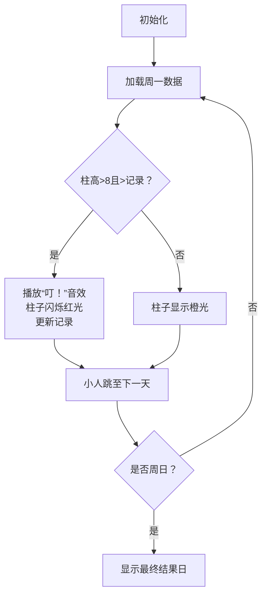

# 题目信息

# [NOIP 2004 普及组] 不高兴的津津

## 题目描述

津津上初中了。妈妈认为津津应该更加用功学习，所以津津除了上学之外，还要参加妈妈为她报名的各科复习班。另外每周妈妈还会送她去学习朗诵、舞蹈和钢琴。但是津津如果一天上课超过八个小时就会不高兴，而且上得越久就会越不高兴。假设津津不会因为其它事不高兴，并且她的不高兴不会持续到第二天。请你帮忙检查一下津津下周的日程安排，看看下周她会不会不高兴；如果会的话，哪天最不高兴。


## 说明/提示

NOIP2004 普及组第 1 题

- 2021-10-27：增加一组 hack 数据
- 2022-06-05：又增加一组 hack 数据

## 样例 #1

### 输入

```
5 3
6 2
7 2
5 3
5 4
0 4
0 6
```

### 输出

```
3```

# AI分析结果


### 💡 Kay的C++算法解析：不高兴的津津 深入学习指南 💡

**引言**  
今天我们来分析NOIP2004普及组题目《不高兴的津津》。这道题考察如何通过编程检测津津下周的情绪状态，核心在于理解并实现高效的枚举策略。本指南将帮助你掌握算法逻辑、代码实现技巧，并通过像素动画直观理解解题过程。

---

### 1. 题目解读与核心算法识别  
✨ **本题主要考察**：`模拟枚举`  

🗣️ **初步分析**：  
> 解决本题的关键在于**模拟枚举**——像扫描仪一样逐日检查津津的学习时长。想象一个像素小人从周一到周日巡逻，当发现某天学习时长超过8小时（红色警报线）且刷新最高记录时，就标记该天为"最不高兴日"。  
> - **核心流程**：遍历7天数据，动态更新最大值及其出现位置  
> - **可视化设计**：  
>   - 用像素柱状图表示每日学习时长（1像素=1小时）  
>   - 当柱高突破8像素时触发红色警报动画  
>   - 小人巡逻时播放8-bit脚步声，发现新记录时触发"叮！"音效  

---

### 2. 精选优质题解参考  
**题解一（IMGCsir）**  
* **点评**：  
  思路直击要害——实时计算每日总和并更新最大值。代码亮点在于：  
  - 用`maxn=-1`巧妙标识未更新状态  
  - 双条件判断`(a[i]>8 and a[i]>maxn)`确保精准捕获超标日  
  - 边界处理干净利落（输出0的判定）  
  > 💡 学习价值：负值初始化是检测状态变化的实用技巧

**题解二（cff_0102）**  
* **点评**：  
  采用阈值融合策略：  
  - 初始值`mx=8`同时承担阈值与最大值记录  
  - 单次判断`if(mx<a+b)`精简代码逻辑  
  - 利用`pos=0`天然处理无超标日情况  
  > 💡 学习价值：合理复用变量可提升代码简洁性

**题解三（zhuoqizhi）**  
* **点评**：  
  详解关键设计决策：  
  - 强调`max< t1+t2`（非≤）保证取最早最大值  
  - 明确注释变量含义（t1=校内，t2=课外）  
  - 对初始化值选择（8 vs 7）进行防错分析  
  > 💡 学习价值：严格不等号是保留首次出现的核心技巧

---

### 3. 核心难点辨析与解题策略  
1. **难点1：初始化陷阱**  
   * **分析**：`max_val`初始值需满足：  
     - 能触发更新（若设≥9会漏掉9）  
     - 能区分无效状态（如设0会导致9>0但无法区分是否超标）  
   * 💡 **学习笔记**：建议初始值=阈值（本题设为8）

2. **难点2：相同极值取舍**  
   * **分析**：题目要求取最早出现的最大值。解决方案：  
     - 采用`if(total > max_val)`严格大于判断  
     - 顺序遍历保证优先捕获靠前日期  
   * 💡 **学习笔记**：严格不等号是保留首位的黄金法则

3. **难点3：状态标识设计**  
   * **分析**：需区分"无超标日"与"首日为最大值"：  
     - 初始`ans_day=0`表示无记录  
     - 最终输出0即表示无超标日  
   * 💡 **学习笔记**：0是标识特殊状态的哨兵值

#### ✨ 解题技巧总结  
- **阈值融合**：用阈值兼任初始最大值（如设max_val=8）  
- **单次判定**：合并超标检查与极值更新（避免冗余判断）  
- **顺序优先**：正序扫描天然保证取最早极值  

---

### 4. C++核心代码实现赏析  
**本题通用核心实现**  
```cpp
#include <iostream>
using namespace std;
int main() {
    int max_val = 8, ans_day = 0;  // 阈值8兼任初始最大值
    for (int day = 1; day <= 7; day++) {
        int school, extra;
        cin >> school >> extra;
        int total = school + extra;
        if (total > max_val) {     // 严格大于保证取首位
            max_val = total;
            ans_day = day;
        }
    }
    cout << ans_day;  // 未更新则输出0
    return 0;
}
```
* **代码解读概要**：  
  > 初始化`max_val=8`作为阈值基准，`ans_day=0`标记无超标日。循环中实时计算总学时，仅当突破阈值且刷新记录时才更新日期。最终`ans_day`自动处理无解情况。

---

**题解一片段赏析（IMGCsir）**  
```cpp
if(a[i]>8 and a[i]>maxn){
    maxn=a[i];
    maxm=i;   // 实时更新最大值及日期
}
```
* **亮点**：负值初始化检测状态变化  
* **代码解读**：  
  > `maxn=-1`创建明确无效状态 → `a[i]>8`过滤超标日 → `a[i]>maxn`确保仅更新更大值。环环相扣实现精准捕获。  
* 💡 **学习笔记**：负初始化是检测"有无更新"的利器

---

**题解二片段赏析（cff_0102）**  
```cpp
if(mx<a+b)mx=a+b,pos=i;  // 单行完成判断与更新
```
* **亮点**：阈值与最大值巧妙融合  
* **代码解读**：  
  > `mx`初始8实现三重功能：  
  > 1. 作为比较基准（>8才触发）  
  > 2. 存储当前最大值  
  > 3. 隐含记录是否超标（若未更新则pos=0）  
* 💡 **学习笔记**：多功能变量简化代码逻辑

---

**题解三片段赏析（zhuoqizhi）**  
```cpp
if(max<t1+t2){  // 严格大于而非≥
    max=t1+t2;
    maxi=i;      // 保证相同极值取首位
}
```
* **亮点**：强调不等号选择的重要性  
* **代码解读**：  
  > 当后续出现相同极值时，因不满足`>`条件，保留首次出现的`maxi`。这是实现"取最早出现"的核心逻辑。  
* 💡 **学习笔记**：严格不等号是保留首位的密钥

---

### 5. 算法可视化：像素动画演示  
**主题**：`像素小人周历巡逻大冒险`  

**核心演示内容**：  
- 8-bit风格周历网格（7列×10行）  
- 每日学习时长转化为像素柱（1小时=1像素高度）  
- 小人按日巡逻，动态检测超标日并记录最大值  

**动画关键帧设计**：  


**交互控制面板**：  
- 速度滑块：控制小人移动速度（50ms~1000ms/步）  
- 单步执行：手动触发每日检测  
- 结果高亮：结束动画时目标日柱子持续脉冲金光  

**音效方案**：  
- 移动：8-bit脚步声（每步触发）  
- 发现记录：NES风格"升级"音效  
- 结束：马里奥过关音乐（若找到）或低沉提示音（无解）  

**游戏化设计**：  
- 成就系统：首次找到最大值解锁"超强侦探"徽章  
- 速度挑战：完成巡逻后显示用时排名  

---

### 6. 拓展练习与相似问题  
**通用技巧迁移**：  
1. **极值定位**：求数组最大值首次出现位置（P1420）  
2. **阈值检测**：统计超标数据量（P1424）  
3. **状态标记**：多条件结果判定（P1055）  

**洛谷题目推荐**：  
1. **P1420** 最长连号  
   → 同款"扫描+记录"模式，检测连续递增序列  
2. **P1424** 小鱼的航程  
   → 周期遍历与条件判断的进阶练习  
3. **P1055** ISBN号码  
   → 含阈值校验的字符串处理经典题  

---

### 7. 学习心得与经验分享  
> **参考经验（zhuoqizhi）**：  
> “比较条件必须用严格大于而非大于等于，这是保留最早极值的关键”  
>  
> **Kay点评**：  
> 这个经验直击算法核心——在循环结构中，`>`和`≥`的选择直接影响结果逻辑。建议编码时用注释明确标注选择依据，如：  
> ```cpp
> // 严格>确保取首个最大值（题目要求）  
> if (current > record) ... 
> ```

---

**结语**  
通过本次分析，我们掌握了枚举算法的核心技巧与实现要点。记住：精准的初始化和条件判断是解题关键。尝试用像素动画可视化你的下一个算法，让编程如同游戏般有趣！下次见！🚀

---
处理用时：207.74秒