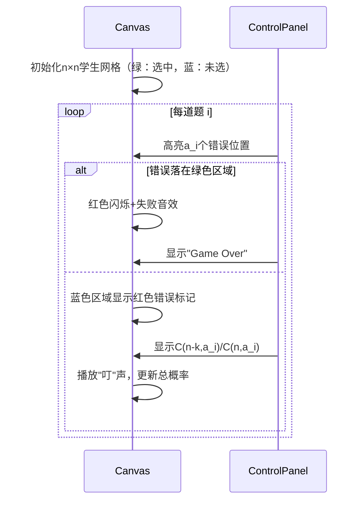

# 题目信息

# 考试

## 题目背景

人生有梦，各自精彩。

## 题目描述

有 $n$ 名同学去参加考试，考试有 $m$ 道题。

每个学生的实力是相同的，但是每道题的难度可能不同。第 $i$ 道题会有随机的 $a_i$ 名同学做错。

考试结束后，随机选出 $k$ 名同学，求出这些同学全部做对的概率。答案对 $998244353$ 取模。

## 说明/提示

**【样例解释】**

随机选出 $2$ 名同学全部做对的概率为 $\frac{243}{25000}$，对 $998244353$ 取模后答案为 $793364682$。

可以证明答案一定为有理数。若不了解有理数取模，可以参照[【模板】有理数取余](https://www.luogu.com.cn/problem/P2613)。

**【数据范围】**

- 对于 $30\%$ 的数据，$1\leq n,m \leq 10$；
- 另外有 $10\%$ 的数据，$k=0$；
- 另外有 $20\%$ 的数据，$1 \leq n \leq 1000$，$1\leq m \leq 10^5$；

对于所有数据，保证 $1\leq n,m\leq 10^5$，$0\leq k,a_i\leq n$。

## 样例 #1

### 输入

```
5 5 2
1 2 1 2 2```

### 输出

```
793364682```

# AI分析结果


### 💡 Kay的C++算法解析：考试 深入学习指南 💡

**引言**  
今天我们来分析「考试」这道C++编程题。题目要求计算随机选出k名同学全部答对m道题的概率。本指南将帮助你理解组合数学的核心思想，掌握模逆元技巧，并通过像素动画直观感受算法执行过程。

---

### 1. 题目解读与核心算法识别
✨ **本题主要考察**：组合数学与模逆元技巧  

🗣️ **初步分析**  
> 本题核心在于将概率问题转化为组合数计算，可类比为**多层抽奖模型**：从n名学生中抽取k名"中奖者"（全对），要求每道题的"错误券"（做错题的学生）必须全部落在未中奖区。  
> - **核心公式**：总概率 $P = \prod_{i=1}^{m} \frac{C(n-k, a_i)}{C(n, a_i)}$，其中$a_i$是第i题错误人数  
> - **关键难点**：  
>   - 大组合数取模运算（$n \leq 10^5$）  
>   - 特判无解情况（$a_i > n-k$时概率为0）  
> - **算法流程**：  
>   ```mermaid
>   graph TD
>     A[预处理阶乘数组] --> B[预处理阶乘逆元]
>     B --> C{遍历每道题}
>     C --> D[检测a_i>n-k?]
>     D --是--> E[输出0]
>     D --否--> F[计算C(n-k,a_i)/C(n,a_i)]
>     F --> G[累乘概率]
>   ```
> - **像素动画设计**：  
>   - 8-bit网格表示学生（绿：选中，蓝：未选，红：错误）  
>   - 逐题高亮错误分布，冲突时红色闪烁+失败音效  
>   - 成功时显示组合数公式弹窗，伴随"叮"声  

---

### 2. 精选优质题解参考
**题解一：听取MLE声一片**  
* **亮点**  
  - 思路直击核心：直接应用组合数比值公式，逻辑清晰  
  - 代码规范：模块化组合数函数，边界处理严谨（`C(n,m)`返回0处理无效参数）  
  - 高效实践：费马小定理求逆元，时间复杂度$O(n + m \log n)$  
  - 调试提示：强调线性求逆元优化空间（虽未实现但点明方向）  

**题解二：Nuyoah_awa**  
* **亮点**  
  - 防御性编程：检测到$a_i>n-k$立即退出，避免无效计算  
  - 教学友好：独立`qpow`函数实现，便于理解模逆元原理  
  - 代码可读性：变量命名明确（`MOD`常量全大写），缩进规范  

**题解三：Claire0918**  
* **亮点**  
  - 公式创新：将组合数转化为阶乘连乘，减少计算量  
  - 效率优化：分母部分统一计算$(\frac{n!}{(n-k)!})^m$的逆元  
  - 工程思维：主循环内集中处理特判，逻辑紧凑  

---

### 3. 核心难点辨析与解题策略
1. **概率模型转化**  
   * **难点**：理解"错误学生必须全在未选中区域"的约束条件  
   * **策略**：画网格图模拟小规模案例（如n=5,k=2,a_i=2）  
   * 💡 **学习笔记**：组合数比值本质是超几何分布的概率计算  

2. **大数组合数取模**  
   * **难点**：阶乘溢出与除法取模  
   * **策略**：  
     - 预处理$1! \sim n! \mod 998244353$  
     - 费马小定理求逆元：$a^{-1} \equiv a^{mod-2} \pmod{mod}$  
   * 💡 **学习笔记**：模数为质数时逆元存在唯一性  

3. **边界处理**  
   * **难点**：$a_i > n-k$导致组合数无定义  
   * **策略**：  
     - 优先检测$a_i$而非依赖组合数函数返回0  
     - 集中处理特判提升代码可读性  
   * 💡 **学习笔记**：防御性编程能避免隐蔽的除零错误  

✨ **解题技巧总结**  
- **分治建模**：将复杂概率分解为独立事件乘积  
- **空间换时间**：预处理$O(n)$阶乘表应对多次查询  
- **逆向思维**：当$a_i$过大时立即返回0，减少无效计算  
- **模块封装**：将组合数计算封装为独立函数  

---

### 4. C++核心代码实现赏析
**本题通用核心实现**  
```cpp
#include <iostream>
#define int long long
const int N = 1e5+10, mod = 998244353;
int f[N], g[N]; // 阶乘(f)和阶乘逆元(g)

int qpow(int x, int y) {
    int res = 1;
    while (y) {
        if (y & 1) res = res * x % mod;
        x = x * x % mod; y >>= 1;
    }
    return res;
}

int C(int n, int m) {
    if (m < 0 || n < m) return 0; // 边界处理
    return f[n] * g[m] % mod * g[n - m] % mod;
}

signed main() {
    // 预处理阶乘和逆元
    f[0] = g[0] = 1;
    for (int i = 1; i < N; i++) {
        f[i] = f[i-1] * i % mod;
        g[i] = qpow(f[i], mod - 2); // 费马小定理求逆
    }
    
    int n, m, k, ans = 1;
    std::cin >> n >> m >> k;
    for (int i = 0, a; i < m; i++) {
        std::cin >> a;
        if (a > n - k) { // 特判无解
            std::cout << 0;
            return 0;
        }
        ans = ans * C(n - k, a) % mod * qpow(C(n, a), mod - 2) % mod;
    }
    std::cout << ans;
}
```

**题解一核心代码解析**  
```cpp
ans = ans * C(n-k, a[i]) % mod * inv(C(n, a[i])) % mod;
```
> **逐行解读**：  
> 1. `C(n-k, a_i)`：计算未选中区容纳错误学生的方案数  
> 2. `inv(C(n, a_i))`：总方案的模逆元（除法转乘法）  
> 3. 累乘各题概率  
> **学习笔记**：模逆元是处理有理数取模的核心工具  

**题解三公式优化**  
```cpp
res = res * fac[n - a] % mod * inv(fac[n - a - k]) % mod;
res = res * inv(qpow(fac[n] * inv(fac[n-k]) % mod, m)) % mod;
```
> **数学推导**：  
> $\frac{C(n-k,a_i)}{C(n,a_i)} = \frac{(n-k)!(n-a_i)!}{n!(n-k-a_i)!}$  
> 分子分母约去$a_i!$后得到优化公式  
> **学习笔记**：组合恒等式能显著减少计算量  

---

### 5. 算法可视化：像素动画演示
**主题**：8-bit概率模拟器（复古考试风格）  

**核心演示流程**：  


**技术实现细节**：  
- **网格渲染**：Canvas绘制$10 \times 10$像素块，颜色编码：  
  ```javascript
  const COLOR_MAP = {
    SELECTED: '#00FF00',  // 绿：选中学生
    UNSELECTED: '#3498db',// 蓝：未选学生
    ERROR: '#e74c3c'     // 红：错误学生
  };
  ```
- **交互控制**：  
  - 步进按钮：`stepNext()`/`stepPrev()`  
  - 速度滑块：`document.getElementById("speed").onchange`  
- **音效设计**：  
  - 正确：8-bit上升音阶（Web Audio API）  
  - 错误：低音爆破声  
- **游戏化元素**：  
  - 每题为1关，通关显示$$\prod \frac{C_{n-k}^{a_i}}{C_n^{a_i}}$$  
  - 连续通关奖励分数倍增  

---

### 6. 拓展练习与相似问题思考
**通用技巧迁移场景**：  
1. 超几何分布概率计算（如抽奖问题）  
2. 容斥原理中的组合计数  
3. 随机事件独立性的数学证明  

**洛谷题目推荐**：  
1. [P2638 安全系统](https://www.luogu.com.cn/problem/P2638)  
   🗣️ 巩固组合数建模能力，练习状态设计  
2. [P2822 组合数问题](https://www.luogu.com.cn/problem/P2822)  
   🗣️ 掌握二维前缀和优化组合数查询  
3. [P3807 卢卡斯定理](https://www.luogu.com.cn/problem/P3807)  
   🗣️ 拓展大模数下的组合数计算方法  

---

### 7. 学习心得与经验分享
> **来自Nuyoah_wa的调试经验**：  
> "在实现组合数函数时，若不对$a_i>n-k$做显式检测，逆元计算可能触发除零错误。建议在主循环优先处理边界条件。"  
>   
> **Kay点评**：  
> 该经验直击模运算的核心风险点。在竞赛编程中，**防御性检测**应优于依赖函数内部处理，这对调试复杂逻辑尤为重要。  

---

**结语**  
通过本指南，你掌握了组合概率问题的核心解题框架。记住，将复杂问题分解为独立事件、善用预处理优化、严谨处理边界条件，是解决此类问题的关键。下次我们将探索更精彩的算法世界！💪

---
处理用时：266.64秒