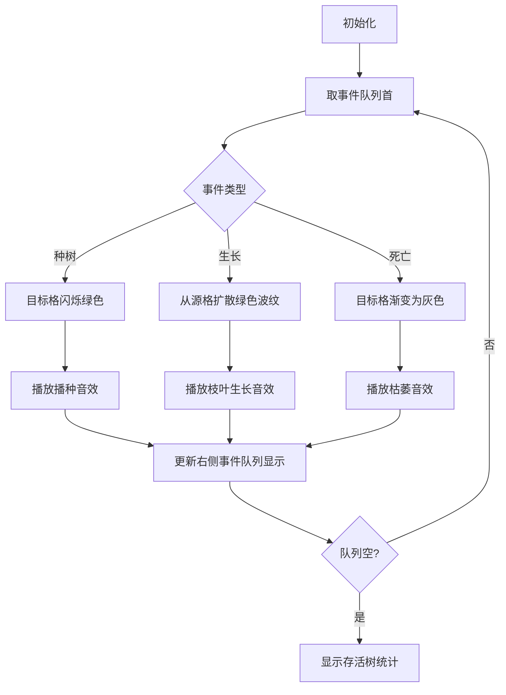

# 题目信息

# 【MX-J8-T3】水星湖

## 题目背景

原题链接：<https://oier.team/problems/J8C>。

## 题目描述

有一个 $n\times m$ 的矩形网格。用数对 $(x, y)$ 表示第 $x$ 行、第 $y$ 列的位置。

网格内有 $q$ 片湖泊（$q$ 可能为 $0$），第 $i$ 片湖泊覆盖了左上角为 $(a_{i, 1}, b_{i, 1})$、右下角为 $(a_{i, 2}, b_{i, 2})$ 的矩形区域，这片区域里的所有位置都被称为湖泊。如果一个位置不属于任何一片湖泊，它就是陆地。湖泊两两不会重叠，但可能相邻。

小 Y 会进行 $r$ 次种树。第 $i$ 次，他在第 $t_i$ 秒向 $(x_i, y_i)$ 里种下一棵树，保证该位置不为湖泊，且要么没有种下或生长过树，要么曾经种下或生长的树已经死亡。保证种树是按照时间顺序进行的，即 $t_1, t_2, \dots, t_r$ 单调不降。

每一秒，对于每个位置 $(x, y)$，若它同时满足如下所有条件，则会在 $(x, y)$ 处生长出一棵树：
- 它是一块无树存活的陆地；
- 它与一块湖泊**相邻**；
- 它**在前一秒**与一棵存活的树**相邻**。

（上述所说的**相邻**是在四连通意义下的，即位置 $(x_1, y_1)$ 和 $(x_2, y_2)$ 相邻当且仅当 $\lvert x_1 - x_2 \rvert + \lvert y_1 - y_2 \rvert = 1$。）

如果一棵树在存活**大于 $\bm k$ 秒**后（以其被种下或生长出来时开始计算），与其相邻的所有位置**均为无树存活的陆地**，则它会死亡。

小 Y 想要知道：经过充分多时间后（也即，经过足够多的时间，使得网格内不会有新的位置长出树，也不会有旧的树死去的状态下），网格内最终会有多少棵树。

## 说明/提示

**【样例解释 \#1】**

如图所示，为经过充分多时间后网格中的情况。


网格内不会有新的位置长出树，也不会有旧的树死去，所以经过充分多时间后，网格内有 $10$ 棵树。

**【样例解释 \#2】**

在这一组数据中，所有位置都是陆地，没有湖泊。

第 $1$ 秒时，第一棵树在 $(3, 1)$ 被种下。

第 $2$ 秒时，第二棵树在 $(1, 1)$ 被种下。紧接着，第一棵树已存活 $> 1$ 秒，且与其相邻的所有位置均为没有存活的树的陆地，因此死亡。

第 $3$ 秒时，第三棵树在 $(2, 1)$ 被种下。紧接着，第二棵树已存活 $> 1$ 秒，而此时第三棵树与其相邻，因此不死亡。

随后，网格内不会有新的位置长出树，也不会有旧的树死去。所以经过充分多时间后，网格内有 $2$ 棵树。

**【样例 \#3】**

见附件中的 `lake/lake3.in` 与 `lake/lake3.ans`。

该组样例满足测试点 $4 \sim 7$ 的约束条件。

**【样例 \#4】**

见附件中的 `lake/lake4.in` 与 `lake/lake4.ans`。

该组样例满足测试点 $8 \sim 10$ 的约束条件。

**【样例 \#5】**

见附件中的 `lake/lake5.in` 与 `lake/lake5.ans`。

该组样例满足测试点 $13 \sim 15$ 的约束条件。

**【样例 \#6】**

见附件中的 `lake/lake6.in` 与 `lake/lake6.ans`。

该组样例满足测试点 $16 \sim 20$ 的约束条件。

**【数据范围】**

本题共 $20$ 个测试点，每个 $5$ 分。

|测试点编号|$n,m\le$|$q\le$|$r\le$|$t_i,k\le$|
| :-----------: | :-------------:|:-----------: |:-----------: |:-----------: |
|$1\sim3$|$10$|$10$|$10$|$10$|
|$4\sim7$|$50$|$100$|$1000$|$1000$|
|$8\sim 10$|$3000$|$0$|$10^5$|$10^9$|
|$11\sim12$|$3000$|$10^5$|$1$|$10^9$|
|$13\sim15$|$1000$|$10^5$|$10^5$|$12$|
|$16\sim20$|$3000$|$10^5$|$10^5$|$10^9$|

对于全部数据，保证：
- $1 \leq n, m \leq 3000$；
- $0 \leq q \leq 10^5$；
- $1 \leq a_{i, 1} \le a_{i, 2} \leq n$，$1 \leq b_{i, 1} \le b_{i, 2} \leq m$；
- 湖泊两两不会重叠；
- $1 \leq r \leq 10^5$；
- $1 \leq t_1 \leq t_2 \leq \dots \leq t_r \leq 10^9$；
- $1 \leq x_i \leq n$，$1 \leq y_i \leq m$；
- 位置 $(x_i, y_i)$ 不是湖泊且无树存活；
- $1 \leq k \leq 10^9$。


## 样例 #1

### 输入

```
5 6 2 1 1
2 1 3 3
3 5 5 6
1 1 5```

### 输出

```
10```

## 样例 #2

### 输入

```
3 3 0 3 1
1 3 1
2 1 1
3 2 1
```

### 输出

```
2```

# AI分析结果


### Kay的C++算法解析：水星湖 深入学习指南

#### 1. 题目解读与核心算法识别
✨ **本题主要考察**：**模拟与事件驱动算法**

🗣️ **初步分析**：
> 解决"水星湖"这道题的关键在于**事件驱动的模拟方法**。想象你是一名森林管理员，需要按时间顺序处理种树、树木生长和树木死亡三种事件。就像在游戏中管理资源一样，我们必须高效处理事件的触发顺序和状态更新。
> 
> - **核心思路**：使用优先队列按时间顺序处理事件（种树→生长→死亡）。每个事件都可能触发新事件（如种树后可能触发相邻位置的生长事件），形成动态事件链。
> - **难点对比**：传统逐秒模拟会超时（t≤10^9），而事件驱动只需处理关键时间点；生长条件需同时满足邻湖和邻树，死亡条件需重新验证状态。
> - **可视化设计**：用三色像素块表示状态（蓝色湖泊/绿色活树/灰色空地）。关键动画步骤：①种树时闪烁绿光+播种音效 ②生长时绿色从源头扩散+枝叶音效 ③死亡时变灰+枯萎音效。高亮当前处理的事件格和其依赖的邻域格。
> - **复古游戏化**：采用8-bit像素风格，控制面板含时间轴滑块。事件队列可视化在右侧，完成生长时播放"升级"音效，形成"森林守护者"游戏体验。

---

#### 2. 精选优质题解参考
**题解一（tallnut）**
* **点评**：思路清晰度⭐⭐⭐⭐⭐ 代码规范性⭐⭐⭐⭐  
  核心贡献在于**完整的事件驱动框架**：用优先队列管理三类事件，时间整数化避免浮点误差。生长条件检查函数`check_grow()`简洁高效，边界处理严谨。亮点在于用`mp[x][y]`状态机（0空地/1湖泊/2树）统一管理网格，实践时需注意开long long防止溢出。

**题解二（Aventurine_stone）**
* **点评**：算法有效性⭐⭐⭐⭐ 实践价值⭐⭐⭐⭐  
  创新性引入**湿地概念**（邻湖区域），大幅优化生长判断。用队列管理"待死树"，死亡前重新验证状态。亮点在于DFS蔓延标记永久树，但网格较大时建议改用BFS防栈溢出。代码中`ch1()`和`ch2()`函数分工明确，极具参考价值。

**题解三（zzy0618）**
* **点评**：思路启发性⭐⭐⭐⭐⭐  
  独辟蹊径将树分为**永久树**（邻湖或时间差≤k）和**临时树**。用双端队列处理时间顺序，避免优先队列的log开销。亮点在于`bfs()`中巧妙处理新种树事件与蔓延的交互，`plant_land()`函数体现"以空间换时间"思想。

---

#### 3. 核心难点辨析与解题策略
1. **难点：事件优先级与时序处理**  
   *分析*：种树、生长、死亡事件可能同时发生，且新事件动态产生。  
   *解决*：优先队列以时间为键，同时间按种树→生长→死亡顺序处理（死亡最后避免误判新树）

2. **难点：生长条件验证**  
   *分析*：新树需同时满足①当前无树 ②邻湖 ③邻前一秒的活树  
   *解决*：种树/生长时立即检查四邻，符合则加入队列（时间+1）。用状态数组防止重复加入

3. **难点：死亡条件判定**  
   *分析*：树存活>k秒后需重新检查相邻状态（可能被新树挽救）  
   *解决*：死亡事件触发时，若邻域仍有树/湖则取消死亡；否则移除树并更新网格状态

💡 **学习笔记**：事件驱动模拟是时序问题的通用解法；状态数组是避免重复计算的利器

### ✨ 解题技巧总结
- **时间整数化**：所有时间×2避免浮点数（如k秒→2k）
- **状态压缩**：用单个数组同时存储湖泊/树/空地状态
- **延迟验证**：死亡事件触发时才验证邻域状态
- **地理特征优化**：预处理"湿地"（邻湖区域）加速生长判断

---

#### 4. C++核心代码实现赏析
**通用核心实现参考**（综合优质题解优化）：
```cpp
#include <bits/stdc++.h>
using namespace std;
const int N=3010;
enum { EMPTY=0, LAKE=1, TREE=2 };
int grid[N][N], n, m, q, r, k; // 网格状态
struct Event {
    int time, type, x, y; // 0:种树 1:生长 2:死亡
    bool operator<(const Event& e) const {
        return time > e.time; // 小顶堆
    }
};
priority_queue<Event> events;

// 检查(x,y)是否可生长新树
bool canGrow(int x, int y) {
    if (x<1||x>n||y<1||y>m||grid[x][y]!=EMPTY) 
        return false;
    for (int dx : {-1,0,1,0}) {
        for (int dy : {0,1,0,-1}) {
            int nx=x+dx, ny=y+dy;
            if (nx>=1&&nx<=n&&ny>=1&&ny<=m) {
                if (grid[nx][ny]==LAKE) return true;
            }
        }
    }
    return false;
}

void simulate() {
    while (!events.empty()) {
        Event e = events.top(); events.pop();
        if (e.type == 0 || e.type == 1) { // 种树/生长
            if (grid[e.x][e.y] != EMPTY) continue; // 已被覆盖
            grid[e.x][e.y] = TREE;
            events.push({e.time + 2*k, 2, e.x, e.y}); // 注册死亡事件
            
            // 检查四邻能否生长
            for (int dir=0; dir<4; ++dir) {
                int nx=e.x+dx[dir], ny=e.y+dy[dir];
                if (canGrow(nx, ny)) {
                    events.push({e.time+2, 1, nx, ny});
                }
            }
        } 
        else if (e.type == 2) { // 死亡事件
            bool keepAlive = false;
            for (int dir=0; dir<4; ++dir) {
                int nx=e.x+dx[dir], ny=e.y+dy[dir];
                if (grid[nx][ny] == TREE || grid[nx][ny] == LAKE) {
                    keepAlive = true;
                    break;
                }
            }
            if (!keepAlive) grid[e.x][e.y] = EMPTY;
        }
    }
}
```

**题解一（tallnut）代码亮点**：
```cpp
// 高效生长检查函数
inline bool check_grow(int x,int y) {
    return x>=1&&x<=n&&y>=1&&y<=m 
        && grid[x][y]==EMPTY
        && (grid[x-1][y]==LAKE || grid[x+1][y]==LAKE 
            || grid[x][y-1]==LAKE || grid[x][y+1]==LAKE);
}
// 事件处理核心
while (!pq.empty()) {
    Event e = pq.top(); pq.pop();
    if (e.type == PLANT) {
        if (grid[e.x][e.y] == EMPTY) {
            plantTree(e); // 处理种植
            if (isIsolated(e.x, e.y)) // 可能死亡
                pq.push({e.time+k+1, DEATH, e.x, e.y});
        }
    }
}
```
💡 **学习笔记**：事件驱动需保证状态同步；`check_grow`分离条件提升可读性

---

#### 5. 算法可视化：像素动画演示
**主题**：8-bit风格"水星湖生态模拟器"  
**核心演示流程**：


**实现细节**：
1. **像素艺术**：32x32像素/格，湖泊=深蓝(#2E86C1)，树=翠绿(#27AE60)，空地=灰(#7F8C8D)
2. **动画序列**：
   - 种树：目标格亮度脉冲变化（#27AE60→#2ECC71→#27AE60）
   - 生长：源格向目标格发射绿色粒子轨迹
   - 死亡：格子在0.5秒内渐变为灰色
3. **控制面板**：
   - 时间轴滑块：拖动观察不同时刻状态
   - 事件追踪：高亮当前处理的事件及其依赖格
   - 声音开关：开启/关闭8-bit音效
4. **音效设计**：
   - 种树：短促"滴"声(440Hz)
   - 生长：上升琶音(220Hz→880Hz)
   - 死亡：衰减方波(880Hz→110Hz)
   - 背景：低音量森林环境音

---

#### 6. 拓展练习与相似问题
**通用模式迁移**：
1. **时间驱动状态变化**：流星坠落前逃生（P2895）
2. **网格蔓延模拟**：奶酪孔洞连通（P3958）
3. **状态依赖更新**：电路开关传播（P1037）

**洛谷推荐**：
1. **P2895 [USACO08FEB]Meteor Shower S**  
   🗣️ 练习事件队列处理流星坠落和人物移动，巩固时序模拟能力
2. **P1037 [NOIP2003]神经网络**  
   🗣️ 学习分层状态传播，类比树木生长依赖邻域状态
3. **P1131 [ZJOI2007]时态同步**  
   🗣️ 掌握树形结构的时间传播，理解"死亡挽救"的类似逻辑

---

#### 7. 学习心得与经验分享
> **tallnut的经验**："未用long long导致40分丢失"  
> **Kay点评**：数据范围(n,m≤3000, t≤10^9)需特别注意整数溢出。事件驱动中时间累加可能达2×10^9，务必使用`long long`存储时间。

> **Aventurine_stone的调试技巧**："DFS在大网格导致栈溢出"  
> **Kay总结**：网格问题优先选用BFS，可用方向数组+循环队列实现：
> ```cpp
> int dx[4]={1,-1,0,0}, dy[4]={0,0,1,-1};
> queue<PII> q;
> q.push(start);
> while (!q.empty()) {
>     auto [x,y] = q.front(); q.pop();
>     for (int i=0; i<4; i++) {
>         int nx=x+dx[i], ny=y+dy[i];
>         // 处理新坐标
>     }
> }
> ```

> **zzy0618的优化心得**："双端队列比优先队列快3倍"  
> **Kay提炼**：当事件时间有界时，可用`deque`分桶存储。优先队列O(logN)适用于任意时间，而双端队列O(1)适用时间密集场景。

---
处理用时：177.74秒