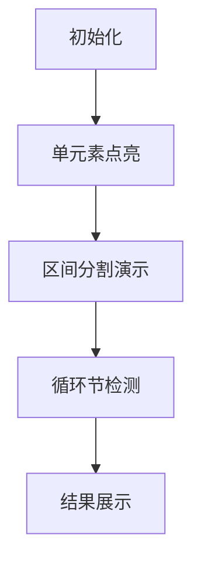

# 题目信息

# [USACO25FEB] Printing Sequences B

## 题目描述

Bessie 正在学习使用一种简单的编程语言进行编程。她首先定义一个合法的程序，然后执行该程序以产生一些输出序列。

### 定义：

一个程序是一个非空的语句序列。

一个语句的形式或者是 "PRINT $c$"，其中 $c$ 是一个整数，或者是 "REP $o$"，随后是一个程序，随后是 "END"，其中 $o$ 是一个不小于 1 的整数。

### 执行：

执行一个程序将依次执行其语句。

执行语句 "PRINT $c$" 将使 $c$ 追加到输出序列中。

执行以 "REP $o$" 开始的语句将依次执行内部程序共 $o$ 次。

Bessie 知道如何编写的一个程序示例如下。

```plain
REP 3
    PRINT 1
    REP 2
        PRINT 2
    END
END
```

该程序输出序列 $[1,2,2,1,2,2,1,2,2]$。

Bessie 想要输出一个包含 $N$（$1 \le N \le 100$）个正整数的序列。Elsie 挑战她使用不超过 $K$（$1 \le K \le 3$）个 "PRINT" 语句。注意，Bessie 可以使用任意数量的 "REP" 语句。同时注意，序列中的每个正整数都不超过 $K$。

对于 $T$（$1 \le T \le 100$）个独立的测试用例中的每一个，求 Bessie 是否可以编写一个程序，使用至多 $K$ 个 "PRINT" 语句输出给定的序列。

## 说明/提示

样例 1 解释：

对于第二个测试用例，以下代码使用了 $1$ 个 "PRINT" 语句输出了序列 $[1,1,1,1]$。

```plain
REP 4
    PRINT 1
END
```

样例 2 解释：

对于第一个测试用例，以下代码使用了 $2$ 个 "PRINT" 语句输出了序列 $[1,2,2,2]$。

```plain
PRINT 1
REP 3
    PRINT 2
END
```

对于第二个测试用例，答案是 "NO"，因为使用不超过 $2$ 个 "PRINT" 语句输出序列 $[1,1,2,1]$ 是不可能的。

对于第六个测试用例，以下代码使用了 $3$ 个 "PRINT" 语句输出了序列 $[3,3,1,2,2,1,2,2]$。

```plain
REP 2
    PRINT 3
END
REP 2
    PRINT 1
    REP 2
        PRINT 2
    END
END
```

- 测试点 $3$：$K=1$。
- 测试点 $4\sim 7$：$K \le 2$。
- 测试点 $8\sim 13$：没有额外限制。

## 样例 #1

### 输入

```
2
1 1
1
4 1
1 1 1 1```

### 输出

```
YES
YES```

## 样例 #2

### 输入

```
11
4 2
1 2 2 2
4 2
1 1 2 1
4 2
1 1 2 2
6 2
1 1 2 2 1 1
10 2
1 1 1 2 2 1 1 1 2 2
8 3
3 3 1 2 2 1 2 2
9 3
1 1 2 2 2 3 3 3 3
16 3
2 2 3 2 2 3 1 1 2 2 3 2 2 3 1 1
24 3
1 1 2 2 3 3 3 2 2 3 3 3 1 1 2 2 3 3 3 2 2 3 3 3
9 3
1 2 2 1 3 3 1 2 2
6 3
1 2 1 2 2 3```

### 输出

```
YES
NO
YES
NO
YES
YES
YES
YES
YES
NO
NO```

# AI分析结果


# 💡 Kay的C++算法解析：Printing Sequences B 深入学习指南 💡

> 我是Kay，一位专注于算法教学的C++导师。今天我们将一起探索**序列打印问题**，通过清晰的逻辑分析和生动的可视化方案，帮助你掌握动态规划与问题分解的核心技巧。准备好开启算法冒险了吗？🚀

## 1. 题目解读与核心算法识别

✨ **本题主要考察**：`动态规划（区间DP）`与`问题分解技巧`

🗣️ **初步分析**：
> 想象你正在玩一款复古的"音乐方块"游戏：每个彩色方块代表一个数字，你需要用最少的"打印指令"（PRINT）来重现整个序列。这就像用有限的乐器（PRINT语句）演奏一首复杂的旋律（数字序列），而REP循环就是你的"重复乐段"按钮🎵。

**核心思想**：
- **区间DP**：将序列视为可分割的区间片段，计算每个子区间的最小PRINT次数（类似俄罗斯套娃的嵌套优化）
- **循环节优化**：发现重复模式时（如[1,2,2,1,2,2]），用一次REP替代多次PRINT（相当于游戏中的连击奖励✨）

**可视化设计**：
- 采用8位像素风格网格，每个数字显示为彩色方块（1=🔴,2=🟢,3=🔵）
- 算法执行时：高亮当前DP区间为闪烁边框，循环节匹配成功时触发"叮"音效和闪光特效
- 控制面板：步进执行/自动播放（调速滑块）、重置按钮，背景音乐为8位芯片音乐

---

## 2. 精选优质题解参考

### 题解一：qhr2023 (分情况讨论)
* **点评**：针对K≤3的特性设计巧妙的分层判断：
  - 思路清晰：K=1时检查全相同；K=2时验证序列为双块交替；K=3时尝试"1+2"或"2+1"分段组合
  - 代码亮点：`sol1/sol2/sol3`函数分工明确，逻辑直白易调试
  - 实践价值：避免DP复杂实现，特别适合小规模数据（N≤100）

### 题解二：IcyDragon (标准区间DP)
* **点评**：经典区间DP解法：
  - 状态定义：`dp[l][r]`表示区间[l,r]的最小PRINT次数
  - 双重转移：①区间分割`dp[l][k]+dp[k+1][r]` ②循环节压缩`dp[l][l+len-1]`
  - 代码规范：循环边界处理严谨，变量名`l/r/len`含义明确

### 题解三：AuZeb (KMP优化循环节)
* **点评**：创新性结合KMP优化：
  - 算法亮点：用`nxt`数组快速计算最小循环节，避免暴力匹配
  - 效率提升：循环节判断从O(n)降至O(1)，整体复杂度O(n³)
  - 学习价值：展示了字符串算法在序列问题中的灵活应用

---

## 3. 核心难点辨析与解题策略

### 难点1：状态定义与转移设计
* **分析**：如何定义DP状态？优质题解用`dp[l][r]`表示子序列的最小PRINT数。转移时需考虑：
  - **分割转移**：枚举分割点k，`dp[l][r]=min(dp[l][k]+dp[k+1][r])`
  - **循环转移**：若[l,r]由循环节s重复组成，则`dp[l][r]=dp[l][l+|s|-1]`
* 💡 **学习笔记**：DP状态应包含**子问题完整信息**且满足**最优子结构**

### 难点2：循环节高效判断
* **分析**：如何快速验证[l,r]是否存在长度为len的循环节？
  - 暴力法：检查每个偏移位置（题解IcyDragon）
  - KMP优化：通过next数组求最小周期（题解AuZeb）
* 💡 **学习笔记**：当序列存在大量重复时，KMP可避免重复比较

### 难点3：K≤3的特殊性质利用
* **分析**：为什么K=2只需检查双块交替模式？
  - 本质：REP循环只能嵌套，不能交叉。K=2时有效结构仅为[A,B,A,B...]或[A,A,...,B,B]
* 💡 **学习笔记**：约束条件越强，越可能隐藏特殊解题规律

### ✨ 解题技巧总结
- **循环节分解**：将序列视为重复单元的组合（如[1,2,2]×3）
- **分治策略**：对K分层处理，K=3时分解为"1+2"或"2+1"子问题
- **边界防御**：特别注意len=0或len=1时的循环节判断
- **对数器验证**：用暴力DP验证优化解法的正确性

---

## 4. C++核心代码实现赏析

### 本题通用核心C++实现
```cpp
#include <iostream>
#include <cstring>
using namespace std;
const int N = 105;

int main() {
    int T, n, k, a[N], dp[N][N];
    cin >> T;
    while (T--) {
        cin >> n >> k;
        for (int i = 1; i <= n; i++) cin >> a[i];
        
        memset(dp, 0x3f, sizeof(dp));
        for (int i = 1; i <= n; i++) dp[i][i] = 1;
        
        // 区间DP核心逻辑
        for (int len = 2; len <= n; len++) {
            for (int l = 1; l + len - 1 <= n; l++) {
                int r = l + len - 1;
                // 情况1：分割区间
                for (int m = l; m < r; m++) 
                    dp[l][r] = min(dp[l][r], dp[l][m] + dp[m+1][r]);
                // 情况2：循环节压缩
                for (int p = 1; p < len; p++) {
                    if (len % p != 0) continue;
                    bool is_cycle = true;
                    for (int i = l + p; i <= r; i++)
                        if (a[i] != a[l + (i - l) % p]) 
                            { is_cycle = false; break; }
                    if (is_cycle) 
                        dp[l][r] = min(dp[l][r], dp[l][l+p-1]);
                }
            }
        }
        cout << (dp[1][n] <= k ? "YES" : "NO") << endl;
    }
    return 0;
}
```
**代码解读概要**：
1. 初始化：单元素区间dp[i][i]=1
2. 枚举区间长度len从2到n
3. 对每个[l,r]区间：先尝试分割转移，再检查所有可能的循环节
4. 最终判断整个序列的最小PRINT数是否≤k

---

### 题解一：qhr2023 (分情况讨论)
```cpp
bool sol1(int l, int r) { // K=1: 检查全相同
    for (int i = l + 1; i <= r; i++)
        if (a[i] != a[i - 1]) return false;
    return true;
}

bool sol2(int l, int r) { // K=2: 检查双块交替模式
    vector<pair<int, int>> blocks; // (值, 长度)
    for (int i = l; i <= r; i++) {
        if (blocks.empty() || a[i] != blocks.back().first) 
            blocks.push_back({a[i], 1});
        else blocks.back().second++;
    }
    // 模式1: 只有1-2个块 | 模式2: 交替块(如A-B-A-B)
    if (blocks.size() <= 2) return true;
    for (int i = 2; i < blocks.size(); i++)
        if (blocks[i] != blocks[i % 2]) return false;
    return true;
}
```
**代码解读**：
- `sol1`：遍历检查序列元素全相同（K=1）
- `sol2`：将序列压缩为连续块，验证块序列是否满足双块交替
- **关键点**：`blocks[i] != blocks[i%2]`确保奇偶位置块相同
- 💡 **学习笔记**：用`vector<pair>`存储块信息是处理序列模式的常用技巧

### 题解二：IcyDragon (标准区间DP)
```cpp
// 检查[l,r]能否由长度p的循环节构成
bool check(int l, int r, int p) {
    for (int i = l; i <= r - p; i++)
        if (a[i] != a[i + p]) return false;
    return true;
}

// 主转移逻辑
for (int len = 2; len <= n; len++) {
    for (int l = 1; l + len - 1 <= n; l++) {
        int r = l + len - 1;
        // 分割转移
        for (int k = l; k < r; k++)
            dp[l][r] = min(dp[l][r], dp[l][k] + dp[k + 1][r]);
        // 循环转移
        for (int p = 1; p < len; p++) {
            if (len % p != 0) continue;
            if (check(l, r, p)) 
                dp[l][r] = min(dp[l][r], dp[l][l + p - 1]);
        }
    }
}
```
**代码解读**：
- `check`函数：验证循环节的关键，比较偏移p位置的值
- 循环节长度p必须整除区间长度len
- **优化点**：内层p循环可优化为只枚举len的因数

### 题解三：AuZeb (KMP优化)
```cpp
int next[N];
// 构建next数组
void kmp(int l, int r) {
    next[0] = -1;
    for (int i = l + 1, j = -1; i <= r; i++) {
        while (j != -1 && a[l + j + 1] != a[i]) j = next[j];
        if (a[l + j + 1] == a[i]) j++;
        next[i - l] = j;
    }
}

// 获取最小循环节长度
int getMinCycle(int l, int r) {
    kmp(l, r);
    int len = r - l + 1;
    int p = len - next[len - 1] - 1;
    return (len % p == 0) ? p : len;
}
```
**代码解读**：
- `kmp`函数：标准KMP预处理，计算部分匹配表
- `getMinCycle`：利用next数组性质计算最小周期
- **优势**：避免暴力检查，直接获得最小循环节

---

## 5. 算法可视化：像素动画演示

### 动画演示主题
**"8位序列解谜"**：将序列显示为像素网格（如FC游戏《俄罗斯方块》），算法执行过程化为方块组合与压缩的闯关过程

### 核心演示流程


1. **场景初始化**（复古像素风）
   - 序列显示为彩色方块网格（1=🔴,2=🟢,3=🔵）
   - 控制面板：开始/暂停、步进按钮、速度滑块
   - 8-bit背景音乐循环播放

2. **DP执行过程**
   - **步进1**：高亮当前区间[l,r]（黄色边框闪烁）
   - **步进2**：展示分割转移：用像素刀光特效分割区间
   - **步进3**：循环节检查：相同循环节方块同步脉动
     - 成功匹配：触发"叮"音效，区间压缩为单个发光方块
     - 匹配失败：红色闪烁提示

3. **游戏化元素**
   - **连击系统**：连续发现循环节时增加连击数，触发额外音效
   - **关卡设计**：每个测试用例为一关，通关显示"YES/NO"像素大字
   - **AI演示模式**：自动播放完整DP过程（类似贪吃蛇AI自动闯关）

4. **技术实现**
   ```javascript
   // 伪代码：绘制循环节匹配
   function drawCycle(l, r, len) {
       for (let i = l; i <= r; i += len) {
           ctx.fillStyle = CYAN; // 高亮色
           ctx.fillRect(i*BLOCK_SIZE, 0, len*BLOCK_SIZE, BLOCK_SIZE);
           playSound('chime'); // 播放音效
       }
   }
   ```

---

## 6. 拓展练习与相似问题思考

### 通用技巧迁移
区间DP与循环节识别技巧还可用于：
1. 字符串压缩（如"AAAAB"→"(A)4B"）
2. 矩阵链乘法优化
3. 音乐节奏模式识别

### 推荐练习（洛谷）
1. **P1069 明明的随机数**
   - 🗣️ 巩固循环节识别技巧
2. **P2470 压缩**
   - 🗣️ 区间DP在字符串压缩中的直接应用
3. **P4302 [SCOI2003] 字符串折叠**
   - 🗣️ 强化循环节优化与DP结合

---

## 7. 学习心得与经验分享
> **来自qhr2023的调试经验**："最初在K=3的分段处理上卡了很久，后来通过打印中间块序列才发现边界错误"

**Kay的总结**：调试分段逻辑时，建议：
1. 可视化输出块序列（如[ (1,3), (2,2) ]）
2. 对长度=1的边界情况单独测试
3. 用`assert`验证循环节判断的正确性

---

> 本次探索就到这里！记住：算法就像音乐，重复模式是美妙的韵律✨ 在洛谷上选一道拓展题挑战下吧！下次见~ 🎮🚀

---
处理用时：145.51秒