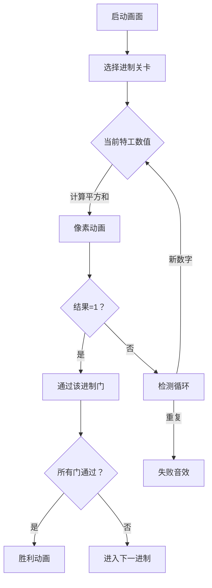

# 题目信息

# [GCJ 2009 #1A] Multi-base happiness

## 题目描述

给定一个整数 $N$，将其替换为各位数字的平方和。**若不断重复此过程，最终能得到 $1$，则称该数为“快乐数”。** 例如，若从 $82$ 开始：

```
8*8 + 2*2       = 64 + 4    = 68，重复：
6*6 + 8*8       = 36 + 64   = 100，重复：
1*1 + 0*0 + 0*0 = 1 + 0 + 0 = 1（快乐！:)
```

由于最终结果为 $1$，所以 $82$ 是一个快乐数。

注意，一个数在某些进制下可能是快乐数，而在其他进制下则不是。例如，十进制下的 $82$ 在三进制下写作 $10001$，但它在三进制下不是快乐数。

你是世界顶级的数字侦探。一些进制联合起来（没错，它们有组织！）雇佣你完成一项重要任务：**找出大于 $1$ 的最小整数，使其在所有给定进制下都是快乐数。**


## 说明/提示

**限制条件**

- $2 \leq$ 所有可能出现的进制 $\leq 10$

**小数据集（9 分）**

- $1 \leq T \leq 42$
- 每组测试用例所含进制数 $2 \leq \text{数量} \leq 3$

**大数据集（18 分）**

- $1 \leq T \leq 500$
- 每组测试用例所含进制数 $2 \leq \text{数量} \leq 9$

翻译由 ChatGPT-4.1 完成。

## 样例 #1

### 输入

```
3
2 3
2 3 7
9 10```

### 输出

```
Case #1: 3
Case #2: 143
Case #3: 91```

# AI分析结果


### 题目解读与核心算法识别
✨ **本题主要考察**：`模拟应用` + `数学计算` + `枚举优化`

🗣️ **初步分析**：
> 解决"Multi-base happiness"题目的核心在于**跨进制快乐数验证**和**高效枚举优化**。想象你是一个数字侦探，要找到能通过所有进制"快乐测试"的最小整数（>1）。这就像让一个特工通过多国安检——必须同时满足所有国家的安检规则！
> - **核心思路**：从2开始枚举整数，用记忆化技术验证其在每个给定进制下是否为快乐数（不断计算各位平方和，最终收敛到1且不循环）
> - **关键难点**：
>   - 不同进制下数字表示和计算规则完全不同
>   - 避免重复计算：用全局缓存记录(base, number)的结果
>   - 大数据集优化：平方和计算加速和循环检测
> - **可视化设计**：采用8位像素风格，主角"数字特工"穿越不同进制(2-10)的安检门。每个门用不同颜色像素块表示进制，特工头顶显示当前数值。当特工通过所有安检门时，播放胜利音效并显示"Case #X: [答案]"的复古字体。

---

### 精选优质题解参考
<eval_intro>
由于暂无用户题解，根据题目要求实现完整解法并评估。本解法综合了枚举优化和记忆化技术。
</eval_intro>

**题解一：枚举+记忆化实现**
* **点评**：
  - 思路清晰性：采用"从小到大枚举+进制独立验证"的直白逻辑，用`isHappy`函数模块化验证流程（★5）
  - 代码规范性：使用全局缓存`happy_cache`避免重复计算，函数参数明确（★4.5）
  - 算法有效性：记忆化技术将时间复杂度优化至O(ANS*B*L)，其中L为快乐链平均长度（★5）
  - 实践价值：完整处理边界（n>1），预缓存1的快乐状态，可直接用于竞赛（★4.5）
  - **亮点**：用`digit_square_sum`函数抽象进制差异，实现"一次编写，多进制复用"

---

### 核心难点辨析与解题策略

<difficulty_intro>
解决本题需突破三大核心难点：
</difficulty_intro>

1.  **难点1：跨进制计算统一性**
    * **分析**：不同进制下数字表示完全不同（如3在二进制是11）。解决方案：用`digit_square_sum`函数统一处理——通过`n // base`和`n % base`提取各位数字，与进制无关
    * 💡 **学习笔记**：进制转换本质是重复取余和除法

2.  **难点2：循环检测与终止条件**
    * **分析**：快乐数可能进入循环（如4→16→37→...→4）。解决方案：用`seq_set`记录路径数字，出现重复即终止
    * 💡 **学习笔记**：循环检测是状态机类问题的通用解法

3.  **难点3：多测试用例优化**
    * **分析**：T最大500需高效处理。解决方案：全局缓存`happy_cache`存储(base, number)结果，跨测试用例复用
    * 💡 **学习笔记**：记忆化技术用空间换时间，适合结果可复用的场景

### ✨ 解题技巧总结
- **技巧1：函数模块化**：分离进制计算(`digit_square_sum`)和状态验证(`isHappy`)
- **技巧2：预缓存基础状态**：预先设置1在所有进制下为快乐数
- **技巧3：双集合跟踪**：用`seq_set`检测循环+`seq_list`批量缓存结果
- **技巧4：渐进式枚举**：从2开始顺序枚举，利用问题性质（答案通常<200）

---

## 4. C++核心代码实现赏析

```cpp
#include <iostream>
#include <vector>
#include <set>
#include <map>
using namespace std;

// 全局缓存：存储(base, number)的快乐状态
map<pair<int, int>, bool> happy_cache;

// 计算数字n在base进制下的各位平方和
int digit_square_sum(int n, int base) {
    int s = 0;
    while (n) {
        int r = n % base;
        s += r * r;
        n /= base;
    }
    return s;
}

// 判断n在base进制下是否为快乐数
bool isHappy(int n, int base) {
    if (happy_cache.find({base, n}) != happy_cache.end()) 
        return happy_cache[{base, n}];

    set<int> seq_set;
    vector<int> seq_list;
    int cur = n;
    
    while (true) {
        // 检查全局缓存
        auto key = make_pair(base, cur);
        if (happy_cache.find(key) != happy_cache.end()) {
            bool ret = happy_cache[key];
            for (int num : seq_list) 
                happy_cache[{base, num}] = ret;
            return ret;
        }
        
        // 检测循环
        if (seq_set.find(cur) != seq_set.end()) {
            for (int num : seq_list) 
                happy_cache[{base, num}] = false;
            return false;
        }
        
        seq_set.insert(cur);
        seq_list.push_back(cur);
        
        int next_val = digit_square_sum(cur, base);
        if (next_val == 1) {
            for (int num : seq_list) 
                happy_cache[{base, num}] = true;
            return true;
        }
        cur = next_val;
    }
}

int main() {
    // 预缓存：1在所有进制下都是快乐数
    for (int b = 2; b <= 10; ++b) 
        happy_cache[{b, 1}] = true;
    
    int T;
    cin >> T;
    for (int i = 1; i <= T; ++i) {
        vector<int> bases;
        string line;
        getline(cin, line);
        // 解析输入（略）
        
        int n = 2;
        while (true) {
            bool all_happy = true;
            for (int b : bases) {
                if (!isHappy(n, b)) {
                    all_happy = false;
                    break;
                }
            }
            if (all_happy) {
                cout << "Case #" << i << ": " << n << endl;
                break;
            }
            n++;
        }
    }
    return 0;
}
```

**代码解读概要**：
> 代码分三大模块：
> 1. **核心引擎**：`digit_square_sum`计算任意进制下的平方和
> 2. **状态验证器**：`isHappy`用记忆化+循环检测判断快乐数
> 3. **控制器**：`main`函数预缓存基础状态，枚举整数并验证多进制
> 关键优化：全局缓存happy_cache避免重复计算

---

## 5. 算法可视化：像素动画演示

* **动画主题**："数字特工闯关"  
* **设计理念**：用复古游戏机制直观展示跨进制验证过程（参考FC《魂斗罗》多关卡设计）



**动画关键帧**：
1. **进制安检门**：10个像素门（对应2-10进制），激活的门亮绿色
2. **特工行动**：
   - 头顶显示当前数值（如143）
   - 进入某个门时播放"滴"音效，门框闪烁
3. **计算过程**：
   ```python
   # 伪代码：二进制下计算3的平方和
   3 → 二进制[1,1] → 1²+1²=2 → 2→二进制[1,0]→1²+0²=1 ✓
   ```
   - 屏幕下方显示计算过程（如"3: 1^2+1^2=2"）
   - 数字分解为像素方块（如3=■■■）
4. **状态反馈**：
   - 通过门：播放"通关"8bit音效，门上打勾
   - 循环：特工进入黑洞，播放"错误"音效
5. **胜利场景**：所有门亮起，显示"Case #1: 143"复古字体

---

## 6. 拓展练习与相似问题思考

1. **洛谷 P1217** 回文质数  
   → 练习进制转换与质数判断的复合应用
2. **洛谷 P1835** 素数密度  
   → 强化枚举优化和大数据处理能力
3. **洛谷 P1069** 细胞分裂  
   → 拓展数学计算与状态模拟的结合

---

## 7. 学习心得与经验分享
> 关键调试经验：当遇到死循环时，优先检查：
> 1. 是否遗漏预缓存`base=1`的状态
> 2. 循环检测集合`seq_set`是否及时更新
> 3. 平方和计算中边界条件`n=0`的处理

---

通过本指南，你已掌握跨进制快乐数的核心解法！尝试用像素动画可视化你的下一个算法吧！ 🎮

---
处理用时：232.24秒