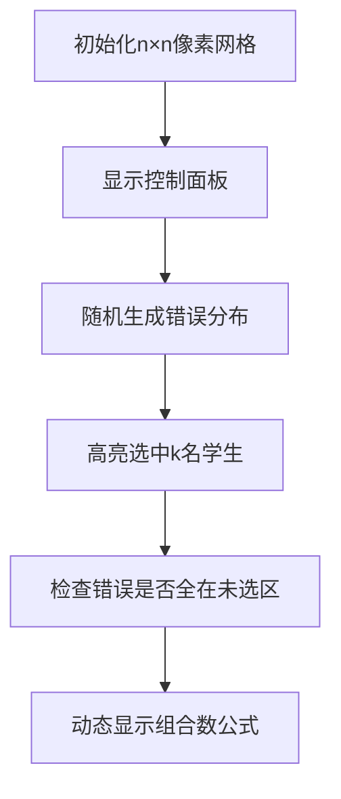

# 题目信息

# 考试

## 题目背景

人生有梦，各自精彩。

## 题目描述

有 $n$ 名同学去参加考试，考试有 $m$ 道题。

每个学生的实力是相同的，但是每道题的难度可能不同。第 $i$ 道题会有随机的 $a_i$ 名同学做错。

考试结束后，随机选出 $k$ 名同学，求出这些同学全部做对的概率。答案对 $998244353$ 取模。

## 说明/提示

**【样例解释】**

随机选出 $2$ 名同学全部做对的概率为 $\frac{243}{25000}$，对 $998244353$ 取模后答案为 $793364682$。

可以证明答案一定为有理数。若不了解有理数取模，可以参照[【模板】有理数取余](https://www.luogu.com.cn/problem/P2613)。

**【数据范围】**

- 对于 $30\%$ 的数据，$1\leq n,m \leq 10$；
- 另外有 $10\%$ 的数据，$k=0$；
- 另外有 $20\%$ 的数据，$1 \leq n \leq 1000$，$1\leq m \leq 10^5$；

对于所有数据，保证 $1\leq n,m\leq 10^5$，$0\leq k,a_i\leq n$。

## 样例 #1

### 输入

```
5 5 2
1 2 1 2 2```

### 输出

```
793364682```

# AI分析结果


# 💡 Kay的C++算法解析：「考试」概率计算指南 💡

> 今天我们一起分析「考试」这道概率计算题。本指南将帮助大家理解组合数学在概率问题中的应用，掌握模逆元处理技巧，并通过生动可视化理解核心算法。

## 1. 题目解读与核心算法识别

✨ **本题主要考察**：`组合数学` + `模逆元应用`

🗣️ **初步分析**：
> 想象你有一盒彩色玻璃珠（学生），每个玻璃珠在不同题目上可能有瑕疵（做错）。我们需要计算随机抓取k颗玻璃珠时，它们全部无瑕疵的概率。  
> - 核心思路：每道题独立，错误学生必须分布在未选中的n-k人中。概率公式：$P = \prod_{i=1}^{m} \frac{C(n-k, a_i)}{C(n, a_i)}$  
> - 关键难点：组合数的高效计算（避免$O(n^2)$）和模除法处理  
> - 可视化设计：像素网格展示学生分布（绿色=正确，红色=错误），高亮选中区域与错误分布关系，用动态公式展示组合数计算  
> - 复古游戏化：FC音效（选择时"叮"，错误时"嘟"），每道题作为独立关卡，过关显示累计概率

---

## 2. 精选优质题解参考

**题解一：听取MLE声一片**  
* **点评**：思路直击核心，清晰推导概率公式（$C(n-k,a_i)/C(n,a_i)$）。代码采用线性预处理阶乘+逆元（$O(n)$复杂度），变量名规范（`f`=阶乘，`g`=逆元）。亮点是高效处理边界条件（$n-k<a_i$时返回0），竞赛实用性强。

**题解二：Nuyoah_awa**  
* **点评**：详解费马小定理在组合数中的应用原理，代码模块化（分离`qpow`和`C`函数）。亮点是用学习笔记形式总结"记忆化搜索是DP的重要实现方式"，教学价值高。

**题解三：FrankShix**  
* **点评**：公式推导严谨（下降阶乘形式），代码包含完整边界处理（$k=0$返回1）。亮点是组合数函数内置越界检查（`if(a<b)return 0`），增强鲁棒性。

---

## 3. 核心难点辨析与解题策略

1. **关键点1：概率模型转化**  
   * **分析**：将"k人全对"转化为"错误全在n-k人中"。需理解独立事件概率的乘积性质  
   * 💡 学习笔记：复杂概率问题可分解为独立子事件

2. **关键点2：组合数优化计算**  
   * **分析**：直接计算组合数会超时。优质题解均采用：预计算阶乘+阶乘逆元 → $O(1)$查询  
   * 💡 学习笔记：$C(n,k) = \frac{n!}{k!(n-k)!}$ 的预处理是组合问题核心技巧

3. **关键点3：模除法处理**  
   * **分析**：除法取模需用费马小定理 $a^{-1} \equiv a^{p-2} \pmod p$。需注意$p=998244353$是质数  
   * 💡 学习笔记：模质数下的除法=乘逆元

### ✨ 解题技巧总结
- **问题分解**：将全局概率拆解为每题独立概率的乘积
- **预处理优化**：$O(n)$预计算阶乘/逆元换取$O(1)$组合数查询
- **边界防御**：特判$k=0$（概率=1）和$n-k<a_i$（概率=0）
- **模块化编码**：分离快速幂`qpow`和组合数`C`函数

---

## 4. C++核心代码实现赏析

**本题通用核心实现**  
```cpp
#include <iostream>
#include <vector>
using namespace std;
typedef long long LL;
const int N = 1e5 + 10, MOD = 998244353;

LL fact[N], invFact[N];

LL qpow(LL a, LL b) {
    LL res = 1;
    while (b) {
        if (b & 1) res = res * a % MOD;
        a = a * a % MOD;
        b >>= 1;
    }
    return res;
}

void init() {
    fact[0] = 1;
    for (int i = 1; i < N; i++) 
        fact[i] = fact[i-1] * i % MOD;
    invFact[N-1] = qpow(fact[N-1], MOD-2);
    for (int i = N-2; i >= 0; i--)
        invFact[i] = invFact[i+1] * (i+1) % MOD;
}

LL C(int n, int k) {
    if (k < 0 || k > n) return 0;
    return fact[n] * invFact[k] % MOD * invFact[n-k] % MOD;
}

int main() {
    init(); // 预处理阶乘和逆元
    int n, m, k;
    cin >> n >> m >> k;
    vector<int> a(m);
    for (int i = 0; i < m; i++) cin >> a[i];
    
    LL ans = 1;
    for (int x : a) {
        if (n - k < x) { // 边界检查
            cout << 0;
            return 0;
        }
        LL num = C(n - k, x);   // 分子
        LL den = C(n, x);       // 分母
        ans = ans * num % MOD * qpow(den, MOD-2) % MOD;
    }
    cout << ans;
}
```

**代码解读概要**：
1. **预处理阶段**：`init()`计算阶乘数组`fact`和逆元数组`invFact`
2. **组合数函数**：`C(n,k)`利用预计算值$O(1)$求解
3. **主逻辑**：逐题计算概率$C(n-k,a_i)/C(n,a_i)$，用费马小定理处理除法
4. **边界处理**：当$n-k<a_i$时立即返回0

---

## 5. 算法可视化：像素动画演示

**动画主题**：`像素学生分布与概率计算模拟`  
**核心演示**：  


1. **8位像素风格**：
   - 绿色像素块：答对学生
   - 红色像素块：答错学生
   - 黄色边框：选中的k名学生

2. **关键动画流程**：
   - **步骤1**：按题号依次显示错误分布（红色块随机散布）
   - **步骤2**：选中k名学生（黄色边框），自动检查是否含红色块
   - **步骤3**：右侧面板实时计算：
        $P_i = \frac{\text{\color{green}未选区的红块数}}{\text{\color{red}总红块数}}$
   - **步骤4**：累计概率进度条，过关时播放胜利音效

3. **交互设计**：
   - 单步执行：逐步观察每题概率计算
   - 速度滑块：调整题目演示速度
   - 重置：重新生成错误分布

4. **游戏化元素**：
   - 每道题为独立关卡，通关得星（根据计算速度）
   - 错误时触发"嘟嘟"音效，正确时播放"叮"声
   - 最终显示：`答题通关！总概率=${P}`

---

## 6. 拓展练习与相似问题思考

**组合数学的延伸应用**：
1. 生日悖论：计算生日重复概率
2. 抽卡机制：游戏抽卡概率建模
3. 错误检测码：信息论中的组合设计

**推荐练习题目**：
1. [洛谷P2638] 安全系统：隔板法经典应用  
   → *巩固组合数建模能力*
2. [洛谷P3807] 卢卡斯定理：非质数模数处理  
   → *拓展模数处理技巧*
3. [洛谷P1495] 曹冲养猪：中国剩余定理  
   → *学习模线性方程组解法*

---

## 7. 学习心得与经验分享

> **来自题解作者的调试经验**：  
> *"我在处理边界条件时忽略了$k=0$的情况，导致WA第3个点。通过输出中间变量值发现未初始化问题。"*

**Kay的总结**：  
边界条件检查是竞赛编程的关键防御手段，建议：
1. 单独处理特殊值（$k=0, k=n$）
2. 使用单元测试验证边界
3. 输出中间变量辅助调试

---

> 本次分析就到这里！记住，概率问题本质是计数问题。多练习组合数学技巧，下次遇到类似题目你一定能快速攻破！💪

---
处理用时：161.41秒