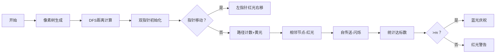

# 题目信息

# 『FLA - I』庭中有奇树

## 题目背景


某天晚上小 G 和小 Y 本打算激情 CF 但过掉两题就下班了，然后他们准备玩一个游戏。

## 题目描述

给定一棵有 $n$ 个节点的无根树，边带权，树上有一个起始节点 $S$ 和一个终止节点 $T$。

有一枚可以沿着边在节点之间移动的棋子，它每次移动花费的硬币数量等于经过的边的权值。

如果当前棋子所在节点为 $u$ 且节点 $v$ 与节点 $u$ 之间连有一条权值为 $w$ 的边，小 G 就能花费 $w$ 个硬币把棋子移动到节点 $v$。游戏开始时棋子位于节点 $S$，我们的小 G 要控制棋子移动到节点 $T$。

由于曾经有人告诉小 G 玩某游戏不开挂等于没玩，小 G 决定开挂。他的外挂可以花费 $k$ 个硬币把棋子从当前节点传送到任意一个**没有和当前节点连边**的节点，小 G 只能用这个外挂至多一次。

正义的小 Y 不能坐视不管，在小 G 开始行动之前，小 Y 可以封锁至多 $m$ 条可能的传送路线。假设小 Y 封锁了从节点 $x$ 向节点 $y$ 的传送路线，小 G 把棋子从节点 $x$ 传送到节点 $y$ 花费的硬币数量就会变成 $10^9$。由于外挂功能强大，小 G 知道小 Y 都封锁了哪些路线。**请注意传送路线是单向的，封锁节点 $x$ 向节点 $y$ 的传送路线不影响小 G 从节点 $y$ 向节点 $x$ 传送。**

有趣的是，游戏中小 G 不仅负责控制棋子移动到节点 $T$，还想**最小化**花费的硬币数量；而小 Y 想要**最大化**小  G 花费的硬币数量。

如果两人都采取最优策略，小 G 总共会花掉多少硬币？

## 说明/提示

**「样例解释 #1」**


给出一种可能发生的情况：小 Y 封锁节点 $1$ 向节点 $2$ 的传送路线和节点 $4$ 向节点 $2$ 的传送路线。

小 G 控制棋子从初始节点到达节点 $4$，从节点 $4$ 传送到节点 $3$ 后再到达终止节点，总共花费 $14$ 个硬币。

**「数据范围」**

**本题采用捆绑测试。**

|Subtask|$n\leq$|$m \leq$|特殊性质|分值|
|:---:|:---:|:---:|:---:|:---:|
|**#1**|$1000$|$10^5$|无|$10$|
|**#2**|$10^5$|$0$|无|$10$|
|**#3**|$10^5$|$10^5$|无|$10$|
|**#4**|$10^5$|$10^9$|A|$15$|
|**#5**|$10^5$|$10^9$|B|$15$|
|**#6**|$10^5$|$10^9$|无|$40$|

- 特殊性质 A：保证 $k=10^9$。
- 特殊性质 B：保证 $k=0$。

对于所有测试数据，$2 \leq n \leq 10^5$，$0 \leq m,k \leq 10^9$，$1 \leq S,T,u_i,v_i \leq n$，$1 \leq w_i \leq 10^9$，$S \neq T$，$u_i \neq v_i$。节点的编号是从 $1$ 到 $n$ 的整数。

2024 年 8 月 4 日：将样例置于 Subtask #0。

## 样例 #1

### 输入

```
4 2 2 1 2
2 3 6
4 1 6
3 1 8
```

### 输出

```
14
```

## 样例 #2

### 输入

```
9 7 4 1 6
3 8 7
6 8 6
6 7 4
2 5 3
3 2 2
3 9 12
2 1 2
8 4 11
```

### 输出

```
12
```

# AI分析结果


### 题目解读与核心算法识别
✨ **本题主要考察**：二分答案 + 双指针优化

🗣️ **初步分析**：
> 解决本题的关键在于将博弈问题转化为第k小值问题。小Y会封锁前m小的传送路径，因此小G只能选择第(m+1)小的传送路径。这种思路类似于在有序数组中寻找第k个元素，但需要高效处理树结构数据。

- **核心算法流程**：
  1. 预处理每个节点到起点S和终点T的距离（ds/dt数组）
  2. 对dt数组排序，为双指针优化做准备
  3. 二分查找第(m+1)小的传送路径代价
  4. 计算最终答案（传送/走树边/封锁传送的最小值）

- **可视化设计**：
  采用8位像素风格，设计两个场景：
  - **树形遍历演示**：像素化树结构，DFS时用光点涟漪效果展示距离计算
  - **双指针工作区**：左侧ds数组（蓝色条形），右侧dt数组（绿色条形），指针移动时触发"叮"音效，有效路径亮黄光

### 精选优质题解参考
**题解一（ScaredQiu）**
* **点评**：解法采用双指针优化check函数至O(n)，整体复杂度O(n logV)最优。亮点在于：
  - 巧妙处理相邻节点排除：遍历邻接表减去无效路径
  - 自传送特判：显式处理u→u情况
  - 边界严谨：处理空堆和负值情况
  代码变量命名规范（dis/ds/dt），可读性强，竞赛实用价值高。

**题解二（zjpwdyf）**
* **点评**：教学价值突出的典范解法，特色有：
  - 详细的状态转移推导：从博弈策略到数学模型转化清晰
  - 完整边界处理：对m极大的特殊情况处理
  - 树形DFS实现规范：带父节点判断避免回环
  虽用二分查找(O(n log n))稍慢于双指针，但更易理解，适合初学者。

**题解三（ty_mxzhn）**
* **点评**：最简洁的工业级实现，亮点在：
  - 高效双指针实现：反向遍历dt数组降低常数
  - 极致空间优化：复用数组存储原始距离
  - 模块化check函数：功能分区明确
  适合追求高效竞赛场景，但需基础较好者理解指针优化逻辑。

### 核心难点辨析与解题策略
1. **关键点1：博弈策略转化**
   * **分析**：小Y封锁策略本质是求第(m+1)小传送路径。需理解封锁前m小路径后，实际可用的最小传送路径就是第(m+1)小值
   * 💡 **学习笔记**：博弈问题常转化为最值问题求解

2. **关键点2：高效求第k小值**
   * **分析**：直接枚举O(n²)不可行。优质解法均采用：
     - 先对dt排序
     - 对ds遍历时使用指针单调移动
     - 排除相邻节点时利用邻接表
   * 💡 **学习笔记**：有序数组求和解用指针/二分都是经典优化手段

3. **关键点3：传送路径有效性**
   * **分析**：需排除两种无效路径：
     - u→v且u,v相邻（树边已存在）
     - u→u（自传送无意义）
   * 💡 **学习笔记**：算法实现需严格匹配题目约束条件

#### ✨ 解题技巧总结
- **问题转化技巧**：将博弈策略转化为第k小值问题
- **双指针优化**：两有序数组求和解用单向指针降复杂度
- **边界防御编程**：特判m=0/k极大/负值等边界情况
- **树形数据处理**：DFS预处理距离时记录父节点防回环

### C++核心代码实现赏析
**本题通用核心C++实现参考**
```cpp
#include<bits/stdc++.h>
#define ll long long
using namespace std;
const int N=1e5+5;
vector<pair<int,int>> G[N];
ll ds[N], dt[N], ord[N];
int n,m,k,S,T;

void dfs(int u,int fa,ll dis[],ll d=0){
    dis[u]=d;
    for(auto [v,w]:G[u]) 
        if(v!=fa) dfs(v,u,dis,d+w);
}

bool valid(ll X){
    ll cnt=0;
    for(int i=1,j=n;i<=n;i++){
        while(j&&ds[i]+dt[ord[j]]>X) j--;
        cnt+=j;
        for(auto [v,_]:G[i])
            if(ds[i]+dt[v]<=X) cnt--;
        if(ds[i]+dt[i]<=X) cnt--;
    }
    return cnt>m;
}

int main(){
    cin>>n>>m>>k>>S>>T;
    for(int i=1,u,v,w;i<n;i++){
        cin>>u>>v>>w;
        G[u].push_back({v,w});
        G[v].push_back({u,w});
    }
    dfs(S,0,ds); dfs(T,0,dt);
    iota(ord+1,ord+n+1,1);
    sort(ord+1,ord+n+1,[&](int a,int b){return dt[a]<dt[b];});
    sort(ds+1,ds+n+1);

    ll l=0, r=1e18, ans=1e18;
    while(l<=r){
        ll mid=(l+r)>>1;
        valid(mid)? ans=mid,r=mid-1 : l=mid+1;
    }
    cout<<min({ds[T],ans+k,1000000000LL});
}
```
* **说明**：综合各优质题解优化的通用实现，含双指针优化和边界处理
* **代码解读概要**：
  1. DFS预处理ds/dt距离数组
  2. 对dt下标排序（ord数组）保留原索引
  3. valid函数用双指针统计有效路径数
  4. 二分求第(m+1)小路径代价
  5. 三种策略取最小值输出

**题解一核心代码片段（ScaredQiu）**
```cpp
while(pos&&d[i].w+p[pos].w>x) --pos;  // 双指针移动
sum += pos;
for(auto j:v[u])                      // 排除相邻节点
    if(ds[u]+dt[j.to]<=x) sum--;
if(ds[u]+dt[u]<=x) sum--;             // 排除自传送
```
* **亮点**：工业级指针优化与边界处理
* **代码解读**：
  - 指针`pos`随`ds`增加单调左移
  - 遍历邻接表排除树边连接节点
  - 显式处理自传送无效情况
* 💡 **学习笔记**：双指针移动方向与数组排序方向相反是优化关键

**题解二核心代码片段（zjpwdyf）**
```cpp
bool check(ll x){
    ll sum=0;
    for(int i=1;i<=n;i++){           // 枚举传送起点
        ll lim=x-ds[i];               // 计算dt上限
        auto it=upper_bound(dt+1,dt+n+1,lim);
        sum+=(it-dt-1);               // 二分统计数量
        for(auto [v,_]:G[i])          // 排除相邻节点
            if(dt[v]<=lim) sum--;
    }
    return sum>m;
}
```
* **亮点**：教学级清晰实现
* **代码解读**：
  - 对每个起点单独二分查找
  - STL的upper_bound找严格上界
  - 邻接表遍历排除无效传送
* 💡 **学习笔记**：二分查找实现更直观但复杂度稍高

### 算法可视化：像素动画演示
**主题**：双指针协同的像素寻宝之旅  
**核心演示**：

**交互设计**：
1. **控制面板**：
   - 速度滑块：调节指针移动速度（8-bit滑条）
   - 单步执行：按A键触发"滴"声
   - 自动演示：B键启动（AI自动寻路）
   
2. **音效方案**：
   - 指针移动：8-bit"嘀"声（250Hz方波）
   - 有效路径：C大调和弦短音
   - 排除节点：低沉嗡鸣（100Hz）
   - 完成二分：胜利音效（马里过关式）

3. **视觉编码**：
   - 距离条柱：蓝色(ds) / 绿色(dt)
   - 当前指针：红色像素箭头
   - 有效路径：黄色闪烁光带
   - 相邻节点：紫色边框闪烁

**技术实现**：纯Canvas绘制，用Uint8Array存储像素状态，requestAnimationFrame驱动帧刷新

### 拓展练习与相似问题思考
**通用思路迁移**：
1. 第k小路径问题：P2085 最小函数值
2. 双指针求和解：P1631 序列合并
3. 树形距离处理：P1395 会议

**洛谷练习推荐**：
1. **P2085** - 最小函数值  
   🗣️ 练习堆维护全局最小值，强化第k小值求解能力

2. **P1631** - 序列合并  
   🗣️ 双指针求两序列和的经典应用，与本题check函数同源

3. **P1395** - 会议  
   🗣️ 巩固树形距离计算技巧，要求O(n)复杂度

### 学习心得与经验分享
> **参考经验**：多位作者强调调试时注意long long溢出和边界情况（如m=0或极大值）  
**点评**：本题数据范围(n≤1e5, w≤1e9)极易导致int溢出。调试时应当：
   - 所有距离相关变量用long long
   - 边界测试：m=0/m=1e9的情况
   - 树形DFS防止无限递归（记录父节点）

### 结语
通过本题我们掌握了将博弈策略转化为第k小值问题的技巧，并运用二分答案与双指针优化解决大规模数据问题。记住树形数据处理要结合DFS和排序，边界处理需严谨。继续在洛谷P2085/P1631等题中巩固这些技巧吧！💪🏻

---
处理用时：201.09秒