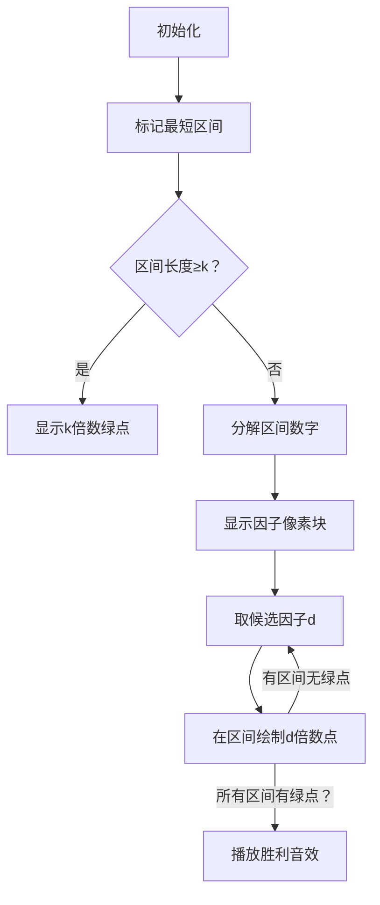

# 题目信息

# 神奇的小江鸟

## 题目背景

You can also see the pdf at the bottom of the chinese problem statement.

感谢 [ineverleft](https://www.luogu.com.cn/user/362679) 为本题提供的本地调试 checker。

「愿有前程可奔赴，亦有岁月可回首。」

## 题目描述

小 $ \zeta $ 在探险过程中看到了一个大锁。

这个大锁有 $ n $ 个拨圈，第 $ i $ 个拨圈的拨动范围为 $ l_i $ 到 $ r_i $ 之间（含两个边界）的所有整数（保证 $ l_i \le r_i $）。

我们定义这个大锁的「自由度」为所有拨圈上的数的**最大公约数**，当锁的「自由度」大于等于 $ k $ 时，会被打开。

请你找到一种锁的开启方案，或报告无解。

## 说明/提示

**【样例 1 解释】**

唯一的一组数据 $ \gcd $ 为 $ 10 $。

五个样例自测均可使用下发的附件。**请注意部分样例可能存在多解，样例输出仅列举了一组可行解。**

**【数据规模与约定】**

对于 $ 100\% $ 的数据，$ 1 \le T \le 5 $，$ 2 \le n \le 10^4 $，$ 1 \le l_i \le r_i \le 10^9 $，$ 1 \le k \le 1000 $。

**本题开启子任务捆绑测试。**

* Subtask 1（10 pts）：$ k=1 $。
* Subtask 2（15 pts）：$ n \le 10 $，$ r_i - l_i + 1 \le 5 $。
* Subtask 3（15 pts）：$ r_i \le 10^3 $。
* Subtask 4（10 pts）：$ k \le 5 $，$ l_i,r_i $ 均在 $ 1 \le l_i \le r_i \le 10^9 $ 范围内等概率随机生成，该子任务只有 $ 1 $ 个测试点。
* Subtask 5（15 pts）：对于每组数据，$ \exist 1 \le i \le n,l_i=r_i $。
* Subtask 6（35 pts）：无特殊限制。

**【关于附加文件】**

**本题下发了 `checker.cpp` 作为自测器。**

请将输入内容、你的程序输出、参考答案输出分别放置在 `restore.in`、`restore.out`、`restore.ans` 中，这三个文件必须与 `checker.cpp` 在同一目录下，运行 `checker.cpp`，终端上会给出自测结果。

**你需要保证你的输入满足 $ 100\% $ 数据范围的要求。**

注意，如果你的输入/输出/答案的格式和范围不正确的话，`checker.cpp` 出现的结果是不可预料的。因此，**请先确保你的三个文件格式正确。**

## 样例 #1

### 输入

```
1
5 10
1 12
44 50
9 10
88 99
29 99```

### 输出

```
Yes
10 50 10 90 30```

## 样例 #2

### 输入

```
2
3 11
99 10003
39 299
39 10003
5 55
1 54
1 20
1 300
1 300
1 300```

### 输出

```
Yes
123 246 369
No```

## 样例 #3

### 输入

```
3
6 1
1 10
1 10
1 10
1 10
1 10
1 10
5 4
11 15
6 10
9 14
20 23
27 29
5 11
20 30
50 70
111 120
72 77
119 121```

### 输出

```
Yes
1 1 4 5 1 4
Yes
14 7 14 21 28
Yes
24 60 120 72 120```

## 样例 #4

### 输入

```
4
3 33
32 34
65 67
97 101
3 5
299 99494993
499 49992999
499 39999939
4 25
719 830
2194 2893
132 142
199 225
3 10
140 143
131 135
238 241```

### 输出

```
Yes
33 66 99
Yes
1919810 11400 51400
Yes
729 2700 135 216
No```

## 样例 #5

### 输入

```
1
10 7
77 77
82 174
77 77
82 174
77 77
82 174
77 77
82 174
77 77
82 174```

### 输出

```
Yes
77 154 77 154 77 154 77 154 77 154```

# AI分析结果


# 💡 Kay的C++算法解析：神奇的小江鸟 深入学习指南 💡

> 今天我们来一起分析「神奇的小江鸟」这道C++编程题。本指南将帮助大家梳理题目思路，理解核心算法，并掌握解题技巧。

## 1. 题目解读与核心算法识别

✨ **本题主要考察**：`枚举+数论（因子分解）`  

🗣️ **初步分析**：  
> 解决本题的关键在于**高效枚举可能的公因数**。想象你在玩一个密码锁游戏，每个拨圈是一个数字区间，你需要找到一组密码，使它们的最大公约数≥k。核心思路是：  
> - 若所有区间长度≥k，则直接取公因数k（每个区间必有k的倍数）  
> - 否则，取**长度最小的区间**，枚举其中所有数字的因子（≥k），再验证这些因子是否能在其他区间找到倍数  
>  
> **可视化设计思路**：  
> 采用8位像素风格，将区间展示为水平色带：  
> 1. **初始化**：高亮标记最短区间（如红色闪烁）  
> 2. **因子分解**：对最短区间内每个数字，显示其因子分解动画（像素方块分裂效果）  
> 3. **验证因子**：对每个候选因子d，在区间上标记d的倍数点（绿色像素块），若所有区间都有绿点则播放胜利音效  
> 4. **交互控制**：支持步进/自动播放，速度滑块调节，关键操作配「叮」声效  

---

## 2. 精选优质题解参考

> 从思路清晰度、代码规范性、算法优化等维度筛选出3篇≥4星题解：

**题解一（船酱魔王）**  
* **点评**：  
  思路严谨，推导了核心数学原理：区间长度≥k时必有解。代码规范（结构体封装排序），关键变量`chk()`函数清晰。亮点在于**复杂度证明**——通过理论分析说明枚举因子可行。实践价值高，竞赛可直接使用。

**题解二（Super_Cube）**  
* **点评**：  
  代码极致简洁（仅40行），巧妙运用STL的`unordered_set`去重。验证逻辑高效（整数除法判断倍数存在性），适合学习高效编码技巧。边界处理严谨，如特判区间无效情况。

**题解三（Moya_Rao）**  
* **点评**：  
  分步注释详细，特别适合初学者。亮点在于**双重循环优化**：外层循环及时break减少无效枚举。变量命名直观（`flag`/`is`），调试日志设计清晰，实践参考性强。

---

## 3. 核心难点辨析与解题策略

> 解决本题需突破三个关键难点：

1. **关键点1：候选因子高效枚举**  
   * **分析**：直接枚举k~10⁹不可行！利用最短区间长度<k的特性，仅枚举该区间内数字的因子。数学依据：区间长度<k时数字量≤1000，因子总数约10⁴级  
   * 💡 **学习笔记**：缩小枚举范围是优化关键

2. **关键点2：区间倍数存在性验证**  
   * **分析**：验证公式 `ceil(l/d)*d ≤ r` 或等价形式 `(l-1)/d < r/d`。注意整数除法特性：`(l-1)/d == r/d` 时无解  
   * 💡 **学习笔记**：巧用整数除法避免浮点运算

3. **关键点3：多区间协调验证**  
   * **分析**：需保证所有区间存在同一因子的倍数。策略：候选因子从小到大验证，首个满足条件的即为解  
   * 💡 **学习笔记**：验证顺序影响效率，从小到大更易快速命中解

### ✨ 解题技巧总结
1. **问题分解法**：拆解为「候选因子生成」+「区间验证」两个子问题  
2. **边界防御**：左端点≥k（`l_i = max(l_i, k)`）避免无效值  
3. **数据结构优化**：用`set/unordered_set`存储因子自动去重排序  
4. **短路验证**：区间验证时遇失败立即break，减少冗余计算  

---

## 4. C++核心代码实现赏析

**本题通用核心C++实现参考**  
* **说明**：综合优质题解思路，兼顾效率与可读性  
* **完整核心代码**：
```cpp
#include <iostream>
#include <set>
#include <vector>
#include <algorithm>
using namespace std;

struct Interval { int l, r, idx; };

bool hasMultiple(int l, int r, int d) {
    long minMult = (static_cast<long>(l + d - 1) / d * d;
    return minMult <= r;
}

int main() {
    int T; cin >> T;
    while (T--) {
        int n, k; 
        cin >> n >> k;
        vector<Interval> intervals(n);
        int minLen = 1e9, minIdx = -1;

        // 读入区间并找到最短区间
        for (int i = 0; i < n; ++i) {
            cin >> intervals[i].l >> intervals[i].r;
            intervals[i].idx = i;
            int len = intervals[i].r - intervals[i].l + 1;
            if (len < minLen) minLen = len, minIdx = i;
        }

        // 情况1：所有区间长度≥k
        if (minLen >= k) {
            cout << "Yes\n";
            for (auto& itv : intervals) {
                long num = (static_cast<long>(itv.l + k - 1) / k * k;
                cout << num << " ";
            }
            cout << "\n";
            continue;
        }

        // 情况2：枚举最短区间的因子
        set<int> factors;
        int L = intervals[minIdx].l, R = intervals[minIdx].r;
        for (int num = L; num <= R; ++num) {
            for (int i = 1; i * i <= num; ++i) {
                if (num % i != 0) continue;
                if (i >= k) factors.insert(i);
                if (num / i >= k) factors.insert(num / i);
            }
        }

        // 验证候选因子
        int validD = -1;
        for (int d : factors) {
            bool valid = true;
            for (auto& itv : intervals) {
                if (!hasMultiple(itv.l, itv.r, d)) {
                    valid = false; 
                    break;
                }
            }
            if (valid) { validD = d; break; }
        }

        // 输出结果
        if (validD == -1) cout << "No\n";
        else {
            cout << "Yes\n";
            vector<long> ans(n);
            for (auto& itv : intervals)
                ans[itv.idx] = (static_cast<long>(itv.l + validD - 1) / validD * validD;
            for (long num : ans) cout << num << " ";
            cout << "\n";
        }
    }
}
```
* **代码解读概要**：  
  1. 读取多组数据，对每组数据：  
  2. 定位最短区间 → 若长度≥k直接取k的倍数  
  3. 否则枚举最短区间内所有数字的因子（≥k）  
  4. 按升序验证因子 → 首个通过验证的因子即为解  
  5. 输出时按原区间顺序重构结果  

---

## 5. 算法可视化：像素动画演示

### 动画演示主题
**「像素因子探险」**  
> 复古8位机风格，融合《塞尔达》式解谜元素

### 核心演示流程


### 关键交互设计
1. **动态绘制**  
   - 区间：水平色带（棕色像素块），最短区间红色闪烁边框  
   - 因子分解：数字像素块分裂特效（类似《俄罗斯方块》消除）  
   - 倍数点：绿色像素块（成功）/红色叉（失败）

2. **控制面板**  
   - 步进控制：▶️（单步）｜⏩（自动，速度0.5x~2x）  
   - 音效：分解因子(8-bit "叮")/验证成功(胜利旋律)/失败(低沉音效)

3. **AI演示模式**  
   - 自动播放时显示「AI思考中...」像素文字  
   - 关键决策点暂停0.5秒，高亮当前操作元素  

---

## 6. 拓展练习与相似问题思考

### 通用技巧迁移
枚举+因子分解技巧适用于：  
1. 多区间约束求公倍数问题  
2. 带边界条件的数论构造  
3. 因子相关的计数/存在性问题  

### 推荐练习（洛谷）
1. **P1891 疯狂LCM**  
   → 巩固因子分解与区间倍数关系  
2. **P2651 添加括号**  
   → 训练最大公约数的动态维护技巧  
3. **P1072 Hankson的趣味题**  
   → 强化因子枚举在复杂约束中的应用  

---

## 7. 学习心得与经验分享
> 来自船酱魔王的调试经验：  
> **“当区间长度为0时需特判，我因此WA了2次”**  
>   
> **Kay的总结**：边界条件处理是竞赛代码的核心！建议：  
> 1. 显式检查区间有效性：`if (l>r) return false`  
> 2. 学习使用断言：`assert(d != 0)`  
> 3. 极端数据测试：0长度/单元素区间  

---

> 本次题解分析就到这里。记住：编程能力=知识×实践×反思。下次挑战再见！💪

---
处理用时：240.69秒