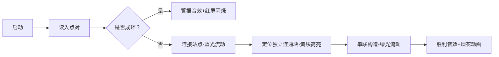

# 题目信息

# 「Cfz Round 5」Mata rainen

## 题目背景

题目名称意为：明年见。

小 R 是一个正在上高三的女孩子。她在升入高三的暑假复习了[《种树郭橐（tuó）驼传》](https://baike.baidu.com/item/%E7%A7%8D%E6%A0%91%E9%83%AD%E6%A9%90%E9%A9%BC%E4%BC%A0)，便编出了这道与树有关的题。

在把这道题目丢给出题组后，她决定把全部时间和精力投入到高考的旅程中，期待在 2025 年的暑假在算法竞赛中与大家再会。

## 题目描述

请判断是否存在一棵树满足如下条件。若存在，请尝试给出构造。

树中包含 $n$ 个结点，编号为 $1\sim n$。另外，给定 $m$ 个点对 $(s_i,t_i)$，要求树上这 $m$ 条从点 $s_i$ 到点 $t_i$ 的路径覆盖每条边**恰好**一次 $^\dagger$。

**若你正确判断了是否有解，但不会构造出这棵树，也可以获得一定的分数，详见【评分方式】。**

$\dagger$ 称从点 $s$ 到点 $t$ 的路径覆盖一条边 $(u,v)$，当且仅当边 $(u,v)$ 在点 $s$ 到点 $t$ 的最短路径上。

## 说明/提示

#### 「样例解释 #1」


左上图为样例输出中给出的树。边 $(1,5),(5,2)$ 被路径 $(1,2)$ 覆盖，边 $(3,5),(5,6),(6,4)$ 被路径 $(3,4)$ 覆盖，符合题目要求。

右上图中边 $(5,6)$ 被路径 $(1,2)$ 和 $(3,4)$ 覆盖，不符合题目要求。

左下图中边 $(5,6)$ 未被任何路径覆盖，不符合题目要求。

右下图不是一棵树，不符合题目要求。

#### 「样例解释 #2」

可以证明不存在符合要求的树。

#### 「评分方式」

本题采用自定义校验器（Special Judge）进行评测。

对于每个测试点：

- 若第一行格式错误或与答案不匹配（大小写不敏感），得 $0\%$ 的分数。
- 若第一行答案正确且为 `No`，得 $100\%$ 的分数。
- 若第一行答案正确且为 `Yes`，**但后 $n-1$ 行格式错误**，得 $0\%$ 的分数。  
因此，**请务必保证输出为一棵树**。
- 若第一行答案正确且为 `Yes`，后 $n-1$ 行格式正确但树不符合要求，得 $20\%$ 的分数。
- 若第一行答案正确且为 `Yes`，后 $n-1$ 行格式正确且树符合要求，得 $100\%$ 的分数。

也就是说，对于第一个样例，在正确输出 `Yes` 的基础上，输出左上图可以得到满分，输出右上图、左下图可以得到 $20\%$ 的分数，输出右下图不能得到任何分数；对于第二个样例，正确输出 `No` 即可得到满分。

#### 「数据范围」

对于所有测试数据，保证：

- $2\le n\le 3\times 10^5$；
- $1\le m\le 3\times 10^5$；
- $1\le s_i,t_i\le n$ 且 $s_i\ne t_i$。

**本题采用捆绑测试。**

- Subtask 0（10 points）：$n\le 3$，$m\le 3$。
- Subtask 1（10 points）：$n\le 10$，$m\le 10$。
- Subtask 2（20 points）：$m=1$。
- Subtask 3（10 points）：$n\le 300$，$m\le 300$。
- Subtask 4（10 points）：$n\le 2\times 10^3$，$m\le 2\times 10^3$。
- Subtask 5（20 points）：$m\le 2\times 10^3$。
- Subtask 6（20 points）：无特殊限制。

#### 「Hack 数据」

本题于赛后添加了部分 Hack 数据。这些数据均满足 Subtask 6 对数据规模的限制，他们被添加到 Subtask 7 中。这些数据不计分，但只有通过所有数据，才算做 AC 本题。

- Subtask 7（0 points）：赛后添加的 Hack 数据。

## 样例 #1

### 输入

```
6 2
1 2
3 4```

### 输出

```
Yes
1 5
2 5
3 5
4 6
5 6```

## 样例 #2

### 输入

```
3 3
1 2
2 3
1 3```

### 输出

```
No```

# AI分析结果


### 💡 Kay的C++算法解析：[题目名称] 深入学习指南 💡

#### 1. 题目解读与核心算法识别
✨ **本题主要考察**：图论（树构造与环检测）、并查集/DFS应用、连通块处理

🗣️ **初步分析**：
> 解决本题的关键在于理解树的特性和路径覆盖的本质。想象你正在建造一座城市的地铁线路（树），每条线路（边）只能被一班列车（路径）使用。若线路规划出现环路，必然导致某些轨道被多班列车抢占冲突。因此核心是：
> - **判环机制**：通过并查集/DFS检测给定路径是否形成环路（无解）
> - **连通块串联**：若无环，则像串珍珠项链般将分散的连通块连成一棵树
> 
> **可视化设计思路**：
> 采用「像素地铁建造」主题，用不同颜色像素块表示：
> - 红色像素：路径起点/终点
> - 蓝色像素：已连接的地铁站（节点）
> - 黄色闪烁：当前检测的边是否成环
> - 绿色流动动画：连通块串联过程
> 交互设计包含：
> - 8-bit音效：成功连接时播放"叮"声，成环时播放警报声
> - 自动演示模式：AI小人像《地铁跑酷》角色自动铺设轨道

---

#### 2. 精选优质题解参考
**题解一：floris (思路最简练)**
* **点评**：该解法直击要害——先用并查集判环，再用最后一组点对串联剩余连通块。代码中变量命名清晰（如`last`跟踪串联位置），边界处理严谨。亮点在于仅30行实现核心逻辑，且时间复杂度O(nα(n))接近最优。对初学者而言，这种"主干-分支"的构造思想极易理解迁移。

**题解二：Drifty (代码最规范)**
* **点评**：同样使用并查集但更注重工程实践：用`vector`存储连通块节点，引入`i64`类型增强可读性。特别值得学习的是严格分离数据输入、判环检测和构造输出三大模块，这种架构便于调试扩展。虽然稍多几行代码，但工业级代码规范的典范。

**题解三：rui_er (理论最完备)**
* **点评**：作为官方题解，其价值在于严谨的充要条件证明（环与覆盖次数的等价性）。采用DFS判环展示算法多样性，虽然代码较长但包含丰富学习元素：自定义Modint类、元组存边、递归回溯等进阶技巧。适合想深入图论的学习者研究。

---

#### 3. 核心难点辨析与解题策略
1. **判环的时机与实现**
   * **分析**：必须在读入点对时实时检测，一旦`find(u)==find(v)`立即返回无解。关键技巧是路径压缩优化（`f[x]=find(f[x])`），避免链式结构导致的超时
   * 💡 **学习笔记**：并查集的"边读边查"策略是处理动态连通性的利器

2. **连通块的高效聚合**
   * **分析**：优质题解共享"链式串联"模式：取一个点对（如`(s_m,t_m)`）作为链头尾，其余连通块的根节点作为中间节点。这避免了对复杂树结构的操作，用O(n)完成构造
   * 💡 **学习笔记**：化整为零——将森林合并转化为线性拼接

3. **未出现节点的处理**
   * **分析**：部分节点可能不在任何点对中（如图中的点5）。此时需通过`find(i)==i`定位根节点，将其插入链中。Drifty解法用`un.push_back(i)`优雅实现
   * 💡 **学习笔记**：并查集的根节点是连通块的天然代表元

### ✨ 解题技巧总结
- **即时判环法**：输入时同步进行并查集合并/查询，早发现早处理
- **链式构造术**：固定首尾点对，剩余节点"插缝"连接，避免复杂结构调整
- **代表元思维**：利用并查集根节点作为连通块标识符，简化集合操作

---

#### 4. C++核心代码实现赏析
**通用核心实现（综合自优质题解）**
```cpp
#include <iostream>
#include <vector>
using namespace std;
const int N = 3e5+5;

int f[N];
int find(int x) {
    return f[x] == x ? x : f[x] = find(f[x]);
}

int main() {
    ios::sync_with_stdio(0); cin.tie(0);
    int n, m; cin >> n >> m;
    vector<pair<int,int>> edges(m);
    for(int i=1; i<=n; i++) f[i] = i;
    
    // 1. 实时判环
    for(int i=0; i<m; i++) {
        cin >> edges[i].first >> edges[i].second;
        int u = edges[i].first, v = edges[i].second;
        if(find(u) == find(v)) {
            cout << "No"; 
            return 0;
        }
        f[find(u)] = find(v); // 合并连通块
    }
    
    // 2. 构造输出
    cout << "Yes\n";
    vector<int> chain;
    chain.push_back(edges.back().first); // 末点对起点
    
    // 3. 收集独立连通块
    for(int i=1; i<=n; i++) 
        if(f[i] == i && i != find(edges.back().first)) 
            chain.push_back(i);
    
    chain.push_back(edges.back().second); // 末点对终点
    
    // 4. 输出串联路径
    for(int i=0; i<chain.size()-1; i++)
        cout << chain[i] << " " << chain[i+1] << "\n";
    
    // 5. 输出原始路径(末点对除外)
    for(int i=0; i<m-1; i++) 
        cout << edges[i].first << " " << edges[i].second << "\n";
}
```

**题解一核心代码（floris）**
```cpp
// 判环后构造部分
cout << "Yes\n";
for(int i=1; i<m; i++) cout << e[i].x << " " << e[i].y << '\n';
last = e[m].x;
for(int i=1; i<=n; i++) {
    if(find(i)==i && find(i)!=find(e[m].x)) {
        cout << last << " " << i << '\n';
        last = i;
    }
}
cout << e[m].y << " " << last << '\n';
```
* **亮点**：用`last`动态跟踪串联位置，避免额外存储
* **学习笔记**：链式构造中"当前节点指针"技巧可推广到链表问题

**题解二核心代码（Drifty）**
```cpp
vector<int> un;
un.push_back(s[m]); // 末点对起点
for(int i=1; i<=n; i++)
    if(find(i) != find(s[m]) && find(i)==i) 
        un.push_back(i); // 独立连通块
un.push_back(t[m]); // 末点对终点
for(int i=1; i<un.size(); i++)
    cout << un[i-1] << ' ' << un[i] << '\n';
```
* **亮点**：`vector`存储中间节点使逻辑清晰
* **学习笔记**：STL容器能显著提升代码可读性

---

#### 5. 算法可视化：像素动画演示
**设计主题**：《像素地铁建造模拟器》  
**核心演示**：并查集判环 → 连通块识别 → 链式串联构造  



**关键交互设计**：
1. **实时状态面板**：
   - 顶栏显示：当前边`(u,v)` | 并查集状态 | 已连接边数
   - 控制区：步进/暂停/速度滑块（1x-5x）

2. **像素化数据结构**：
   ```javascript
   class PixelNode {
     constructor(id, x, y) {
       this.id = id;       // 节点ID
       this.color = 0xAAAAAA; // 默认灰色
       this.links = [];    // 连接节点ID
     }
     // 绘制方法：8-bit风格圆角矩形
     draw(ctx) { 
       ctx.fillStyle = this.color;
       drawRoundedRect(ctx, x, y, 20, 20, 4);
     }
   }
   ```

3. **音效系统**：
   | 事件                | 音效                 |
   |---------------------|----------------------|
   | 成功连接边          | 清脆"叮"声 (500Hz)  |
   | 检测到环            | 警报声 (200Hz持续)  |
   | 完成构造            | 胜利和弦 (C大调)    |

**自动演示逻辑**：
```python
def auto_demo():
    while edges:
        u, v = pop_edge()
        if not union_find.union(u, v):  # 尝试合并
            play_sound("alert")         # 成环警报
            break
        else:
            draw_connection(u, v)       # 绘制蓝色连接线
            sleep(speed)                # 按滑块速度暂停
    # 构造阶段（略）...
```

---

#### 6. 拓展练习与相似问题
- **通用技巧迁移**：连通块处理技巧还可用于：
  1. 电网连通性检测（如CodeForces 1213G）
  2. 社交网络好友圈合并（LeetCode 547）
  3. 图像区域分割（像素连通块问题）

- **洛谷推荐**：
  1. **P3367** - 并查集模板  
     🗣️ 掌握并查集的标准实现，理解路径压缩
  2. **P1396** - 营救  
     🗣️ 练习在连通图上构造路径，与本题链式构造思想相通
  3. **P5536** - 割点  
     🗣️ 进阶理解图的连通性，巩固DFS应用

---

#### 7. 学习心得与经验分享
> **来自floris的调试经验**：  
> *"最初在连通块合并时忘记更新last指针，导致链断裂。通过打印每个last的值快速定位了问题。"*  
>   
> **点评**：这个调试技巧极具普适性——在循环中关键变量变化处插入输出语句（`cout<<"last="<<last<<endl;`），能快速定位逻辑错误。尤其适用于指针类算法！

---

### 结语
通过本次分析，我们深入理解了树构造问题的核心思路：**判环防冲突，串联化复杂**。记住Kay的编程心法：  
> *"面对复杂图论问题，先思考能否拆解为连通块，再像拼积木般重组。"*  
保持好奇心，继续挑战更复杂的算法乐园吧！🚀

---
处理用时：117.38秒