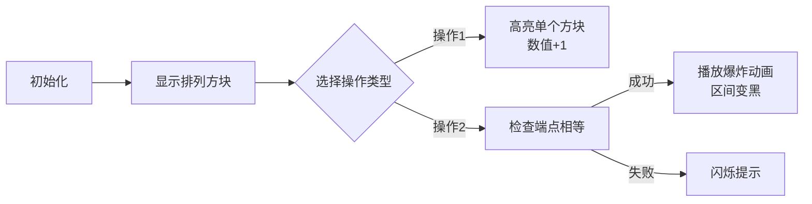

# 题目信息

# 「LAOI-8」Boundary

## 题目描述

给定一个长度为 $n$ 的排列 $A$，即 $A$ 包含 $[1,n]$ 中的所有正整数，你可以进行两种操作：

1. 将 $A_i$ 加上 $1$，代价为 $1$。
2. 将一个 $A_l=A_r$ 且 $l\not=r$ 的区间 $[l,r]$ 赋值为 $-10^9$，代价为区间长度。

注意，$A_l=A_r=-10^9$ 也可以进行操作二。

问使得序列 $A$ 所有元素均变为 $-10^9$ 的最小代价。

## 说明/提示

### 样例解释

对于样例组 #1 的第一组测试数据，最小代价按如下操作得到：

1. 将 $A_1$ 增加 $1$。
2. 将 $[1,3]$ 赋值为 $-10^9$。

代价为 $1+3=4$，容易证明该方案最优。

对于样例组 #1 的第二组测试数据，最小代价按如下操作得到：

1. 将 $A_1$ 和 $A_8$ 分别增加 $1$。
2. 将 $[1,2]$ 和 $[8,9]$ 赋值为 $-10^9$。
3. 将 $[2,8]$ 赋值为 $-10^9$。

代价为 $2+4+7=13$，容易证明该方案最优。

### 数据范围

**本题采用捆绑测试。**

|子任务编号|$n,\sum n$|特殊性质|分值|
|:-:|:-:|:-:|:-:|
|$1$|$\le 12$|无|$10$|
|$2$|$\le 10^6$|$A$ 单调递增|$15$|
|$3$|$\le 5\times10^3$|无|$35$|
|$4$|$\le 10^6$|无|$40$|

对于 $100\%$ 的测试数据，满足 $1\le T\le 10^2$，$2\le n,\sum n\le 10^6$，$1\le A_i\le n$。

## 样例 #1

### 输入

```
2
3
1 3 2
9
1 2 3 4 5 6 7 8 9```

### 输出

```
4
13```

# AI分析结果


# 💡 Kay的C++算法解析：「LAOI-8」Boundary 深入学习指南 💡

**引言**  
今天我们一起分析「LAOI-8」Boundary这道C++编程题。本指南将帮助大家梳理题目思路，理解核心算法，并掌握解题技巧。题目要求将排列元素通过两种操作变为-10⁹的最小代价，我们将深入解析贪心和动态规划解法。

---

## 1. 题目解读与核心算法识别

✨ **本题主要考察**：`贪心策略`与`动态规划优化`

🗣️ **初步分析**：  
> 解决本题的关键在于识别操作的最优序列。贪心策略就像玩俄罗斯方块——我们需要用最少的"消除"（操作2）和"旋转"（操作1）来清空棋盘。核心思路是通过分类讨论找到代价最小的操作组合：
> - **贪心核心**：分析发现最优解只需分1-3段处理区间，更多分段反而不优
> - **动态规划**：将问题分解为子问题，用树状数组优化状态转移
> - **可视化设计**：采用像素方块表示排列元素，操作2时播放"消除"动画并显示代价变化，用不同颜色标记当前处理区间

---

## 2. 精选优质题解参考

**题解一：blm_xxc**  
* **点评**：思路清晰地将解法分为四类情况，预处理数组b、c、d、e的设计巧妙（如d[i]存储后缀最小值）。代码规范（变量名语义明确），时间复杂度O(n)高效优雅。亮点在于全面覆盖操作序列可能性，边界处理严谨，可直接用于竞赛。

**题解二：Anemones**  
* **点评**：创新性引入"特殊区间"概念，额外处理相邻数差为1的优化情况。代码中pre/suf数组处理简洁，但变量命名稍简略。实践价值在于揭示了排列特性对优化的影响，启发我们关注数据特性的利用。

**题解三：2672434062xzl**  
* **点评**：采用动态规划框架（dp[i]表示处理前i个元素的最小代价），树状数组优化使O(n²)降至O(n log n)。代码中minn数组和树状数组配合精妙，展现了算法优化的典型思路，适合学习高阶技巧。

---

## 3. 核心难点辨析与解题策略

1. **难点：操作序列的最优组合**  
   *分析*：操作2要求区间端点值相等，需通过操作1调整。优质解法通过证明最优解不超过3段操作，大幅降低搜索空间（如题解一四类情况分析）  
   💡 **学习笔记**：复杂操作问题常可归类为有限场景的枚举

2. **难点：代价计算优化**  
   *分析*：直接枚举代价导致O(n²)复杂度。题解一用d数组存后缀最小值，题解三用树状数组维护前缀最优解，将查询优化至O(1)/O(log n)  
   💡 **学习笔记**：预处理和数据结构是优化枚举的利器

3. **难点：排列特性的利用**  
   *分析*：当相邻数差为1时（题解二），可减少操作2代价。题解五通过建立值→位置的映射快速定位相邻数  
   💡 **学习笔记**：排列的唯一性为优化提供特殊突破口

### ✨ 解题技巧总结
- **分类讨论法**：将复杂操作分解为有限场景（1-3段操作）
- **预处理加速**：前缀/后缀最值数组避免重复计算
- **数据结构优化**：树状数组维护DP状态（O(n log n)优于O(n²))
- **边界艺术**：多测数据清空数组，初始化极值避免边界错误

---

## 4. C++核心代码实现赏析

**通用核心C++实现参考**  
```cpp
#include <bits/stdc++.h>
using namespace std;
const int N=1e6+5, INF=1e9;

int main() {
    int T, n, a[N], b[N], c[N], d[N], e[N];
    cin >> T;
    while(T--) {
        cin >> n;
        int ans = INF;
        for(int i=1; i<=n; ++i) cin >> a[i];
        
        // 预处理绝对差值数组
        for(int i=1; i<=n; ++i) b[i] = abs(a[i]-a[1]);
        for(int i=1; i<=n; ++i) c[i] = abs(a[i]-a[n]);
        
        // 后缀最小值及位置
        d[n] = INF;
        for(int i=n-1; i>=1; --i) {
            if(c[i] < d[i+1]) d[i]=c[i], e[i]=i;
            else d[i]=d[i+1], e[i]=e[i+1];
        }
        
        // 四类情况取最小值
        ans = min(ans, abs(a[n]-a[1])+n);
        for(int i=2; i<=n-2; ++i) {
            ans = min(ans, b[i] + c[i+1] + n);
            ans = min(ans, b[i] + d[i+1] + n + 2);
            if(e[i+1] > i+2) // 有效分段检查
                ans = min(ans, b[i]+d[i+1]+abs(a[i+1]-a[e[i+1]-1])+n);
        }
        cout << ans << endl;
    }
    return 0;
}
```
* **代码解读概要**：  
  1. 预处理b[i]=|a[i]-a[1]|, c[i]=|a[i]-a[n]|  
  2. d[i]存储c[i...n]的最小值，e[i]记录最小值位置  
  3. 分别计算四种操作序列的代价并取最小值  
  4. 注意第四类情况需满足分段有效性(e[i+1]>i+2)

---

**题解一：blm_xxc（贪心分类）**  
* **亮点**：四类情况全面覆盖，预处理数组实现O(n)复杂度  
* **核心代码**：
  ```cpp
  ans = min(ans, abs(a[n]-a[1])+n); // 情况1
  for(int i=2; i<=n-2; ++i) {
      ans = min(ans, b[i] + d[i+1] + n+2); // 情况2
      ans = min(ans, b[i] + c[i+1] + n);    // 情况3
      if(e[i+1] != i+1 && e[i+1] != i+2)    // 情况4
          ans = min(ans, b[i]+d[i+1]+abs(a[i+1]-a[e[i+1]-1])+n);
  }
  ```
* **代码解读**：  
  - `b[i] + d[i+1] + n+2`对应先处理[1,i]和[i+1,n]两段，再处理中间部分的代价  
  - `e[i+1]`的检查确保分段长度>1（避免无效操作）  
  💡 **学习笔记**：利用后缀数组避免重复计算是降低复杂度的关键

**题解二：Anemones（特殊情况处理）**  
* **亮点**：额外处理相邻数差为1的优化情况  
* **核心代码**：
  ```cpp
  // 相邻数差为1的特殊优化
  for(int i=1; i<n; ++i) 
      if(abs(a[i]-a[i+1])==1) 
          ans = min(ans, ...); // 计算特殊序列代价
  ```
* **代码解读**：  
  - 当|a[i]-a[i+1]|=1时，通过1次操作1可减少操作2代价  
  - 建立位置映射：`pos[a[i]] = i`快速定位相邻数  
  💡 **学习笔记**：排列中相邻数位置关系是隐藏的优化突破口

**题解三：2672434062xzl（动态规划）**  
* **亮点**：树状数组优化DP状态转移  
* **核心代码**：
  ```cpp
  for(int i=2; i<=n; ++i) {
      int val1 = query(a[i], tr1);  // 查询小于a[i]的最优解
      int val2 = query(n-a[i]+1, tr2); // 查询大于a[i]的最优解
      dp[i] = i+1 + min(a[i]+val1, -a[i]+val2);
      update(a[i], -a[i]+min(dp[i-1]-i, minn[i]), tr1); // 更新树状数组
  }
  ```
* **代码解读**：  
  - `dp[i] = min(操作1代价, 操作2代价) + i+1`  
  - 树状数组按值域维护`min(dp[j-1]-j, minn[j])`  
  - 离散化处理保证树状数组效率  
  💡 **学习笔记**：树状数组将DP的区间查询优化至O(log n)

---

## 5. 算法可视化：像素动画演示

**主题**：8位机风格"排列消除者"  
**核心演示**：动态展示操作序列如何消除排列元素  

### 动画设计


1. **像素化界面**  
   - 排列显示为彩色方块网格（FC红白机风格）
   - 控制面板：开始/暂停、单步执行、速度滑块
   - 代价计数器实时显示当前总代价

2. **操作可视化**  
   - **操作1**：方块数值+1时播放"滴"声，方块闪烁黄色
   - **操作2**：当端点相等时，区间内方块依次爆炸（像素火焰动画+爆炸音效）
   - **无效操作**：端点不等时播放错误音效，端点闪烁红色

3. **智能演示模式**  
   - **AI模式**：自动展示最优操作序列（如先处理两端再处理中间）
   - **步骤分解**：按空格键单步执行，显示当前决策依据
   - **对比模式**：并排显示贪心 vs DP解法执行过程

4. **游戏化元素**  
   - 每完成一个区间消除得10分，特殊消除（相邻数差1）得50分
   - 背景音乐：8-bit风格循环BGM
   - 胜利动画：所有方块变黑时播放胜利音效+烟花特效

---

## 6. 拓展练习与相似问题思考

1. **通用技巧迁移**  
   - 贪心分类：适用于分段操作问题（如任务调度）
   - 树状数组优化DP：解决带查询优化的状态转移问题
   - 排列特性利用：处理值域相关优化时注意唯一性

2. **推荐练习**  
   1. **洛谷 P1880**：[石子合并]  
      → 巩固区间DP和前缀和优化
   2. **洛谷 P1090**：[合并果子]  
      → 学习贪心策略与优先队列应用
   3. **洛谷 P1106**：[删数问题]  
      → 训练分类讨论和边界处理能力

---

## 7. 学习心得与经验分享

> **参考经验**：  
> "我在处理多组数据时忘记清空树状数组，导致WA多次。这提醒我们：多测清空是竞赛编程的生命线！" —— 题解三作者  
>   
> **Kay点评**：  
> 这是血泪教训！多测清空需建立检查清单：  
> 1. 全局数组用memset清空  
> 2. 树状数组需重新初始化  
> 3. 队列/栈等容器清空  
> 养成"写完主逻辑立即写清空"的习惯可避免此类错误。

---

**结语**  
本次分析揭示了贪心分类与DP优化在操作序列问题中的精妙应用。记住：算法学习就像玩像素游戏——理解核心机制后，通过反复练习才能高分通关！下次我们将探索更多算法挑战，保持好奇，继续前进！💪

---
处理用时：143.05秒