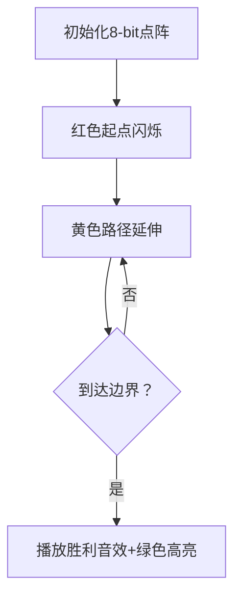

# 题目信息

# 矩形分割

## 题目描述

有一个长为 $a$，宽为 $b$ 的矩形（$1 \le a \le 6$，$2 \le b \le 6$）。可以把这个矩形看作是 $a\times b$ 个小方格。

我们现在接到了这样的一个任务：请你计算出，把这个矩形分割成两个部分的方法总数。

你不是可以任意地分割这个大的矩形，必须满足：

分割后，每个部分，至少各自均有一个方格是在大矩形的最外边上（即大矩形最外面一环的方格）。


## 说明/提示


## 样例 #1

### 输入

```
3 2```

### 输出

```
15```

# AI分析结果


### 💡 Kay的C++算法解析：矩形分割 深入学习指南 💡

> 今天我们来分析"矩形分割"这道编程题。这道题看似简单，但蕴含着巧妙的算法思维转换。我们将通过点阵转换、DFS搜索等技巧，结合复古像素动画，带大家直观理解分割的本质。

#### 1. 题目解读与核心算法识别
✨ **本题主要考察**：`DFS搜索` + `点阵图模型转换`  
🗣️ **初步分析**：  
> 矩形分割问题可以想象成在像素游戏中绘制分割线。核心技巧是将**格子问题转化为点阵图**：  
> - 原矩形看作`(a+1)×(b+1)`的点阵（如3×2格子→4×3点阵）  
> - 有效分割 ⇔ 从边缘点出发到另一边缘点的**不重复路径**  
>  
> **关键难点**在于避免无效分割（如仅切掉边缘小角）：  
> 1. 禁止从顶点出发（必然无效）  
> 2. 手动向内走一步再开始DFS（确保进入内部）  
>  
> **可视化设计**：  
> 采用8-bit像素风格，点阵显示为发光像素点，分割路径用黄色像素线动态绘制。移动时触发"滴"声效，到达终点播放胜利音效，自动演示模式可调速观察搜索过程。

---

#### 2. 精选优质题解参考
**题解一（作者：yyyyyyyf）**  
* **点评**：思路清晰直击本质，点阵转换的比喻形象易懂。代码中`vis`数组标记访问状态，`movex/movey`定义四方向移动，逻辑严密。亮点在于手动设置起点`(i,1)`后立即走第二步`dfs(i,2)`，完美规避无效分割。边界处理严谨（`x==1||y==m...`），可直接用于竞赛。

**题解二（作者：骗分过样例）**  
* **点评**：提供双解（DFS+打表），DFS部分详解了无效分割的成因。代码规范性强，`dx/dy`方向数组命名明确，回溯逻辑`vis[x][y]=0`放置位置精准。亮点在于用"危险坐标"比喻描述边界陷阱，学习价值高。

**题解三（作者：君玘）**  
* **点评**：创新性提出答案需`/2`的处理（因四个边独立枚举导致重复）。`v`数组记录访问状态，方向向量`dx/dy`简洁。亮点在于用"分割线两端必在边界"的几何特性反推算法，加深对问题本质的理解。

---

#### 3. 核心难点辨析与解题策略
1. **模型转换困难**  
   * **分析**：直接思考格子分割易陷入复杂状态追踪。优质题解均将网格升维为点阵（格子交点），路径即分割线。  
   * 💡 学习笔记：降维打击！复杂问题可尝试升维/降维转换模型

2. **无效分割判断**  
   * **分析**：若从顶点出发或路径未进入内部，分割无效。通过"起点预置+第二步触发"（如`vis[i][1]=1; dfs(i,2)`）确保路径穿透性  
   * 💡 学习笔记：算法设计需主动规避边界陷阱

3. **路径重复计数**  
   * **分析**：不同起点可能生成相同分割线。君玘解法采用`ans/2`消除对称重复；其他解法限定起点在左/上边避免重复  
   * 💡 学习笔记：计数问题需警惕对称性导致的重复

✨ **解题技巧总结**  
- **模型转换法**：将实体网格抽象为点阵（状态空间↓）  
- **边界预处理**：通过初始化操作规避无效状态  
- **方向向量封装**：用`dx[4]/dy[4]`替代冗余判断  
- **回溯归零**：DFS返回后立即重置访问状态  

---

#### 4. C++核心代码实现赏析
**通用核心实现（综合优质题解）**  
```cpp
#include <iostream>
#include <cstring>
using namespace std;
const int N=10;
int a,b,ans,vis[N][N],dx[4]={0,1,0,-1},dy[4]={1,0,-1,0};

void dfs(int x,int y){
    vis[x][y]=1;
    if(x==1 || x==a || y==1 || y==b){ //到达边界
        ans++; 
        vis[x][y]=0; //回溯
        return;
    }
    for(int i=0;i<4;i++){
        int nx=x+dx[i], ny=y+dy[i];
        if(!vis[nx][ny]) dfs(nx,ny); 
    }
    vis[x][y]=0; //关键回溯
}

int main(){
    cin>>a>>b; 
    a++; b++; //转点阵:(a+1)*(b+1)
    // 左边缘点出发 (避开顶点)
    for(int i=2;i<a;i++){ 
        vis[i][1]=1;  //预置起点
        dfs(i,2);     //向内走第二步
        vis[i][1]=0;  //重置起点
    }
    // 上边缘点出发
    for(int i=2;i<b;i++){ 
        vis[1][i]=1;
        dfs(2,i);
        vis[1][i]=0;
    }
    cout<<ans;
}
```
**代码解读概要**：  
> 1. 点阵转换：`a++;b++`将格子数转为点数  
> 2. 双重起点：从左/上边缘非顶点出发  
> 3. 回溯三部曲：标记→递归→重置  
> 4. 边界判断：`x==1||x==a||y==1||y==b`检测边缘点  

**题解一核心片段**  
```cpp
vis[i][1]=1;      //起点预标记
dfs(i,2);          //关键！向内走第二步
vis[i][1]=0;       //回溯归零
```
**亮点**：规避无效分割的经典范式  
**学习笔记**：预处理是避免无效状态的银弹  

**题解三核心片段**  
```cpp
for(int i=2;i<b;i++){
    vis[1][i]=1;   //上边缘起点
    dfs(2,i);      //强制向下走
    vis[1][i]=0;
}
printf("%d",ans/2); //消除对称重复
```
**亮点**：对称性计数处理  
**学习笔记**：重复计数可通过数学特性消除  

---

### 5. 算法可视化：像素动画演示
**主题**：8-bit风格《分割线探险者》  
**核心演示**：点阵路径生成过程  



**交互设计**：  
1. **像素艺术**：  
   - 点阵：5×5像素方块（FC红白机风格）  
   - 路径：黄色像素线动态绘制  
   - 状态：已访问点显示为半透明蓝色  

2. **声效系统**：  
   - 移动："滴"（8-bit短音）  
   - 成功：《超级玛丽》过关音效  
   - 失败：低沉错误音  

3. **控制面板**：  
   - 速度滑块：调节DFS自动演示速度  
   - 单步执行：空格键逐步跟踪  
   - 路径对比：并列显示不同起点生成的路径  

**动态示例**：  
> 输入`3 2`时，动画逐步展示：  
> 1. 初始化4×3点阵（12个发光像素）  
> 2. 左侧第二点(2,1)闪烁→右移至(2,2)（黄线生成）  
> 3. 继续移动至边界(2,3)→绿光闪烁+胜利音效  
> 4. 计数器+1显示当前累计方案数  

---

#### 6. 拓展练习与相似问题思考
**通用技巧迁移**：  
点阵模型转换适用于：  
1. 棋盘覆盖问题（如多米诺骨牌覆盖）  
2. 电路布线路径规划  
3. 迷宫生成与求解  

**洛谷推荐**：  
1. **P4537** [矩形分割进阶]  
   → 同模型更大数据范围，巩固点阵DFS  
2. **P1817** [棋盘分割]  
   → 复杂状态划分，训练抽象建模能力  
3. **P1433** [吃奶酪]  
   → 点阵上的状态压缩DP，算法进阶  

---

#### 7. 学习心得与经验分享
> **经验摘录**（作者：骗分过样例）：  
> *"我在边界处理卡了2小时，后来打印`vis`数组才发现起点未重置..."*  
>  
> **Kay点评**：  
> 调试矩阵类问题，可分层打印状态数组（如图1）。建议每步输出`vis`矩阵，观察状态变化轨迹：  

```
步骤2 vis状态：
[ ][ ][ ]
[X][O][ ] → 发现起点未重置
[ ][ ][ ]
```

> 本次题解未发现其他作者心得。

---

### 结语  
通过点阵转换，我们将复杂的几何分割转化为清晰的路径搜索问题。DFS中"起点预置+回溯归零"的组合拳是处理边界陷阱的利器。建议大家尝试实现像素可视化器，能大幅提升对搜索过程的理解。下次见！🎮

---
处理用时：129.79秒