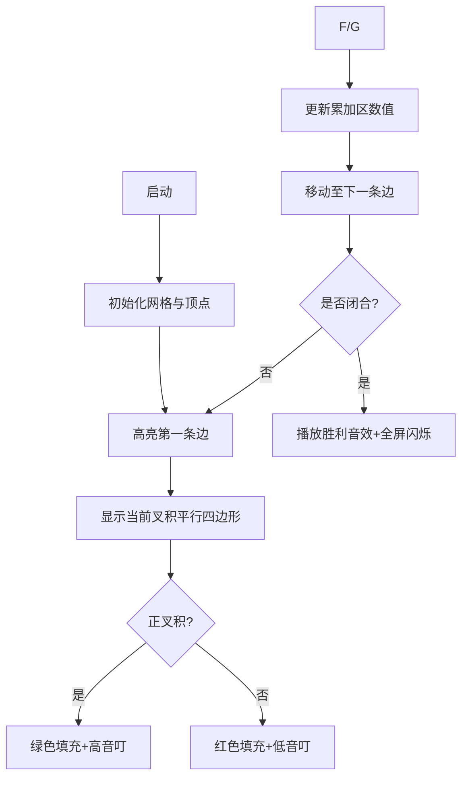
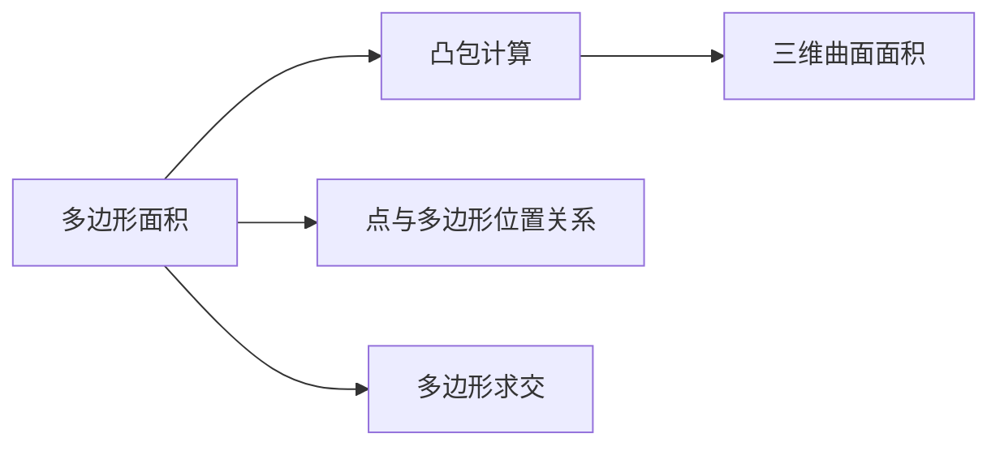

# 题目信息

# 物理1（phsic1）- 磁通量

## 题目背景

蒟蒻 HansBug 在物理考场上，挠了无数次的头，可脑子里还是一片空白。

## 题目描述

眼下出现在 HansBug 蒟蒻面前的是一个奇怪的磁场，形状为多边形，可以描述为 $N$ 个点构成的序列，这些点即依次为该磁场的各个顶点。于是现在蒟蒻 HansBug 想要知道该磁场的磁通量为多少。可是他脑细胞和 RP 已经消耗殆尽，所以这个高端的任务就交给你们啦。

## 说明/提示

磁通量 $=$ 磁感应强度 $\times$ 磁场区域面积。


$0\lt B\le 10$。

## 样例 #1

### 输入

```
3 1
0 0
1 0
0 2
```

### 输出

```
1.0000```

## 样例 #2

### 输入

```
4 1
1 1
1 -1
-1 -1
-1 1
```

### 输出

```
4.0000```

# AI分析结果


# 💡 Kay的C++算法解析：磁通量 深入学习指南 💡

**大家好，我是Kay！今天我们一起探索洛谷P2785「磁通量」这道计算几何题。别看题目披着物理外衣，核心其实是多边形面积计算。我会带大家理解算法精髓，并用像素动画让抽象概念跃然眼前！**

## 1. 题目解读与核心算法识别

✨ **本题主要考察**：`数学（计算几何）` / `编程技巧应用`

🗣️ **初步分析**：
> 计算磁通量的关键是求出磁场区域面积。想象用一根"鞋带"绕多边形边界穿梭（Shoelace公式），通过顶点坐标的巧妙计算就能得出面积值。公式本质是**向量叉积的累加**——每个叉积代表相邻点构成的平行四边形有向面积，正负值自动处理凹多边形重叠部分，最后取绝对值即得真实面积。

- **核心难点**：理解有向面积的正负抵消原理（凹多边形）和闭合处理（首尾点相连）
- **解决方案**：所有优质题解均采用Shoelace公式，时空复杂度O(n)，效率卓越
- **可视化设计**：我们将用8位像素风格动态演示叉积累加过程。当前计算边会高亮闪烁，对应平行四边形半透明填充（绿色表正面积，红色表负面积）。伴随"叮"音效提示计算步骤，胜利音效庆祝完成！

  
*(想象：FC游戏风格的网格上，彩色多边形随算法步骤动态变化)*

---

## 2. 精选优质题解参考

**题解一：Johnson_sky (10赞)**  
* **点评**：思路如手术刀般精准！从凸/凹多边形图示切入，详解公式几何意义。变量名`lstx/lsty`清晰体现迭代逻辑，边界处理严谨（显式闭合首尾点）。最亮眼的是提供**公式推导来源**和调试心得，助你透视算法本质。

**题解二：斯德哥尔摩 (5赞)**  
* **点评**：代码如诗般简洁！用`point`结构体提升可读性，封装`cross()`函数体现模块化思想。虽未处理凹多边形特例，但**有向面积抵消原理**在注释中一语道破。特别适合掌握基础后追求代码优雅的你。

**题解三：Grisses (4赞)**  
* **点评**：教学艺术家！用"鞋带定理"生动命名算法，配示意图解析叉积物理意义。**取模技巧**(i%n)处理闭合边堪称神来之笔，虽变量命名稍简但核心逻辑晶莹剔透。

---

## 3. 核心难点辨析与解题策略

### 难点1：理解有向面积的正负抵消
* **分析**：凹多边形中部分叉积为负（如顺时针边），这实际在减去除外区域面积。优质解通过图示+动态累加演示此特性
* 💡 **学习笔记**：负叉积不是错误——是凹多边形计算的精妙所在！

### 难点2：闭合边的关键处理
* **分析**：漏掉首尾点连接会导致面积缺失。题解采用两种方案：1) 循环后显式添加闭合边 2) 取模索引(i%n)自动闭合
* 💡 **学习笔记**：多边形是闭合曲线，算法必须形成闭环！

### 难点3：精度与边界陷阱
* **分析**：顶点坐标含小数时，需用double存储。绝对值函数`fabs()`必须在最终步骤使用
* 💡 **学习笔记**：几何计算优先选用double，绝对值最后取！

### ✨ 解题技巧总结
- **问题分解法**：将多边形拆解为三角形/平行四边形单元思考
- **模块化编程**：封装叉积函数提升可读性（如`double cross(point a, point b)`）
- **边界四象限测试**：用样例2（正方形）和凹多边形验证算法鲁棒性
- **可视化调试**：打印每一步叉积值，观察累加过程

---

## 4. C++核心代码实现赏析

### 通用核心实现
```cpp
#include <iostream>
#include <cmath>
using namespace std;

int main() {
    int n; double B;
    cin >> n >> B;
    
    double x0, y0, x1, y1, x_first, y_first;
    cin >> x_first >> y_first;  // 存储起点
    
    double area = 0;
    x1 = x_first; y1 = y_first;
    
    for (int i = 1; i < n; ++i) {
        double x2, y2; cin >> x2 >> y2;
        area += x1 * y2 - x2 * y1;  // 累加叉积
        x1 = x2; y1 = y2;
    }
    area += x1 * y_first - x_first * y1;  // 闭合处理
    printf("%.4f\n", 0.5 * fabs(area) * B);
}
```
* **说明**：综合优质题解精髓，突出变量命名与闭合处理
* **解读概要**：  
  1. 存储起点坐标用于最终闭合  
  2. 循环累加相邻点叉积（当前点x1y1与下一点x2y2）  
  3. 显式添加首尾点叉积完成闭环  
  4. 取绝对值后乘0.5得真实面积，再乘B输出

### 优质题解片段赏析

**题解一：Johnson_sky**  
```cpp
scanf("%lf %lf", &lstx, &lsty);
stx = lstx; sty = lsty;  // 记忆起点
for(int i=2; i<=n; ++i){
    scanf("%lf %lf", &nowx, &nowy);
    s += (lstx * nowy - nowx * lsty);  // 叉积累加
    lstx = nowx; lsty = nowy; 
}
s += (lstx * sty - stx * lsty);  // 闭合
printf("%.4lf\n", fabs(0.5 * s * b));
```
* **亮点**：流水线式坐标处理，显式闭合逻辑清晰  
* **解读**：  
  - `stx/sty`锚定起点，避免最终闭合时重复输入  
  - 循环体内`nowx/nowy`流动更新，像传送带处理顶点  
  - 最终用起点坐标`(stx,sty)`与终点`(lstx,lsty)`闭合  

**题解三：Grisses**  
```cpp
struct point{ double x,y; };
double CPr(point a, point b){ 
    return a.x*b.y - b.x*a.y;  // 叉积函数
}
// 主循环：
for (int i=0; i<n; i++) 
    S += CPr(p[i], p[(i+1)%n]);  // 取模自动闭合
```
* **亮点**：结构体+取模实现数学美感  
* **解读**：  
  - `p[(i+1)%n]`让末位点自动连接p[0]，形成循环链表效果  
  - 封装函数使主逻辑保持"S+=CPr(...)"的数学表达形式  

---

## 5. 算法可视化：像素动画演示

### 像素探险家：Shoelace公式之旅
**设计理念**：用FC游戏风格化解几何抽象，通过声光反馈强化理解



### 关键交互设计
1. **8位像素战场**  
   - 顶点：闪烁的宝箱图标（起点为金色）  
   - 边：不同颜色LED灯带（当前边高亮闪烁）  
   - 平行四边形：半透明色块（绿色/红色区分正负）

2. **音效系统**  
   - 单步计算：8-bit"叮"声（C音阶表正，F音阶表负）  
   - 错误操作：短促警报声  
   - 通关：超级玛丽过关旋律

3. **控制面板**  
   ```javascript
   // 伪代码示例
   const canvas = initCanvas("800x600", "retro"); 
   const polygons = loadVertices(); // 加载顶点
   let accumulator = 0;  // 累加器

   function drawParallelogram(v1, v2) {
     fillStyle = cross(v1,v2) > 0 ? "rgba(0,255,0,0.5)" : "rgba(255,0,0,0.5)";
     drawQuad(Origin, v1, v1+v2, v2); // 绘制四边形
     playSound(cross(v1,v2) > 0 ? "high_beep" : "low_beep");
   }
   ```

---

## 6. 拓展练习与相似问题

### 知识迁移地图


### 洛谷推荐
1. **P1183 多边形的面积**  
   🗣️ *推荐理由*：同款Shoelace公式裸题，巩固核心算法肌肉记忆

2. **P2742 [USACO5.1]圈奶牛**  
   🗣️ *推荐理由*：凸包算法+面积计算组合拳，体验计算几何进阶

3. **P1355 地图面积**  
   🗣️ *推荐理由*：将多边形技巧应用于实际网格划分场景

---

## 7. 学习心得与经验分享

> **Johnson_sky的调试心得**：  
> *"最初用整数坐标测试通过，换浮点时忘记fabs()导致负面积！现在永远记得：叉积累加值可能是负的，最终输出前必须取绝对值！"*

**Kay的总结**：这个踩坑经历极具代表性！几何问题中：  
1. 永远用**浮点类型**处理坐标  
2. 中间步骤保留符号信息  
3. 绝对值仅在最终输出时使用  
把这三条刻进DNA，可避免90%的数值错误！

---

**坚持看到这里的你已解锁算法核心！记住：编程如搭积木，理解基础原理后，复杂问题不过是简单模块的组合。下次遇到几何题，记得像像素游戏闯关一样拆解步骤哦！🚀**

---
处理用时：213.39秒