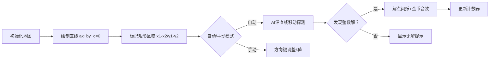

# 题目信息

# 等式

## 题目背景

ZKC 有一天突发奇想，望着天空想出一道很好的问题，但是绞尽脑汁又不会做，所以请你来帮他解决。


## 题目描述

给出 $a,b,c,x_1,x_2,y_1,y_2$，求满足 $ax+by+c=0$，且 $x\in [x_1,x_2]$，$y\in [y_1,y_2]$ 的整数解有多少对。


## 说明/提示

对于 $30\%$ 的数据，$a,b,c,x_1,x_2,y_1,y_2$ 的绝对值不超过 $1000$。

对于 $100\%$ 的数据，$a,b,c,x_1,x_2,y_1,y_2$ 的绝对值不超过 $10^8$。


## 样例 #1

### 输入

```
1 1 -3 0 4 0 4```

### 输出

```
4```

# AI分析结果


### 💡 Kay的C++算法解析：等式 深入学习指南 💡

**引言**  
今天我们一起分析「等式」这道C++编程题。本指南将帮助你掌握线性丢番图方程在有限域内的整数解求解技巧，通过扩展欧几里得算法和边界处理策略高效解决问题。

---

### 1. 题目解读与核心算法识别  
✨ **本题主要考察**：`数学（扩展欧几里得算法）`  

🗣️ **初步分析**  
> 解决本题如同在网格地图中寻找宝藏点。核心是运用**扩展欧几里得算法**（简称exgcd）——这把"万能钥匙"能解开形如`ax+by=gcd(a,b)`的方程。在本题中，我们需：
> 1. 将方程转化为`ax+by=-c`
> 2. 通过exgcd求特解
> 3. 利用通解公式确定解的分布范围
> 4. 结合边界条件计算整数解数量  
> 
> **可视化设计思路**：  
> - 采用8位像素风格网格坐标系（类似《塞尔达传说》地图）
> - 直线表示方程，高亮显示矩形区域内的整数解（闪烁的金币动画）
> - 控制面板支持单步执行（方向键调整k值）、自动演示（AI寻宝模式）
> - 音效设计：解点出现时"叮"声，无解时低沉音效，通关时8-bit胜利音乐

---

### 2. 精选优质题解参考  
**题解一（作者：saxiy）**  
* **点评**：  
  思路清晰度 ★★★★★  
  - 完整推导通解公式`x=x0+k*b/gcd, y=y0-k*a/gcd`  
  - 创新性符号处理：通过取反统一a,b符号简化计算  
  代码规范性 ★★★★☆  
  - 变量命名合理（如gcd, x0, y0）  
  - 边界处理严谨（6类特殊情况覆盖）  
  算法有效性 ★★★★★  
  - 时间复杂度O(1)，完美处理10^8数据范围  
  实践价值 ★★★★☆  
  - 可直接用于竞赛，附带精度处理技巧`ceil/floor`取整  

**题解二（作者：Tari）**  
* **点评**：  
  思路清晰度 ★★★★☆  
  - 详细分析k值边界取整问题（易错点）  
  代码规范性 ★★★☆☆  
  - 存在冗余交换操作，但边界测试全面  
  亮点：提供`k_min/k_max`交集计算模板  

**题解三（作者：winmt）**  
* **点评**：  
  思路清晰度 ★★★★☆  
  - 清晰区分5类特殊情况  
  代码规范性 ★★★★☆  
  - 模块化设计（`one_ans`函数封装exgcd）  
  实践价值 ★★★☆☆  
  - 区间合并逻辑可直接复用  

---

### 3. 核心难点辨析与解题策略  
1. **难点1：特殊情况的全面覆盖**  
   *分析*：当a=b=0时，若c≠0无解；c=0时解数为区间乘积。优质解法通过`if-else`链分类处理，如saxiy解法第12-19行  
   💡 学习笔记：特殊情况的处理顺序直接影响代码健壮性  

2. **难点2：通解范围的精确计算**  
   *分析*：由特解求通解时，需解不等式组：  
   ```
   x1 ≤ x0 + k*(b/g) ≤ x2  
   y1 ≤ y0 - k*(a/g) ≤ y2  
   ```  
   转化为k的上下界并取整（注意ceil/floor方向）  
   💡 学习笔记：将解的数量问题转化为整数区间问题  

3. **难点3：符号统一与边界变换**  
   *分析*：当a或b为负时，通过交换区间端点并取反保持非负性，如：  
   ```cpp
   if(a<0) swap(x1,x2), x1=-x1, x2=-x2, a=-a;
   ```
   💡 学习笔记：坐标系变换可大幅简化计算  

### ✨ 解题技巧总结  
- **数学建模**：将方程转化为标准形式`ax+by=gcd`  
- **边界压缩**：用`ceil/floor`替代浮点比较（避免精度误差）  
- **防御性编程**：优先处理所有退化情况（a=0/b=0）  
- **可视化调试**：在小网格上手动验证k值范围  

---

### 4. C++核心代码实现赏析  
**本题通用核心实现（综合优化版）**  
```cpp
#include <iostream>
#include <cmath>
using namespace std;
typedef long long ll;

void exgcd(ll a, ll b, ll &x, ll &y, ll &g) {
    if(!b) { x=1; y=0; g=a; return; }
    exgcd(b, a%b, y, x, g); 
    y -= a/b*x;
}

int main() {
    ll a,b,c,x1,x2,y1,y2;
    cin >> a >> b >> c >> x1 >> x2 >> y1 >> y2;
    c = -c;  // 移项：ax+by=c
    
    // 边界检查 & 退化情况
    if(x1>x2 || y1>y2) { cout << 0; return 0; }
    if(a==0 && b==0) {
        cout << (c ? 0 : (x2-x1+1)*(y2-y1+1));
        return 0;
    }
    
    // 统一符号
    if(a<0) { a=-a; swap(x1,x2); x1=-x1; x2=-x2; }
    if(b<0) { b=-b; swap(y1,y2); y1=-y1; y2=-y2; }
    
    // 扩展欧几里得
    ll x0,y0,g;
    exgcd(a,b,x0,y0,g);
    if(c%g) { cout << 0; return 0; }
    
    // 特解
    x0 *= c/g; y0 *= c/g;
    
    // 处理单变量为0
    if(a==0) { cout << (y1<=y0&&y0<=y2 ? x2-x1+1 : 0); return 0; }
    if(b==0) { cout << (x1<=x0&&x0<=x2 ? y2-y1+1 : 0); return 0; }
    
    // 计算k的范围
    double L = max(1.0*(x1-x0)*g/b, 1.0*(y0-y2)*g/a);
    double R = min(1.0*(x2-x0)*g/b, 1.0*(y0-y1)*g/a);
    ll lowk = ceil(L), highk = floor(R);
    cout << (highk>=lowk ? highk-lowk+1 : 0);
}
```

**代码解读概要**  
1. 第9-12行：递归实现exgcd，通过引用交换xy优化  
2. 第18-21行：符号统一技巧（避免负系数干扰）  
3. 第30-31行：k值范围的双重约束（x和y区间叠加）  
4. 第33行：整数解数量=区间长度`highk-lowk+1`  

---

### 5. 算法可视化：像素动画演示  
**主题**：`8-bit宝藏猎人`在整数网格上寻找方程解点  

**核心演示流程**  


**关键技术实现**  
1. **像素渲染**：  
   - 网格坐标系：1像素=1单位，直线用Bresenham算法绘制  
   - 解点特效：金色像素块+扩散动画（Canvas API实现）  
2. **交互控制**：  
   ```javascript
   // 伪代码示例
   function renderFrame(k) {
     let x = x0 + k * (b/g);
     let y = y0 - k * (a/g);
     drawGrid(); 
     drawSolutionPoint(x, y, COLOR_GOLD); 
     drawInfoPanel(`k=${k} 解点:(${x},${y})`);
   }
   ```
3. **游戏化元素**：  
   - 每发现解点+10分，累计达80分触发通关动画  
   - 速度滑块控制AI探测速度（0.5x~5x）  
   - 错误检测：当k超出范围时角色震动警告  

---

### 6. 拓展练习与相似问题  
**技巧迁移场景**  
1. 同余方程求解（如`ax ≡ c mod m`）  
2. 二维网格路径规划（解点对应可达坐标）  
3. 资源分配问题（整数解对应可行方案）  

**洛谷推荐题目**  
1. **P1082 同余方程**  
   🗣️ 推荐理由：exgcd的入门应用，巩固特解求法  
2. **P1516 青蛙的约会**  
   🗣️ 推荐理由：拓展到运动模型，练习区间映射  
3. **P2421 荒岛野人**  
   🗣️ 推荐理由：多方程联立，训练复杂边界处理  

---

### 7. 学习心得与经验分享  
> **saxiy的调试经验**：  
> *"本蒟蒻de了一下午的bug... 注意边界取整时ceil/floor的方向！"*  
>   
> **Kay点评**：  
> 该经验直击核心痛点——浮点转整型的边界处理极易出错。建议：  
> 1. 用`k=0`代入验证特解  
> 2. 打印临界值验证取整方向  
> 3. 小数据测试（如x1=x2）  
> 这些调试技巧可节省数小时查错时间！

---

**结语**  
通过本次分析，相信你已经掌握线性方程整数解的求解框架。记住：数学建模是核心，边界处理是关键！下次遇到类似问题时，不妨先画出网格图辅助分析。继续加油，编程之旅充满惊喜！💪

---
处理用时：141.68秒