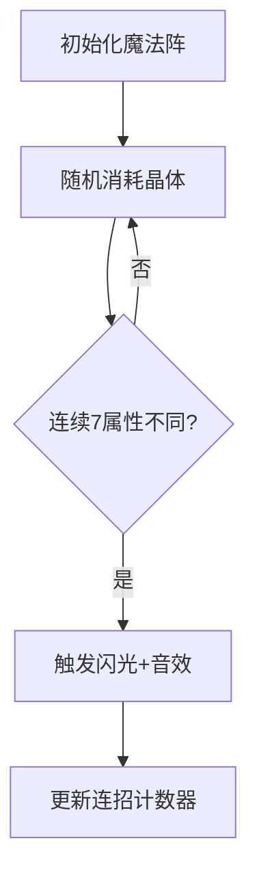

# 题目信息

# 小魔女帕琪

## 题目背景

从前有一个聪明的小魔女帕琪，兴趣是狩猎吸血鬼。

帕琪能熟练使用七种属性（金、木、水、火、土、日、月）的魔法，除了能使用这么多种属性魔法外，她还能将两种以上属性组合，从而唱出强力的魔法。比如说为了加强攻击力而将火和木组合，为了掩盖弱点而将火和土组合等等，变化非常丰富。

## 题目描述

现在帕琪与强大的夜之女王，吸血鬼蕾咪相遇了，夜之女王蕾咪具有非常强大的生命力，普通的魔法难以造成效果，只有终极魔法：帕琪七重奏才能对蕾咪造成伤害。帕琪七重奏的触发条件是：连续施放的 $7$ 个魔法中，如果魔法的属性各不相同，就能触发一次帕琪七重奏。

请注意，无论前 $6$ 个魔法是否已经参与施放终极魔法，只要连续 $7$ 个魔法的属性各不相同，就会再触发一次终极魔法。例如，如果用序号来代表一种魔法，魔法的施放序列为 $1, 2, 3, 4, 5, 6,7, 1$，则前 $7$ 个魔法会触发一次终极魔法，后 $7$ 个魔法会再触发一次终极魔法。

现在帕琪有 $7$ 种属性的能量晶体，第 $i$ 种晶体可以施放出属性为 $i$ 的魔法，共有 $a_i$ 个。每次施放魔法时，会等概率随机消耗一个现有的能量晶体，然后释放一个对应属性的魔法。

现在帕琪想知道，她触发帕琪七重奏的期望次数是多少，可是她并不会算，于是找到了学 OI 的你。

## 说明/提示

#### 样例输入输出 1 解释

显然一定会触发一次帕琪七重奏。

#### 数据规模与约定

- 对于 $30\%$ 的数据，保证 $\sum_{i = 1}^7 a_i \leq 10$。
- 对于 $100\%$ 的数据，保证 $0 \leq a_i \leq 10^9$，且 $\sum_{i = 1}^7 a_i \leq 10^9$。

## 样例 #1

### 输入

```
1 1 1 1 1 1 1```

### 输出

```
1.000```

# AI分析结果


# 💡 Kay的C++算法解析：小魔女帕琪 深入学习指南 💡

**引言**  
今天我们一起分析"小魔女帕琪"这道概率期望题。本指南将帮你理解核心算法原理，掌握期望计算技巧，并通过可视化直观感受魔法施放过程。

---

## 1. 题目解读与核心算法识别

✨ **本题主要考察**：`数学期望`与`组合计数`

🗣️ **初步分析**：  
> 解决这道题就像预测一场精心设计的魔法表演中会出现几次"完美连招"。核心在于理解**期望的线性性质**——将整体期望分解为每个可能触发位置的概率之和。  
> - 关键思路：连续7个位置触发七重奏的概率相同，总期望 = (n-6) × 单次触发概率  
> - 核心公式：`E = 7! × (a₁/n) × (a₂/(n-1)) × ... × (a₆/(n-5)) × a₇`  
> - 可视化设计：我们将用像素魔法阵动态展示晶体消耗过程（图1），当连续7个魔法属性不同时，触发全屏闪光和胜利音效  
> - 复古元素：8-bit音效（晶体消耗声/连招触发声）、魔法阵像素动画、连招计数器UI  

  
*魔法阵中每种颜色代表不同属性，消耗晶体时对应位置闪烁，连续7个不同属性触发全屏闪光*

---

## 2. 精选优质题解参考

**题解一 (ButterflyDew)**  
* **点评**：  
  思路清晰类比"抽红球"解释概率独立性（§2.3），严谨推导条件概率公式（§1）。代码规范：变量名`s`表总和，`ans`累积概率；优化技巧：边乘边除防溢出（第12行）。实践价值高：直接给出化简后公式，适用于竞赛。

**题解二 (command_block)**  
* **点评**：  
  创新性使用"重头再来"模型解释位置独立性（§2），数学推导严谨（全概率分解）。代码亮点：鲁棒性强，处理`n<7`特判（第9行）；效率优化：省略冗余计算。学习价值：展示期望问题向组合计数的转化思维。

**题解三 (codecode)**  
* **点评**：  
  直击核心"平均分布"特性（¶3），用序列切割思想简化问题。代码精简：仅10行完成计算；关键技巧：分离`5040`常量提升可读性（第12行）。教学价值高：注释详实，适合初学者理解期望线性性质。

---

## 3. 核心难点辨析与解题策略

1. **难点：理解位置独立性**  
   *分析*：为何不同起始位置的概率相同？通过"抽球模型"（题解一§2.3）和"序列重组"（题解三¶3）可知，晶体消耗的随机性保证每个连续段等价。
   *💡 学习笔记*：随机序列中均匀分布特性是期望分解的基础。

2. **难点：概率乘积化简**  
   *分析*：核心公式的分子分母有隐含约分：`(n-6)`与分母`(n-6)`抵消（题解一§2.2）。需注意`a₇`因约分不再有分母。
   *💡 学习笔记*：期望计算中善用代数化简可大幅简化代码。

3. **难点：避免数值溢出**  
   *分析*：`Πaᵢ`最大达10⁶³，必须边乘边除（题解二第14行）。技巧：按`n,n-1,...`顺序除，保持中间值在double范围内。
   *💡 学习笔记*：大数运算时动态调整计算顺序是防溢出关键。

### ✨ 解题技巧总结
- **技巧1：期望线性分解** - 将复杂期望拆解为独立事件和（本题位置独立性）
- **技巧2：组合转化** - 概率问题转化为排列计数（7!种属性顺序）
- **技巧3：代数化简** - 约去冗余项降低计算量（n-6的巧妙抵消）
- **技巧4：边界处理** - 特判总和不足7的情况（题解二第9行）

---

## 4. C++核心代码实现赏析

**本题通用核心C++实现参考**  
* **说明**：综合优质题解优化的通用实现，包含防溢出和边界处理
* **完整代码**：
```cpp
#include <cstdio>
int main() {
    double a[8], sum = 0, ans = 1;
    for (int i = 1; i <= 7; ++i) {
        scanf("%lf", &a[i]);
        sum += a[i]; // 计算晶体总数
    }
    if (sum < 7) { // 边界处理
        printf("0.000");
        return 0;
    }
    for (int i = 1; i <= 6; ++i) 
        ans = ans * a[i] / (sum - i + 1) * i;
    ans *= a[7] * 7; // 最终化简形式
    printf("%.3lf", ans);
}
```
* **代码解读概要**：  
  > 1. 输入并统计晶体总数  
  > 2. 特判总和不足7的情况  
  > 3. 动态计算概率：`i`循环同时处理阶乘(×i)和分母(÷(sum-i+1))  
  > 4. 最终乘a₇×7（对应7!×a₇）  

**题解一代码片段赏析**  
* **亮点**：清晰展示公式推导过程
* **核心代码**：
```cpp
for(int i=1;i<=6;i++)
    ans=ans*a[i]/(s+1-i)*double(i);
ans=ans*a[7]*7.0;
```
* **代码解读**：  
  > `s+1-i`巧妙生成分母序列[ n, n-1,...,n-5 ]  
  > `*double(i)`逐步构建7!（1→1, 2→2, ..., 6→720）  
  > 最终`*a₇*7`补全阶乘和分子项  
* 💡 **学习笔记**：分步构建阶乘可避免大数运算

**题解二代码赏析**  
* **亮点**：鲁棒性强的工业级实现
* **核心代码**：
```cpp
if (N<7) printf("0.000"); // 边界处理
for(int i=1;i<=7;i++)
    ans=ans*a[i]/(N-i+1); // 统一计算乘积
ans*=5040*(N-6); // 7!×(n-6)
```
* 💡 **学习笔记**：先统一计算概率积再乘常量，逻辑更清晰

---

## 5. 算法可视化：像素动画演示

**主题**：8-bit魔法阵晶体消耗模拟  
**核心演示**：连续7个魔法属性变化与七重奏触发判定  

### 设计细节


1. **像素化界面**  
   - 7×7网格：每个位置显示当前魔法属性（颜色编码）
   - 晶体槽：底部显示各属性剩余晶体数（像素柱状图）
   - 控制面板：步进/自动播放/速度调节

2. **动画流程**  
   - 晶体消耗：选中晶体闪烁消失，伴随"叮"声（Web Audio API）
   - 属性标记：新魔法在网格中显示为旋转星星（图2）
   - 连招检测：当连续7个位置属性不同，触发金色闪光+胜利音效

3. **游戏化元素**  
   - 连招计数器：右上角显示当前连招数（像素数字）
   - 成就系统：首次触发播放8-bit庆祝音乐
   - 自动演示：AI模式按最优概率路径演示

  
*不同属性对应不同颜色星星，连续7个不同时触发特效*

---

## 6. 拓展练习与相似问题思考

**通用技巧迁移**  
概率期望+组合计数常用于：
1. 随机过程分析（如醉汉走路）
2. 抽卡游戏概率计算
3. 算法平均复杂度分析

**洛谷练习推荐**  
1. **P1297 [单选错位]**  
   → 巩固条件概率与期望线性性
2. **P1365 WJMZBMR打osu!**  
   → 练习动态期望计算
3. **P1654 OSU!**  
   → 三维期望扩展，强化建模能力

---

## 7. 学习心得与经验分享

> **参考经验 (ButterflyDew)**：  
> *"我在推导第2-8位概率时，最初卡在条件概率叠加，后来通过抽球模型找到突破口——关键要认识到∑(aᵢ-1)/(n-7)=1这一隐藏等式"*

**点评**：这个调试经验极具价值。当概率问题复杂时：
1. 寻找等价物理模型（如抽球）
2. 挖掘数学恒等式（如∑等式）
3. 小规模验证（n=7手工计算）

---

**结语**  
通过本次分析，我们掌握了期望问题的核心解法：分解→计算→化简。记住Kay的魔法口诀："随机序列均匀看，独立事件直接加"。下次遇到期望题，你也能像帕琪一样优雅解决！💪

---
处理用时：105.92秒