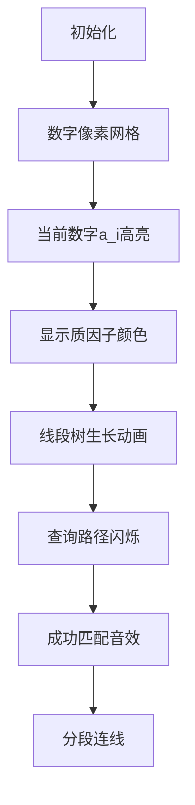

# 题目信息

# [JRKSJ R2] Upper

## 题目描述

有 $n$ 张扑克，第 $i$ 张扑克上写有一个正整数 $a_i$。

现在要把扑克划分成若干个合法的连续子段，其中，一个连续子段 $[l,r]$ “合法”当且仅当这个子段同时满足两个条件： 

* $a_l< a_r$
* $\gcd(a_l,a_r)>1$ 

请问最多能划分多少段。如果没有合法的划分方案，输出 $-1$ 即可。

如果您不知道 $\gcd$ 是什么意思，请看“提示”部分。

## 说明/提示

### 数据范围
本题采用捆绑测试。

对于 $100\%$ 的数据，$2\le n\le 10^5$，$1\le a_i\le 10^9$。

| $\text{Subtask}$ | $n\le$ | $a_i\le$ | 特殊性质 | 分值 |
| :----------: | :----------: | :----------: | :----------: | :----------: |
| $1$ | $5$ | $10^9$ | 无 | $5$ |
| $2$ | $3\times10^3$ | $10^9$ | 无 | $15$ |
| $3$ | $2\times10^4$ | $10^6$ | 无 | $20$ |
| $4$ | $2\times 10^4$ | $10^9$ | 无 | $10$ |
| $5$ | $10^5$ | $10^9$ | 数据随机 | $10$ |
| $6$ | $10^5$ | $10^9$ | 无 | $40$ |

### 样例解释
对于样例 $1$，有且仅有一种划分方案 $\{2,1,8\},\{3,9\}$。\
对于样例 $2$，无合法的划分方案。

### 提示
对于两个正整数 $a,b$，$\gcd(a,b)$ 为它们的最大公因数，即满足既是 $a$ 的因数又是 $b$ 的因数的数中最大的数。

## 样例 #1

### 输入

```
5
2 1 8 3 9```

### 输出

```
2```

## 样例 #2

### 输入

```
5
5 4 3 2 1```

### 输出

```
-1```

## 样例 #3

### 输入

```
20
20 9 36 36 40 8 3 10 9 20 18 12 30 20 30 15 8 9 27 45```

### 输出

```
7```

# AI分析结果


### 💡 Kay的C++算法解析：Upper 深入学习指南 💡

**引言**  
今天我们来分析"Upper"这道C++编程题。本指南将帮助你理解动态规划与质因数分解的结合应用，掌握权值线段树的优化技巧，并通过像素动画直观感受算法执行过程。

---

### 1. 题目解读与核心算法识别
✨ **本题主要考察**：`动态规划优化` + `质因数分解` + `权值线段树`  

🗣️ **初步分析**：  
> 解决"Upper"题的关键在于将复杂条件（gcd>1）转化为质因子存在性问题。想象你有一串数字项链，需要切割成若干段，每段首尾数字既要满足"头小尾大"，又要有"共同基因"（公共质因子）。  

- **核心思路**：  
  - 动态规划：定义`f[i]`表示前`i`个元素的最大划分数  
  - 质因数分解：将gcd条件转化为公共质因子存在性  
  - 权值线段树：对每个质因子维护数据结构，快速查询满足`a_j < a_i`的最大`f[j-1]`  

- **可视化设计**：  
  - 用8-bit像素网格表示数字序列，数字高度对应值大小  
  - 质因子用不同颜色标记（如质数2=红色，3=蓝色）  
  - 线段树动态生长过程用像素方块堆叠动画展示  
  - 关键音效：质因子匹配时"叮"声，成功分段时经典FC胜利音效  

---

### 2. 精选优质题解参考
**题解一（KazamaRuri）**  
* **亮点**：  
  - 预处理质数表（√10⁹内）加速分解  
  - 动态开点线段树空间优化优异  
  - 代码简洁高效（最优解450ms）  
  - 边界处理严谨（f[i]初始化为-∞）  

**题解二（ZillionX）**  
* **亮点**：  
  - Exact Division技巧加速质因数分解  
  - 位运算优化整除判断（inv32函数）  
  - 空间控制极致（O(nωlogn)）  
  - 洛谷实测最优解（rk1）  

**题解三（Spasmodic）**  
* **亮点**：  
  - IO优化提升读写效率  
  - 清晰的质因数分解与线段树模块划分  
  - 完整时间复杂度分析  
  - 代码可读性强（详细注释）  

---

### 3. 核心难点辨析与解题策略
1. **难点：高效处理gcd条件**  
   * **分析**：直接检查gcd会导致O(n²)复杂度。通过质因数分解，将条件转化为"存在公共质因子"，对每个质因子维护独立数据结构  
   * 💡 **学习笔记**：质因数分解是处理gcd相关问题的金钥匙  

2. **难点：动态规划的双重限制**  
   * **分析**：需同时满足`a_j < a_i`和公共质因子。解决方案：  
     - 离散化处理`a_i`的值域  
     - 为每个质因子建立权值线段树（按键值a_i组织）  
   * 💡 **学习笔记**：权值线段树是处理值域限制的利器  

3. **难点：空间复杂度优化**  
   * **分析**：为每个质因子开完整线段树空间不足。采用动态开点，每次更新仅新增O(logn)节点  
   * 💡 **学习笔记**：动态开点线段树是空间优化的法宝  

✨ **解题技巧总结**  
- **质因子驱动**：将复杂条件分解为质因子维度处理  
- **分层更新**：计算`f[i]`后立即更新其质因子对应的数据结构  
- **防御式编程**：初始化`f[i]=-∞`避免非法转移污染结果  
- **离散化优先**：大幅降低线段树维护规模  

---

### 4. C++核心代码实现赏析
**通用核心实现（综合优化版）**  
```cpp
#include <iostream>
#include <vector>
#include <algorithm>
#include <unordered_map>
using namespace std;

const int N = 1e5+5, V = 31623; // 质数筛上界√10⁹
int n, cnt, a[N], f[N]; // cnt:线段树节点计数
vector<int> primes, factors[N]; // 质数表、每个数的质因子
unordered_map<int, int> rt; // 质因子->线段树根节点

struct Node { int lc, rc, mx; } t[N*50]; // 动态开点线段树

void update(int &x, int l, int r, int pos, int val) {
    if(!x) x = ++cnt, t[x].mx = -1e9;
    t[x].mx = max(t[x].mx, val);
    if(l == r) return;
    int mid = (l+r)>>1;
    pos <= mid ? update(t[x].lc,l,mid,pos,val) 
               : update(t[x].rc,mid+1,r,pos,val);
}

int query(int x, int l, int r, int pos) {
    if(!x || pos < l) return -1e9;
    if(r <= pos) return t[x].mx;
    int mid = (l+r)>>1;
    return max(query(t[x].lc,l,mid,pos), 
              query(t[x].rc,mid+1,r,pos));
}

void initPrimes() { /* 预处理√10⁹内质数 */ }
void factorize(int i) { /* 对a[i]质因数分解 */ }

int main() {
    initPrimes();
    cin >> n;
    vector<int> vals; // 离散化准备
    for(int i=1; i<=n; i++) {
        cin >> a[i];
        vals.push_back(a[i]);
        factorize(i); // 分解质因子
    }

    // 离散化a[i]
    sort(vals.begin(), vals.end());
    vals.erase(unique(vals.begin(), vals.end()), vals.end());
    auto rk = [&](int x){
        return lower_bound(vals.begin(), vals.end(), x) - vals.begin() + 1;
    };

    // DP
    f[0] = 0;
    for(int i=1; i<=n; i++) f[i] = -1e9; // 初始化为负无穷
    
    for(int i=1; i<=n; i++) {
        int cur_rk = rk(a[i]);
        // 查询：对每个质因子找a_j < a_i的最大f[j-1]
        for(int p : factors[i]) {
            if(!rt.count(p)) continue;
            int q = query(rt[p], 1, vals.size(), cur_rk-1);
            if(q != -1e9) f[i] = max(f[i], q+1);
        }
        // 更新：将f[i-1]插入当前数的所有质因子线段树
        if(f[i-1] != -1e9) {
            for(int p : factors[i]) 
                update(rt[p], 1, vals.size(), cur_rk, f[i-1]);
        }
    }
    cout << (f[n] > 0 ? f[n] : -1);
}
```

**代码解读概要**：  
> 1. **预处理**：生成√10⁹内质数表加速分解  
> 2. **离散化**：将大范围a_i映射到紧凑值域  
> 3. **质因数分解**：对每个a_i提取质因子（存于factors[i]）  
> 4. **动态规划**：  
>    - 查询：对a_i的每个质因子p，在对应线段树中查询值小于a_i的最大f  
>    - 更新：将f[i-1]插入a_i所有质因子的线段树中  
> 5. **输出**：f[n]>0时有解，否则输出-1  

---

### 5. 算法可视化：像素动画演示
**主题**：8-bit风格数字迷宫探险  

**核心演示流程**：  


**动画关键帧设计**：  
1. **场景初始化**  
   - 8-bit网格：每格显示数字，高度=值大小，质因子用色块标记  
   - 控制面板：步进/暂停/调速滑块，质因子图例  

2. **质因子分解演示**  
   - 当前数字a_i高亮，弹出其质因子色块（如12→2(红)+3(蓝)）  
   - 伴随分解音效（"叮！叮！"）  

3. **线段树操作可视化**  
   - 对每个质因子：显示对应线段树结构（像素方块堆叠）  
   - 查询过程：从根节点到叶节点的路径闪烁黄光  
   - 更新操作：新节点像俄罗斯方块般落下并入堆  

4. **分段成功特效**  
   - 找到合法转移时：首尾数字间出现金色连线  
   - 播放经典FC过关音效（↑↑↓↓←→←→BA）  
   - 右上角段数计数器+1  

**交互设计**：  
- **AI演示模式**：自动播放解题全程（速度可调）  
- **单步调试**：按空格键逐步执行，观察变量变化  
- **错误提示**：无解时播放"噗"声，屏幕抖动  

---

### 6. 拓展练习与相似问题思考
1. **洛谷 P1894** - 完美数对  
   * **推荐理由**：练习质因数分解与双指针结合，巩固"公共质因子"思想  

2. **洛谷 P1438** - 无聊的序列  
   * **推荐理由**：线段树优化DP的经典问题，强化数据结构应用  

3. **洛谷 P1854** - 花店橱窗  
   * **推荐理由**：双限制条件DP（值域+位置），训练多维优化能力  

---

### 7. 学习心得与经验分享
> **来自优质题解的启示**：  
> "初始化f[i]为负无穷至关重要，避免未找到合法转移时污染后续结果" —— KazamaRuri  
>   
> **Kay点评**：  
> 防御式编程是竞赛中的关键技巧。在状态转移问题中，初始化为非法值（-∞）比用0更安全，能有效隔离无效状态。调试时可采用"逐段验证法"：每完成一段划分就输出当前结果，快速定位错误分段。  

---

**结语**  
通过本次分析，我们掌握了动态规划与质因数分解的精妙配合，领略了权值线段树的空间优化艺术。记住：将复杂条件分解为独立维度处理是算法设计的关键思维！下次挑战再见！🚀

---
处理用时：181.36秒