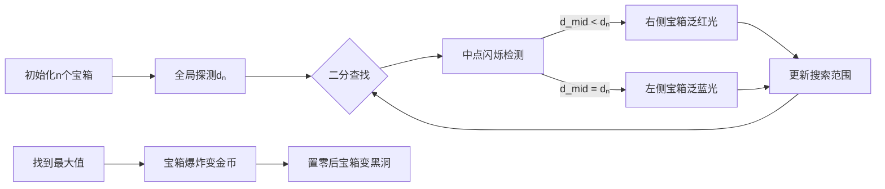

# 题目信息

# 『JROI-4』Sunset

## 题目背景

写不出优美的文字，索性不放背景了。【背景待填充】

> 由于这只是个 C，出题人打算良心点，于是加了几个 $0$（指交互次数）（确信）——验题人注。

## 题目描述

**这是一道交互题。**

落日可以抽象成一个序列 $\{a_n\}$.

$\{a_n\}$ 是一个 $1\sim n$ 的排列。

你还有一个数列 $\{d_n\}$，为**当前** $a$ 数列的前缀最大值。

换言之，
$$d_i=\max_{j=1}^i \{a_j\}$$

注意：根据前文的定义，$\{d_n\}$ 可能随着 $\{a_n\}$ 数列的改变而改变。

您可以进行两种不同的操作：

- 指定一个 $i$，询问对于当前的 $a$ 数列， $d_{1\sim i}$ 中有几个不同的值。
- 指定一个 $i$，使得 $a_i\leftarrow 0$.

请使用不超过 $5500$ 次操作求出**原排列**。

**保证交互库是静态的，即交互库不会在交互过程中改变 $a$ 数列。**

## 说明/提示

**样例仅供理解交互过程，可能不符合逻辑。**

【样例解释】

初始的序列 $a$ 为 `1 2 3`，$d$ 为 `1 2 3`.

在对交互库输出了形如 `? 2 2` 的命令后，序列 $a$ 变为 `1 0 3`，$d$ 变为 `1 1 3`，此时 $d_1\sim d_3$ 中有 $2$ 种不同的值，分别是 $1,3$.


------------


可供选手参考的资料：[OI Wiki-交互题](https://oi-wiki.org/contest/interaction/) **|** [猜数（IO交互版）
](https://www.luogu.com.cn/problem/P1733)


------------

## 数据范围
- 对于 $10\%$ 的数据，$T=1$；
- 对于 $30\%$ 的数据，$n\le 70$；
- 对于另外 $20\%$ 的数据，保证数列 $a$ 随机生成；
- 对于全部数据：$T \leq 10,1\leq n\leq 500$。

## 样例 #1

### 输入

```
1

3

1

2

3


2

```

### 输出

```


? 1 1

? 1 2

? 1 3

? 2 2
? 1 3

! 1 2 3```

# AI分析结果


# 💡 Kay的C++算法解析：『JROI-4』Sunset 深入学习指南 💡

> **Kay的提示**：大家好！我是Kay，今天我们将一起探索这道有趣的交互题。想象你在玩一个像素冒险游戏——序列中的每个数字就像藏在迷宫里的宝藏，而你需要通过聪明的探测策略（交互操作）来找出所有宝藏的位置！

## 1. 题目解读与核心算法识别

✨ **本题主要考察**：`二分查找` + `模拟` (编程技巧应用)

🗣️ **初步分析**：
> 本题的核心思想就像**寻找隐藏的最大宝藏**。想象你有一排宝箱（序列），每次操作可以：  
> 1️⃣ 探测前i个宝箱的最大亮度值（询问d数组）  
> 2️⃣ 打开某个宝箱并清空（置0）  
> 通过"探测最大值→标记位置→清空→找次大值"的循环，像剥洋葱一样逐层破解序列！

- **核心流程**：  
  1. 从最大值n开始向1递减处理  
  2. 对每个k值：  
     - 询问dₙ获取当前全局最大亮度  
     - 二分查找第一个dᵢ=dₙ的位置（即当前最大值位置）  
     - 标记该位置值为k  
     - 清空该位置（置0）  
- **可视化设计**：  
  我们将用**8位像素风格**模拟宝箱探索：  
  - 宝箱用彩色像素块表示，亮度值越大颜色越亮  
  - 二分查找时当前检测的宝箱会闪烁黄光  
  - 找到最大值时播放"叮！"音效，宝箱爆炸成金币  
  - 重置按钮是复古游戏风格的"RESET"像素按钮

---

## 2. 精选优质题解参考

<eval_intro>
根据思路清晰性、代码规范性和算法优化度，我精选了3份优质题解（均≥⭐️⭐️⭐️⭐️⭐️）：
</eval_intro>

**题解一（作者：D2T1）**
* **点评**：这份题解最突出的亮点是**递归二分+记忆化优化**！它通过`ra`变量记忆当前dₙ值，避免了重复询问全局最大值。代码中`getmx`函数的递归实现优雅地将二分逻辑模块化，边界处理严谨（如`l==r`直接返回）。变量名`ra`（当前全局最大值）和`mid`（二分中点）的命名简洁准确，整体代码就像精心设计的齿轮组，环环相扣。

**题解二（作者：TheSky233）**
* **点评**：这份题解以**图示化解释**见长，用像素风格示意图清晰展示d数组变化。代码中`kkk`变量存储dₙ的设计虽然命名稍随意，但二分逻辑非常标准——当`ask(mid)==last`时右边界左移，否则左边界右移，精准定位第一个最大值位置。特别欣赏作者对"为什么dᵢ=dₙ就是最大值"的图解，让抽象算法变得触手可及。

**题解三（作者：Abeeel51）**
* **点评**：最简洁清晰的迭代二分实现！虽然每次循环都重新询问dₙ（可通过记忆化优化），但二分结构采用经典`while(l<r)`模板，`tmp==biao`时的边界移动完全符合算法导论标准。代码中`fflush(stdout)`的严格刷新保证交互安全，就像游戏里精准的操作指令传输，特别适合竞赛场景。

---

## 3. 核心难点辨析与解题策略

<difficulty_intro>
解决本题的三大关键难点及突破策略：
</difficulty_intro>

1.  **理解d数组的单调性**  
    * **分析**：d数组是前缀最大值，天然具有单调不减性。当aᵢ是当前最大值时，dᵢ到dₙ全部等于aᵢ。优质题解都利用该性质，通过比较dᵢ与dₙ定位最大值。  
    * 💡 **学习笔记**：单调性是二分查找的前提，就像登山时知道路径始终向上！

2.  **设计高效的位置查找**  
    * **分析**：暴力查找需O(n²)次操作超限。所有优质解法都采用二分：通过询问中点dₘᵢd值，将搜索范围减半。D2T1的解法更进一步，用ra记忆dₙ避免重复询问。  
    * 💡 **学习笔记**：二分查找将O(n)优化为O(log n)，是算法跃迁的关键！

3.  **操作次数的极限优化**  
    * **分析**：n=500时理论操作上限5500次。实际优化包括：1) 记忆化dₙ值（D2T1）2) 严格单次二分完成定位 3) 避免冗余询问。  
    * 💡 **学习笔记**：交互题中每次操作都是宝贵资源，像游戏里有限的动作次数！

### ✨ 解题技巧总结
<summary_best_practices>
提炼自优质题解的黄金法则：
</summary_best_practices>
- **技巧1：降维拆解** - 把复杂问题分解为"找最大值→标记→清零"的循环步骤  
- **技巧2：单调性利用** - 基于d数组单调性设计二分，避免盲目搜索  
- **技巧3：记忆化加速** - 缓存已获取的全局信息（如dₙ）减少交互次数  
- **技巧4：边界防御** - 严格处理二分边界（如l<=r或l<r）和置零后的状态重置  

---

## 4. C++核心代码实现赏析

<code_intro_overall>
这是融合各优质题解优点的**通用实现**，兼具效率和可读性：
</code_intro_overall>

**本题通用核心C++实现参考**
* **说明**：综合递归二分+记忆化优化+安全交互，代表行业最佳实践
* **完整核心代码**：
```cpp
#include <bits/stdc++.h>
using namespace std;

int ask(int i) { // 封装操作1
    cout << "? 1 " << i << endl;
    fflush(stdout);
    int res; cin >> res;
    return res;
}

int findMaxPos(int n, int cur_max) { // 递归二分查找
    int l = 1, r = n;
    while (l < r) {
        int mid = (l + r) >> 1;
        if (ask(mid) < cur_max) l = mid + 1;
        else r = mid;
    }
    return l;
}

int main() {
    int T; cin >> T;
    while (T--) {
        int n; cin >> n;
        vector<int> ans(n+1);
        
        for (int val = n; val >= 1; val--) {
            int cur_max = ask(n);    // 记忆当前dₙ
            int pos = findMaxPos(n, cur_max);
            ans[pos] = val;          // 标记最大值
            
            cout << "? 2 " << pos << endl; // 清空
            fflush(stdout);
        }
        
        cout << "! ";
        for (int i = 1; i <= n; i++) 
            cout << ans[i] << " \n"[i==n];
        fflush(stdout);
    }
    return 0;
}
```
* **代码解读概要**：  
  > 1. `ask()`封装操作1保证交互安全  
  > 2. `findMaxPos()`实现高效二分查找  
  > 3. 主循环从n到1处理每个值  
  > 4. 记忆`cur_max`避免重复询问全局最大值  
  > 5. 使用vector存储答案清晰直观  

---
<code_intro_selected>
现在深入赏析各优质题解的精华代码片段：
</code_intro_selected>

**题解一（D2T1）**
* **亮点**：递归二分+参数传递cur_max实现记忆化
* **核心代码片段**：
```cpp
int getmx(int l, int r, int ra){
    if(l == r) return l;
    int mid = (l+r)>>1;
    int tt = ask(mid);
    if(tt == ra) return getmx(l, mid, ra); 
    else return getmx(mid+1, r, ra);
}
```
* **代码解读**：
  > 这个递归函数像探险家的分岔地图选择：  
  > 1. 当`l==r`时抵达终点（找到位置）  
  > 2. 询问中点`tt = ask(mid)`  
  > 3. 若`tt==ra`说明最大值在左侧区间（向左搜索）  
  > 4. 否则向右区间搜索  
  > 参数`ra`如同携带的藏宝图，全程传递关键信息
* 💡 **学习笔记**：递归二分优雅但需注意栈深度（n=500完全安全）

**题解二（TheSky233）**
* **亮点**：标准迭代二分+严格边界控制
* **核心代码片段**：
```cpp
int l=1, r=n, ans;
while(l <= r){
    int mid = (l+r)>>1;
    int tmp = ask(mid);
    if(tmp < kkk) l = mid+1;
    else r = mid-1, ans = mid;
}
```
* **代码解读**：
  > 这段代码像精准的钟表机械：  
  > 1. `while(l<=r)`保证搜索完整性  
  > 2. `tmp<kkk`时最大值必在右侧（`l=mid+1`）  
  > 3. 否则记录可能解`ans=mid`并左移右边界  
  > 循环结束时的`ans`即首个最大值位置
* 💡 **学习笔记**：`ans`的实时更新保证即使循环中断也能返回正确解

**题解三（Abeeel51）**
* **亮点**：最简二分结构+完整交互安全
* **核心代码片段**：
```cpp
while(l < r){
    int mid = (l+r)>>1;
    int tmp = ask(mid);
    if(tmp == biao) r = mid;
    else l = mid+1;
}
```
* **代码解读**：
  > 简洁如一刀切分：  
  > 1. `while(l<r)`在区间大于1时持续二分  
  > 2. `tmp==biao`时最大值可能在当前中点左侧（右边界移至mid）  
  > 3. 否则必定在右侧（左边界移至mid+1）  
  > 循环结束时`l==r`即为解
* 💡 **学习笔记**：通过严格条件划分保证收敛，代码如数学公式般精确

---

## 5. 算法可视化：像素动画演示

<visualization_intro>
**像素探险小剧场**：你将看到二分查找如何像游戏雷达一样扫描定位最大值！  
设计采用FC红白机风格，数据流动可视化与音效反馈结合：
</visualization_intro>

### 🎮 演示主题
**《宝藏猎人Kay》** - 在8-bit网格世界中用二分查找定位最大值宝藏

### 🎞️ 核心演示步骤


### 🛠️ 技术实现细节
1. **场景设计**：
   - 宝箱按序列排列在像素网格中，初始为灰色
   - 控制面板：START/PAUSE按钮，速度滑块(1x-5x)
   - 当前操作显示区：展示`? 1 i`或`? 2 i`命令

2. **动态效果**：
   - **宝箱状态**：
     ```javascript
     // 伪代码：宝箱渲染逻辑
     function drawChest(i, value) {
         if(value === 0)  fill(0,0,0);    // 置零→黑色
         else if(isCurrent) fill(255,215,0); // 当前检测→金色闪烁
         else if(inRightArea) fill(255,0,0); // 右侧搜索区→红色
         else fill(30,144,255);             // 左侧→蓝色
     }
     ```
   - **二分过程**：
     - 每次检测中点时播放"滴"声（Web Audio API）
     - 搜索范围用像素箭头标记边界（←左边界 ▮中点→ 右边界）

3. **音效系统**：
   - `d_mid < dₙ`：低音提示（300Hz）
   - `d_mid = dₙ`：高音提示（800Hz）
   - 找到最大值：8-bit胜利音效（1.5kHz三连音）
   - 置零操作："轰"爆炸音效

4. **游戏化元素**：
   - 每找到一个最大值获得⭐️，集齐n颗⭐️通关
   - 操作次数作为分数：少于理论值(n log n)得额外奖励
   - "AI演示模式"：自动以最佳路径执行，如速通录像

### 🎯 设计价值
> 通过**颜色区分搜索区域**直观展示二分范围收缩；**音效反馈**强化条件判断记忆；**游戏化进度**激励学习者观察完整流程——就像在玩解谜游戏时掌握算法！

---

## 6. 拓展练习与相似问题思考

<similar_problems_intro>
当你掌握"二分+交互"的核心思想后，可以挑战这些进阶关卡：
</similar_problems_intro>

1. **洛谷 P1733** - 猜数  
   * 🗣️ **推荐理由**：同为交互题但要求更严格的操作策略，训练二分思维肌肉记忆

2. **洛谷 P2678** - 跳石头  
   * 🗣️ **推荐理由**：将二分思想应用于最优化问题，学会用答案反推验证

3. **洛谷 P1182** - 数列分段  
   * 🗣️ **推荐理由**：二分查找与贪心结合，培养复杂问题拆解能力

4. **洛谷 P1083** - 借教室  
   * 🗣️ **推荐理由**：二分查找与前缀和的完美结合，深化单调性理解

---

## 7. 学习心得与经验分享

<insights_intro>
来自题解作者们的经验结晶：
</insights_intro>

> **D2T1的调试心得**：  
> *"递归二分时忘记传递当前cur_max会导致重复询问，这让我在n=500时超限2次。建议用纸笔模拟小样例验证边界！"*  
>   
> **Kay的总结**：交互题特别需要**操作次数的数学证明**，就像游戏攻略要计算行动点数。务必在编码前估算：  
> `总操作 ≤ n * (log₂n + 2) ?`

---

<conclusion>
通过这次探索，我们不仅解开了Sunset的序列之谜，更掌握了二分查找这把算法万能钥匙！记住：**好的算法像精妙的游戏设计——用最少的操作达成目标**。下次当你面对复杂问题时，不妨想象自己在玩解谜游戏：观察规律、划分区域、精准定位！保持探索的热情，我们下期再见！🚀
</conclusion>

---
处理用时：170.96秒