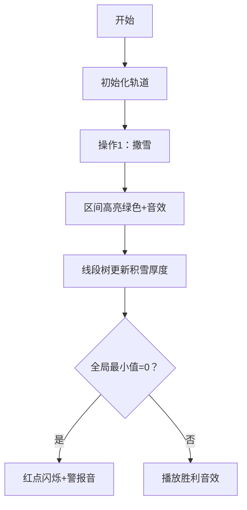

# 题目信息

# [Aya Round 1 H] 破碎的历史

## 题目背景

幻想乡迎来了它的毁灭，幻想的载体也已经遁入了幻想。

所幸的是，幻想乡中的乡民们还侥幸存活着，她们在尝试恢复幻想乡的历史。然而历史之中的大大小小的事情不计其数，人们只能记得起一些大事情罢了。

或许，根据那些重要的事情，可以把次要的事件推导出来呢？

## 题目描述

数轴的正半轴上有 $n$ 个互不相同的被黑白染色的特殊整点，位置从左到右依次为 $p_1,p_2,\cdots,p_n$。维护初始为空的**可重**线段集合 $S$。

$q$ 次操作。操作分若干种，具体格式如下：

- `1 l r`：将所有满足 $l \le x \le y \le r$ 且两端点均为特殊整点的线段 $[x,y]$ 加入 $S$。
- `2 x`：撤回第 $x$ 次操作添加的线段。

在初始时和每次操作后，假设你可以进行任意次（可以是零次）染色。每次从 $S$ 中选出一条线段 $[x,y]$，满足位于点 $x$ 和点 $y$ 的特殊整点均为黑色，然后将所有在线段内的白色特殊整点染黑。试判断是否存在至少一种合法染色方式使得正半轴上的所有特殊整点均被染黑（即，不存在白色特殊整点）。**注意：所有的询问均为「假设」，即各组询问之间独立，不会造成对数轴的实际修改。**


## 说明/提示

### 样例解释

六个特殊点的位置/颜色在数轴正半轴上如图所示。


容易发现，并非所有点都是黑点。因此在进行操作前，输出 $\verb!NO!$。

第一次操作后，一共往 $S$ 加入了三条线段：$[5,5],[8,8],[5,8]$（图中省略了端点重叠的线段）。容易发现，此时无法进行任何操作，因此没法将所有点变成黑点。输出 $\verb!NO!$。


第二次操作后，又往 $S$ 中加入了 $20$ 条线段。除去端点重叠的选段，在 $S$ 中如图所示。（以示区别，上一次操作加入的边标成了深蓝色）。


可以找出一种方案，将图上所有特殊点变成黑点。具体而言，首先选择 $S$ 中 $[1,5]$ 线段（容易发现位于 $1$ 和 $5$ 的特殊点均为黑点，因此可以进行染色），那么可以把位于 $2$ 和 $3$ 的点染色。


此时又可以选择 $S$ 中 $[3,13]$ 线段（在上一轮操作中，$3$ 号点变为了黑点，因此 $[3,13]$ 符合条件），将点 $8$ 染为黑色。


此时所有点都为黑色，因此输出 $\verb!YES!$。再次强调，询问之间互相独立，且只是询问是否存在染色方案，而不会对特殊整点进行实际上的染色操作。


第三个操作撤回了第二个操作往 $S$ 里加入的所有线段。因此退回到了只有第一个操作的情况。不存在一种方案将所有点染黑，因此输出 $\verb!NO!$。

### 数据范围

对于所有数据，$1 \le n,q \le 5 \times 10^5$，$a_i \in \{0,1\}$，$1 \le l< r \le 10^9$，$1 \le p_i \le 10^9$。保证 $p_i$ 单调递增，$2$ 操作撤销的只会是 $1$ 操作，且每个操作最多被撤销一次。


## 样例 #1

### 输入

```
6 3
1 2 3 5 8 13
1 0 0 1 0 1
1 5 10
1 1 15
2 2
```

### 输出

```
No
No
Yes
No```

# AI分析结果


### Kay的C++算法解析：破碎的历史 深入学习指南 💡

---

#### 1. 题目解读与核心算法识别  
✨ **本题主要考察**：`数据结构应用`与`贪心思想`  

🗣️ **初步分析**：  
> 本题的核心在于**区间覆盖计数**和**黑白点状态维护**。想象数轴是一段需要扫雪的轨道，黑点是已有积雪（初始值较大），白点是裸露路面（初始值=0）。每次操作1相当于在特定区间撒一层雪（区间+1），操作2则是铲雪（区间-1）。最终目标是判断轨道是否完全被雪覆盖（所有点>0）。  
> - **核心难点**：快速定位有效区间（最左/右黑点）并高效维护覆盖状态。线段树完美解决这两点：二分查找定位端点，区间修改维护覆盖计数。  
> - **可视化设计**：采用8位像素风格，数轴化为轨道网格，黑点为蓝色方块，白点为灰色。添加线段时，目标区间闪烁绿色并播放"撒雪音效"；线段树节点实时显示积雪厚度，最小值位置高亮红色。若最小值=0，触发警报音效和闪烁红光。

---

#### 2. 精选优质题解参考  
**题解一（jjsnam）**  
* **点评**：  
  思路清晰，用"积雪模型"巧妙转化问题。代码规范：  
  - `blk[]`存储黑点位置，`id[]`映射原下标，二分查找高效定位区间（`findL`/`findR`）  
  - 线段树设计精炼：`mn`维护区间最小值，`lazy`优化区间修改  
  - 实践亮点：强调**每次操作后立即查询**的易错点，边界处理严谨（`if(l>r) continue`）  
  > 💡 学习价值：将抽象染色问题转化为直观的覆盖计数模型  

**题解二（chen_zhe）**  
* **点评**：  
  理论分析透彻，直击要害：  
  - 指出**端点必须为黑点**的核心约束（`pt[]`预处理黑点）  
  - 线段树初始化巧妙：黑点赋极大值（`1<<30`）避免干扰最小值判断  
  - 代码简洁高效：仅20行线段树实现，`Push_Up`/`Push_Down`逻辑紧凑  
  > 💡 学习价值：复杂问题中识别关键约束的洞察力  

---

#### 3. 核心难点辨析与解题策略  
1. **难点1：有效区间定位**  
   * **分析**：操作区间`[l,r]`内可能包含非黑点，需快速找到实际端点。解法：预处理黑点数组并排序，用`lower_bound`二分查找左端点，`upper_bound-1`找右端点。  
   * 💡 **学习笔记**：**有序序列+二分查找**是定位类问题的黄金组合  

2. **难点2：覆盖状态维护**  
   * **分析**：线段树需支持区间加减和全局最小值查询。关键技巧：  
     - 黑点初始值设为极大数（如`1<<30`），使其不影响最小值判断  
     - 白点初始=0，值>0即表示被覆盖  
   * 💡 **学习笔记**：**极值初始化**可简化状态判断  

3. **难点3：操作独立性处理**  
   * **分析**：撤销操作需精准回滚。解法：记录每次操作1的`(L,R)`，撤销时用相同参数反向操作（`update(..., -1)`）  
   * 💡 **学习笔记**：**操作日志**是支持撤销功能的通用方案  

### ✨ 解题技巧总结  
- **模型转化**：将染色问题转化为区间覆盖计数（积雪模型）  
- **数据结构选择**：涉及**区间修改+极值查询**首选线段树  
- **边界防御**：先检查`l<=r`再操作，避免无效更新  

---

#### 4. C++核心代码实现赏析  
**通用核心实现参考**  
```cpp
#include <iostream>
#include <algorithm>
#define ls (id<<1)
#define rs (id<<1|1)
using namespace std;
const int N=5e5+9, INF=1e9;

int n,q,p[N],col[N];
int blk[N],idx[N],cnt; // blk:黑点位置, idx:位置→编号

struct SegTree {
    int mn, lazy;
} tr[N<<2];

void pushup(int id) { tr[id].mn = min(tr[ls].mn, tr[rs].mn); }

void update(int id, int l, int r, int v) {
    tr[id].mn += v;
    tr[id].lazy += v;
}

void pushdown(int id) {
    update(ls, tr[id].lazy);
    update(rs, tr[id].lazy);
    tr[id].lazy = 0;
}

void modify(int id, int l, int r, int ql, int qr, int v) {
    if(ql<=l && r<=qr) return update(id, v);
    pushdown(id);
    int mid = (l+r)>>1;
    if(ql<=mid) modify(ls,l,mid,ql,qr,v);
    if(qr>mid) modify(rs,mid+1,r,ql,qr,v);
    pushup(id);
}

int main() {
    // 初始化：读入点, 预处理黑点数组blk[]
    for(int i=1; i<=n; i++) 
        if(col[i]) blk[++cnt]=p[i], idx[cnt]=i;

    // 线段树初始化：黑点赋INF, 白点=0
    build(1,1,n); 

    while(q--) {
        if(op==1) {
            int L,R; cin>>L>>R;
            int l = lower_bound(blk+1, blk+1+cnt, L) - blk;
            int r = upper_bound(blk+1, blk+1+cnt, R) - blk - 1;
            if(l<=r) modify(1,1,n, idx[l], idx[r], 1); // 区间+1
        }
        else { /* 类似逻辑，modify(..., -1) */ }
        cout << (tr[1].mn > 0 ? "Yes" : "No") << endl;
    }
}
```

**题解一核心片段赏析**  
```cpp
int findL(int x){
    return idx[lower_bound(blk+1, blk+1+len, x)-blk]; 
}
```
> **解读**：  
> - `lower_bound`在有序数组`blk`中找到首个≥`x`的位置  
> - 通过`idx`数组转换为原序列下标，确保线段树正确定位  
> 💡 **学习笔记**：通过辅助数组实现**位置↔下标转换**是离散化常用技巧  

**题解二核心片段赏析**  
```cpp
t[id].val = (col[l] ? 1<<30 : 0);
```
> **解读**：  
> - 建树时对黑点赋极大值（`1<<30`），使其不影响全局最小值判断  
> - 白点初始为0，只要未被覆盖（值=0）即判定失败  
> 💡 **学习笔记**：**极值初始化**可避免特殊判断逻辑  

---

### 5. 算法可视化：像素动画演示  
**主题**：8位像素风《雪地轨道维护》  

**核心交互设计**：  


**关键动画帧**：  
1. **轨道初始化**：  
   - 数轴化为横向像素轨道（复古棕色调）  
   - 黑点：深蓝方块（初始积雪），白点：灰方块（裸露）  

2. **操作1动画**：  
   - 定位区间端点：红色箭头从`l`/`r`向黑点滑动  
   - 有效区间：绿色闪烁3次，伴随"撒雪音效"  
   - 线段树节点：雪层厚度+1，显示`+❄️`粒子特效  

3. **实时状态反馈**：  
   - 全局最小值位置：持续红色高亮  
   - 若最小值=0：触发8-bit警报音，该点闪烁红光  

4. **游戏化元素**：  
   - 每次成功覆盖（最小值>0）：轨道尽头升起像素太阳  
   - 连续正确：轨道上方显示COMBO计数器，音效升级  

---

#### 6. 拓展练习与相似问题  
1. **洛谷 P1442**：铁球落地  
   > 推荐理由：同样需要区间覆盖判断，训练线段树模型转化能力  

2. **洛谷 P8463**：深潜的第六兽  
   > 推荐理由：强化区间操作+撤销功能的应用场景  

3. **洛谷 P3372**：线段树模板  
   > 推荐理由：巩固线段树区间修改/查询的基础实现  

---

#### 7. 学习心得与经验分享  
**作者jjsnam的经验**：  
> *"考试时因忘记每次操作后查询导致WA，这提醒我们：**框架性逻辑错误往往比算法更难排查***  
>   
> **Kay总结**：  
> - 在多次操作的问题中，**明确每个步骤的输入输出**至关重要  
> - 调试建议：用小数据模拟执行流程，验证中间状态  

---

通过本次分析，我们不仅掌握了线段树在区间覆盖问题中的应用，更学会了将抽象问题转化为直观模型的思想。下次遇到类似问题时，不妨回想这个"雪地轨道"的像素世界哦！❄️🎮

---
处理用时：110.28秒