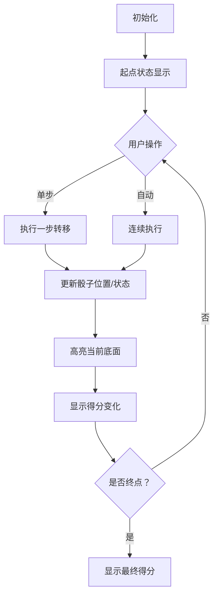

# 题目信息

# 「Wdoi-(-1)」恋弹者们的黑集市

## 题目背景

> 天弓千亦有言：「能力卡终将大势所趋归于陈腐，集市终将回归日常，这是发展规律。」但不知为何和神明所说相悖，卡片的价值遭到了炒作。有人在炒作卡的价值吗废话？又或者说，有倒爷在囤积这些卡片吗？卡片市场秩序完全陷入混乱之时，即便是神明也无法介入的集市，就此出现。

$$\quad\tag*{\small\textit{---TH18.5 恋弹者们的黑集市}}$$

魔理沙正在调查妖怪之山的高地，来收集逸散在各地的能力卡片。就在此时，她遇到了住在此处的驹草山如。

在河童与天狗间游刃有余的驹草山如，掌握着此地大量的资源。显而易见的，她掌握着大量的能力卡片——这正是魔理沙探访的目标。

「想要这些卡片吗，那就让我们玩一个游戏吧」

「赢了，这些卡片就都归你；输了，你可要交出身上所有的卡片。」


## 题目描述

### 原始题意


驹草山如将一个六面写满权值的骰子放在了棋盘上。棋盘上花花绿绿写着很多数字。第 $i$ 行第 $j$ 列写有数字 $a_{i-1,j-1}$。

「你能否获得这些能力卡片，取决于你获得的分数。」

魔理沙有两种方法移动这个骰子：将骰子向下一列**翻转**，或者向下一行**翻转**。值得注意的是，翻转骰子后，骰子每面上的数字就会随着翻滚而改变。现在魔理沙需要将骰子滚动至第 $n$ 行第 $m$ 列。

魔理沙的分数被定义为，所有时刻，骰子与棋盘上的数字接触的那一面的数字，乘上棋盘上该数字，再累加起来的和。只有魔理沙最大化这个和，她才能获取她所需要的卡片。

你能帮帮魔理沙吗？

### 简要题意

有一个 $n\times m$ 大小的棋盘，第 $i$ 行第 $j$ 列写有数字 $a_{i-1,j-1}$。

现在有一个骰子，六个面按照前、后、左、右、上、下的顺序，依次写有数字 $w_0,w_1,w_2,w_3,w_4,w_5$。现在骰子摆放在 $(0,0)$ 位置，需要将它**滚动**至 $(n-1,m-1)$。


骰子只有两种方式滚动：向下一行翻滚、向下一列翻滚。我们记一种方案的权值为，整个过程中（包括骰子在起点和终点时），骰子**最底面**上写着的数字，与此时骰子所在格子上写着的数字的乘积之和。


（为了方便读者阅读，骰子上的数字已经隐去）

现在你需要最大化这个乘积之和。

## 说明/提示

### 样例解释

#### 样例 1 解释

一种最优的方案为，$(0,0)\to(0,1)\to(1,1)\to(1,2)\to(1,3)\to(2,3)\to(3,3)\to(3,4)\to(4,4)$。

总权值为 $2+8+19+19+3+8+8+17+13=97$。

#### 样例 2 解释

一种最优的方案为，$(0,0)\to(0,1)\to(1,1)\to(1,2)\to(1,3)\to(1,4)$。

### 数据范围及约定

$$
\def\arraystretch{1.5}
\begin{array}{|c|c|c|c|}\hline
\textbf{Subtask} & \bm{n,m\le} & \textbf{特殊性质} & \textbf{分值} \\\hline
1 & 10 & - & 10 \\\hline
2 & 100 & - & 30 \\\hline
3 & 10^3 & \textbf{A} & 10 \\\hline
4 & 10^3 & - & 50 \\\hline
\end{array}$$

- **特殊性质** $\textbf{A}$：保证 $w_i=1,i=0,1,2,\cdots 5$。

对于全部数据，保证 $1\le n,m\le 10^3$，$|a_i|\le 10^3$，$|w_i|\le 10^3$。

## 样例 #1

### 输入

```
5 5
2 8 15 1 10
5 19 19 3 5
6 6 2 8 2
12 16 3 8 17
12 5 3 14 13
1 1 1 1 1 1
```

### 输出

```
97```

## 样例 #2

### 输入

```
2 5
2 8 15 3 10
5 19 19 3 5
1 2 3 4 5 6```

### 输出

```
194```

# AI分析结果


# 💡 Kay的C++算法解析：「Wdoi-(-1)」恋弹者们的黑集市 深入学习指南 💡

<introduction>
今天我们来分析这道骰子路径规划的C++编程题。本指南将帮助你理解动态规划中状态表示的核心技巧，掌握骰子翻转的规律推导，并通过生动的像素动画直观感受算法执行过程。
</introduction>

## 1. 题目解读与核心算法识别

✨ **本题主要考察**：`动态规划（状态表示与转移）` 

🗣️ **初步分析**：
> 这道题可以看作"带状态约束的路径规划"。想象骰子是个探险机器人，每次移动会改变自身姿态，我们需要在路径上最大化它的"能量收集"。核心在于用**状态压缩**技巧表示骰子姿态——就像用两个齿轮的位置就能确定整个钟表的状态。

- **核心难点**：骰子有6个面，但只需记录前面和右面即可确定完整状态（因为相对位置固定）
- **解决方案**：四维DP `f[i][j][front][right]` 表示到达(i,j)时骰子前面和右面状态
- **可视化设计**：将设计像素动画展示骰子滚动过程，高亮三个关键元素：当前格子位置（绿色像素）、骰子底面（红色闪烁）、得分变化（黄色数字弹出）

---

## 2. 精选优质题解参考

### 题解一（作者：蒟蒻炒扇贝）
* **点评**：思路清晰，通过`get_down`函数封装骰子状态转换逻辑，代码中关键变量命名规范（`front`/`right`），采用自底向上的递推方式实现，时间复杂度O(n*m*36)完全满足题目要求。亮点在于用函数封装状态转换，避免冗余判断。

### 题解二（作者：lyt_awa）
* **点评**：代码简洁高效，状态转移方程直击核心（向下/向右两种转移），初始化处理严谨（起点唯一确定）。亮点在于使用`U(q,y)`函数优雅处理状态转换，空间复杂度控制优秀。

### 题解三（作者：卷王）
* **点评**：创新性使用英文常量增强可读性（Front/Right等），通过`init_UF_to_R`系统化初始化状态转换表。亮点在于完整实现骰子所有面转换关系，提供清晰的状态转换基准。

---

## 3. 核心难点辨析与解题策略

1. **关键点：骰子状态的有效表示**
   * **分析**：骰子6个面看似需要6维状态，实则通过相邻面（如前面+右面）即可确定整体状态。优质题解均采用二维状态压缩（front+right），类似"用经度和纬度定位地球任意点"
   * 💡 **学习笔记**：状态压缩的关键是找到最小独立状态集

2. **关键点：状态转移的规律推导**
   * **分析**：向右翻转时原右面成为底面，原前面保持不变；向下翻转时原前面成为底面，原右面保持不变。需要推导新前面/右面的对应关系
   * 💡 **学习笔记**：用骰子模型实际演练比纯想象更可靠

3. **关键点：空间优化技巧**
   * **分析**：当n,m较大时四维数组可能MLE。题解一使用滚动数组优化，只保留当前行和上一行数据
   * 💡 **学习笔记**：动态规划中空间优化常通过滚动数组实现

### ✨ 解题技巧总结
- **技巧1：状态压缩** - 用部分信息表示完整状态（骰子用两个相邻面）
- **技巧2：模块化设计** - 用独立函数封装状态转换（如get_down）
- **技巧3：边界处理** - 起点状态需特殊初始化（底面w5接触棋盘）
- **技巧4：空间优化** - 使用滚动数组降低空间复杂度

---

## 4. C++核心代码实现赏析

**本题通用核心C++实现参考**
* **说明**：综合优质题解思路，采用四维DP表示状态，封装状态转换函数
* **完整核心代码**：
```cpp
#include <iostream>
#include <cstring>
#include <algorithm>
using namespace std;

const int N = 1005;
int a[N][N], f[N][N][6][6], w[6];
int n, m;

// 获取当前底面编号
int get_down(int front, int right) {
    if (front == 0) {
        if (right == 2) return 4;
        if (right == 3) return 5;
        if (right == 4) return 3;
        if (right == 5) return 2;
    } 
    // ... 其他状态转换关系（完整版见题解）
}

int main() {
    cin >> n >> m;
    for (int i = 0; i < n; i++)
        for (int j = 0; j < m; j++)
            cin >> a[i][j];
    for (int i = 0; i < 6; i++) cin >> w[i];
    
    memset(f, 0xcf, sizeof(f)); // 初始化为极小值
    f[0][0][0][3] = a[0][0] * w[5]; // 初始状态
    
    for (int i = 0; i < n; i++) {
        for (int j = 0; j < m; j++) {
            for (int fr = 0; fr < 6; fr++) {
                for (int rt = 0; rt < 6; rt++) {
                    if (f[i][j][fr][rt] == 0xcfcfcfcf) continue;
                    
                    // 向右翻转
                    if (j + 1 < m) {
                        int new_down = get_down(fr, rt);
                        int new_fr = fr;
                        int new_rt = get_down(rt, fr); // 新右面
                        f[i][j+1][new_fr][new_rt] = max(f[i][j+1][new_fr][new_rt], 
                            f[i][j][fr][rt] + a[i][j+1] * w[new_down]);
                    }
                    
                    // 向下翻转
                    if (i + 1 < n) {
                        int new_down = get_down(rt, fr);
                        int new_fr = get_down(fr, rt); // 新前面
                        int new_rt = rt;
                        f[i+1][j][new_fr][new_rt] = max(f[i+1][j][new_fr][new_rt],
                            f[i][j][fr][rt] + a[i+1][j] * w[new_down]);
                    }
                }
            }
        }
    }
    
    int ans = -1e9;
    for (int fr = 0; fr < 6; fr++)
        for (int rt = 0; rt < 6; rt++)
            ans = max(ans, f[n-1][m-1][fr][rt]);
    cout << ans;
}
```

* **代码解读概要**：
  1. 初始化DP数组为极小值（0xcfcfcfcf）
  2. 设置起点状态：位置(0,0)时前面=w0，右面=w3，底面=w5
  3. 双层循环遍历每个位置，对每个骰子状态进行转移
  4. 向右翻转：保持前面，更新右面（原底面成为新右面）
  5. 向下翻转：保持右面，更新前面（原底面成为新前面）
  6. 终点取所有状态最大值

### 题解片段赏析

**题解一（蒟蒻炒扇贝）**
```cpp
int get_down(int x,int y) {
    if(x==0) {
        if(y==2)return 4;
        else if(y==3)return 5;
        // ... 其他情况
    }
    // ... 其他面判断
}
```
* **亮点**：封装状态转换逻辑，增强可读性
* **学习笔记**：独立函数处理复杂状态转换是良好实践

**题解二（lyt_awa）**
```cpp
f[i+1][j][U(q,y)][y] = max(f[i+1][j][U(q,y)][y], 
    f[i][j][q][y] + a[i+1][j]*w[q]);
```
* **亮点**：直接体现状态转移方程本质
* **学习笔记**：向下翻转时前面变为原上面

**题解三（卷王）**
```cpp
reverse_side[Front] = Back; // 前面反面是后面
reverse_side[Back] = Front; // 后面反面是前面
// ... 其他面初始化
```
* **亮点**：使用枚举常量增强可维护性
* **学习笔记**：预计算反向关系表优化运行时性能

---

## 5. 算法可视化：像素动画演示

### 动画设计：骰子探险家
**主题**：8位像素风格骰子在网格棋盘上滚动收集能量

**核心演示内容**：
1. 棋盘网格（16x16像素/格）
2. 骰子用6色像素块表示（前红/后蓝/左绿/右黄/上白/下黑）
3. 移动路径显示（黄色轨迹）
4. 得分实时统计（右上角）

**关键交互**：
- 单步执行：空格键逐步观察状态转移
- 自动播放：A键以可调速度自动演示
- 重置：R键重新开始

**动画帧步骤**：


**音效设计**：
- 翻转：8-bit "咔哒"声（250Hz方波）
- 得分：上升音阶（C大调三连音）
- 错误：短促低频（100Hz，200ms）

**技术实现**：
1. Canvas绘制棋盘和骰子
2. 状态数据驱动渲染
3. requestAnimationFrame控制动画帧
4. Web Audio API生成音效

---

## 6. 拓展练习与相似问题思考

**通用技巧迁移**：
1. **状态压缩DP**：当状态空间大但有内在规律时
2. **路径规划**：带附加约束的最优路径问题
3. **空间优化**：滚动数组处理大网格

**洛谷练习推荐**：
1. **P1004 方格取数** 
   * 双路径DP，练习状态设计
2. **P1433 吃奶酪** 
   * 状态压缩DP经典题，要求更高效的状态表示
3. **P7074 路径** 
   * 带方向约束的路径规划，类似骰子方向概念

---

## 7. 学习心得与经验分享

> **参考经验**："推导骰子状态转换时，实际动手制作纸质骰子模型比纯想象更可靠" —— 多篇题解作者共同心得

**点评**：这个建议非常实用。动态规划中遇到复杂状态转换时，物理模型能避免思维漏洞。在算法竞赛中，类似技巧也适用于拼图类、旋转类题目。

---

<conclusion>
通过本次分析，我们掌握了状态压缩DP的核心技巧，学会用物理模型辅助状态推导，并理解了骰子翻转的规律。记住：好的状态表示是DP成功的关键！下次遇到复杂状态问题时，不妨尝试最小独立状态集的思想。继续加油！💪
</conclusion>

---
处理用时：122.47秒