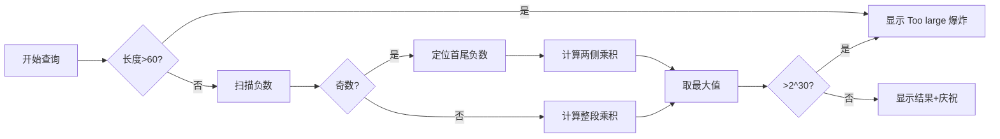

# 题目信息

# Magenta Potion

## 题目描述

给定一个长为 $n$ 的整数序列 $a$，其中所有数的绝对值均大于等于 $2$。有 $q$ 次操作，格式如下：

$\texttt{1 i k}$，表示将 $a_i$ 修改为 $k$。保证 $k $ 的绝对值大于等于 $2$。

$\texttt{2 l r}$，考虑 $[l,r]$ 的子区间（包括本身）中乘积最大的的区间乘积 $M$。如果 $M>2^{30}$，输出 `Too large`，否则输出 $M$。特别地，空区间的元素乘积定义为 $1$。

## 说明/提示

对于所有的数据，$2\le |a_i|,|k| \le 10^9$，$1 \le n,q \le 2\times 10^5$，$1 \le l \le r \le n$。

$$
\def{\arraystretch}{1.5}
\begin{array}{c|c|c}\hline 
\textbf{测试点编号}&\bm{~~~~~~~~n,q\le~~~~~~~~}&~~~~\textbf{特殊限制}~~~~\cr\hline 
\textsf1\sim \sf2 & 10& \cr\hline 
\sf3\sim 6 & 100&  \cr\hline 
\sf7\sim 10 & 5 \times 10^3&\cr\hline 
\sf 11\sim 13 &  &\sf A\cr\hline 
\sf14\sim 16 & & \sf B\cr\hline
\sf17\sim 20 & &\cr\hline
\end{array}
$$

$\textsf A$：保证 $a_i,k \ge 2$。

$\textsf B$：保证对于每一组询问，对应的 $r-l \ge 100$。


## 样例 #1

### 输入

```
5 7
2 2 3 4 5
2 1 5
1 3 -3
2 1 5
2 3 3
1 1 100000
1 2 100000
2 1 2```

### 输出

```
240
20
1
Too large```

# AI分析结果


# 💡 Kay的C++算法解析：Magenta Potion 深入学习指南 💡

## 1. 题目解读与核心算法识别

✨ **本题主要考察**：`贪心策略`与`数据结构应用`

🗣️ **初步分析**：
> 解决“Magenta Potion”的关键在于利用数值特性设计高效策略。想象你在一条宝石链上挑选连续宝石，每颗宝石的"能量值"（绝对值）都≥2，我们需要快速找到能量乘积最大的连续段。核心技巧是：
>   - **贪心阈值法**：利用"|aᵢ|≥2"的特性，当区间长度>60时乘积必然超过2³⁰（最坏情况：30个2、1个-2、30个2的乘积=2⁶⁰），直接返回"Too large"
>   - **负数奇偶处理**：奇数个负数时需舍弃最左或最右负数，取两侧乘积最大值
>   - **线段树优化**：维护区间乘积/负数位置，支持高效查询
> 
> 可视化设计思路：
> - 像素网格展示数组，正数绿色/负数红色
> - 高亮当前处理的区间和关键负数位置
> - 超过阈值时显示"Too large"爆炸动画
> - 复古音效：移动时"滴"，负数时"砰"，成功时8-bit胜利旋律

---

## 2. 精选优质题解参考

**题解一（cyhtxdy）**
* **点评**：提供双解法（线段树+贪心），思路全面清晰。贪心解法利用长度阈值（70）避免无效计算，代码简洁规范（变量名`query_sum`等含义明确），边界处理严谨（单元素负数返回1）。线段树实现展示了如何维护负数位置和乘积压缩（>2³⁰标记为P值）。实践价值高，作者分享的"比赛时忽略Too large条件"的教训极具警示意义。

**题解二（E1_de5truct0r）**
* **点评**：创新性证明长度>62必输出"Too large"（严谨数学推导），小范围使用经典DP求最大子段积（`dp[i][0/1]`状态设计清晰）。代码简洁但DP在本题稍显过度（贪心更直接），提供不同解题视角，启发思考状态机模型的应用场景。

**题解三（Fishmaster）**
* **点评**：阈值法（61）实现简洁高效，完整处理负数奇偶情况。亮点在于明确边界条件（`if(x==y && arr[x]<0) cout<<1`），乘法过程实时检查溢出（`res <= inf`判断）。变量命名直观（`cnt`计负数），适合初学者学习基础暴力优化技巧。

---

## 3. 核心难点辨析与解题策略

1.  **难点：负数奇偶性影响决策**
    * **分析**：奇数个负数时需舍弃一个使乘积变正。优质题解统一策略：定位最左(`first_neg`)/最右(`last_neg`)负数，分别计算其左右两侧乘积取最大值
    * 💡 **学习笔记**：奇数负数 = 去掉边界负数后取最大连续段

2.  **难点：大数溢出与阈值设定**
    * **分析**：利用|aᵢ|≥2的特性，当区间长度>60时2⁶⁰ > 2³⁰（30对2×2），直接返回"Too large"。小范围暴力时需实时检查乘积是否溢出
    * 💡 **学习笔记**：题目约束条件（如数值范围）可能成为优化突破口

3.  **难点：高效查询负数位置**
    * **分析**：线段树解法需快速定位区间最左/最右负数。优质题解用二分查找（O(log²n)）或平衡树维护位置集合，平衡查询效率与实现复杂度
    * 💡 **学习笔记**：根据问题规模选择数据结构——小范围暴力更实用

### ✨ 解题技巧总结
- **技巧1 阈值分治**：利用数据特性（如|aᵢ|≥2）划分问题规模
- **技巧2 边界特判**：单独处理单元素负数、空区间等边界情况
- **技巧3 实时溢出检测**：乘法中每一步检查是否超界，避免无效计算
- **技巧4 数据结构选择**：竞赛中简单方法优先（如本题贪心优于线段树）

---

## 4. C++核心代码实现赏析

**本题通用核心C++实现参考**
```cpp
#include <iostream>
#include <vector>
using namespace std;
typedef long long ll;
const ll P = 1 << 30; // 阈值

int main() {
    int n, q; cin >> n >> q;
    vector<ll> a(n+1);
    for (int i=1; i<=n; i++) cin >> a[i];
    while (q--) {
        int op, x, y; cin >> op >> x >> y;
        if (op == 1) a[x] = y;
        else {
            // 阈值检查
            if (y - x + 1 > 60) { 
                cout << "Too large\n"; continue; 
            }
            vector<ll> temp;
            for (int i=x; i<=y; i++) temp.push_back(a[i]);
            
            int cnt = 0;
            for (auto v : temp) cnt += (v < 0);
            
            ll ans = 1;
            if (cnt % 2 == 0) { // 偶数个负数
                for (auto v : temp) {
                    ans *= abs(v);
                    if (ans > P) break;
                }
            } else { // 奇数个负数
                int l_id = 0, r_id = temp.size()-1;
                while (temp[l_id] > 0) l_id++;
                while (temp[r_id] > 0) r_id--;
                
                ll left_val = 1, right_val = 1;
                // 计算右侧部分（舍弃最左负数）
                for (int i=l_id+1; i<temp.size(); i++) {
                    left_val *= abs(temp[i]);
                    if (left_val > P) break;
                }
                // 计算左侧部分（舍弃最右负数）
                for (int i=0; i<r_id; i++) {
                    right_val *= abs(temp[i]);
                    if (right_val > P) break;
                }
                ans = max(left_val, right_val);
            }
            cout << (ans > P ? "Too large" : to_string(ans)) << endl;
        }
    }
    return 0;
}
```

**题解一（cyhtxdy）贪心片段**
```cpp
if (r - l + 1 > 70) 
    printf("Too large\n");
else {
    int tot = 0;
    for (int i=l; i<=r; i++)
        if (a[i] < 0) tot++;
    // ... 负数奇偶处理
}
```
* **亮点**：阈值设定保守安全（70），避免边界问题
* **学习笔记**：阈值选择需结合最坏情况计算（2³⁰对应约1e9）

**题解二（E1_de5truct0r）DP片段**
```cpp
dp[j][0] = dp[j-1][1] * a[i]; // 负负得正
dp[j][1] = min(dp[j-1][0]*a[i], a[i]); // 维护最小负积
ans = max(ans, dp[j][0]); // 更新答案
```
* **亮点**：经典双状态DP维护最大/最小积
* **学习笔记**：DP状态设计适用于更一般的最大子段积问题

**题解三（Fishmaster）定位负数**
```cpp
int l = x, r = y;
while (arr[l] > 0) l++; // 线性扫描找左负数
while (arr[r] > 0) r--; // 线性扫描找右负数
```
* **亮点**：直观的线性扫描，适合小范围数据
* **学习笔记**：O(n)扫描在长度≤60时效率可接受

---

## 5. 算法可视化：像素动画演示

**主题**："8-bit乘积冒险家"在宝石阵中寻找最大能量路径

**核心演示**：
1. **初始化**：FC风格网格地图，绿宝石(正数)/红宝石(负数)，控制面板含速度滑块
2. **长度检测**：区间>60格时，显示"Too large"爆炸动画+失败音效
3. **负数扫描**：
   - 红宝石闪烁计数，显示"负数：5(奇数)"
   - 定位最左/最右红宝石（像素箭头指示）
4. **乘积计算**：
   - 偶数负数：角色收集整条路径，实时显示乘积值
   - 奇数负数：角色分两路收集（舍左/舍右路径），对比最终能量值
5. **游戏化元素**：
   - 成功时宝石绽放光芒+胜利音效
   - 错误操作触发"像素碎裂"动画
   - 积分系统：每正确计算得10分，超时/溢出扣5分

**关键帧设计**：


---

## 6. 拓展练习与相似问题思考

**通用技巧迁移**：
1. 利用数据范围设定阈值（如数值增长快的问题）
2. 分治处理奇偶性问题（如负数个数的奇偶性）
3. 线段树维护区间特征（如乘积/最值位置）

**练习推荐（洛谷）**：
1. **P4513 小白逛公园**  
   🗣️ 最大子段和变形，练习线段树维护区间特征
2. **P1471 方差**  
   🗣️ 区间统计问题，涉及平方和计算（类似乘积增长）
3. **P3372 线段树1**  
   🗣️ 基础区间修改/查询，巩固数据结构实现

---

## 7. 学习心得与经验分享

> **参考经验（来自cyhtxdy）**：  
> "比赛时没看到Too large条件，导致线段树写挂...这告诉我们要好好读题"

**点评**：  
算法竞赛中审题至关重要，特别是边界条件和特殊约束（如本题的"Too large"）。建议：
1. 用笔标记题目关键约束
2. 编写代码前先设计测试边界用例
3. 学习利用题目条件优化（如本题的数值范围）

---

掌握核心思想比死记代码更重要。下次遇到带约束的区间问题，记得问自己：**数据特性是否隐藏了优化钥匙？** 继续加油，少年！💪

---
处理用时：171.96秒