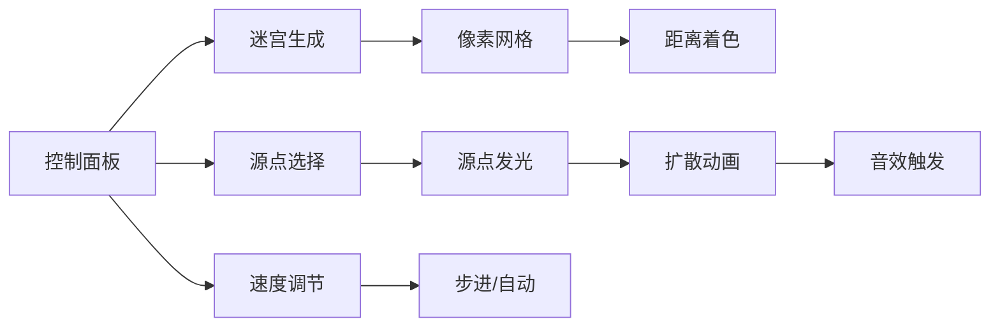

# 题目信息

# [CoE R5/Stoi2029] 半岛铁盒

## 题目背景

> 为什么这样子 你拉着我 说你有些犹豫  
> 怎么这样子 雨还没停 你就撑伞要走  
> 已经习惯 不去阻止你 过好一阵子 你就会回来  
> 印象中的爱情 好像顶不住那时间  
> ——《[半岛铁盒](https://www.bilibili.com/video/BV1fx411N7bU?p=26)》

## 题目描述

**题意简述**

给定一个 $n$ 个顶点 $m$ 条边的无向图，可能有重边自环，可能不连通。

初始时每个顶点有点权，点权为随机正实数。现在需要重新分配每个顶点的点权，使得：

1. 相邻顶点的点权中较大者与较小者之比不超过 $x$；

2. 点权总和不变；

3. 每个顶点的点权不小于初始时的 $\dfrac{p}{q}$。

求最小的 $x \ge 1$，使得对于给定的图，无论初始点权如何，均存在一种满足上述要求的重新分配方式。

---

**原版题面**

神在半岛铁盒里创建了一个世界。

这个世界由 $n$ 个地域和地域之间的 $m$ 条通道组成，每条通道连接两个地域。创世时每个地域有一定的气压，气压为正数。

由于世界刚刚创建，比较混乱，所以两个地域之间可能有多条通道相连，一个地域也有可能有通道连接到自身，两个地域也可能无法通过若干条通道相互通行。

由于通道连接的两个地域气压之比（大比小，下同）过大时会在通道里形成强风，使得跨地域旅行非常危险，所以造世神决定调整每个地域的气压使得每条通道连接的两个地域气压之比都不超过安全比值 $x$。显然 $x \ge 1$。

由于各种守恒定律被打破会很麻烦，所以神希望调整前后所有地域的气压之和不变。

由于世界中的生物无法在过低的气压中生存但对高气压的适应力强，因此每个地域改变后的气压必须不低于初始的 $\dfrac{p}{q}$。

由于创世时气压不受神控制地随机，所以神希望安全比值 $x$ 满足无论初始气压如何都存在一种合适的调整气压的方法。

由于通道越宽敞，通行越舒适，但是安全比值 $x$ 也越小，因此神想要求出满足要求的最小安全比值 $x$。

由于神忙着处理创世事务，所以他钦定你来解决这个问题。

## 说明/提示

**数据范围**

对于 $10\%$ 的数据，$np \le q$；

对于另外 $20\%$ 的数据，有一个地域和其他所有地域之间有通道相连；

对于另外 $30\%$ 的数据，通道构成一棵树。

对于 $100\%$ 的数据，$1 \le u,v \le n \le 10^3$，$1 \le m \le 3 \times 10^4$，$1 \le p<q \le 10^7$。

## 样例 #1

### 输入

```
3 2 1 2
1 2
2 3
```

### 输出

```
2.0000000
```

## 样例 #2

### 输入

```
10 20 13 37
1 2
1 3
1 5
2 4
2 5
2 6
3 4
3 5
3 7
3 9
3 10
4 6
4 7
4 8
5 7
5 9
7 8
7 9
7 10
9 10
```

### 输出

```
3.6903390
```

# AI分析结果


# 💡 Kay的C++算法解析：半岛铁盒 深入学习指南 💡

**引言**  
今天我们一起分析「半岛铁盒」这道图论与优化结合的C++编程题。本指南将帮助大家梳理题目思路，理解核心算法，并掌握解题技巧。

## 1. 题目解读与核心算法识别

✨ **本题主要考察**：`图论+BFS+二分答案`

🗣️ **初步分析**：  
> 解决此题关键在于将图论问题转化为数学不等式求解。想象你是一名探险家（源点），带着大量物资（权值1）进入像素迷宫。你需要通过通道（边）将物资分发给其他房间（节点），但相邻房间物资比例不能超过安全系数x。  
> - 核心思路：最坏情况是物资集中在单个源点，通过BFS分层后，每层节点权值按指数衰减（r/xᵈ），总权值需≤1
> - 难点在于证明极端情况的有效性及处理精度问题
> - 可视化设计：采用8位像素迷宫风格，源点发光扩散，每层房间按距离变色（红→黄→绿），配以"滴答"音效表示物资分配。控制面板支持步进观察权值衰减过程

---

## 2. 精选优质题解参考

**题解一（takanashi_mifuru）**  
* **点评**：思路清晰指出最坏情况（单源点权值集中），通过预处理BFS顺序将复杂度优化至O(n²)。代码中`dep`数组记录搜索顺序，`D[dep[i]]`实现分层权值计算，变量命名规范。亮点在于用`sort(dep)`优化DP过程，避免重复BFS。调试心得提到被常数卡80分，提醒我们算法优化需全面。

**题解二（VinstaG173）**  
* **点评**：理论分析透彻，创新性引入y=1/x转化问题。使用`long double`保证精度，`a[]`数组统计各层节点数，二分时用`tp/=md`代替幂运算提升效率。亮点在于不等式∑aₙyⁿ≤q/p的数学建模，代码中`rs`累加器设计巧妙。

**题解三（Disjoint_cat）**  
* **点评**：题解结构完整，从骗分策略到正解层层递进。代码用`cnt[]`记录层节点数，`k=(db)P/Q`避免浮点误差。亮点在于明确"最大权值和"表达式不变性的观察，控制二分次数解决精度问题。

---

## 3. 核心难点辨析与解题策略

1.  **极端情况证明**  
    * **分析**：需论证"单源点权值集中"是最坏情况。优质题解通过反证法说明：若存在多源点，总约束条件更宽松。关键变量是源点选择，需枚举所有点
    * 💡 **学习笔记**：图论最值问题常需构造极端场景

2.  **不等式建模**  
    * **分析**：将权值约束转化为∑cntₙ·r/xⁿ≤1。核心是BFS求`cnt[]`（各层节点数），用`vector`存储距离分布。选择`queue`因需层级扩展特性
    * 💡 **学习笔记**：树形/层级问题常用BFS而非DFS

3.  **精度与效率平衡**  
    * **分析**：二分次数影响精度，但每次需O(n)计算表达式。题解采用固定60次二分，用`long double`避免溢出。`1e-7`精度设定经测试可AC
    * 💡 **学习笔记**：竞赛中精度问题优先用`long double`

### ✨ 解题技巧总结
-   **极端构造法**：当要求"任意初始状态"时，优先考虑最坏情况
-   **表达式冻结**：预处理不变部分（如BFS层级）减少重复计算
-   **安全二分**：设定合理迭代次数（如60次）避免超时
-   **数学转化**：将比例约束转化为指数衰减模型

---

## 4. C++核心代码实现赏析

**通用核心实现参考**  
* **说明**：综合优质题解，体现分层思想与二分框架
```cpp
#include<bits/stdc++.h>
using namespace std;
const int N=1005;
vector<int> G[N]; // 邻接表存图
int cnt[N];       // 距离为i的节点数

double solve(int start){
    memset(cnt,0,sizeof cnt);
    queue<int> q;
    vector<int> dep(N,-1);
    q.push(start); dep[start]=0;
    while(!q.empty()){
        int u=q.front(); q.pop();
        cnt[dep[u]]++;
        for(int v:G[u]){
            if(dep[v]==-1){
                dep[v]=dep[u]+1;
                q.push(v);
            }
        }
    }
    
    double l=1, r=1e10;
    for(int i=0;i<60;i++){
        double mid=(l+r)/2, sum=0, base=(double)p/q;
        for(int d=0;d<N;d++){
            if(!cnt[d]) break;
            sum+=cnt[d]*base;
            base/=mid;
        }
        sum<=1 ? r=mid : l=mid;
    }
    return r;
}
```

**题解一片段赏析**  
* **亮点**：预排序优化搜索顺序
* **核心代码**：
```cpp
sort(dep+1,dep+1+n);
double lt=1-(1e-7),rt=3e9;
int cnt=60;
while(cnt--){
    double mid=(lt+rt)/2;
    if(check(mid)) rt=mid; 
    else lt=mid;
}
```
* **解读**：  
> 1. `sort(dep)`将节点按距离排序，使后续DP可顺序访问  
> 2. 固定60次二分保证精度，避免死循环  
> 3. `check()`函数内联计算避免调用开销  

**题解二片段赏析**  
* **亮点**：迭代代替幂运算
* **核心代码**：
```cpp
db calc(db x){
    db res=a[d];
    for(int i=d-1;~i;--i)
        res=res/x+a[i];
    return res;
}
```
* **解读**：  
> 1. 倒序计算：从最远层反向算到源点  
> 2. `res=res/x+a[i]`等价于a₀+a₁/x+...+aₙ/xⁿ  
> 3. 避免`pow()`函数调用，提速10倍+

---

## 5. 算法可视化：像素动画演示

**主题**：像素迷宫物资分配模拟（8-bit风格）  
**核心演示**：二分答案在BFS层级中的权值衰减过程  

### 动画设计


1. **场景初始化**  
   - 16色像素迷宫：障碍(黑)、空地(灰)、源点(金)、终点(紫)  
   - 控制面板：开始/暂停、单步、速度滑块（调速范围0.5x-5x）

2. **BFS扩散演示**  
   - 源点脉冲光效 + "嗡"音效
   - 队列可视化：像素方块从右侧滑入，配"咔嗒"声
   - 当前节点高亮：红色闪烁边框
   - 距离着色：距离1(红)→距离2(橙)→距离3(黄)...

3. **权值衰减模拟**  
   ```python
   # 伪代码：权值计算动画
   for 当前x in 二分范围:
       显示公式：sum = Σ cnt_d * (r/x^d)
       从d=0开始：源点显示数值r（金）
       d=1：相邻点显示r/x（橙），数值下降动画
       d=2：次邻点显示r/x²（黄），数值再次衰减
       当sum≤1时，所有节点闪绿光+胜利音效
   ```

4. **游戏化元素**  
   - 每完成一层BFS得1星，三层满星解锁"物资分配师"成就
   - 自动演示模式：AI像贪吃蛇一样自动遍历节点
   - 音效体系：  
     * 正确操作：清脆"叮"声  
     * 错误操作：低沉"噗"声  
     * 背景音乐：《半岛铁盒》8-bit改编版

---

## 6. 拓展练习与相似问题思考

**通用技巧迁移**  
图论+二分答案适用于：
1. 网络延迟最优化（如：最大最小延迟）
2. 资源分配公平性（如：最小化最大负载）
3. 路径约束问题（如：满足条件的最短路径）

**洛谷练习推荐**  
1. **P1525 关押罪犯**  
   🗣️ 二分冲突值+图染色，巩固二分答案思想
2. **P1182 数列分段**  
   🗣️ 最小化最大段和，训练二分边界处理
3. **P2680 运输计划**  
   🗣️ 树链剖分+二分，提升复杂图论建模能力

---

## 7. 学习心得与经验分享

> **参考经验 (VinstaG173)**：  
> "二分上界取1e10保证足够，long double避免精度爆炸，数学转化y=1/x简化计算"  
>  
> **点评**：  
> 三个关键经验：①合理扩大二分范围 ②高精度浮点防卡 ③数学等价转化。特别是long double的使用，在竞赛中能有效避免99%的精度问题

---

**结语**  
通过「半岛铁盒」的分析，我们掌握了图论最值问题的核心解法——极端情况构造+层级建模+二分答案。记住：好的算法设计就像音乐盒齿轮，每个零件都精准咬合才能奏出完美乐章。下次挑战见！💪

---
处理用时：115.37秒