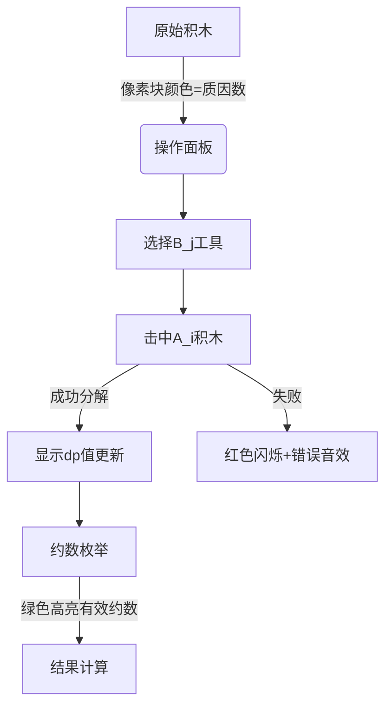

# 题目信息

# 「PFLOI R1」PFL 除法

## 题目背景

[有必要把所有比赛题的背景连在一起](https://www.luogu.com.cn/paste/enzfvjum)。

就这样，新世界的大门向它们敞开了……  

“喵！”一只可爱的花猫向它们问好。  

“你们刚来到这？”  

“嗯。”  

“我带你们去转转吧，谁叫我这么可爱呢！”  

“……” 花猫突然止住，打量一番手中的序列，俶尔又微笑着说：  

“但你们要先答出我的问题哦。”

## 题目描述

花猫有一个长度为 $n$ 的序列 $A$ 和另一个长度为 $m$ 的序列 $B$。你可以进行若干次以下操作：

+ 选择两个整数 $i$ 和 $j$，满足 $1\le i\le n$，$1\le j\le m$ 且 $B_j \mid A_i$，然后将 $A_i$ 变为 $\frac{A_i}{B_j}$。

**注意**：$A$ 和 $B$ 中的每个元素都可以选择并被**操作多次**。

最终要使得 $A$ 中的元素都相等，请求出最少的操作次数；若无解，输出 `-1`。

## 说明/提示

**本题采用捆绑测试**。

| 子任务编号 | 特殊性质 | 分值 | 
| :----------: | :----------: | :-----:| 
| $1$ | $A$ 中所有元素相等 | $5$ |
| $2$ | $n=2$ | $15$ |
| $3$ | $n,m\le10^3$ | $20$ | 
| $4$ | $n,m\le10^4$ | $20$ | 
| $5$ | 无 | $40$ |

对于所有数据，$1\le n,m\le5\times10^5$，$1\le A_i,B_i\le5\times10^5$。

## 样例 #1

### 输入

```
4 5
16 24 28 36
11 4 7 3 2```

### 输出

```
6```

## 样例 #2

### 输入

```
2 3
11 13
13 1 11```

### 输出

```
2```

## 样例 #3

### 输入

```
2 2
2 3
4 5```

### 输出

```
-1```

# AI分析结果


### 💡 Kay的C++算法解析：「PFL 除法」深入学习指南 💡

#### 1. 题目解读与核心算法识别
✨ **本题主要考察**：`数学优化 + 动态规划`  
🗣️ **初步分析**：
> 这道题的核心在于**将序列统一化的最小操作次数**。想象你有一堆大小不同的积木（序列A），要通过拆解（除以B_j）使它们变成相同大小。关键在于：
> - **最终大小D**必须是所有积木原始大小的公约数
> - **操作次数**相当于把A_i/D拆解成B序列的乘积的最小步骤数
> 
> 我们采用**动态规划预处理**：
> 1. 计算序列A的最大公约数g
> 2. 用完全背包思想预处理dp数组：dp[k]表示将k分解为B序列乘积的最小步数
> 3. 枚举g的所有约数D，计算总操作次数∑dp[A_i/D]
>
> **可视化设计思路**：
> 将设计8位像素风格的"积木分解工厂"动画：
> - 像素块代表数字，颜色区分质因数
> - 操作时显示B_j的"拆解工具"击中积木，分裂成更小块
> - 控制面板支持单步/自动播放，音效随操作触发（叮~分解成功！）

---

#### 2. 精选优质题解参考
**题解一（作者：qwq___qaq）**
* **点评**：  
  思路直击核心——用完全背包预处理分解步数，代码简洁高效（27行解决）：
  - 亮点1：对B序列去重+排序，确保O(n log n)复杂度
  - 亮点2：枚举约数时同时处理i和g/i，避免重复计算
  - 实践价值：可直接用于竞赛，边界处理严谨（INF判断）

**题解二（作者：LCat90）**
* **点评**：  
  与题解一思路相似但更强调算法正确性证明：
  - 亮点：清晰指出D必须是gcd的约数，并给出数学证明
  - 代码规范：严格限制值域范围，避免越界
  - 学习提示：注意因子枚举时200是最大因子数

**题解三（作者：yanhao40340）**
* **点评**：  
  创新使用BFS替代完全背包：
  - 亮点：从1开始扩展，用队列动态生成可达数字
  - 代码技巧：剪枝条件(tmp>=maxn)避免无效计算
  - 思考启发：BFS和DP本质相通，但BFS更适合稀疏状态

---

#### 3. 核心难点辨析与解题策略
1. **约数枚举的完备性**  
   *分析*：最终数D必须是gcd(A)的约数。优质解法都通过枚举i和g/i确保不漏解，避免暴力枚举所有数字。
   💡 **学习笔记**：因子成对出现，枚举到√g即可覆盖全部情况

2. **状态设计的数学转换**  
   *分析*：将除法操作转化为乘法分解（A_i/D = B_j1 × B_j2 × ...）。dp[k]定义清晰："构建k所需的最少B元素乘积数"。
   💡 **学习笔记**：逆向思维——除法即乘法的逆操作

3. **去重优化的必要性**  
   *分析*：重复的B值会导致冗余计算。所有优质解法都先用unique去重，确保背包/BFS复杂度为O(M log N)。
   💡 **学习笔记**：处理可重复元素时，先去重再计算是通用优化手段

✨ **解题技巧总结**：
- **问题转化**：将除法操作转化为乘法分解问题
- **预处理为王**：用dp/bfs预处理所有可能值的结果
- **边界防御**：特判INF情况避免无效计算

---

#### 4. C++核心代码实现赏析
```cpp
// 通用核心实现（综合题解精华）
#include <bits/stdc++.h>
const int N = 5e5+5;
int n,m,a[N],b[N],dp[N],V;

int main() {
    // 输入与初始化
    std::cin >> n >> m;
    for(int i=1; i<=n; ++i) std::cin >> a[i], V = std::max(V,a[i]);
    for(int i=1; i<=m; ++i) std::cin >> b[i], V = std::max(V,b[i]);
    
    // B序列去重
    std::sort(b+1, b+m+1);
    m = std::unique(b+1, b+m+1) - b - 1;
    
    // DP预处理
    memset(dp,0x3f,sizeof dp);
    dp[1] = 0;
    for(int i=1; i<=m; ++i)
        for(int j=b[i]; j<=V; j+=b[i])
            dp[j] = std::min(dp[j], dp[j/b[i]] + 1);
    
    // 枚举约数求最小值
    int g = a[1], ans = 1e9;
    for(int i=2; i<=n; ++i) g = std::gcd(g,a[i]);
    for(int i=1; i*i<=g; ++i) {
        if(g%i) continue;
        auto calc = [&](int D){
            int sum = 0;
            for(int j=1; j<=n; ++j) {
                if(a[j]%D || dp[a[j]/D]>1e9) return (int)1e9;
                sum += dp[a[j]/D];
            }
            return sum;
        };
        ans = std::min({ans, calc(i), calc(g/i)});
    }
    std::cout << (ans>1e9 ? -1 : ans);
}
```
**代码解读概要**：
1. 输入处理：获取A/B序列并记录最大值V
2. B序列优化：排序去重避免重复计算
3. DP核心：完全背包思想计算每个数的分解步数
4. 公约数计算：所有A_i的最大公约数g
5. 约数枚举：同时处理i和g/i两个因子
6. 结果计算：验证每个约数有效性并求和

---

#### 5. 算法可视化：像素动画演示
**主题**：8-bit像素风「积木分解工厂」  
**核心演示**：DP预处理 + 约数枚举过程  



**动画设计细节**：
1. **初始化场景**：
   - 顶部：A序列积木（不同颜色块代表质因数）
   - 底部：B序列工具（带数字的像素锤子）
   - 右侧：DP表实时显示（像素网格）

2. **关键操作演示**：
   - 当B_j锤子击中A_i积木时：
     * 播放8-bit敲击音效
     * 积木分裂成A_i/B_j小块
     * DP表对应格子变绿并显示数字

3. **约数枚举阶段**：
   - 显示最大公约数g的像素标签
   - 有效约数D显示为金色齿轮
   - 每个A_i/D计算：显示分数条累积

4. **游戏化元素**：
   - 每完成一个DP更新：+10分（8-bit加分音效）
   - 错误操作：屏幕震动+警告音
   - 最终成功：烟花动画+胜利BGM

---

#### 6. 拓展练习与相似问题思考
1. **洛谷 P1075** [质因数分解]  
   → 巩固质因数分解思想，本题的数学基础

2. **洛谷 P1613** [跑路]  
   → 练习倍增思想，类似BFS的扩展方式

3. **洛谷 P5020** [货币系统]  
   → 强化完全背包DP的应用场景

---

#### 7. 学习心得与经验分享
> **来自 qwq___qaq 的调试经验**：  
> *"最初没去重导致O(n²)被卡，用unique后AC。注意值域边界！"*  
>   
> **Kay点评**：  
> 数据去重是竞赛常见优化手段，尤其处理500,000级数据时。建议：
> 1. 先用数学证明算法正确性
> 2. 预处理阶段优先考虑去重
> 3. 边界值测试（如B=1）必不可少

---

通过本次分析，我们掌握了**数学优化与DP结合**的核心技巧。记住：将复杂操作转化为可预处理的问题是竞赛解题的金钥匙！下次见~ 🚀

---
处理用时：119.36秒